# 当前系统代码分析报告

> 分析日期：2026-07-11
> 分析分支：`dev`（`5d24690 refactor: consolidate runtime boundaries`）
> 基线验证：`npm test`，751/751 通过；`npm run eval:recognition -- --json` 报告 4 个静态 JSON 样本、accuracy=1。
> 边界：本报告只分析真实代码、SQL、配置、workflow 和运行路径；`docs/` 仅用于核对历史，不作为当前事实源。

## 1. 结论

当前系统不是“尚未开始架构重构”的旧系统，而是已经完成一轮目录与运行入口收敛、但核心复杂度仍未被真正隐藏的中间态。

已经存在且应保留的基础包括：

- PostgreSQL `core.*` 业务事实层、`ingest.*` 输入审计层、`archive.*` 恢复层和 `monitor.*` 运维层。
- Telegram/飞书统一进入消息同步主链，Cloudflare Worker 使用 webhook 校验、Durable Object 缓冲和任务队列。
- OpenAI-compatible provider、prompt/schema 版本、缓存、重试、fallback、幂等键、AI 调用日志和 pending replay。
- App 无关 prompt、`detectedApp`、App Profile 和 Apple Health fixture。
- 751 个通过的自动化测试与数据库显式 migration runner。

但系统尚未达到“通用 AI 截图识别系统”：

- 图片直接送入视觉模型；没有真实 OCR 模块、坐标结果、图片增强、压缩、质量评分或标准化图片资产契约。
- AI 输出仍绑定训练领域的固定 `measurement/workout/nutrition/sleep` schema，不是来源无关的 `source_app/data_type/fields/confidence` 识别核心。
- Feishu 被转换成 Telegram 形状和哈希数字 ID 以复用主链，`ingest.telegram_*`、`telegram_training_image`、`telegram_message_id` 等兼容语义仍渗透数据库和业务代码。
- 核心编排、识别和持久化集中在多个 800-1800 行文件中；所谓六边形 port/service 有一部分只在测试中使用，生产依赖方向没有完全落地。
- 当前“识别准确率”评估不执行图片、OCR 或模型，只比较 fixture 中预填的 `expected` 与 `actual`，不能证明真实 AI 能力。

最高杠杆的重构中心是：把“Telegram 兼容形状驱动的图片同步”改为“来源无关消息 + 来源无关识别流水线”，同时保持 `core.*` 训练业务模型稳定。

## 2. 当前系统架构图

```mermaid
flowchart LR
  TG["Telegram"] --> W["Cloudflare unified webhook worker"]
  FS["Feishu"] --> W
  W --> DO["Durable Object buffers / dispatch queue"]
  DO --> GH["GitHub Actions sync.yml / sync-dev.yml"]
  GH --> MSG["runMessageSync"]
  MSG --> IMG["image-processing.mjs"]
  IMG --> VISION["OpenAI-compatible vision request"]
  VISION --> SCHEMA["fixed training schema + semantic warnings"]
  SCHEMA --> BATCH["Telegram-shaped batch normalization"]
  BATCH --> INGEST["PostgreSQL ingest.telegram_*"]
  BATCH --> CORE["PostgreSQL core.*"]
  INGEST --> RETRY["pending replay / AI audit"]
  CORE --> SNAP["TrainingSnapshot"]
  SNAP --> HEXO["Hexo generators + view models"]
  HEXO --> STATIC["GitHub Pages / Cloudflare Pages static site"]
  CORE --> BACKUP["Markdown derived backup"]
  BACKUP --> HEXO
```



当前最痛的复杂度中心位于 `runMessageSync -> image-processing -> image-recognition -> sync-batch-logic -> db/write`。来源适配、图片输入、AI 请求、JSON 容错、业务标准化、重试、日志和数据库策略跨越五个大型模块，修改一个识别字段通常需要同时修改 prompt、schema、normalizer、batch merge、SQL writer、read mapper、页面和测试。

## 3. 当前真实架构

### 3.1 前端结构

前端不是独立 SPA，也没有浏览器端 Backend API。它是 Hexo 构建的静态站点：

- 页面数据由 `src/app/use-cases/generate-training-data.impl.mjs` 生成。
- 页面视图模型位于 `src/site/dashboard-view.mjs`、`monitor-view.mjs`、`action-monitor-view.mjs`、`parameter-health-view.mjs`。
- Hexo adapter 位于 `src/adapters/hexo/`，把 snapshot/view model 写成 `source/_data/*.json`。
- EJS 模板位于 `themes/cactus/layout/`，浏览器脚本位于 `themes/cactus/source/js/`。
- `training-dashboard.js`、`training-monitor.js` 使用 Chart.js；`action-monitor.js` 实现分页和参数健康弹窗。
- 最终发布到 GitHub Pages（main）和 Cloudflare Pages（dev）。

前端数据不是实时 API 查询，而是在 CI/build 阶段从 PostgreSQL 或 Markdown 生成后公开发布。

### 3.2 后端结构

系统没有常驻 Node 后端服务。后端能力由四类运行时组成：

1. Cloudflare Worker：验证 Telegram/飞书 webhook，缓冲消息并触发 GitHub workflow。
2. GitHub Actions：注入 secret/variable，运行 Telegram/飞书同步、数据库写入、构建和通知。
3. Node CLI/use case：执行同步、分析、导入导出、迁移、健康检查和构建。
4. PostgreSQL：保存输入审计、核心业务数据、归档、pending、AI 日志和监控数据。

`src/` 的目录名呈六边形架构形状，但生产依赖仍混合：

- `src/app/use-cases/*` 直接依赖 `src/adapters/*`、`src/db/*`、`pg` 和文件系统。
- `src/domain/training/training-snapshot.mjs` 反向依赖 `src/db/training/read.mjs`。
- `src/adapters/postgres/core-day-repository.pg.mjs` 反向依赖 `src/db/training/read.mjs`。
- `TrainingRepositoryPort`、`TrainingSnapshotService`、`PostgresTrainingRepository` 当前只被测试引用，未进入生产主链。

### 3.3 消息与数据流程

1. Telegram/飞书 webhook 到达 `cloudflare/sync-dispatch-worker.mjs`。
2. Telegram 校验 secret header；飞书校验 verification token、签名时间窗和 HMAC。
3. 图片 burst/相册进入 Durable Object，随后进入 `SyncDispatchQueue`。
4. queue 触发 `sync.yml` 或 `sync-dev.yml`。
5. workflow 运行 `runTelegramSync()` 或 `runFeishuSync()`。
6. 飞书事件先在 `src/adapters/feishu/sync-batch-logic.adapter.mjs` 转成 Telegram update 形状，再复用 `groupTelegramUpdates()`。
7. `runMessageSync()` 处理权限、pending replay、识别、分析、随想、持久化、补偿和通知。
8. `persistNormalizedBatch()` 在一个事务内写 `ingest.telegram_batch/message/recognition` 和 `core.*`。
9. build 从 `core.*` 生成 `TrainingSnapshot`，再生成静态页面和 Markdown 备份。

### 3.4 当前 AI 识别流程

```text
消息图片 file_id / image_key
  -> URL 或下载为 data URL
  -> OpenAI-compatible vision chat completion
  -> json_schema / json_object / no-response-format fallback
  -> JSON 容错提取
  -> 固定训练 schema 校验
  -> measurement/sleep 语义范围 warning
  -> Telegram batch 归档日期与业务字段合并
  -> ingest 原始识别 JSON + core 业务表
```

已有通用性：

- `prompts/_source/app-profiles.json` 已包含华为健康与 Apple Health。
- prompt 明确要求 App 无关、自适应字段别名和单位换算。
- `detectedApp`、prompt/schema/model/cache metadata 已落入识别结果。
- Telegram 和飞书共用识别入口。

仍然固定的部分：

- schema 只允许 `measurement/workout/nutrition/sleep/unknown`。
- `records` 必须包含固定训练字段集合。
- 新类型不能只添加 profile，仍需改 schema、prompt、batch merge、core 表和页面。
- OCR 只是测试文案中的 `dateEvidence: ocr`，仓库没有 OCR provider 或 OCR 结果模型。

### 3.5 图片处理流程

当前图片处理只完成：

- Telegram/飞书文件下载。
- 最大下载字节限制。
- MIME/扩展名识别。
- 原始字节转 base64 data URL。
- URL 输入失败后 inline 重试。

没有实现：

- 尺寸/方向标准化。
- HEIC 等格式转码。
- 压缩、分辨率限制或 token/cost 预算。
- 去噪、锐化、对比度增强、裁边。
- 图片质量评分与低质量拒绝/提示。
- 独立 OCR 文本和坐标框。
- 图片内容 hash、原图/处理图资产生命周期和保留策略。

证据：`src/app/use-cases/telegram-sync/image-processing.mjs:195-210,676-785` 只选择 URL/inline、转 base64 和判断 content-type；`src/app/use-cases/image-recognition.use-case.mjs:876-905` 直接将图片作为 `image_url` 送给模型。

### 3.6 数据库存储流程

数据库没有 ORM，全部使用 `pg` 和手写 SQL。

| Schema | 表 | 当前职责 | 初步判断 |
|---|---|---|---|
| `maintenance` | `schema_migration` | migration checksum 与执行历史 | Keep |
| `archive` | `training_parse_snapshot` | Markdown 解析快照 | Keep，限制为恢复/审计 |
| `archive` | `training_day/activity/measurement/meal/sleep` | 历史归档明细 | Keep，避免与 core 双向写 |
| `archive` | `training_parse_run` | 解析运行留痕 | Keep |
| `ingest` | `telegram_batch` | 输入批次、状态、payload | Replace 为来源无关命名 |
| `ingest` | `telegram_message` | 原始消息与图片引用 | Replace 为来源无关消息/资产模型 |
| `ingest` | `telegram_recognition` | AI 识别 JSON | Replace 为版本化 recognition run/result |
| `ingest` | `telegram_pending_batch` | 识别/数据库失败重试 | Replace 为来源无关 pending task |
| `ingest` | `ai_call_log` | AI 调用审计 | Keep，补 scene/status 约束与关联键 |
| `core` | `training_day` | 日级物化汇总 | Keep；它服务静态构建查询 |
| `core` | `measurement/activity/meal/sleep` | 训练业务事实 | Keep；不应为任意 App 字段无限扩表 |
| `core` | `thought` | 随想业务事实 | Keep，移除 Telegram numeric 兼容身份 |
| `monitor` | `github_action_runs/jobs/steps/failures` | Action 运维监控 | Keep |
| `monitor` | `system_config_parameters/checks` | 配置存在性与健康检查 | Keep |

关键字段审计：

| Target field | Type | Classification | Field nature | Existence justification | Current field | Current source | Change |
|---|---|---|---|---|---|---|---|
| `source_channel` | text | table column | — | 跨 Telegram/飞书隔离与查询必需 | `source_channel` | ingest/core | Keep，增加约束 |
| `source_chat_id` | text | table column | — | 来源身份必需 | `source_chat_id` | ingest/core | Keep，删除 `legacy-chat` 默认后设真实迁移门禁 |
| `source_message_id` | text | table column | — | 来源幂等主身份 | `source_message_id` | ingest/core | Keep |
| `source_event_id` | text | table column | — | 各平台事件去重需要 | `update_id bigint` | ingest | Replace；不能要求所有平台生成 Telegram numeric proxy |
| `legacy_message_id` | bigint | remove | — | 已被 source identity 覆盖 | `message_id` / `telegram_message_id` | ingest/core | 分阶段迁移后删除 |
| `asset_refs` | jsonb 或关联表 | config/related entity | content | 识别重放和审计需要 | `photo_file_ids_json` / `image_refs_json` | ingest/core | 统一为来源无关 asset reference |
| `source_app` | text | table column | — | 需要统计、评估和路由 | `detectedApp` 仅在 JSON | recognition JSON | 提升为可查询列 |
| `data_type` | text | table column | — | 识别类型查询与评估需要 | `imageType` 仅在 JSON | recognition JSON | 提升为可查询列 |
| `fields` | jsonb | config/content | content | 新 App/字段变化不应每次迁移 core | `records` | recognition JSON | 保留来源无关标准化结果 |
| `confidence` | numeric | table column | — | 阈值、评估和人工复核需要 | batch + JSON | ingest | 统一 ownership |
| `ocr_text` | text | config/content | content | 调试与语义理解需要 | — | 未实现 | New，可配置保留期 |
| `ocr_regions` | jsonb | config/content | content | 坐标和版面证据需要 | — | 未实现 | New，可配置保留期 |
| `image_metadata` | jsonb | config/system | system | 尺寸、格式、质量和处理版本需要 | 零散 file metadata | message JSON | New |
| `pipeline_version` | text | table column | — | 可复现与 cache invalidation 需要 | prompt/schema/model 分散 | recognition JSON | New/统一 |
| `sleep_stage_detail` | jsonb | config/content | content | 结构化阶段列表 | `text` in core / `jsonb` in archive | DB | core 改为 jsonb，统一类型 |
| `training_day` 睡眠/训练汇总 | numeric/text | table column | — | 静态看板高频读取，物化有实际价值 | 已存在 | core | Keep，明确为 materialized summary |
| `markdown_path` | text | defer/remove | — | 仅派生备份兼容路径 | `markdown_path` | core.thought | Prove first；迁移到导出层后删除 |

## 4. 分级问题清单

### P0：识别缓存读取丢失 source identity，存在跨通道误命中风险

- **文件**：`src/app/use-cases/image-recognition.use-case.mjs:280-320`
- **问题**：缓存 key 构造包含 `sourceChannel`，但数据库读取函数只接收 `fileUniqueId/promptVersion/schemaVersion/model`；SQL 用 `m.message_id = r.message_id` 这个 legacy 数字连接，未使用 `source_channel/source_chat_id/source_message_id`。
- **原因**：数据库已迁移到复合 source identity，缓存读取仍沿用 Telegram numeric identity。
- **影响**：飞书使用 SHA-256 截断生成 numeric proxy；理论上可能与 Telegram ID 或其他来源碰撞，并读取错误识别结果。即使概率低，也违反数据隔离契约。
- **方向**：缓存查询必须使用来源复合身份或独立 `cache_key` 唯一列；禁止 legacy `message_id` join。

### P0：当前 AI 准确率指标是自证 fixture，不测真实识别

- **文件**：`tools/eval-recognition.mjs:12-44`、`test/fixtures/recognition-eval/*.json`、`test/recognition-eval.test.mjs:21-26`
- **问题**：fixture 同时手写 `expected` 和几乎相同的 `actual`，evaluator 只比较两者；没有读取图片，没有执行 preprocess/OCR/vision，也没有对模型输出做回归。
- **原因**：评估层记录的是人工准备结果，不是系统运行结果。
- **影响**：`accuracy=1` 不能证明 AI 改动变好或变坏，重构无法量化验收。
- **方向**：建立真实图片 golden dataset；离线 fixture 测 pipeline contract，受控 provider run 测 end-to-end，并按 App/type/field 统计准确率和拒识率。

### P0：没有 OCR 与图片处理边界，无法满足目标流水线

- **文件**：`src/app/use-cases/telegram-sync/image-processing.mjs:32-160,195-210,676-785`、`src/app/use-cases/image-recognition.use-case.mjs:876-905`
- **问题**：名为 image-processing 的模块实际负责下载、输入模式、识别重试、stage 日志、pending replay；图片本身只转 base64 后直接进入视觉模型。
- **原因**：按运行时阶段组织代码，而不是按隐藏的信息与稳定契约组织。
- **影响**：无法替换 OCR、图片处理或视觉模型；新格式/尺寸/质量策略会继续堆入同一文件。
- **方向**：建立 `ImageAsset -> ProcessedImage -> OcrDocument -> SemanticObservation -> NormalizedRecognition` 的深模块契约。

### P0：消息核心仍是 Telegram 模型，飞书通过伪装兼容

- **文件**：`src/adapters/feishu/sync-batch-logic.adapter.mjs:7-97`、`src/adapters/telegram/sync-batch-logic.adapter.mjs:133-522`、`sql/training_records/ingest.sql:31-224`
- **问题**：飞书 string message/event id 被 hash 为 safe integer，再构造成 Telegram update，复用 Telegram grouping；数据库和 schema 名仍为 `telegram_*`。
- **原因**：早期 Telegram 单入口模型扩展成多入口时采用兼容转换，没有建立来源无关消息契约。
- **影响**：平台字段和兼容规则扩散到业务、缓存、SQL、测试；接入第三个 App/通道会复制相同模式。
- **方向**：Telegram/飞书只在 adapter 做协议翻译，核心接收 `SourceMessage`；平台 ID 全部保留字符串，不再制造 numeric proxy。

### P1：核心编排文件职责过载

- **文件**：
  - `src/app/use-cases/telegram-sync.use-case.mjs:95-528`：单个 `runMessageSync()` 超过 430 行。
  - `src/app/use-cases/image-recognition.use-case.mjs:59-1093`：缓存、provider fallback、HTTP 格式 fallback、JSON 修复、schema、normalization、日志、数据库读取和安全摘要集中。
  - `src/app/use-cases/telegram-sync/image-processing.mjs:32-803`：下载、识别、stage、pending replay、错误分类混合。
  - `src/adapters/telegram/sync-batch-logic.adapter.mjs:133-1833`：消息分类、命令解析、日期判定和训练标准化混合。
  - `src/db/training/write.mjs:53-968`：事务、观测、ingest/core 写入、backfill、Markdown import 和比较逻辑混合。
- **原因**：按执行顺序不断追加条件，模块没有吸收并隐藏单一复杂度。
- **影响**：高认知负担、高变更扩散，测试虽然多但 fixture 注入点巨大。
- **方向**：按稳定信息边界拆分，不按“为了短文件”机械切割。

### P1：六边形架构存在测试专用空壳，生产依赖方向未兑现

- **文件**：`src/core/repositories/*.port.mjs`、`src/core/services/training-snapshot-service.mjs`、`src/adapters/postgres/training-repository.pg.mjs`、`test/core-repositories.test.mjs`、`test/hexagonal-v13-progress.test.mjs`
- **问题**：`PostgresTrainingRepository` 和 `TrainingSnapshotService` 只在测试中引用；生产仍通过 `src/db/training/read.mjs`、`write.mjs` 和 adapter 互相调用。
- **原因**：目录和抽象先建立，真实调用链未迁移或迁移后未删除空壳。
- **影响**：架构图与真实代码不一致，维护者不知道哪个入口是事实源。
- **方向**：不要保留象征性 port。要么把真实主链迁移到一个小而稳定的 contract，要么删除未使用 port/service。

### P1：同一 JSON 容错算法重复实现

- **文件**：`src/core/ai/schema-validator.mjs:62-196`、`src/app/use-cases/image-recognition.use-case.mjs:518-638`
- **问题**：`collectJsonCandidates()` 和 `extractBalancedJsonCandidates()` 两套实现编码同一决策。
- **原因**：识别 use case 绕过已有 schema parser 做了专用复制。
- **影响**：修复 SSE/代码块/脏 JSON 时可能只改一处，产生行为漂移。
- **方向**：下沉为一个可配置的 AI JSON decoder，识别层只负责 normalization 与 schema validation。

### P1：授权发生在 GitHub Action 内，不能阻止未授权请求消耗任务资源

- **文件**：`cloudflare/telegram-sync-dispatch-worker.mjs:114-232`、`cloudflare/feishu-sync-dispatch-worker.mjs:121-246`、`src/app/use-cases/telegram-sync.use-case.mjs:303-315`
- **问题**：Worker 验证平台 webhook 真伪，但不检查 allowed chat；chat 权限直到 GitHub Action 内分组后才判断。
- **原因**：权限规则只存在 Node runtime 配置。
- **影响**：任何能给 Bot 发消息的合法平台用户都可能触发 Durable Object、GitHub Actions 和通知开销，随后才被标记 unauthorized。
- **方向**：在 Worker 入口注入环境隔离的 allowlist，早拒绝；Node 端保留第二道校验。

### P1：静态公开部署与健康/图片数据缺少明确隐私边界

- **文件**：`_config.yml:14`、`README.md:12,136,165-171`、`src/app/use-cases/telegram-sync/thought-artifacts.mjs:560-590,625-657`
- **问题**：训练、体脂、睡眠、随想和图片最终进入公开静态站点或 COS 公网 URL；没有用户鉴权和文件访问控制层。
- **原因**：当前产品形态是公开静态看板，不是私有健康数据系统。
- **影响**：如果目标要求数据私密，现架构无法通过应用层权限补丁解决；必须改变发布边界或脱敏范围。
- **方向**：明确 public/private 数据分类。公共站只发布聚合/脱敏数据；原图、OCR 和 AI 原始结果默认私有存储并设置保留期。

### P1：dev/main 密钥没有完全隔离

- **文件**：`.github/workflows/sync-dev.yml:117-139`、`.github/workflows/sync.yml:127-149`
- **问题**：dev 与 main 共用 `secrets.AI_API_KEY`、AI fallback secret；dev 飞书 secret 允许回退到 main secret。
- **原因**：workflow 以分支区分数据库/Bot，但部分第三方配置仍使用共享名。
- **影响**：dev 误调用生产 AI/飞书账户，成本、数据和权限边界不能独立审计。
- **方向**：统一 `DEV_*` / production secret，不允许 dev fallback 到 production；启动时输出非敏感配置指纹并 fail fast。

### P1：SQL 事实源分散且含破坏性 dump

- **文件**：`sql/pgsql17.sql`、`sql/training_records/core.sql`、`ingest.sql`、`archive.sql`、`monitor.sql`、`migrations/001_runtime_schema_preflight_backfill.sql`
- **问题**：`pgsql17.sql` 是可初始化 schema，但不包含 `monitor.*`；模块 SQL 是含 `DROP TABLE` 的 Navicat dump，并在 header 暴露具体数据库主机；运行迁移另有 migrations 目录。
- **原因**：初始化、备份 dump、当前 schema 和增量迁移混在同一 `sql/` 信息层级。
- **影响**：部署迁移时不清楚哪个文件可安全执行，误执行 dump 会删表；schema drift 难审计。
- **方向**：明确 `bootstrap.sql` + 只增量 migration；dump 移出执行路径或明确归档；最终按用户要求生成 `sql/migration.sql` 作为本轮汇总入口。

### P2：前端 JSON 直接嵌入 script，缺少 script-safe serialization

- **文件**：`themes/cactus/layout/dashboard.ejs:174-175`、`monitor.ejs:205`、`action-monitor.ejs:221-224`
- **问题**：`JSON.stringify()` 结果通过 `<%- ... %>` 原样写入 `<script type="application/json">`；若外部文本包含 `</script>`，可提前闭合标签。
- **原因**：浏览器脚本读取 JSON 时只考虑 JSON 合法性，没有考虑 HTML parser 上下文。
- **影响**：Action 错误摘要、参数消息或未来用户字段可能形成存储型 XSS。
- **方向**：统一 `serializeForHtmlScript()`，至少转义 `<`, `>`, `&`, U+2028/U+2029，并增加恶意 fixture。

### P2：错误信息直接回给用户，错误边界未统一

- **文件**：`src/app/use-cases/telegram-sync.use-case.mjs:920-953`、`cloudflare/telegram-sync-dispatch-worker.mjs:210-225,326-340`
- **问题**：分析失败和 GitHub dispatch 失败会把原始错误摘要回复给消息用户。
- **原因**：内部诊断与用户错误文案共用同一字符串。
- **影响**：可能泄露供应商、HTTP、内部运行细节；用户体验也不稳定。
- **方向**：内部错误保留 traceId/category；用户只收到稳定错误码、简短说明和 traceId。

### P2：平台/部署默认值仍写死

- **文件**：`_config.yml:14,51`、`cloudflare/sync-dispatch-queue.mjs:1-18,444-448`、`cloudflare/telegram-sync-dispatch-worker.mjs:1-4,381-385`
- **问题**：生产域名、GitHub owner/repo 和部分 API 默认值内置。
- **原因**：个人项目早期部署假设进入代码默认值。
- **影响**：迁移到新仓库、域名或平台时容易遗漏；不过 GitHub owner/repo 已支持 env 覆盖。
- **方向**：部署 profile 提供默认值，核心运行时只消费配置；本地示例使用占位符。

## 5. Clean Code 审计摘要

| 优先级 | 维度 | 位置 | 问题 | 保行为重构方向 |
|---|---|---|---|---|
| P1/高 | 单一职责 | `telegram-sync.use-case.mjs:95-528` | 一个函数编排所有消息能力和补偿 | 提取 source-neutral sync coordinator 与 handler registry |
| P1/高 | 单一职责 | `image-recognition.use-case.mjs:59-1093` | provider/cache/decoder/schema/DB/logging 混合 | 分为 recognition application service + provider/decoder/cache adapters |
| P1/高 | DRY | `schema-validator.mjs` 与 `image-recognition.use-case.mjs` | JSON candidate 算法重复 | 唯一 decoder |
| P1/高 | 结构清晰度 | `sync-batch-logic.adapter.mjs:133-1833` | 平台转换与业务规则混合 | SourceMessage parser 与 training normalizer 分离 |
| P2/中 | YAGNI | `core/repositories/*.port.mjs` 等 | 只在测试中存在的抽象 | 接入真实主链或删除 |
| P2/中 | 项目规范 | 前端三个脚本 | `escapeHtml`、Chart options、分页重复 | 提取静态前端 shared helper，不引入框架 |

值得保留：

- 外部下载有字节上限，Telegram/飞书均有对应测试。
- AI 请求有 timeout、重试、fallback、幂等 key 和日志脱敏。
- PostgreSQL 应用、维护、迁移、只读角色分离。
- pending claim 使用数据库并发控制，避免重复消费。
- source identity 已进入复合主键，说明迁移方向正确。

## 6. Razor 审计：哪些概念值得保留

| Concept | 删除后具体破坏 | Hidden owner | Verdict | 原因 |
|---|---|---|---|---|
| App Profile | 新 App 别名/单位只能硬编码 | semantic mapper | Keep | 它承载真实 variation，但应是提示/映射证据而非主解析器 |
| 固定训练 core tables | 看板业务事实失去类型与查询能力 | business service | Keep | 通用识别不等于把业务事实全部塞 JSON |
| `archive.*` | Markdown 恢复与历史审计能力下降 | maintenance | Keep | 是恢复边界，不应参与每日双写决策 |
| Markdown import/export | 当前静态文章生成与灾备受影响 | export adapter | Prove first | 不能因“兼容”字样直接删除；先切断核心依赖 |
| `TrainingRepositoryPort` 等测试空壳 | 当前生产无变化 | none | Delete/Merge | 未隐藏真实复杂度 |
| Feishu -> Telegram update 转换 | 当前复用链断开 | source-neutral adapter | Replace | 责任真实，但 owner/shape 错误 |
| `telegram_message_id/chat_id` | 现有导出、编辑和 backfill 仍使用 | migration/export adapter | Prove first -> Delete | 先迁移调用和数据，再删除 |
| `legacy-chat` 默认 | 缺失来源数据无法写入 | migration quarantine | Replace | 应显式隔离 legacy row，不应成为新写入默认 |
| legacy long queue task matcher | 旧队列任务可能无法关联 run | queue migration | Prove first | 需确认旧任务最长存活期后删除 |
| `ingest.telegram_*` 名称 | 不影响当前运行，但持续泄漏平台语义 | ingest boundary | Replace | 新系统应来源无关，采用分阶段迁移/视图 |
| materialized `core.training_day` summaries | 静态构建查询变复杂 | database projection | Keep | 这是有证据的读模型，不是无意义重复 |

必须保留的复杂度：Webhook 真伪校验、allowlist、幂等、pending/retry/dead-letter、source identity、数据库事务、AI schema/semantic validation、日志脱敏、migration checksum 和 archive recovery。

## 7. 架构选项

| 选项 | 边界清晰度 | 迁移成本 | 风险 | 判断 |
|---|---:|---:|---:|---|
| A. 保守拆文件，继续 Telegram batch/schema/table | 中 | 低 | 通道和 AI 字段耦合继续存在 | 不推荐作为终局 |
| B. 来源无关消息 + 分阶段通用识别流水线，保留 core 业务表 | 高 | 中 | 需要 schema migration 和双写/回填窗口 | 推荐 |
| C. 立即拆独立 AI 微服务、OCR 服务、Backend API | 高（理论） | 高 | 当前是个人 CI/Worker 系统，运维复杂度显著增加 | 暂不推荐 |

推荐 B：在同一 Node 代码库内先建立清晰进程内边界，不提前制造网络微服务。未来部署到 Docker/Kubernetes 时，只有在 AI 负载、密钥隔离或独立伸缩有真实压力后，再把同一 contract 搬成独立服务。

### Red / Blue 对抗检查

- **Red**：未来开发者为接入第三个平台，再把它转换成 Telegram update。
- **Blue**：核心 API 只接受 `SourceMessage`，架构测试禁止 `app/core/domain` 出现 Telegram/Feishu wire 字段。
- **Residual risk**：迁移期兼容 adapter 仍可能偷偷扩大；设置删除日期和调用计数。

- **Red**：通用 `fields` JSON 变成无约束垃圾桶。
- **Blue**：`NormalizedRecognition` envelope 固定，`data_type` 对应版本化 domain mapper；原始 observation 与 core write 分开校验。
- **Residual risk**：长尾字段仍需治理；通过 schema registry/version 和评估集控制。

- **Red**：OCR/视觉双路结果冲突导致错误保存。
- **Blue**：semantic fusion 输出字段级 evidence/confidence，低于阈值进入 review/retry，不直接写 core。
- **Residual risk**：没有人工审核 UI；第一阶段可先落 pending/manual_review 状态。

## 8. dev/main 配置审计

已实现：

- main/dev 使用不同 workflow、Worker route、dispatch event/ref、Bot、数据库变量和 Cloudflare Pages 目标。
- secrets 通过 GitHub Secrets/Cloudflare secrets 注入，仓库扫描未发现真实 API key/token/password。
- DB 已有 app/readonly/maintenance/migrator 角色分离。

未完全实现：

- dev AI 主密钥与 main 共用 `AI_API_KEY`。
- dev fallback AI secret 与 main 共用。
- dev 飞书配置允许 fallback 到 main secret。
- `_config.yml` 只有一个生产 URL；dev 依靠 workflow 删除 CNAME 和部署 URL 补偿。
- config 分散在 workflow 表达式、wrangler vars、GitHub vars/secrets 和 Node 默认值，没有统一 typed runtime config。

## 9. 数据库索引与关系结论

当前主键/索引总体覆盖了日查询、来源身份、pending retry、Action 时间序列等高频路径。主要缺口不是“索引数量少”，而是 identity 与 schema 语义仍不一致：

- `ingest.telegram_message` 与 `telegram_recognition` 都以 source identity 为主键，但 recognition 没有复合外键关联 message。
- cache 查询仍按 legacy `message_id` join。
- `core.sleep.sleep_stage_detail` 为 text，`archive.training_sleep.sleep_stage_detail` 为 jsonb。
- status/type 字段多数是无 CHECK 的 text，非法状态可直接入库。
- 通用识别所需的 `source_app/data_type/pipeline_version` 只能在 JSON 内扫描，无法高效评估与治理。

因此本轮后续需要数据库迁移；迁移设计完成后生成用户要求的 `sql/migration.sql`，并为每个新增/变化字段添加中文注释、pre-check、backfill、acceptance SQL 和回滚说明。

## 10. 第一阶段验收证据

- `git status --short --branch`：工作树原先干净，新增本目标/分析文档；当前分支 `dev`。
- `git diff main...dev`：dev 比 main 领先 187 个文件变更、10095 insertions / 2665 deletions，说明 main 当前不是相同架构基线。
- `npm test`：751 tests，751 pass，0 fail，约 43.3 秒。
- `npm run eval:recognition -- --json`：4 个 JSON fixture，报告 accuracy=1；本报告已说明该证据不能代表真实图片识别。
- 全仓 secret pattern 扫描：仅命中 `example.com` 测试连接串，没有发现真实明文密钥。
- OCR 搜索：生产代码无 OCR provider/engine/result model，只有日期证据文本和测试描述。
- 调用搜索：`PostgresTrainingRepository`、`TrainingSnapshotService` 仅被测试引用。

## 11. 下一阶段输入

第二阶段应以本报告为事实基线，输出可执行重构设计，重点先确定：

1. `SourceMessage`、`ImageAsset`、`OcrDocument`、`SemanticObservation`、`NormalizedRecognition` 的最小契约。
2. 新旧 ingest schema 的 staged migration、回填、兼容视图与删除门禁。
3. 真实识别评估集与 TDD 验收标准。
4. dev/main secret 命名与 Worker 入口 allowlist。
5. 第一批垂直切片：先修 cache identity + 建 pipeline contract，再迁移 Telegram/飞书，不一次性重写全部同步系统。
