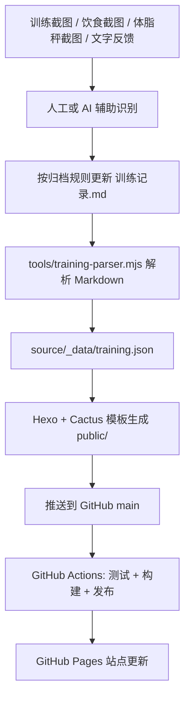

# training_records

这是一个围绕 `训练记录.md` 运转的静态记录系统，用来持续维护训练、饮食、体脂、恢复状态与主观反馈，并自动同步到 GitHub Pages 站点。

这份文档的目标不是记录某一次改了什么，而是说明整个系统现在如何工作、维护者平时该怎么操作，以及后续架构师可以从哪些位置继续迭代。

## 1. 系统目标

- 用 `训练记录.md` 作为唯一主数据源，集中保存每日训练与身体状态。
- 接收体脂秤截图、训练截图、饮食截图和文字反馈，并将其整理成结构化 Markdown。
- 通过脚本把 Markdown 解析成站点数据，再由 Hexo 生成 GitHub Pages 页面。
- 让维护者只需要维护内容，不需要手动改前端页面里的数值。

## 2. 当前系统边界

当前仓库里已经实现的是：

- `训练记录.md` 到结构化 JSON 的解析。
- JSON 到 Hexo 页面展示的转换。
- GitHub Actions 自动测试、构建和发布 GitHub Pages。

当前仓库里还没有实现的是：

- 截图上传接口。
- OCR 服务或图片自动识别后端。
- 管理后台。

因此，“上传训练截图、饮食截图、体脂秤截图进行识别”在当前阶段的真实含义是：

- 由维护者提供截图。
- 由人工或 AI 辅助识别截图内容。
- 按既定口径把识别结果更新到 `训练记录.md`。
- 提交到 GitHub 后，由现有构建链路自动刷新站点。

这点很重要，后续迭代时不要把“截图识别规则”误认为“仓库里已经内建 OCR 自动化能力”。

## 3. 整体流程



## 4. 输入类型与归档口径

### 4.1 体脂秤截图

维护者需要从截图中优先提取：

- 测量时间
- 身体得分
- 体重
- BMI
- 体脂率
- 骨骼肌量
- 内脏脂肪等级
- 基础代谢率
- 水分率
- 蛋白质率
- 骨盐量
- 去脂体重
- 身体年龄
- 身体类型（如果截图中有）

归档规则：

- 默认归入截图对应日期。
- 如果用户明确说明“次日清晨称重用于记录前一日状态收尾”，则归档到前一日。
- 即使归档到前一日，也必须保留真实测量时间。

### 4.2 运动截图

维护者需要从截图中优先提取：

- 训练日期与时间
- 训练类型
- 时长
- 距离
- 消耗热量
- 均速
- 心率等关键指标

当前已知常见类型：

- 燃脂训练
- 力量训练
- 户外骑行
- 爬楼

归档规则：

- 按当天时间顺序写入。
- 同一天多次训练要全部保留。
- 华为运动健康中的“自由训练”当前统一归为“燃脂训练”，必要时保留原始名称备注。

### 4.3 饮食截图

维护者需要从截图中优先提取：

- 记录日期
- 餐次
- 每餐建议热量范围
- 每餐实际热量
- 食物名称
- 食物重量或份量
- 单项热量
- 当日总热量

归档规则：

- 先写餐次汇总，再写明细。
- 若某餐明显超出建议范围，可单独标记，便于后续分析体脂和恢复变化。

### 4.4 文字反馈

文字反馈通常来自用户对当天状态的补充，例如：

- 疼痛、酸胀、疲劳
- 恢复情况
- 饮食异常
- 补剂使用
- 对训练强度的主观感受

这部分应一并归入对应日期，不要散落在站点文案里。

## 5. 主数据源设计

当前系统使用 `训练记录.md` 作为唯一主数据源。

推荐维护思路：

- 每天一个 `### YYYY-MM-DD` 顶级日期块。
- 同一天内部按主题拆成 `####` 子块。
- 结构优先稳定，便于脚本解析。

当前解析器会重点识别：

- 包含“体脂秤”的 `####` 区块
- 包含“运动截图记录”的 `####` 区块
- 包含“饮食截图记录”的 `####` 区块

这意味着：

- `训练记录.md` 既是“内容文档”，也是“半结构化数据源”。
- 改标题层级、字段名称、行格式时，需要考虑是否会影响解析器。

## 6. 核心文件职责

- `训练记录.md`
  训练主记录文档，也是系统唯一主数据源。

- `source/_data/training.json`
  由脚本生成的结构化数据，供 Hexo 模板直接读取。

- `tools/training-parser.mjs`
  负责把 `训练记录.md` 解析为每日记录、最新记录和图表数据。

- `tools/generate-training-data.mjs`
  调用解析器并生成 `source/_data/training.json`。

- `tools/run-hexo-command.mjs`
  用 Node 程序化调用 Hexo，执行 `generate`、`server`、`clean` 等命令。

- `source/index.md`
  首页内容入口，使用 `dashboard` 布局。

- `source/_posts/`
  存放“锻炼随想”文章，按时间倒序展示。

- `source/about/index.md`
  About 页面内容，说明作者背景、记录目的和站点定位。

- `themes/cactus/layout/dashboard.ejs`
  首页数据看板模板。

- `.github/workflows/deploy-pages.yml`
  GitHub Pages 自动部署工作流。

## 7. 维护者日常操作流程

### 7.1 收集输入

维护者收到以下任意输入后开始更新：

- 体脂秤截图
- 训练截图
- 饮食截图
- 口述或文字反馈

### 7.2 识别并标准化

先把截图内容转成结构化文本，再写入 `训练记录.md`。

当前建议原则：

- 不直接把图片信息散写到多个页面。
- 所有结构化数据最终都回收进 `训练记录.md`。
- 页面层只负责展示，不直接承担数据录入。

### 7.3 更新主记录

维护者更新 `训练记录.md` 时需要注意：

- 日期归档要一致。
- 测量时间和归档日期要区分清楚。
- 同一天多条活动要按时间顺序写。
- 饮食先汇总后明细。
- 异常情况单独说明。

### 7.4 如有主观感受，补充锻炼随想

如果有更偏感受型、判断型、反思型的内容，可以单独新增到：

- `source/_posts/*.md`

例如：

- 训练后哪里酸痛
- 当前阶段判断
- 某个动作的体会
- 恢复是否正常

### 7.5 本地验证

提交前建议至少执行：

```bash
npm test
npm run build
```

如需本地预览：

```bash
npm run server
```

### 7.6 提交与发布

当内容确认无误后：

1. 提交到 Git。
2. 推送到 `main`。
3. GitHub Actions 自动执行测试、构建与发布。
4. GitHub Pages 页面刷新。

## 8. 构建与发布流程

当前 `package.json` 中的关键命令：

- `npm test`
  运行 Node 原生测试，覆盖解析器和页面构建关键行为。

- `npm run build:data`
  从 `训练记录.md` 生成 `source/_data/training.json`。

- `npm run build:site`
  调用 Hexo 生成静态站点。

- `npm run build`
  先生成数据，再生成站点。

- `npm run server`
  本地启动 Hexo 预览。

GitHub Actions 发布流程如下：

1. checkout 仓库
2. 安装 Node.js 与依赖
3. 执行 `npm test`
4. 执行 `npm run build`
5. 上传 `public/` 产物
6. 发布到 GitHub Pages

因此，线上页面展示的数据始终来自：

`训练记录.md -> training.json -> Hexo 模板 -> public/ -> GitHub Pages`

## 9. 当前前端结构

站点目前包含三个主要模块：

- `训练记录`
  首页数据看板，展示最新归档数据、趋势图、每日速览与前一日对比。

- `锻炼随想`
  展示 `source/_posts/` 中的 Markdown 文章。

- `关于`
  展示作者背景与站点说明。

## 10. 对架构师的迭代建议

后续如果要把这个系统从“可维护的静态记录系统”升级成“半自动或全自动的数据采集系统”，建议优先考虑以下演进点：

### 10.1 截图接入层

- 增加统一截图上传入口。
- 为每类截图建立元数据结构，例如来源、截图时间、设备、用户备注。
- 把原始截图与识别结果做关联保存。

### 10.2 识别层

- 增加 OCR / 多模态识别服务。
- 为体脂秤、运动、饮食截图分别建立识别模板。
- 引入“识别结果待确认”状态，避免错误直接落库。

### 10.3 结构化数据层

- 不再只依赖 Markdown 作为唯一数据存储。
- 可以引入 JSON Schema、数据库或版本化记录模型。
- 保留 Markdown 作为可读导出层，而不是唯一事实源。

### 10.4 审核与回写层

- 建立“识别结果 -> 人工确认 -> 正式入库/回写 Markdown”的流程。
- 保留修改历史，便于排错和追踪。

### 10.5 展示层

- 扩展趋势图、异常提醒、周期对比、阶段总结。
- 增加更多健康指标，例如睡眠、步数、心率区间、围度等。

## 11. 维护注意事项

- 不要随意更改 `训练记录.md` 中解析器依赖的标题层级和字段命名。
- 新增截图类型前，先确认解析器和展示层是否需要同步扩展。
- 页面样式可以改，但数据口径必须先稳定。
- 如果要把截图识别自动化，优先补“识别结果校验”能力，而不是直接替换人工确认环节。

## 12. 一句话总结

这个仓库当前的本质是：

一个以 `训练记录.md` 为核心、通过脚本生成数据并自动发布到 GitHub Pages 的训练记录静态系统。

截图是输入来源，Markdown 是当前事实源，GitHub Actions 是发布链路，README 则是维护者和后续架构师理解整套系统的入口。
