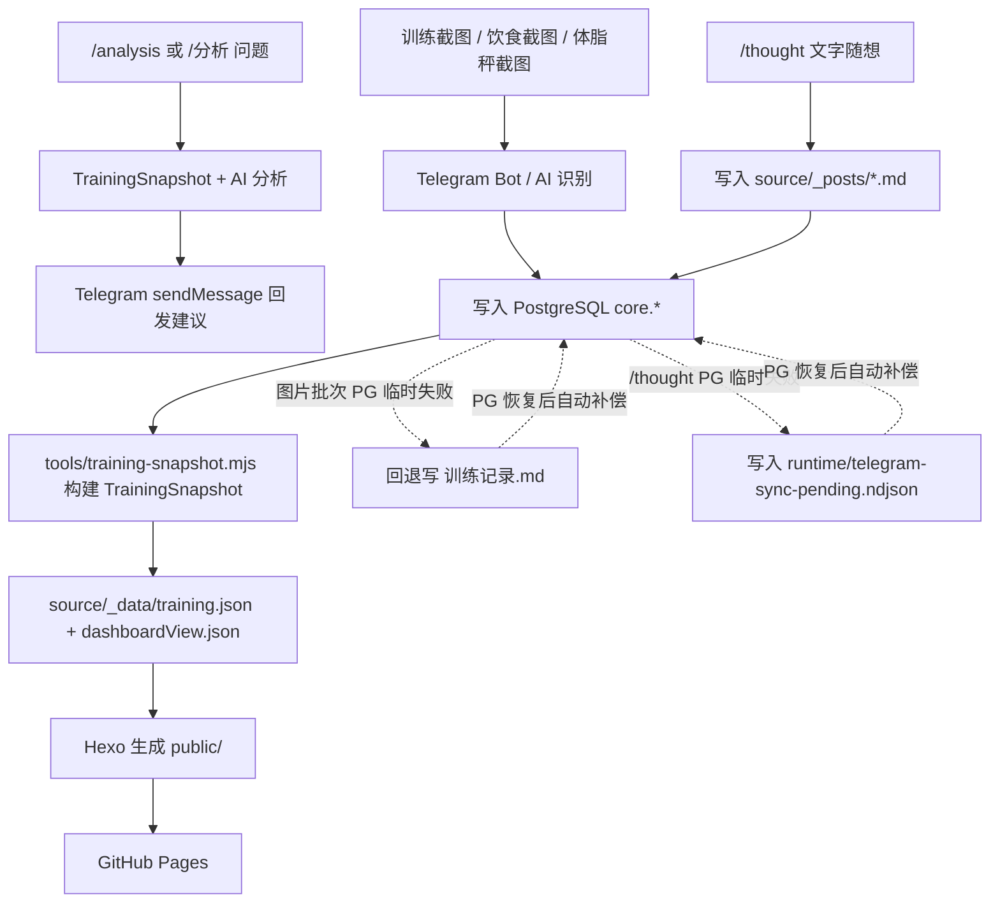

# training_records

这是一个围绕 `训练记录.md`、PostgreSQL 和 GitHub Pages 运转的训练记录系统。

当前系统的核心思路是：

- `TrainingSnapshot` 作为统一中间层
- `markdown` 与 `database` 两种数据来源并存
- Telegram 自动同步优先写 PostgreSQL；图片批次失败时回退写 `训练记录.md`，`/thought` 批次保留 `source/_posts` 并进入待补偿队列
- Telegram `/analysis` / `/分析` 可基于现有 `TrainingSnapshot` 生成临时训练建议并直接回发到 Telegram

## 1. 系统目标

- 用截图、文字反馈和手工补充持续维护训练、饮食、体脂与恢复记录
- 用 PostgreSQL `core.*` 作为自动同步后的主结构化数据层
- 用 `训练记录.md` 作为人工可读、人工修订和故障回退层
- 用 Hexo + GitHub Pages 持续生成可浏览的静态站点

## 2. 当前能力边界

当前仓库已经实现：

- `训练记录.md` 到 canonical snapshot 的解析
- PostgreSQL `core.*` 到 canonical snapshot 的读取
- Telegram 图片识别结果优先写 PostgreSQL，失败时回退写 Markdown
- Telegram `/thought` 文字随想直接写 `source/_posts/*.md`，并同步入库或进入待补偿队列
- Telegram `/analysis` / `/分析` 训练分析指令直接回发建议，不写 Markdown、docs 或数据库
- PostgreSQL 恢复后自动重放待补偿批次
- snapshot 到 Hexo 页面展示的转换
- GitHub Actions 自动测试、构建和发布 GitHub Pages

当前仓库仍然没有实现：

- 独立截图上传后台
- 专门的 OCR 服务后端
- 管理后台

## 3. 整体流程



## 4. 输入类型与归档口径

### 4.1 体脂秤截图

优先提取：

- 测量时间
- 身体得分
- 体重
- BMI
- 体脂率
- 骨骼肌量
- 内脏脂肪等级
- 基础代谢率
- 水分率
- 蛋白质率
- 骨盐量
- 去脂体重
- 身体年龄
- 身体类型

归档规则：

- 默认归入截图对应日期
- 如果明确说明“次日清晨称重用于前一日状态收尾”，则归档到前一日
- 即使归档到前一日，也必须保留真实测量时间

### 4.2 运动截图

优先提取：

- 训练日期与时间
- 训练类型
- 时长
- 距离
- 消耗热量
- 均速
- 心率等关键指标

当前常见类型：

- 燃脂训练
- 力量训练
- 户外骑行
- 爬楼

归档规则：

- 按当天时间顺序写入
- 同一天多次训练全部保留
- 华为运动健康中的“自由训练”统一归为“燃脂训练”，必要时保留原始类型

### 4.3 饮食截图

优先提取：

- 记录日期
- 餐次
- 每餐建议热量范围
- 每餐实际热量
- 食物名称
- 食物重量或份量
- 单项热量
- 当日总热量

归档规则：

- 先写餐次汇总，再写明细
- 超出建议范围的餐次可以额外标记

### 4.4 文字反馈

常见内容：

- 疼痛、酸胀、疲劳
- 恢复情况
- 饮食异常
- 补剂使用
- 对训练强度的主观感受

这部分应归到对应日期，不要散落在页面文案里。

## 5. 数据源设计

当前系统分为两层事实源：

- `core.*`
  Telegram 自动同步后的主结构化数据层
- `训练记录.md`
  人工可读、人工修订、以及 PostgreSQL 失败时的回退落地点

Markdown 推荐结构：

- 每天一个 `### YYYY-MM-DD`
- 同一天内部按主题拆成 `####`
- 标题和字段口径尽量保持稳定，便于解析

当前 Markdown 解析重点识别：

- 包含“体脂秤”的 `####` 区块
- 包含“运动截图记录”的 `####` 区块
- 包含“饮食截图记录”的 `####` 区块

## 6. 核心文件职责

- `训练记录.md`
  人工主文档，也是 PostgreSQL 失败时的回退落地点

- `source/_data/training.json`
  统一 snapshot 数据

- `source/_data/dashboardView.json`
  仪表盘视图模型

- `tools/training-domain.mjs`
  共享领域工具，供解析器、Telegram 同步和快照构建复用

- `tools/training-parser.mjs`
  把 Markdown 解析为 canonical snapshot

- `tools/training-snapshot.mjs`
  从 `markdown` 或 `database` source 构建统一 `TrainingSnapshot`

- `tools/training-db-core.mjs`
  负责 `ingest.* / core.*` 的持久化、读取和 Markdown 导出

- `tools/generate-training-data.mjs`
  生成 `training.json` 与 `dashboardView.json`

- `tools/import-training-markdown.mjs`
  把 Markdown 回填到 PostgreSQL `core.*`

- `tools/export-training-markdown.mjs`
  从 PostgreSQL 导出派生 `训练记录.md`

- `tools/telegram-sync.mjs`
  处理 Telegram 同步、图片识别、`/thought` 随想写入、`/analysis` 分析回复、DB 优先写入、Markdown 回退和待补偿重放

- `tools/training-analysis.mjs`
  从 `TrainingSnapshot` 汇总最近 7/30 天数据，调用 AI 生成 Telegram 训练分析回复

- `cloudflare/telegram-sync-dispatch-worker.mjs`
  Cloudflare Worker 示例，用于把 Telegram webhook 转发成 GitHub `repository_dispatch`，并把相册消息按 `media_group_id` 聚合后再派发

- `themes/cactus/layout/dashboard.ejs`
  首页模板

- `themes/cactus/source/js/training-dashboard.js`
  首页图表和分页脚本

## 7. 日常维护流程

### 7.1 本地手工维护

如果你是直接编辑内容：

1. 更新 [训练记录.md](/C:/Users/ljq90/Desktop/project_test/健身锻炼/训练记录.md)
2. 如需同步到数据库，执行 `npm run import:markdown`
3. 本地检查：

```bash
npm test
npm run build
```

### 7.2 Telegram 自动同步

`npm run sync:telegram` 的行为是：

1. 接收 GitHub `repository_dispatch` 传入的 Telegram update，或在轮询模式下拉 Telegram 消息
   Cloudflare webhook 接入已支持把同一相册的多条 update 聚合后一次 dispatch
2. 如果是截图消息，则调用 AI 识别图片并归档训练/饮食/体脂数据
3. 如果是 `/thought 正文` 文字消息，则直接生成 `source/_posts/YYYY-MM-DD-telegram-thought-<messageId>.md`
4. 如果是 `/analysis 问题` 或 `/分析 问题`，则读取现有 `TrainingSnapshot`，调用 AI 生成短建议并回发 Telegram
5. 图片和 `/thought` ready 批次优先写 PostgreSQL
6. 图片批次在 PostgreSQL 失败时会回退写 `训练记录.md`
7. `/thought` 批次在 PostgreSQL 失败时会保留已写出的随想 Markdown，并把待补偿记录写入队列
8. 失败批次写入 `runtime/telegram-sync-pending.ndjson`
9. PostgreSQL 恢复后，下次同步会先重放待补偿批次

### 7.2.1 `/thought` 随想的当前规则

- 入口命令是 Telegram 文本消息 `/thought 正文`
- 当前只识别文字消息，不需要图片
- 同步时会生成 `source/_posts/YYYY-MM-DD-telegram-thought-<messageId>.md`
- front matter 当前包含：`date`、`tags`、`telegram_message_id`、`telegram_chat_id`
- 当前不会为 Telegram 随想生成 `title`
- “锻炼随想”列表页只展示时间、标签和正文，不展示标题，也没有“阅读全文”
- 无标题 Telegram 随想的单篇详情页不会渲染空 H1

更完整的维护说明见 `docs/thoughts-module.md`。

### 7.2.2 `/analysis` 训练分析的当前规则

- 入口命令是 Telegram 文本消息 `/analysis 问题` 或 `/分析 问题`
- 问题为空时使用默认问题：`请根据最近训练、体脂、饮食数据给出今天/明天的训练建议`
- 只处理 `TELEGRAM_ALLOWED_CHAT_IDS` 白名单内的 chat
- 不走图片识别，不写 `训练记录.md`，不写 `source/_posts`，不写 PostgreSQL
- 基于现有 `TrainingSnapshot` 汇总最近 7/30 天数据，并通过 Telegram `sendMessage` 回发短建议
- 输出约束由 `prompts/training-analysis.md` 维护

更完整的维护说明见 `docs/telegram-analysis.md`。

### 7.3 页面构建

`TRAINING_SNAPSHOT_SOURCE` 决定页面构建数据来源：

- `markdown`
  站点从 `训练记录.md` 构建
- `database`
  站点从 PostgreSQL `core.*` 构建

## 8. 关键命令

- `npm test`
  运行全部测试

- `npm run build:data`
  生成 `training.json` 和 `dashboardView.json`

- `npm run build:site`
  调用 Hexo 生成静态站点

- `npm run build`
  先构建数据，再构建站点

- `npm run server`
  本地启动预览

- `npm run import:markdown`
  把当前 Markdown 回填到 PostgreSQL

- `npm run export:markdown`
  从 PostgreSQL 导出 Markdown

- `npm run sync:telegram`
  处理 Telegram update、识别截图、写入 `/thought` 随想或回复 `/analysis` 分析，同步到 PostgreSQL，必要时回退写 Markdown / 待补偿队列

## 9. GitHub Actions

当前工作流：

- `.github/workflows/deploy-pages.yml`
  在 `main` 的站点相关变更 push 后自动测试、构建并发布 Pages，也支持手动触发

- `.github/workflows/telegram-sync.yml`
  在 `repository_dispatch`、手动触发或 `训练记录.md` 的人工 push 时运行 Telegram 同步，并提交派生 Markdown；会跳过自身 bot push 造成的二次空跑

- `docs/telegram-date-resolution.md`
  Telegram 单张/多张图片的日期归档与跳过规则说明，包含 `photo` 与 `document` 的差异

- `docs/telegram-webhook-cloudflare.md`
  Telegram webhook + Cloudflare Worker 的接入说明

- `docs/thoughts-module.md`
  锻炼随想模块与 Telegram `/thought` 的维护说明

- `docs/telegram-analysis.md`
  Telegram `/analysis` / `/分析` 训练分析指令维护说明

页面展示数据来源取决于 `TRAINING_SNAPSHOT_SOURCE`：

- `markdown`
  `训练记录.md -> TrainingSnapshot -> training.json -> Hexo -> public/`
- `database`
  `core.* -> TrainingSnapshot -> training.json -> Hexo -> public/`

## 10. GitHub Settings 是否需要配置

需要。

至少 Telegram 自动同步和数据库链路都依赖 GitHub Settings 配置：

### Secrets

- `TELEGRAM_BOT_TOKEN`
- `AI_API_KEY`
- `TRAINING_DB_URL`

### Variables

- `AI_BASE_URL`
- `AI_MODEL`
- `AI_CONCURRENCY`
- `TELEGRAM_ALLOWED_CHAT_IDS`
- `TELEGRAM_POLL_LIMIT`
- `TRAINING_SNAPSHOT_SOURCE`
- `TRAINING_DB_ENABLED`
- `TRAINING_DB_TIMEOUT_MS`
- `TRAINING_DB_APP_NAME`

详细说明见 [docs/github-settings.md](/C:/Users/ljq90/Desktop/project_test/健身锻炼/docs/github-settings.md)。

## 11. PostgreSQL 初始化

- 新库初始化：执行 [sql/pgsql17.sql](/C:/Users/ljq90/Desktop/project_test/健身锻炼/sql/pgsql17.sql)
- 已有库升级：请保留你已经执行过的数据库升级结果；仓库内不再维护单独的 `update.sql`

当前数据库分为三层：

- `archive.*`
  构建快照与运行留痕
- `ingest.*`
  Telegram 原始批次、消息元数据、识别结果
- `core.*`
  主结构化数据层

## 12. 维护注意事项

- 不要随意更改 `训练记录.md` 中解析器依赖的标题层级和字段命名
- 如果页面继续走 `markdown` source，PG 故障不会影响页面构建
- 如果页面切到 `database` source，PG 就会变成页面构建依赖
- PostgreSQL 失败时，Telegram 批次会先写 Markdown，再进入待补偿队列，不会直接丢
- `/thought` 随想当前写入 `source/_posts` 时不生成 `title`；如果后续要恢复标题或调整 permalink，请同步修改模板、同步逻辑和测试
- `/analysis` 训练分析只回发 Telegram，不写 docs、Markdown 或数据库；如果后续改成持久化报告，请同步修改文档、workflow 和测试
- 如果你在 PG 故障期间又手工改了同一天的 Markdown，后续补偿入库时要注意冲突口径

## 13. 一句话总结

这个仓库现在的本质是：

一个以 `TrainingSnapshot` 为统一中间层、支持 Markdown 与 PostgreSQL 双来源、并自动发布到 GitHub Pages 的训练记录系统。
