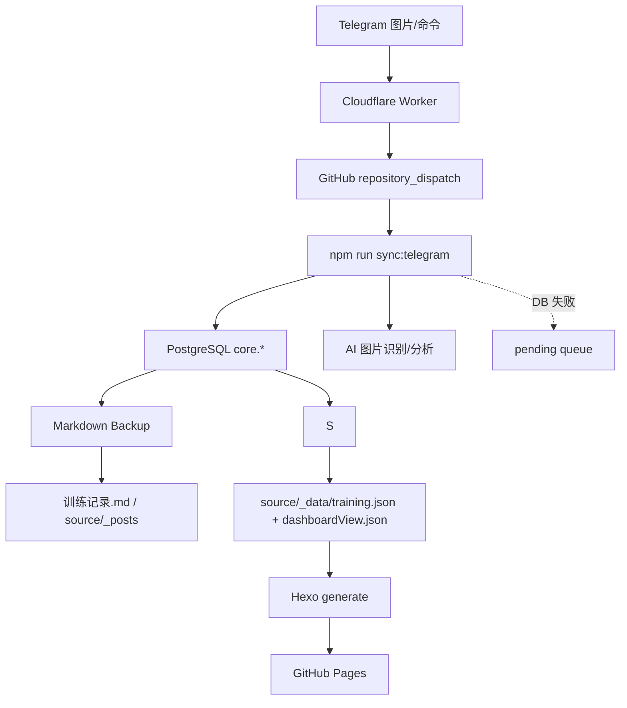

# 健身训练记录看板

这是一个用 PostgreSQL、Telegram Bot、AI 图片识别、Markdown 备份、Hexo 和 GitHub Pages 组成的个人训练记录系统。它的核心目标是把训练截图、体脂秤截图、饮食截图、睡眠截图和日常身体反馈归档成统一的 `TrainingSnapshot`，再生成可浏览的静态训练看板。

系统当前没有独立后台、OCR 服务后台或管理后台。主要维护入口是 Telegram Bot、PostgreSQL、npm scripts、GitHub Actions 和 `docs/` 文档；`训练记录.md` 是数据库派生备份。

## 核心功能

- 从 PostgreSQL `core.*` 读取结构化训练数据。
- 通过 Telegram 发送锻炼、饮食、体脂秤和睡眠截图，并调用 AI 识别归档。
- Telegram `/随想` / `/thought` 写入随想和身体反馈，支持编辑、删除、移动和带图。
- Telegram `/分析` / `/analysis` 基于训练快照生成训练建议，只回发 Telegram，不写入数据。
- Telegram `/ai` / `/智能助手` 调用 MCP 工具查询历史、同步状态或生成综合回答。
- PostgreSQL 写入失败时，批次进入待补偿队列，数据库恢复后重放。
- 定时从数据库导出 Markdown 备份。
- 生成 `source/_data/training.json` 和 `source/_data/dashboardView.json`，由 Hexo 渲染为 GitHub Pages 静态站点。

## 技术栈

| 层级 | 技术 |
| --- | --- |
| 运行时 | Node.js 22、ESM |
| 静态站点 | Hexo 7、EJS、Stylus、Chart.js CDN |
| 数据库 | PostgreSQL、`pg` |
| 自动化 | GitHub Actions、GitHub Pages |
| Telegram 入口 | Telegram Bot API、Cloudflare Worker、Durable Object |
| AI | OpenAI-compatible Chat Completions |
| Agent 工具 | 本地 MCP stdio server |

## 系统架构简述

`TrainingSnapshot` 是系统统一中间层。页面构建、训练分析、MCP 查询和 Markdown/数据库互导都围绕它工作。



## 项目目录结构

```text
.
├── README.md
├── 训练记录.md
├── 训练数据解析.md
├── CHANGELOG.md
├── _config.yml
├── docs/
├── prompts/
├── source/
├── themes/cactus/
├── tools/
├── src/
├── cloudflare/
├── sql/
├── runtime/
├── test/
└── .github/
```

关键目录说明：

- `训练记录.md`：数据库派生的人工可读训练备份。
- `训练数据解析.md`：`npm run build:data` 生成的解析排查输出，不建议手工维护。
- `source/`：Hexo 内容源，包含首页、随想页、文章、图片和 CNAME。
- `source/_data/`：构建生成的 `training.json` 与 `dashboardView.json`。
- `tools/`：CLI 入口和核心编排脚本。
- `src/`：AI、Telegram、MCP 等内部模块。
- `cloudflare/`：Telegram webhook 转 GitHub dispatch 的 Worker。
- `sql/`：PostgreSQL 初始化 SQL。
- `runtime/`：待补偿队列和归档失败日志。
- `docs/`：维护文档入口。

## 快速开始

环境要求：

- Node.js 22
- npm
- 可选：PostgreSQL 17 或兼容版本
- 可选：Telegram Bot、Cloudflare Worker、GitHub Pages 配置

安装依赖：

```bash
npm ci
```

本地构建：

```bash
npm run build
```

本地预览：

```bash
npm run server
```

线上推荐数据源是 PostgreSQL。未配置 PostgreSQL 时，本地仍可显式使用 Markdown 兼容构建。

## 配置方式

常用环境变量：

| 变量 | 作用 |
| --- | --- |
| `TRAINING_SNAPSHOT_SOURCE` | 页面和分析数据源，`markdown` 或 `database`，线上推荐 `database` |
| `TRAINING_SNAPSHOT_STRICT_DATABASE` | 严格数据库快照模式，数据库源失败时不回退 Markdown，默认 `false` |
| `TRAINING_DB_ENABLED` | 是否启用 PostgreSQL |
| `TRAINING_DB_URL` | PostgreSQL 连接串 |
| `TELEGRAM_BOT_TOKEN` | Telegram Bot token |
| `TELEGRAM_ALLOWED_CHAT_IDS` | 允许处理的 Telegram chat id，逗号分隔 |
| `TELEGRAM_RECOGNITION_IMAGE_INPUT_MODE` | 图片识别输入模式：`auto`、`url` 或 `inline`；Action 默认 `inline` |
| `TELEGRAM_RECOGNITION_MODEL` | 可选，仅覆盖 Telegram 图片识别模型 |
| `TELEGRAM_SYNC_RUN_SLEEP_BACKFILL` | 可选，显式运行睡眠全量补偿；默认在 pending replay 或新存储的睡眠图片后触发 |
| `AI_API_KEY` | AI 服务鉴权 |
| `AI_BASE_URL` | Chat Completions base URL |
| `AI_MODEL` | AI 模型名 |
| `AI_CONCURRENCY` | 图片识别并发数，默认 3 |
| `TRAINING_DB_TIMEOUT_MS` | 训练数据库连接超时时间，默认 5000ms；数据库偶发抖动时可适当调大 |
| `TRAINING_ANALYSIS_GOAL` | `/分析` 长期训练目标覆盖值 |
| `TELEGRAM_WEBHOOK_URL` | Telegram webhook 目标地址 |
| `TELEGRAM_SECRET_TOKEN` | Telegram webhook secret header 校验值 |
| `MARKDOWN_BACKUP_ENABLED` | 是否启用 DB -> Markdown 定时备份 |
| `MARKDOWN_BACKUP_FREQUENCY` | Markdown 备份频率，`weekly` 或 `daily` |

完整配置见 [GitHub与Cloudflare配置](/C:/Users/ljq90/Desktop/project_test/健身锻炼/docs/部署维护/GitHub与Cloudflare配置.md) 和 [日常维护手册](/C:/Users/ljq90/Desktop/project_test/健身锻炼/docs/部署维护/日常维护手册.md)。

## 训练记录流程

手工维护流程：

1. 优先通过 Telegram 或数据库维护入口写入数据。
2. 执行 `npm run build:data` 生成快照和解析排查文件。
3. 执行 `npm run build` 生成静态站点。
4. 只有确认 Markdown 是完整可信快照时，才显式执行 `npm run import:markdown`。

Telegram 自动流程：

1. Telegram 消息进入 Cloudflare Worker。
2. Worker 校验 secret；帮助消息直接回复，其它消息触发 GitHub `repository_dispatch`。
3. `telegram-sync.yml` 执行 `npm run sync:telegram`。
4. 图片批次调用 AI 识别；随想、分析、AI Agent 按命令分支处理。
5. 图片、随想和身体反馈写 PostgreSQL。
6. PostgreSQL 失败时写 pending 队列。
7. 内容变化后 workflow 只提交文件；站点构建部署由 push 或 DB-only 异步 deploy workflow 完成。

详细规则见 [训练记录生成与解析](/C:/Users/ljq90/Desktop/project_test/健身锻炼/docs/训练系统/训练记录生成与解析.md)。

## GitHub Pages 部署

`.github/workflows/deploy-pages.yml` 在 `main` 分支站点相关文件变更或手动触发时运行。它调用 `.github/actions/site-build/action.yml`，完成依赖安装、安全数据库修复、构建和 Pages 部署，不做 Markdown 回灌数据库。

站点配置在 `_config.yml`，当前 URL 为 `https://soulgo.chat`，`source/CNAME` 也指向 `soulgo.chat`。GitHub Pages 自定义域名、DNS 和 Cloudflare 控制台状态需要在对应平台人工确认。

Dev 分支在线预览由 `.github/workflows/deploy-cloudflare-pages-dev.yml` 发布到 Cloudflare Pages，默认地址为 `https://training-records-dev.pages.dev`。该 workflow 构建前使用 Dev 数据库变量，上传前会删除 `public/CNAME`，避免覆盖生产域名。

## GitHub Actions

| Workflow | 作用 |
| --- | --- |
| `ci-tests.yml` | 运行 `npm test` |
| `deploy-pages.yml` | 构建并部署 GitHub Pages |
| `deploy-cloudflare-pages-dev.yml` | 构建 dev 分支并部署 Cloudflare Pages 预览 |
| `telegram-sync.yml` | 处理 Telegram 同步、提交内容变化，并在 DB-only 入库时异步触发站点部署 |
| `markdown-backup.yml` | 按 GitHub Variables 控制定时从数据库导出 Markdown 备份 |
| `deploy-cloudflare-worker.yml` | 部署 Cloudflare Worker，并刷新 Telegram webhook |
| `refresh-telegram-webhook.yml` | 手动或每 6 小时刷新 Telegram webhook |

共享构建 action：`.github/actions/site-build/action.yml`。

## 数据来源说明

系统当前的事实源和备份层：

- PostgreSQL `core.*`：训练、饮食、体脂、睡眠、随想、身体反馈的唯一事实源。
- `训练记录.md` / `source/_posts`：从数据库导出的 Markdown 备份层。

`TRAINING_SNAPSHOT_SOURCE=database` 时，页面从 PostgreSQL 构建。DB-only 异步部署会启用 `TRAINING_SNAPSHOT_STRICT_DATABASE=true`，避免读库失败时发布旧 Markdown 页面。

## 常见维护操作

| 操作 | 命令 |
| --- | --- |
| 运行全部测试 | `npm test` |
| 快速测试 | `npm run test:fast` |
| 生成训练数据 | `npm run build:data` |
| 构建站点 | `npm run build` |
| 本地预览 | `npm run server` |
| 安全同步 archive/ingest/随想到数据库 | `npm run sync:db` |
| 显式 Markdown 导入数据库 | `npm run import:markdown` |
| 数据库导出 Markdown 备份 | `npm run export:markdown` |
| 显式 Markdown 与数据库对账 | `npm run reconcile:markdown` |
| 重放/补齐 archive 到 core | `npm run backfill:core` |
| 随想 Markdown 回填 core | `npm run backfill:thoughts` |
| 处理 Telegram 同步 | `npm run sync:telegram` |
| 刷新 Telegram webhook | `npm run telegram:webhook` |
| 启动 MCP Server | `npm run mcp:server` |

## 文档导航

- [文档总览](/C:/Users/ljq90/Desktop/project_test/健身锻炼/docs/README.md)
- [系统总览](/C:/Users/ljq90/Desktop/project_test/健身锻炼/docs/系统架构/系统总览.md)
- [内部接口手册](/C:/Users/ljq90/Desktop/project_test/健身锻炼/docs/系统架构/内部接口手册.md)
- [数据流转说明](/C:/Users/ljq90/Desktop/project_test/健身锻炼/docs/数据流转/数据流转说明.md)
- [训练记录生成与解析](/C:/Users/ljq90/Desktop/project_test/健身锻炼/docs/训练系统/训练记录生成与解析.md)
- [Telegram 使用说明](/C:/Users/ljq90/Desktop/project_test/健身锻炼/docs/训练系统/Telegram使用说明.md)
- [GitHub 与 Cloudflare 配置](/C:/Users/ljq90/Desktop/project_test/健身锻炼/docs/部署维护/GitHub与Cloudflare配置.md)
- [日常维护手册](/C:/Users/ljq90/Desktop/project_test/健身锻炼/docs/部署维护/日常维护手册.md)
- [常见问题排查](/C:/Users/ljq90/Desktop/project_test/健身锻炼/docs/问题排查/常见问题排查.md)

## FAQ

**页面数据来自哪里？**
由 `TRAINING_SNAPSHOT_SOURCE` 决定。线上推荐从 PostgreSQL `core.*` 构建。

**`训练数据解析.md` 可以手工改吗？**
不建议。它由 `npm run build:data` 生成，用于排查解析结果，下一次构建会覆盖。

**Telegram 图片为什么没有入库？**
常见原因是未授权 chat、AI 识别失败、置信度低、同一批次日期冲突，或图片和文件名都没有可靠日期。先看 GitHub Actions 的 `Telegram Sync` 日志和 pending 队列。

**`/分析` 会改训练记录吗？**
不会。它只读取 `TrainingSnapshot`，调用 AI 后回发 Telegram。

**`/ai` 会改数据吗？**
不会。当前 Agent 入口只调用 MCP 查询和分析类工具，不写 Markdown、数据库或 Telegram 以外的状态。

**数据库挂了会丢数据吗？**
批次会进入 pending 队列。数据库恢复后，下次同步会先重放队列；Markdown 备份由数据库恢复后的导出 workflow 生成。

## 注意事项

- 不要随意改变 `训练记录.md` 的日期标题、四级标题和字段名，解析器依赖这些结构。
- 修改 prompt 规则时，改 `prompts/_source/*.json`，再运行 `node tools/prompt-generator.mjs`，不要直接手写运行时 prompt。
- 更新 Telegram 命令、数据库结构、环境变量或 workflow 时，必须同步更新 `docs/`。
- 生产环境 Secrets、Variables、Cloudflare Worker 变量和数据库状态无法从仓库文件完全确认，需要在对应平台检查。
- 纯文档整理不应修改代码、配置逻辑、接口行为或系统功能。
