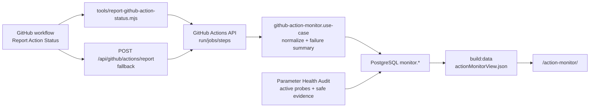

# Action 日志与失败补偿

## 当前实现范围

Action 日志现在由 workflow、同步结果文件、统一 summary 脚本、结构化事件和 PostgreSQL Action 监控表共同组成。当前事实如下：

- `sync.yml` / `sync-dev.yml` 在 `workflow_dispatch` 场景把 `dispatch_payload` 转写到 runner 临时文件，并只通过 `SYNC_DISPATCH_EVENT_PATH` 跨 step 传递事件文件路径；不再把原始 `DISPATCH_PAYLOAD` / `SYNC_DISPATCH_PAYLOAD` 写入 `$GITHUB_ENV`。
- `tools/lib/action-logger.mjs` 生成 `[action-log]` 单行 JSON。事件字段会统一归一化，敏感 key 默认 hash 或丢弃。
- `tools/action-sync-summary.mjs` 是 Telegram / 飞书 sync summary 的统一入口。`sync.yml` 与 `sync-dev.yml` 都调用它写入 `GITHUB_STEP_SUMMARY`。
- 所有 `.github/workflows/*.yml` 都有最终 `Report Action Status` step，使用 `if: always()`、`continue-on-error: true`，对 success / failure / cancelled 都尝试上报。
- `Report Action Status` 优先用 `tools/report-github-action-status.mjs` 在 runner 内直接写入当前分支对应 PostgreSQL；没有分支库连接时才 `POST /api/github/actions/report` 到外部监控服务。
- Action 监控只上报或读取 `run_id`，由 GitHub API 拉取 run/job/step 结构化数据；不上传 workflow event payload、业务 payload、step 输出或日志正文。
- Action 监控数据写入 `monitor.github_action_runs/jobs/steps/failures`，用于长期统计成功率、失败率、耗时和失败摘要。
- `/action-monitor/` 是独立站点页面；`build:data` 生成 `source/_data/actionMonitorView.json`，合并 PostgreSQL 监控表和 GitHub Actions API 最近 runs 后展示。
- `/action-monitor/` 同时展示系统参数健康。`.github/workflows/parameter-health-audit.yml` 支持手动选择 dev/main，也会每天定时运行；它向 `tools/check-parameter-health.mjs` 注入 Secret，执行只读健康 probes，写入 `monitor.system_config_parameters` / `monitor.system_config_parameter_checks`，输出健康计数后触发对应 Pages 刷新。Secret 仅存在于 runner 内存和 outbound 鉴权请求，不写入 summary、数据库或页面。
- `traceId` 由 `queueTaskId` 派生，格式为 `tr_<sha256前16位>`；workflow 没有队列任务时使用 `GITHUB_RUN_ID` 作为兜底 seed。
- Telegram / 飞书 sync CLI stdout 默认只输出 safe report；完整 report 只写入 `TELEGRAM_SYNC_RESULT_PATH` / `FEISHU_SYNC_RESULT_PATH`，供 summary 和 notify step 读取。
- `npm run export:markdown` 默认只输出 compact summary；完整导出 payload 只允许本地显式 `--debug-json`，GitHub Actions 中会拒绝该参数。
- DB 写入结果会带 `persistenceResult`，其中只保留安全字段：`transactionId`、`sourceChannel`、`rowCounts`、`durationMs`、`slowQueries`、`pendingStatus`、`rollbackStatus` 等。
- `sleepBackfill` 的同步链路回填只针对本轮写入的睡眠归档日期；全量回填只能走显式维护入口。
- Deploy 等待阶段会周期性输出 `[action-log]`，并在 step summary 中记录 deploy 状态、耗时和 URL。

## GitHub Actions summary

`sync.yml` / `sync-dev.yml` 在 webhook dispatch 场景会把同步结果写入 `GITHUB_STEP_SUMMARY`。

| Summary | 生成方式 |
| --- | --- |
| Run context | `tools/action-sync-summary.mjs` 输出 `workflow`、`runId`、`traceId`、`queueTaskId`、`channel` |
| Telegram sync result | `Write Telegram sync summary` step 调用 `tools/action-sync-summary.mjs --channel telegram` |
| Feishu sync result | `Write Feishu sync summary` step 调用 `tools/action-sync-summary.mjs --channel feishu` |
| AI | summary 聚合 provider、model、promptVersion、fallback/retry、duration 和 token totals |
| Database | summary 聚合 `persistenceResult` 中的 status、transactionId、rowCounts、pending/rollback、duration 和 slow query 数量 |
| Image storage | summary 聚合 `batch.imageUploadStats`，bucket/pathPrefix 以 hash 展示 |
| Site deploy result | 同步 workflow 的 `Trigger and wait for site deploy` step |

## GitHub Action 监控落库

当前监控链路是 run_id 驱动，不做轮询，也不把 workflow 日志正文落库。

| 环节 | 当前事实 |
| --- | --- |
| Workflow 接入 | 每个 workflow 最后都有 `Report Action Status`，非 `dev` / `main` 分支直接跳过。 |
| 本地写库优先 | step 注入 `GITHUB_TOKEN`、`GITHUB_ACTION_MONITOR_JOB_STATUS`、分支对应 `TRAINING_DB_URL` 和 `TRAINING_DB_APP_NAME`；有 DB URL 时运行 `node tools/report-github-action-status.mjs`。 |
| HTTP 兜底 | 没有分支 DB URL 且配置了 `GITHUB_ACTION_MONITOR_REPORT_URL*` 时，发送 `{"run_id":"${{ github.run_id }}"}` 到 `/api/github/actions/report`。 |
| GitHub API | `reportGitHubActionRun()` 读取 run 和 jobs，jobs API 中的 steps 作为 step 事实源。 |
| 分支隔离 | `allowedBranches` 来自 `GITHUB_ACTION_MONITOR_ALLOWED_BRANCH` 或当前 `dev` / `main` 分支；分支不匹配返回 `skipped=true`，不拉 jobs、不写库。 |
| 当前 run 结论 | GitHub API 在最终 step 执行时可能仍返回 `in_progress`；本地 reporter 用 `${{ job.status }}` 作为当前 run 兜底结论。 |
| 写库 | `PostgresGitHubActionMonitorRepository` 在事务内 upsert run/job/step，删除当前 run 旧 failures 后写入最新 failures。 |
| 读取 | 站点构建优先从 `monitor.*` 读取；配置了 GitHub token 时会合并 GitHub Actions API 当前分支 runs，补齐漏报或延迟上报的 run。 |
| 参数健康 audit | `Parameter Health Audit` 按 registry 执行 PostgreSQL 只读查询、AI models、Telegram getMe、飞书 tenant token、COS HeadBucket、Cloudflare Token Verify 或存在性检查；输出 compact summary 与 GitHub Step Summary，不输出参数值。 |
| 参数健康写库 | `PostgresParameterHealthMonitorRepository.writeParameterAudit()` upsert 参数元数据并追加本次检查结果；没有 DB URL 时只输出 summary 并跳过写库。 |
| 参数健康页面刷新 | audit 成功后按环境触发 dev Pages 或 main Pages workflow；刷新失败 `continue-on-error`，不会改变 audit 已完成的检查结果。 |

## Action monitor 页面

`/action-monitor/` 由 `ActionMonitorGenerator` 和 `themes/cactus/layout/action-monitor.ejs` 生成。页面展示当前环境、最近运行数、成功率、失败数、平均耗时、系统参数健康摘要，并按 15 条分页显示 Action 日志。

| 数据项 | 来源 |
| --- | --- |
| 状态 / 结论 | `monitor.github_action_runs.status`、`conclusion`；GitHub API fallback rows 可补齐缺失 run。 |
| workflow / run 编号 | `workflow_name`、`run_number`。 |
| commit / 触发人 / 分支 | `commit_sha`、`head_commit_message`、`actor_login`、`branch`。 |
| 耗时 | `start_time`、`end_time` 或 GitHub API `run_started_at` / `updated_at` 计算。 |
| 失败摘要 | 优先由失败 step 生成，最多取前三条，最长 800 字符。 |
| 明细计数 | 读取时聚合 job、step 和 failure 数量。 |
| 参数健康 | 读取当前 registry 和 `monitor.system_config_parameters` / 最新检查结果，展示健康状态、探测方式、证据强度、耗时、最近检查、最近健康和可选真实到期信息。registry probe 定义变化时不会继续采用数据库旧检查。 |

参数健康列表按 `invalid`、`missing`、`unreachable`、`unknown`、`unsupported`、`present`、`not_configured`、`healthy` 排序。到期信息完全独立：只有 Provider 返回或有真实依据的 `expiresAt` 才展示，不参与健康状态判定。

| 状态 | 含义 |
| --- | --- |
| `healthy` | 真实只读 API、数据库连接或存储访问探测成功。 |
| `present` | 参数已注入，但没有执行外部鉴权；不等于凭证可用。 |
| `invalid` | Provider 明确以 401/403 或业务鉴权错误拒绝凭证。 |
| `missing` | 当前环境必填参数或探测依赖未注入。 |
| `not_configured` | 可选参数未配置，不作为故障。 |
| `unreachable` | 超时、网络错误、限流或 Provider 5xx；不能误判为凭证无效。 |
| `unsupported` | 当前没有安全、可靠的自动探测方式。 |
| `unknown` | 探测未运行或证据不足；不代表参数有效。 |

## 关键状态字段

| 字段 | 来源 | 含义 |
| --- | --- | --- |
| `run_id` | GitHub Actions / `GITHUB_RUN_ID` | workflow run 稳定 ID，是 Action 监控主幂等键。 |
| `workflow_name` | GitHub Actions API | workflow 名称，用于页面展示和统计。 |
| `branch` | GitHub Actions API `head_branch` | run 所属分支，dev/main 分库隔离的业务边界。 |
| `monitor_environment` | report 配置 / 当前分支 | 监控实例环境，dev 库写 `dev`，main 库写 `main`。 |
| `run_attempt` | GitHub Actions API | 同一 run 的尝试次数。 |
| `job_id` | GitHub Actions jobs API | job 幂等键。 |
| `step_number` | GitHub Actions jobs API steps | 同一 job 内 step 序号，和 `job_id` 组成 step 幂等键。 |
| `failure_key` | `buildActionRunSnapshot()` | failure 幂等键，格式含 run/job/step 和失败层级。 |
| `error_summary` | `buildErrorSummary()` | 失败摘要，优先失败 step，其次失败 job / run。 |
| `traceId` | `tools/lib/action-logger.mjs` / workflow summary | 安全追踪 ID，优先由 `queueTaskId` 派生。 |
| `queueTaskId` | Worker / Queue / workflow input | 队列任务 ID，用于关联 Worker、workflow run 和 batch。 |
| `taskStatus` | `buildMessageSyncTasks` | 任务级状态。 |
| `persistenceStatus` | `persistNormalizedBatch` 结果 | `stored`、`unchanged`、`pending_replay`、`manual_intervention` 等。 |
| `persistenceResult.status` | `src/db/training/write.mjs` | DB 写入阶段状态。 |
| `persistenceResult.transactionId` | `persistNormalizedBatch` | 单次写入事务摘要 ID，格式为 `dbtx_<hex>`，不是数据库内部事务号。 |
| `persistenceResult.rowCounts` | `createObservedClient()` | 按白名单表聚合的影响行数。 |
| `persistenceResult.slowQueries` | `createObservedClient()` | 超过 `TRAINING_DB_SLOW_QUERY_MS` 的慢查询摘要，只含 operation/table/duration/threshold。 |
| `persistenceResult.pendingStatus` | pending replay 处理 | DB 失败后是否已进入 pending。 |
| `persistenceResult.rollbackStatus` | DB catch 分支 | rollback 是否 `succeeded`、`failed`、`not_needed` 等。 |
| `failureCategory` | `classifyFailureCategory` | AI、Telegram API、database、user_input 等失败分类。 |
| `failureDisposition` | summary 计算 | `auto_retry`、`manual_intervention`、`skip` 等处置。 |
| `recognitionAttemptKinds` | 图片识别流程 | `normal`、`fallback`、`strict_json_retry` 等。 |
| `aiCallLogStatus` | AI call log 写入 | AI 审计日志状态。 |
| `ai.provider` / `ai.model` | 图片识别结果 summary | 本次识别使用的 provider 和模型。 |
| `ai.promptVersion` | Prompt metadata | 使用的 Prompt 版本。 |
| `ai.fallbackUsed` / `ai.retryCount` | AI provider / fallback 逻辑 | 是否发生 fallback 和 HTTP retry 次数。 |
| `ai.totalTokens` | provider usage | provider 返回 token usage 时的总 token 数。 |

## 日志安全规则

当前日志只允许写入可排障的安全摘要：

| 类别 | 当前规则 |
| --- | --- |
| Action 监控上报 | workflow 只发送 `run_id`；本地 reporter 用 GitHub API 拉取 run/job/step，不上传 `github.event_path`、业务 payload、step 输出或日志正文。 |
| Action 监控落库 | `raw_payload_json` 只保存 GitHub API 返回的结构化 run/job/step 安全对象；失败摘要限制长度，不保存完整 logs。 |
| 参数健康监控 | registry、检查结果和页面只保存参数名、分类、位置、有效期规则和非敏感提示；不保存参数值、hash、DB URL、token、API key、聊天 ID 或 COS key。 |
| 原始 dispatch payload | 只落到 runner 临时 event 文件；跨 step 只传 `SYNC_DISPATCH_EVENT_PATH`。 |
| 文件、图片、聊天和来源 ID | `file_id`、`file_unique_id`、`image_key`、`chat_id`、`chatIds`、`sourceId`、飞书 `oc_` 默认 hash 或不输出。 |
| COS 信息 | `bucket`、`pathPrefix`、`object key` 默认 hash 或不输出完整值。 |
| Prompt / 用户文本 / SQL | `prompt`、`caption`、`text`、`body`、`sql`、`params` 在 action logger 中丢弃。 |
| Markdown 导出 | stdout 默认只输出 `status`、`mode`、`target`、`outputPath`、daily/thought 计数和 `durationMs`。 |
| 同步 CLI stdout | 默认只输出 safe report；完整 sync report 只写 result file，不直接 tee 到 Action log。 |
| Secret | 不允许输出 API Key、DB URL、token、password。 |

## 失败补偿

| 失败点 | 代码位置 | 处理 |
| --- | --- | --- |
| AI 识别失败 | `src/app/use-cases/telegram-sync/image-processing.mjs` | 可重试失败进入 pending recognition。 |
| DB 写入失败 | `src/app/use-cases/telegram-sync.use-case.mjs` 写库 catch 分支 | 写入 pending，返回 `pending_replay`。 |
| DB rollback | `src/db/training/write.mjs` | `persistenceResult.rollbackStatus` 记录 rollback 结果；rollback 失败写 stderr。 |
| 用户输入问题 | `classifyFailureCategory(..., { phase })` 后为 `user_input` | 返回 `manual_intervention`，不自动重放。 |
| AI call log 写入失败 | `src/db/training/write.mjs:91-99` | stderr 记录，不回滚主业务事务。 |
| Telegram 通知失败 | workflow `continue-on-error: true` 的通知 step | 不阻断已成功的同步结果。 |
| Action 监控上报失败 | `Report Action Status` step | `continue-on-error: true`，不反向改变原 workflow 结论；后续页面可通过 GitHub API fallback 补齐 run。 |
| Action 监控写库失败 | `tools/report-github-action-status.mjs` / HTTP report handler | 事务 rollback；本地 reporter 输出 `[github-action-monitor] local report failed`，HTTP handler 返回 5xx JSON。 |
| Action 监控分支不匹配 | `reportGitHubActionRun()` | 返回 `skipped=true` / `branch_not_allowed`，不拉 jobs、不写库。 |
| 参数健康无效、缺失、不可达或未知 | `tools/check-parameter-health.mjs` / `Parameter Health Audit` | 写入 Step Summary 和 `monitor.system_config_parameter_checks`；不让同步、部署、备份 workflow 因健康告警失败。 |
| 参数健康写库失败 | `tools/check-parameter-health.mjs` | audit 命令失败并暴露维护问题；不会输出 Secret 明文或参数值。 |

## 通知脚本

| 脚本 | 触发位置 | 作用 |
| --- | --- | --- |
| `tools/telegram-sync-notify.mjs` | sync workflow 成功后 | 向 Telegram 回发同步结果。 |
| `tools/feishu-sync-notify.mjs` | sync workflow 成功后 | 向飞书回发同步结果。 |
| `tools/telegram-action-monitor.mjs` | sync workflow 失败后 | 汇总失败步骤并通知 Telegram。 |
| `tools/feishu-action-monitor.mjs` | sync workflow 失败后 | 汇总失败步骤并通知飞书。 |

## 日常维护

维护入口必须优先使用只读巡检和显式阶段命令，避免把旧 Markdown 当作事实源覆盖数据库。

| 命令 | 说明 |
| --- | --- |
| `npm run maintenance:inspect` | 只读巡检 pending 队列、归档失败、AI monitoring 来源和 DB 账号权限摘要。 |
| `npm run maintenance:inspect -- --batch-id <batchId>` | 只读审计单个批次的识别 JSON、core 目标和 `recoveryTargetDays`。 |
| `npm run maintenance:sync` | 显式运行维护同步入口。 |
| `npm run maintenance:migrate` | 迁移入口，写入前必须 dry-run 或显式 confirm。 |
| `npm run sync:db` | 安全数据库修复入口。 |
| `npm run import:markdown` | 显式 Markdown 导入数据库。 |
| `npm run export:markdown` | 数据库导出 Markdown 备份，stdout 默认只输出 compact summary。 |
| `npm run export:markdown -- --debug-json` | 本地调试时输出完整导出 payload；GitHub Actions 中禁用。 |
| `npm run reconcile:markdown` | 显式 Markdown 与数据库对账。 |
| `npm run backfill:core` | 重放 archive 到 core。 |
| `npm run backfill:thoughts` | 随想 Markdown 回填 core。 |

安全数据库修复：`sync:db` 内部按维护阶段执行，可显式使用 `--phase archive`、`--phase ingest`、`--phase markdown`、`--phase thoughts` 或 `--phase all`。Markdown 导入属于 legacy 修复阶段，生产写入前先 dry-run 并核对 affected days。

pending 队列巡检重点看 `pendingDatabaseOldestAgeMinutes`、`pendingDatabaseMaxAttemptCount`、`pendingDatabaseAlertLevel` 和 `pendingDatabaseAlertReasons`。AI monitoring 重点看 `aiMonitoringFallbackRate`、`aiMonitoringSchemaFailureCount`、`aiMonitoringAvgRecognitionLatencyMs`、`aiMonitoringTotalCostUsd`，来源是 `ingest.ai_call_log` 和 `ingest.telegram_recognition.recognition_json.aiAttemptKind`。DB 权限巡检重点看 `database.permissionAudit.isSuperuser`、`database.permissionAudit.isMigratorLikeUser`、`database.permissionAudit.schemaCreatePrivileges` 和 `database.permissionAudit.dangerousPrivilegeReasons`；这些字段只来自只读权限查询，不会输出 DB URL 或 Secret。

配置 `TRAINING_DB_READONLY_URL` 后，`maintenance:inspect` 的 pending summary、AI monitoring、单批次审计和 DB 权限巡检优先使用只读连接；未配置时才回退 `TRAINING_DB_URL`。

旧 NDJSON pending 已从同步主链路下线。需要先运行 `node tools/telegram-sync-fallback.mjs inspect` 确认历史文件为空或仅作归档，不再通过 `sync:telegram` 重放；恢复统一走数据库 pending 队列。

Markdown backup workflow 的告警值包括 `changed_without_commit` 和 `workflow_failed_before_alert_evaluation`。出现 `changed_without_commit` 时先确认是否应由 `npm run export:markdown` 在目标分支提交，不能手工改派生备份来绕过数据库事实源。

## 内部接口索引

| 接口 | 说明 |
| --- | --- |
| `tools/lib/action-logger.mjs` | `[action-log]` 单行 JSON logger，负责 trace context、字段归一化和敏感字段处理。 |
| `tools/action-sync-summary.mjs` | Telegram / 飞书同步 summary 的统一 formatter。 |
| `tools/report-github-action-status.mjs` | GitHub Actions 本地 reporter，优先写入分支对应 PostgreSQL。 |
| `tools/github-action-monitor-server.mjs` | 可选 HTTP 监控服务，提供 `POST /api/github/actions/report`。 |
| `src/app/use-cases/github-action-monitor.use-case.mjs` | 拉取 GitHub run/jobs/steps、归一化并生成 failures。 |
| `src/app/use-cases/github-action-report-http.mjs` | HTTP handler，校验 method、JSON 和 `run_id`。 |
| `src/adapters/postgres/github-action-monitor-repository.pg.mjs` | `monitor.*` 表 upsert 和 `/action-monitor/` 读取查询。 |
| `src/site/action-monitor-view.mjs` | `/action-monitor/` 页面 view model。 |
| `GITHUB_ACTION_MONITOR_REPORT_URL(_DEV/_MAIN)` | HTTP 上报兜底 URL；有分支 DB URL 时不会优先使用。 |
| `GITHUB_ACTION_MONITOR_ALLOWED_BRANCH` | 可选分支白名单；未配置时本地 reporter 按当前 `dev` / `main` 分支收敛。 |
| `GITHUB_ACTION_MONITOR_VIEW_LIMIT` | 可选页面读取上限；未设置时不人为限制读取条数。 |
| `tools/training-maintenance.mjs sync --phase markdown` | Markdown 导入数据库阶段，对应 `import:markdown` 和 `reconcile:markdown`。 |
| `tools/training-maintenance.mjs sync --phase all` | 显式运行全部维护阶段。 |
| `tools/training-maintenance.mjs export markdown` | 数据库导出 Markdown 备份，对应 `export:markdown`，默认 compact summary。 |
| `TRAINING_DB_SLOW_QUERY_MS` | DB 慢查询摘要阈值，默认 1000ms；只记录 operation/table/duration/threshold。 |
| `aiCallLogStatus` | sync summary 中 AI 审计日志写入状态。 |
| `recognitionAttemptKinds` | 图片识别尝试类型，包括 normal、fallback、strict_json_retry。 |
| `persistenceResult` | DB 写入安全摘要，用于 summary 和失败排查。 |
| `syncStages` | 同步阶段状态集合，用于定位 Action 成功但业务未完成。 |
| `dateConfidence` | 日期归档可信度。 |
| `dateStages` | 日期推断阶段集合。 |

## 接手演练题卡

1. 画出 Telegram/飞书 -> Worker -> Queue -> Action -> AI -> DB -> Pages 的全链路，并指出哪些日志在 Worker、GitHub Actions、PostgreSQL 和 Pages。
2. 解释 `Action success` 不等于业务 stored：summary 中 `pending_replay`、`auto_retry`、`manual_intervention`、`skipped` 和 `partialFailure` 都需要继续判断业务状态。
3. 解释 `monitor.github_action_runs` 与 `GITHUB_STEP_SUMMARY` 的区别：前者是跨 run 统计事实，后者是单次 workflow 页面摘要。
4. 说明 `core.*`、`ingest.*`、`monitor.*`、`archive.*` 和 `训练记录.md` 的恢复优先级：业务事实优先保护 `core.*`，用 `ingest.*` 追溯消息和识别，用 `monitor.*` 排查 workflow 生命周期，用 `archive.*` 与 Markdown 作为恢复材料。
5. 给出人工验收步骤：先 `maintenance:inspect`，再按 `recoveryTargetDays` 核对目标日期，最后确认页面或数据库结果。
