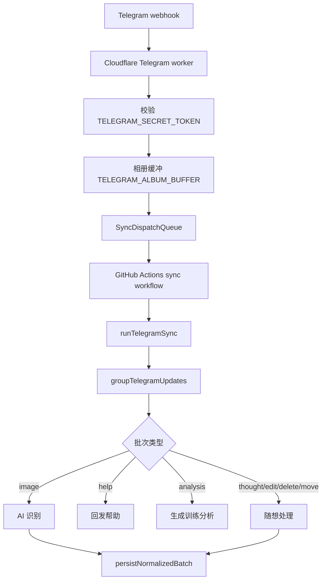

# Telegram 流程

## 流程

## 源码证据

| 步骤 | 代码位置 |
| --- | --- |
| Worker 默认入口 | `cloudflare/telegram-sync-dispatch-worker.mjs:18-19` |
| secret header 校验 | `cloudflare/telegram-sync-dispatch-worker.mjs:126` |
| 必需 Worker env | `cloudflare/telegram-sync-dispatch-worker.mjs:236-245` |
| Telegram 帮助直接回复 | `cloudflare/telegram-sync-dispatch-worker.mjs:261-273` |
| 相册缓冲 DO | `cloudflare/telegram-sync-dispatch-worker.mjs:24,173-175` |
| dispatch GitHub | `cloudflare/telegram-sync-dispatch-worker.mjs:364-369`、`cloudflare/sync-dispatch-queue.mjs:375` |
| 用例入口 | `src/app/use-cases/telegram-sync.use-case.mjs`（`main`/`runTelegramSync` 装配）→ `src/app/use-cases/message-sync.use-case.mjs`（共享编排 `runMessageSync`） |
| 必需运行时 env | `src/app/use-cases/message-sync-env.mjs`（`loadRequiredEnv`） |
| 消息分组 | `src/adapters/telegram/sync-batch-logic.adapter.mjs:95` |
| 批次处理 | `src/app/use-cases/message-sync.use-case.mjs`（`runMessageSync` 主循环） |

## 批次类型

| 类型 | 识别代码 | 处理结果 |
| --- | --- | --- |
| `image` | `groupTelegramUpdates` 中普通 photo/document image 分支 | 进入图片识别、日期归档、DB 写入。 |
| `help` | `parseHelpCommand`、`handleHelpBatch` | 回发 `TELEGRAM_HELP_TEXT`。 |
| `analysis` | `parseAnalysisCommand`、`handleAnalysisBatch` | 读取快照，生成分析并回发。 |
| `thought` | `parseThoughtCommand`、`handleThoughtSyncBatch` | 写随想 Markdown 兼容产物并镜像到 DB。 |
| `thought_edit` | `parseThoughtEditCommand`、edited message / reply edit | 编辑随想。 |
| `thought_delete` | `parseThoughtDeleteCommand` | 软删除随想。 |
| `thought_move` | `parseThoughtMoveCommand` | 移动随想模块。 |

## 授权

`loadRequiredEnv` 读取 `TELEGRAM_ALLOWED_CHAT_IDS` 并通过 `parseAllowedChatIds` 转换为集合。`runMessageSync` 对每个 batch 执行 `batch.messages.every((message) => env.allowedChatIds.has(message.chatId))`，不通过则返回 `status: ignored`、`reason: unauthorized chat`。
