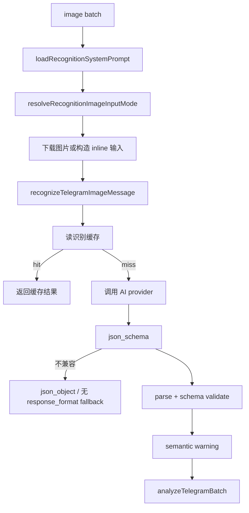

# 图片识别逻辑

## 流程



## 源码证据

| 步骤 | 代码位置 |
| --- | --- |
| 识别批次编排 | `src/app/use-cases/telegram-sync/image-processing.mjs` |
| 系统 Prompt 加载 | `src/app/use-cases/telegram-sync/image-processing.mjs:19-20` |
| 图片输入模式 | `src/app/use-cases/telegram-sync/image-processing.mjs:184-189` |
| 单张图片识别 | `src/app/use-cases/image-recognition.use-case.mjs:34` |
| 识别缓存开关 | `src/app/use-cases/image-recognition.use-case.mjs:14-18` |
| 缓存 key | `src/app/use-cases/image-recognition.use-case.mjs:20-33` |
| AI 请求 | `src/app/use-cases/image-recognition.use-case.mjs:199` |
| strict json schema | `src/app/use-cases/image-recognition.use-case.mjs:430` |
| response format fallback | `src/app/use-cases/image-recognition.use-case.mjs:409` |
| schema 定义 | `src/core/ai/telegram-recognition-schema.mjs` |
| schema 校验 | `src/core/ai/schema-validator.mjs` |
| 语义 warning | `src/core/ai/recognition-semantic-validator.mjs` |
| 识别评测 | `tools/eval-recognition.mjs`、`test/fixtures/recognition-eval/` |

## Schema 与语义校验

当前识别 schema 为 `RECOGNITION_SCHEMA_VERSION = 'v3'`。`records.required` 包含 `sleep`，因此睡眠图片必须输出 `records.sleep` 对象，非睡眠图片也必须显式输出 `records.sleep: null`。

schema parse 后会执行 `applyRecognitionSemanticWarnings()`。该步骤只追加安全 warning，不自动猜测或改写识别值；measurement / sleep 等明显异常字段会进入 warning 或后续人工介入判断，Action 日志和 summary 不输出图片 URL、file id、caption、Prompt 或完整 AI 响应。

固定样本评测入口是：

```bash
npm run eval:recognition
```

评测输出字段级准确率、schema failure 和 semantic warning 统计，用于比较 prompt、schema 或 model 调整前后的效果。

## Provider 与 fallback

`createAiProvider` 根据 `AI_PROVIDER` 创建 provider，默认 `openai-compatible`。识别场景中 `createRecognitionAiProvider` 会用 `TELEGRAM_RECOGNITION_MODEL` 覆盖通用 `AI_MODEL`，并在 `TELEGRAM_RECOGNITION_FALLBACK_API_KEY`、`TELEGRAM_RECOGNITION_FALLBACK_BASE_URL`、`TELEGRAM_RECOGNITION_FALLBACK_MODEL` 都完整时创建 fallback provider。

触发 fallback 的错误来自 `shouldRetryWithFallbackProvider`：`AiProviderError`、HTTP 429/5xx、Abort/Timeout、包含 timeout/rate limit/network/fetch failed 等文本的错误。

## 输出类型

识别结果经过 `normalizeRecognitionPayload` 标准化，核心分类来自 `imageType`：

| imageType | 后续映射 |
| --- | --- |
| `workout` | `records.activities` 和 `records.dailyWorkoutSummary` 映射到训练活动和日汇总。 |
| `nutrition` | `records.meals`、`records.totalCalories`、`records.details` 映射到饮食。 |
| `measurement` | `records.measurement` 映射到体脂/体测。 |
| `sleep` | `records.sleep` 映射到睡眠明细和日汇总。 |

低置信度、缺识别、无可靠日期、多日期冲突会在 `analyzeTelegramBatch` 中被跳过，不进入 `core.*` 写入。
