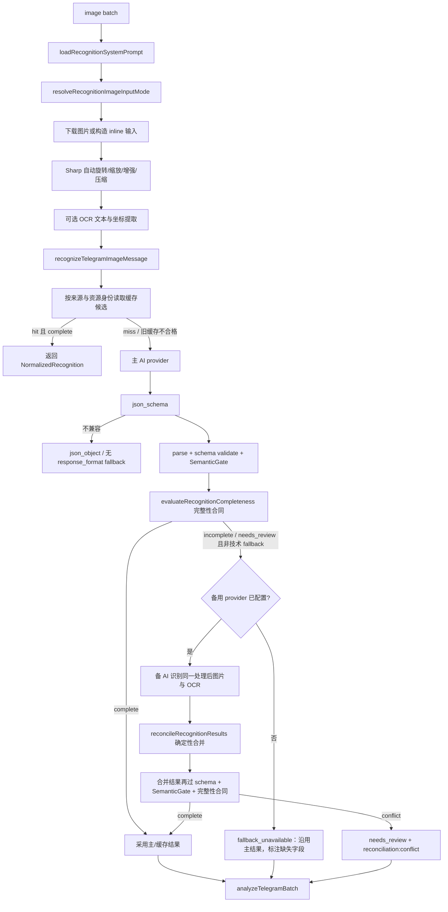

# 图片识别逻辑

## 流程



## 源码证据

| 步骤 | 代码位置 |
| --- | --- |
| 识别批次编排 | `src/app/use-cases/message-sync/image-processing.mjs` |
| 系统 Prompt 加载 | `src/app/use-cases/message-sync/image-processing.mjs:19-20` |
| 图片输入模式 | `src/app/use-cases/message-sync/image-processing.mjs:184-189` |
| 单张图片识别 | `src/app/use-cases/image-recognition.use-case.mjs:34` |
| Sharp 图片处理 | `src/adapters/image/sharp-image-processor.mjs` |
| OCR 文档契约 | `src/core/ai/ocr-document.mjs` |
| OCR 适配器 | `src/adapters/ocr/openai-compatible-ocr.adapter.mjs` |
| 标准化识别契约 | `src/core/ai/normalized-recognition.mjs` |
| 识别缓存开关 | `src/app/use-cases/image-recognition.use-case.mjs:14-18` |
| 缓存 key | `src/app/use-cases/image-recognition.use-case.mjs:20-33` |
| AI 请求 | `src/app/use-cases/image-recognition.use-case.mjs:199` |
| strict json schema | `src/app/use-cases/image-recognition.use-case.mjs:430` |
| response format fallback | `src/app/use-cases/image-recognition.use-case.mjs:409` |
| schema 定义 | `src/core/ai/telegram-recognition-schema.mjs` |
| schema 校验 | `src/core/ai/schema-validator.mjs` |
| SemanticGate | `src/core/ai/recognition-semantic-validator.mjs` |
| 完整性合同 | `src/core/ai/recognition-completeness.mjs` |
| 主备确定性合并 | `src/core/ai/recognition-reconciliation.mjs` |
| 主备编排与缓存后置校验 | `src/app/use-cases/image-recognition.use-case.mjs` |
| 单 provider 请求与技术 fallback | `src/app/use-cases/image-recognition-provider.mjs` |
| 识别评测 | `tools/eval-recognition.mjs`、`test/fixtures/recognition-eval/` |

## Schema 与语义校验

当前识别 schema 为 `RECOGNITION_SCHEMA_VERSION = 'v4'`。`records.required` 包含 `sleep`，因此睡眠图片必须输出 `records.sleep` 对象，非睡眠图片也必须显式输出 `records.sleep: null`。活动明细直接输出 `durationSeconds`、`calories`、`heartRate`、`distanceKm`、`avgSpeedKmh`；`detail` 只保留可读说明，不再作为新识别结果的结构化指标来源。

schema parse 后会执行 `applyRecognitionSemanticGate()`。物理越界字段会清洗为 `null`（`sanitize`），关系冲突升级为 `needs_review`；标准字段保存清洗结果，`raw_result_json` 保留 gate 前原始结构用于审计。其中「去脂体重 > 体重」这类物理不可能值按 `sanitize` 处理——清空存疑的非关键字段 `fatFreeMassKg`、保留体重与体脂率继续入库，不升级为需复核，避免体重已识别成功的体测图在备用识别未配置时整条无法入库。Action 日志和 summary 不输出原始值、图片 URL、file id、caption、Prompt 或完整 AI 响应。

固定样本评测入口是：

```bash
npm run eval:recognition
```

默认 fixture 只输出 contract field-match、schema failure 和 semantic warning 统计，不代表真实模型准确率；没有脱敏自然图片与受控 provider run 时，`accuracy/tokens/latency` 明确为 `not_measured`。

## 图片、OCR 与标准化边界

- `AI_IMAGE_PROCESSING_ENABLED=true` 时，图片会执行 EXIF 自动旋转、输入字节/像素限制、等比缩放、normalize、sharpen 和 JPEG 压缩；不会把原图 base64 写入数据库证据。
- Telegram `photo` 下载若同时缺少文件扩展名且响应为 `application/octet-stream`，按 Bot API 的 photo 语义推断为 `image/jpeg`；document/文件不会使用该兜底。
- `AI_OCR_ENABLED=true` 时，OCR 输出全文、文本块、归一化坐标、语言和置信度。`AI_OCR_FAILURE_MODE=best_effort` 时 OCR 失败继续视觉识别，`required` 时终止该张图片处理。
- AI 结果统一包装为 `NormalizedRecognition`，稳定提供 `sourceApp`、`dataType`、`fields`、`confidence`、`warnings`、`evidence` 和 `runtime`；不同 App 不需要新增独立代码入口。
- 缓存键包含来源渠道、资源身份、prompt、schema、完整性合同版本（`completeness:v1`）和 model、capability mode；主备合并结果使用独立的 `model+fallbackModel`、`capability:reconciled` 键。缓存读取使用 `ingest.recognition_run.cache_key` 精确匹配，命中候选会重新执行 schema、SemanticGate 与完整性门禁后才允许复用，旧的业务不完整缓存不再直接返回成功。

## Provider 与 fallback

`createAiProvider` 根据 `AI_PROVIDER` 创建 provider，默认 `openai-compatible`。`AI_API_PROTOCOL` 显式选择 `chat_completions`（默认）或 `responses`；Responses 适配器会转换多模态输入、`text.format` 结构化输出和响应 payload，并默认发送 `store: false`，调用方继续使用统一接口。响应文本优先读取官方 `output_text`，官方输出为空时兼容网关返回的 Chat Completions `choices[0].message.content`；仍无文本时仅记录 `status`、`incomplete_details.reason`、output/content 类型和是否 refusal，不记录正文、图片或健康数据。Provider 暴露 `vision`、`jsonSchema`、`jsonObject`、`textJson` 四项能力；对应运行时开关为 `AI_SUPPORTS_VISION`、`AI_SUPPORTS_JSON_SCHEMA`、`AI_SUPPORTS_JSON_OBJECT`、`AI_SUPPORTS_TEXT_JSON`，未配置时均默认为 `true`，三套 AI workflow 均会注入显式配置。识别请求按能力依次尝试 strict `json_schema`、`json_object`、纯文本 JSON，每一层都经过同一本地 schema validator 和 SemanticGate。

识别场景中主 provider 使用通用 `AI_API_PROTOCOL`；fallback 默认独立使用 `chat_completions`，可通过 `TELEGRAM_RECOGNITION_FALLBACK_API_PROTOCOL` 覆盖。`createRecognitionAiProvider` 会用 `TELEGRAM_RECOGNITION_MODEL` 覆盖通用 `AI_MODEL`。配置 `TELEGRAM_RECOGNITION_FALLBACK_MODEL` 即启用 fallback；备用 key/base URL 未单独配置时继承 `AI_API_KEY`、`AI_BASE_URL`，显式 `TELEGRAM_RECOGNITION_FALLBACK_API_KEY`、`TELEGRAM_RECOGNITION_FALLBACK_BASE_URL` 仍优先。

触发 fallback 的错误来自 `shouldRetryWithFallbackProvider`：`AiProviderError`、HTTP 429/5xx、Abort/Timeout、包含 timeout/rate limit/network/fetch failed 等文本的错误。这是**技术 fallback**，与下述**业务完整性 fallback** 是两条独立分支，不互相伪装。

## 完整性合同与主备 AI 补全

识别结果通过 SemanticGate 后，`evaluateRecognitionCompleteness()`（`src/core/ai/recognition-completeness.mjs`，版本 `RECOGNITION_COMPLETENESS_VERSION = 'v1'`）按图片类型评估业务完整性，返回 `status`（`complete` / `incomplete` / `needs_review`）、`missingFields`、`conditionalFields`、`reviewFields`、`evidenceCodes` 和 `requiresFallback`。它是纯函数，不接触数据库、不发起 AI 请求，只返回字段路径和证据代码，不输出健康数值或 OCR 原文。

- **硬完整性**：`measurement` 需有效 `weightKg`；`workout` 需至少一条有效 activity（`time`+`type`+`detail`）或有效 `dailyWorkoutSummary.activityCaloriesKcal`；`nutrition` 需有效 `totalCalories` 或可确定性求和的 `meals[].calories`；`sleep` 需 `totalSleepMinutes` 或 `nightSleepMinutes` 至少一个有效。`imageType='unknown'` 直接判 `complete`，不触发备用识别。
- **条件完整性**：只有 OCR 文本命中字段别名（如「体脂率 / 活动热量 / 总热量 / 睡眠评分」）而该字段缺失时，才把它记入 `conditionalFields`；截图未展示的字段不会仅因数据库列为空而判缺失，也不会让备 AI 凭常识补值。
- **needs_review**：SemanticGate 输出 `action:'review'` 的字段进入 `reviewFields`，状态升级为 `needs_review`。

`recognizeTelegramImageMessage()`（`image-recognition.use-case.mjs`）据此编排：

1. 缓存命中且完整性 `complete` → 直接返回，主备 AI 调用次数为 0。
2. 主 AI 技术成功且 `complete` → 采用主结果，不调用备 AI。
3. 主 AI 技术失败 → 走技术 fallback（`requestRecognitionWithProviderFallback`）。
4. 主 AI Schema 合法但 `incomplete` / `needs_review` 且未走技术 fallback → 调用**备用 provider** 重新识别同一处理后图片与 OCR，再做确定性合并。
5. 备用 provider 未配置 → 结果标 `reconciliation.status = 'fallback_unavailable'`，沿用主结果并记录缺失字段，不伪装为“完全识别”。

### 确定性合并

`reconcileRecognitionResults({ primary, fallback })`（`src/core/ai/recognition-reconciliation.mjs`）返回 `status`（`primary` / `fallback_completed` / `conflict` / `incomplete`）、`value`、`filledFields`、`agreedFields`、`conflictFields`、`fieldSources` 和 `finalSource`：

- 主值非空、备值空 → 保留主值；主值空、备值非空 → 用备值补全并记 `filledFields`。
- 数值在 `RECOGNITION_RECONCILIATION_TOLERANCES` 容差内视为一致（体重 0.1kg、百分比/BMI 0.1、kcal 1、分钟 5、秒 5、心率 2bpm、距离 0.05km、速度 0.1km/h、睡眠评分 1），保留主值记 `agreedFields`。
- 关键数值字段超出容差 → 记 `conflictFields`、状态 `conflict`，不按模型置信度自动二选一；`recommendedMin/Max` 等非关键字段冲突不阻断。
- `imageType` 冲突 → 直接 `conflict`。数组按业务键合并（activity 用 `time|type|detail`、meal 用标准化名称），字段级补全而非整条覆盖。
- 合并结果必须再次通过 schema、SemanticGate 与完整性门禁；仍不完整则状态降级为 `incomplete`、`value` 置空。

合并元数据经 `sanitizeReconciliationMetadata()` 脱敏后写入 `NormalizedRecognition.runtime` 与 `ingest.recognition_run`，只保留字段路径、来源（primary/fallback/reconciled）和状态，不含业务明文。**完整性状态只驱动“是否触发备 AI 最大化提取”，不是“是否入库”的门槛**；入库判定见 [数据入库流程](数据入库流程.md)。

## 输出类型

识别结果经过 `normalizeRecognitionPayload` 标准化，核心分类来自 `imageType`：

| imageType | 后续映射 |
| --- | --- |
| `workout` | `records.activities` 和 `records.dailyWorkoutSummary` 映射到训练活动和日汇总。 |
| `nutrition` | `records.meals`、`records.totalCalories`、`records.details` 映射到饮食。 |
| `measurement` | `records.measurement` 映射到体脂/体测。 |
| `sleep` | `records.sleep` 映射到睡眠明细和日汇总。 |

低置信度、缺识别、无可靠日期、多日期冲突会在 `analyzeTelegramBatch` 中被跳过，不进入 `core.*` 写入。识别完整性只影响是否触发备 AI 补全：只要本张图有可写入的真实数据即入库，仅在主备关键字段确定性冲突（`reconciliation:conflict` 或活动指标冲突）或整张图无任何可写入数据时进入 `skipped` / `manual_intervention`，详见 [数据入库流程](数据入库流程.md)。

App Profile 位于 `prompts/_source/app-profiles.json`，只保存标签别名、单位换算和时间优先级。未知 App 仍使用同一 v4 schema；截图不可见字段必须为 `null` 或空数组，不为单一 App 新增 core 表或独立主链路。
