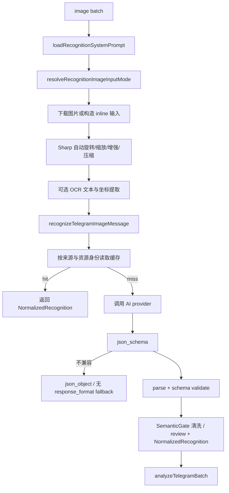

# 图片识别逻辑

## 流程



## 源码证据

| 步骤 | 代码位置 |
| --- | --- |
| 识别批次编排 | `src/app/use-cases/telegram-sync/image-processing.mjs` |
| 系统 Prompt 加载 | `src/app/use-cases/telegram-sync/image-processing.mjs:19-20` |
| 图片输入模式 | `src/app/use-cases/telegram-sync/image-processing.mjs:184-189` |
| 单张图片识别 | `src/app/use-cases/image-recognition.use-case.mjs:34` |
| Sharp 图片处理 | `src/adapters/image/sharp-image-processor.mjs` |
| OCR 文档契约 | `src/core/ai/ocr-document.mjs` |
| OCR 适配器 | `src/adapters/ocr/openai-compatible-ocr.adapter.mjs` |
| 标准化识别契约 | `src/core/ai/normalized-recognition.mjs` |
| 识别缓存开关 | `src/app/use-cases/image-recognition.use-case.mjs:14-18` |
| 缓存 key | `src/app/use-cases/image-recognition.use-case.mjs:20-33` |
| AI 请求 | `src/app/use-cases/image-recognition.use-case.mjs:199` |
| strict json schema | `src/app/use-cases/image-recognition.use-case.mjs:430` |
| response format fallback | `src/app/use-cases/image-recognition.use-case.mjs:409` |
| schema 定义 | `src/core/ai/telegram-recognition-schema.mjs` |
| schema 校验 | `src/core/ai/schema-validator.mjs` |
| SemanticGate | `src/core/ai/recognition-semantic-validator.mjs` |
| 识别评测 | `tools/eval-recognition.mjs`、`test/fixtures/recognition-eval/` |

## Schema 与语义校验

当前识别 schema 为 `RECOGNITION_SCHEMA_VERSION = 'v4'`。`records.required` 包含 `sleep`，因此睡眠图片必须输出 `records.sleep` 对象，非睡眠图片也必须显式输出 `records.sleep: null`。活动明细直接输出 `durationSeconds`、`calories`、`heartRate`、`distanceKm`、`avgSpeedKmh`；`detail` 只保留可读说明，不再作为新识别结果的结构化指标来源。

schema parse 后会执行 `applyRecognitionSemanticGate()`。物理越界字段会清洗为 `null`，关系冲突标记为 `needs_review`；标准字段保存清洗结果，`raw_result_json` 保留 gate 前原始结构用于审计。Action 日志和 summary 不输出原始值、图片 URL、file id、caption、Prompt 或完整 AI 响应。

固定样本评测入口是：

```bash
npm run eval:recognition
```

默认 fixture 只输出 contract field-match、schema failure 和 semantic warning 统计，不代表真实模型准确率；没有脱敏自然图片与受控 provider run 时，`accuracy/tokens/latency` 明确为 `not_measured`。

## 图片、OCR 与标准化边界

- `AI_IMAGE_PROCESSING_ENABLED=true` 时，图片会执行 EXIF 自动旋转、输入字节/像素限制、等比缩放、normalize、sharpen 和 JPEG 压缩；不会把原图 base64 写入数据库证据。
- `AI_OCR_ENABLED=true` 时，OCR 输出全文、文本块、归一化坐标、语言和置信度。`AI_OCR_FAILURE_MODE=best_effort` 时 OCR 失败继续视觉识别，`required` 时终止该张图片处理。
- AI 结果统一包装为 `NormalizedRecognition`，稳定提供 `sourceApp`、`dataType`、`fields`、`confidence`、`warnings`、`evidence` 和 `runtime`；不同 App 不需要新增独立代码入口。
- 缓存键包含来源渠道、资源身份、prompt、schema、model 和 capability mode，缓存读取使用 `ingest.recognition_run.cache_key` 精确匹配。

## Provider 与 fallback

`createAiProvider` 根据 `AI_PROVIDER` 创建 provider，默认 `openai-compatible`。`AI_API_PROTOCOL` 显式选择 `chat_completions`（默认）或 `responses`；Responses 适配器会转换多模态输入、`text.format` 结构化输出和响应 payload，并默认发送 `store: false`，调用方继续使用统一接口。Provider 暴露 `vision`、`jsonSchema`、`jsonObject`、`textJson` 四项能力；对应运行时开关为 `AI_SUPPORTS_VISION`、`AI_SUPPORTS_JSON_SCHEMA`、`AI_SUPPORTS_JSON_OBJECT`、`AI_SUPPORTS_TEXT_JSON`，未配置时均默认为 `true`。当前 sync workflow 尚未注入这些开关。识别请求按能力依次尝试 strict `json_schema`、`json_object`、纯文本 JSON，每一层都经过同一本地 schema validator 和 SemanticGate。

识别场景中主 provider 使用通用 `AI_API_PROTOCOL`；fallback 默认独立使用 `chat_completions`，可通过 `TELEGRAM_RECOGNITION_FALLBACK_API_PROTOCOL` 覆盖。`createRecognitionAiProvider` 会用 `TELEGRAM_RECOGNITION_MODEL` 覆盖通用 `AI_MODEL`，并在 `TELEGRAM_RECOGNITION_FALLBACK_API_KEY`、`TELEGRAM_RECOGNITION_FALLBACK_BASE_URL`、`TELEGRAM_RECOGNITION_FALLBACK_MODEL` 都完整时创建 fallback provider。

触发 fallback 的错误来自 `shouldRetryWithFallbackProvider`：`AiProviderError`、HTTP 429/5xx、Abort/Timeout、包含 timeout/rate limit/network/fetch failed 等文本的错误。

## 输出类型

识别结果经过 `normalizeRecognitionPayload` 标准化，核心分类来自 `imageType`：

| imageType | 后续映射 |
| --- | --- |
| `workout` | `records.activities` 和 `records.dailyWorkoutSummary` 映射到训练活动和日汇总。 |
| `nutrition` | `records.meals`、`records.totalCalories`、`records.details` 映射到饮食。 |
| `measurement` | `records.measurement` 映射到体脂/体测。 |
| `sleep` | `records.sleep` 映射到睡眠明细和日汇总。 |

低置信度、缺识别、无可靠日期、多日期冲突会在 `analyzeTelegramBatch` 中被跳过，不进入 `core.*` 写入。

App Profile 位于 `prompts/_source/app-profiles.json`，只保存标签别名、单位换算和时间优先级。未知 App 仍使用同一 v4 schema；截图不可见字段必须为 `null` 或空数组，不为单一 App 新增 core 表或独立主链路。
