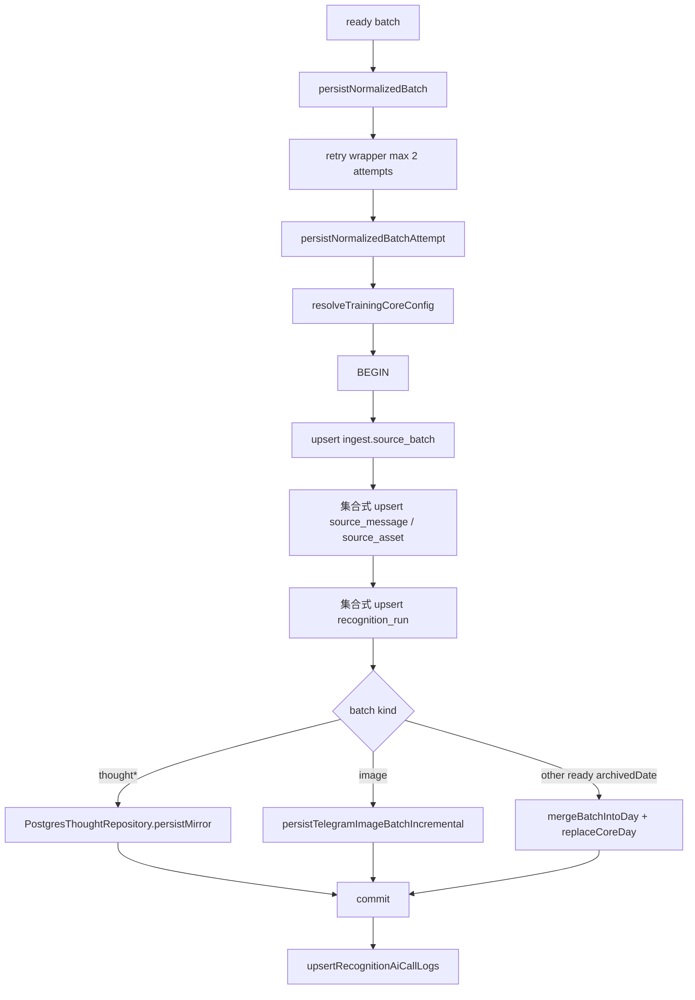

# 数据入库流程

## 流程



## 主事务重试机制（v1.3.5）

从 v1.3.5 开始，`persistNormalizedBatch` 增加了自动重试包装层：

- **最多重试 2 次**：第一次失败后，系统会自动重试最多 2 次（共 3 次尝试）
- **重试延迟**：第 1 次重试延迟 500ms，第 2 次重试延迟 1000ms（指数退避）
- **可重试错误识别**：只对瞬时数据库错误重试，包括：
  - 连接中断（`connection.*terminated`, `connection.*reset`, `connection.*closed`）
  - 超时（`timeout`, `timed out`, `ETIMEDOUT`）
  - 死锁（`deadlock`, `lock.*timeout`）
  - 序列化失败（`serialization.*failure`, `could not serialize`）
  - 网络错误（`ECONNRESET`, `ECONNREFUSED`）
- **失败处理**：如果 3 次尝试都失败，或遇到非可重试错误，则进入 pending 队列等待定时重放

这个机制显著减少了因瞬时网络或数据库错误导致的数据进入 pending 队列的情况，用户感知的延迟从 30 分钟（pending replay 间隔）降低到秒级。

## 源码证明

| 步骤 | 代码位置 |
| --- | --- |
| 入库入口 | `src/db/training/write.mjs:54` |
| 重试包装层 | `src/db/training/write.mjs:54-74` |
| 实际执行逻辑 | `src/db/training/write.mjs:76` (persistNormalizedBatchAttempt) |
| DB 配置读取 | `src/db/training/config.mjs` |
| 建立 pg client | `src/db/training/write.mjs` |
| 事务开始 | `src/db/training/write.mjs` |
| generic ingest repository | `src/adapters/postgres/source-batch-repository.pg.mjs` |
| batch / message / asset / recognition upsert | `src/db/training/write.mjs` |
| thought mirror | `src/db/training/write.mjs` |
| image incremental write | `src/db/training/write.mjs` |
| merge day fallback | `src/db/training/write.mjs` |
| AI call log | `src/db/training/write.mjs` |
| rollback | `src/db/training/write.mjs` |

## 写入目标

| schema | 表 | 来源 |
| --- | --- | --- |
| `ingest` | `source_batch` | 每个来源 batch 的 payload、hash 和处理状态。 |
| `ingest` | `source_message` | batch 内消息及来源 identity。 |
| `ingest` | `source_asset` | 图片/文档资源 identity 和非敏感元数据。 |
| `ingest` | `recognition_run` | 标准化识别字段、OCR/图片证据、缓存键与原始结构化结果。 |
| `ingest` | `ai_call_log` | AI 识别 started / 结果审计。 |
| `ingest` | `pending_task` | 来源无关的 AI 或 DB 失败 pending replay。 |
| `core` | `training_day` | 日汇总。 |
| `core` | `activity` | 训练活动。 |
| `core` | `meal` | 饮食。 |
| `core` | `measurement` | 体脂/体测。 |
| `core` | `sleep` | 睡眠。 |
| `core` | `thought` | 随想正文、模块、图片引用、状态。 |

## DDL 与回填边界

- 日常同步只执行业务 DML，不包含任何 schema preflight 或运行时 DDL。
- 数据库结构按环境保存于 `sql/dev-sql/` 与 `sql/main-sql/`；dev/main 已完成结构对齐，后续变更必须在目标数据库独立执行并重新导出对应环境 SQL。
- `sleepBackfill` 在同步链路中只针对本轮写入的睡眠归档日期执行目标日期回填；外层入口必须把 `targetArchivedDates` 透传到数据库查询，无目标日期时不做全量扫描。
- 同一天的多个 ingest/archive 睡眠候选先合并后只执行一次 core 写入；相同归档日期、睡眠类型、入睡时间和醒来时间生成同一 `sleepKey`，重复身份只保留最新记录，避免 `ON CONFLICT DO UPDATE` 在同一语句中重复命中。
- 全量修复、Markdown 导入和历史 backfill 属于显式维护入口，不能由普通消息同步隐式触发。

## 失败补偿

`runMessageSync` 捕获 ready batch 的数据库写入异常。若失败分类不是 `user_input`，调用 `appendPendingRecognitionBatch` 写入 pending，返回 `persistenceStatus: pending_replay`。pending 数据只存储在数据库 `ingest.pending_task`，恢复也统一通过数据库队列完成。

主事务成功后的 `sleepBackfill` 属于目标日期修复阶段；该阶段失败不回滚已存储 batch，但会把对应 batch 标记为 `partialFailure`、`failureCategory: database` 并写入 warnings。**从 v1.3.4 开始，sleepBackfill 失败且非用户输入错误时，系统会自动将失败任务加入 `ingest.pending_task` 队列进行重试，确保数据最终一致性。**

`backfillCoreSleepFromIngestBatchesClient` 内部实现了最多 3 次的自动重试机制（v1.3.4），对可重试的数据库错误（连接中断、超时、死锁、序列化失败等）会自动重试，减少瞬时错误导致的失败。

排查和通知必须识别 `partialFailure` 状态，不能只检查 workflow conclusion。messages、assets、recognitions 使用 `jsonb_to_recordset` 一次写入一组记录；批次内容 hash 未变化时事务直接回滚并返回 `unchanged`，避免重复写入 core。

## 数据一致性检查和自动修复（v1.3.5）

从 v1.3.5 开始，系统增加了全面的数据一致性检查和自动修复功能：

### 检查范围

涵盖所有数据类型：
- **Activities（训练消耗）**：检查 `ingest.source_batch` 中有 activities 数据但 `core.activity` 中缺失的情况
- **Measurements（体脂秤）**：检查 `ingest.source_batch` 中有 measurement 数据但 `core.measurement` 中缺失的情况
- **Meals（饮食）**：检查 `ingest.source_batch` 中有 meals 数据但 `core.meal` 中缺失的情况
- **Sleep（睡眠）**：检查 `ingest.source_batch` 中有 sleep 数据但 `core.sleep` 中缺失的情况（重用 v1.3.4 的睡眠检查）

### 使用方式

1. **手动检查**：
   ```bash
   npm run check:core-consistency
   ```
   输出所有数据类型的不一致情况，包括批次数量、归档日期等详细信息。

2. **自动修复**：
   ```bash
   npm run sync:db
   ```
   在 ingest 阶段自动执行一致性检查，发现不一致时从 `ingest.source_batch` 读取原始识别结果，重新执行 `persistTelegramImageBatchIncremental` 写入 `core.*` 表。

### 修复机制

- **批次级修复**：对每个不一致的 `batchId`，从 `ingest.source_batch` 读取完整 `payload_json`
- **增量重写**：调用 `persistTelegramImageBatchIncremental` 重新执行 activities/measurements/meals/sleep 的写入
- **幂等保证**：所有 core 表使用 `ON CONFLICT` 更新，重复执行不会产生重复数据
- **错误隔离**：单个批次修复失败不影响其他批次，失败批次会记录到日志

### 适用场景

- **历史遗留问题修复**：修复 v1.3.5 之前因瞬时错误导致的数据不一致
- **定期验证**：在 `npm run sync:db` 中自动执行，确保数据持续一致
- **故障恢复**：数据库崩溃、网络中断等异常恢复后的数据完整性验证
