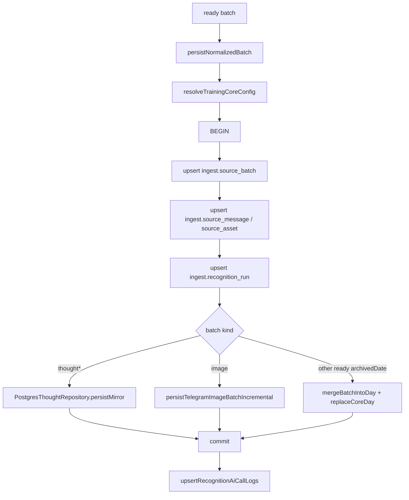

# 数据入库流程

## 流程

## 源码证据

| 步骤 | 代码位置 |
| --- | --- |
| 入库入口 | `src/db/training/write.mjs:21` |
| DB 配置读取 | `src/db/training/config.mjs` |
| 建立 pg client | `src/db/training/write.mjs:38-47` |
| 事务开始 | `src/db/training/write.mjs` |
| generic ingest repository | `src/adapters/postgres/source-batch-repository.pg.mjs` |
| batch / message / asset / recognition upsert | `src/db/training/write.mjs` |
| thought mirror | `src/db/training/write.mjs:72-73` |
| image incremental write | `src/db/training/write.mjs:74-75` |
| merge day fallback | `src/db/training/write.mjs:76-84` |
| AI call log | `src/db/training/write.mjs:91-99` |
| rollback | `src/db/training/write.mjs:119-130` |

## 写入目标

| schema | 表 | 来源 |
| --- | --- | --- |
| `ingest` | `source_batch` | 每个来源 batch 的 payload、hash 和处理状态。 |
| `ingest` | `source_message` | batch 内消息及来源 identity。 |
| `ingest` | `source_asset` | 图片/文档资源 identity 和非敏感元数据。 |
| `ingest` | `recognition_run` | 标准化识别字段、OCR/图片证据、缓存键与原始结构化结果。 |
| `ingest` | `ai_call_log` | AI 识别 started / 结果审计。 |
| `ingest` | `pending_task` | 来源无关的 AI 或 DB 失败 pending replay。 |
| `core` | `training_day` | 日汇总。 |
| `core` | `activity` | 训练活动。 |
| `core` | `meal` | 饮食。 |
| `core` | `measurement` | 体脂/体测。 |
| `core` | `sleep` | 睡眠。 |
| `core` | `thought` | 随想正文、模块、图片引用、状态。 |

## DDL 与回填边界

- 日常同步只执行业务 DML，不包含任何 schema preflight 或运行时 DDL。
- 常规 migration 通过 `npm run maintenance:migrate -- --dry-run` 预览，并在配置 `TRAINING_DB_MIGRATION_URL` 后用 `--confirm` 执行；本轮 `sql/migration.sql` 与 `sql/migration_phase2_generic_ingest.sql` 是独立手工迁移文件。
- `sleepBackfill` 在同步链路中只针对本轮写入的睡眠归档日期执行目标日期回填；无目标日期时不做全量扫描。
- 全量修复、Markdown 导入和历史 backfill 属于显式维护入口，不能由普通消息同步隐式触发。

## 失败补偿

`runMessageSync` 捕获 ready batch 的数据库写入异常。若失败分类不是 `user_input`，调用 `appendPendingRecognitionBatch` 写入 pending，返回 `persistenceStatus: pending_replay`。pending 数据只存储在数据库 `ingest.pending_task`，恢复也统一通过数据库队列完成。

dev 已于 2026-07-11 执行 Phase 1/Phase 2 迁移。main 部署前仍须执行相同迁移；`cleanup_phase2_legacy_ingest.sql` 尚未执行，不能与普通部署自动绑定。
