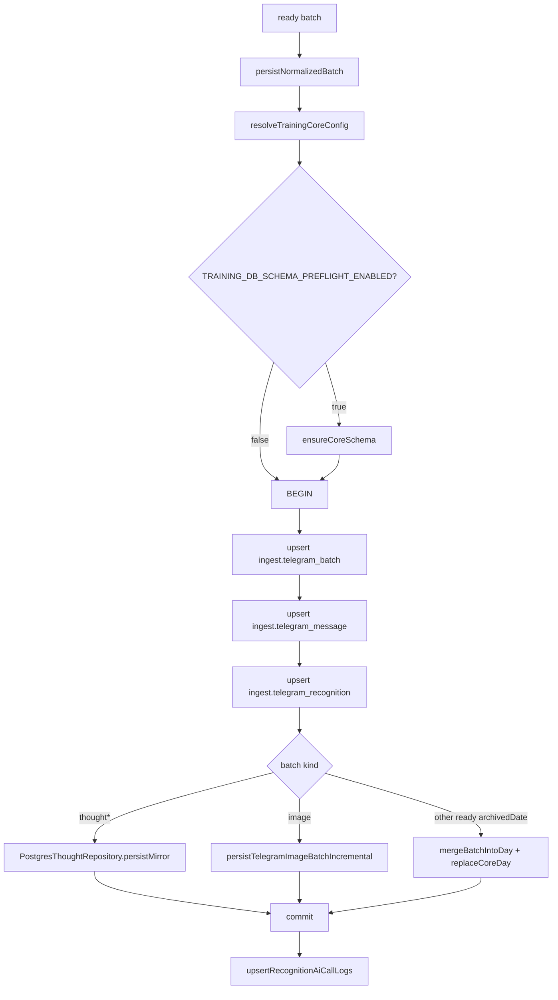

# 数据入库流程

## 流程

## 源码证据

| 步骤 | 代码位置 |
| --- | --- |
| 入库入口 | `src/db/training/write.mjs:21` |
| DB 配置读取 | `src/db/training/config.mjs` |
| 建立 pg client | `src/db/training/write.mjs:38-47` |
| schema preflight | `src/db/training/write.mjs` 中仅在 `TRAINING_DB_SCHEMA_PREFLIGHT_ENABLED=true` 时执行 |
| 事务开始 | `src/db/training/write.mjs` |
| batch upsert | `src/db/training/write.mjs:57-66` |
| messages / recognitions upsert | `src/db/training/write.mjs:68-69` |
| thought mirror | `src/db/training/write.mjs:72-73` |
| image incremental write | `src/db/training/write.mjs:74-75` |
| merge day fallback | `src/db/training/write.mjs:76-84` |
| AI call log | `src/db/training/write.mjs:91-99` |
| rollback | `src/db/training/write.mjs:119-130` |

## 写入目标

| schema | 表 | 来源 |
| --- | --- | --- |
| `ingest` | `telegram_batch` | 每个 batch 的 payload 和状态。 |
| `ingest` | `telegram_message` | batch 内消息、来源 identity、图片 file ids。 |
| `ingest` | `telegram_recognition` | AI 识别结果。 |
| `ingest` | `ai_call_log` | AI 识别 started / 结果审计。 |
| `ingest` | `telegram_pending_batch` | AI 或 DB 失败后的 pending replay。 |
| `core` | `training_day` | 日汇总。 |
| `core` | `activity` | 训练活动。 |
| `core` | `meal` | 饮食。 |
| `core` | `measurement` | 体脂/体测。 |
| `core` | `sleep` | 睡眠。 |
| `core` | `thought` | 随想正文、模块、图片引用、状态。 |

## 失败补偿

`runMessageSync` 捕获 ready batch 的数据库写入异常。若失败分类不是 `user_input`，调用 `appendPendingRecognitionBatch` 写入 pending，返回 `persistenceStatus: pending_replay`。pending 数据存储在数据库 `ingest.telegram_pending_batch`；旧 NDJSON 队列不再由同步主链路重放，只能通过独立 inspect 工具做历史核对。
