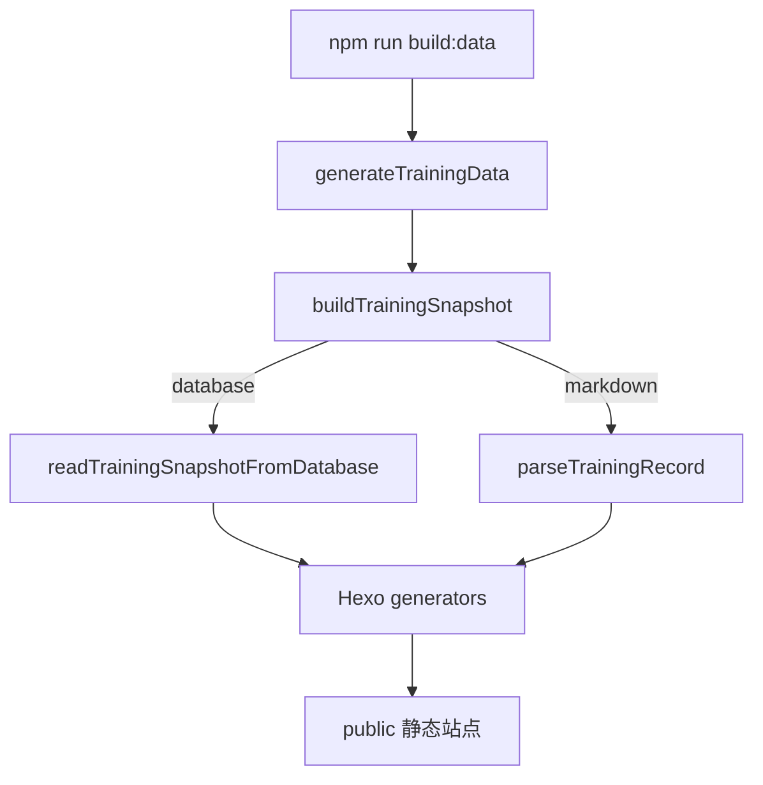

# 查询展示逻辑

## 流程

## 源码证据

| 步骤 | 代码位置 |
| --- | --- |
| npm script | `package.json` 中 `build:data`、`build` |
| 数据生成入口 | `src/app/use-cases/generate-training-data.use-case.mjs` |
| 快照来源解析 | `src/app/use-cases/generate-training-data.use-case.mjs` |
| 快照构建 | `src/domain/training/training-snapshot.mjs:15` |
| database 读取 | `src/adapters/postgres/training-read-client.pg.mjs`、`src/adapters/postgres/training-read-queries.pg.mjs`、`src/adapters/postgres/training-read-mapper.pg.mjs` |
| markdown 解析 | `src/domain/training/training-parser.mjs` |
| dashboard view model | `src/site/dashboard-view.mjs:3` |
| Hexo adapter | `src/adapters/hexo/hexo-generator.adapter.mjs` |
| GitHub Pages build action | `.github/actions/site-build/action.yml` |

## 数据源策略

`resolveSnapshotSource` 默认读取 `TRAINING_SNAPSHOT_SOURCE`，未设置时为 `markdown`。当配置为 `database` 时，`buildTrainingSnapshot` 尝试从 PostgreSQL 读取；若快照为空或不可用，是否回退由 `TRAINING_SNAPSHOT_STRICT_DATABASE` 和 fallback 工具决定。

`site-build` 在 `SNAPSHOT_SOURCE=database` 且 `STRICT_DATABASE_SNAPSHOT=true` 时先执行 `npm run export:markdown`，然后把 GitHub Actions 环境中的 `TRAINING_SNAPSHOT_SOURCE` 改为 `markdown`、`TRAINING_SNAPSHOT_STRICT_DATABASE=false` 再构建。

## 页面模块

站点配置来自 `_config.yml`：

| 路径 | 含义 |
| --- | --- |
| `/` | 训练记录首页。 |
| `/monitor/` | 健身监控总览，跨域指标、趋势与预警，详见 `训练监控逻辑.md`。 |
| `/thoughts/` | workout 随想。 |
| `/misc/` | 杂七杂八。 |
| `/body-feedback/` | 身体反馈。 |
| `/about/` | 关于页。 |

对应主题模板和样式在 `themes/cactus/layout/*`、`themes/cactus/source/css/*`。
