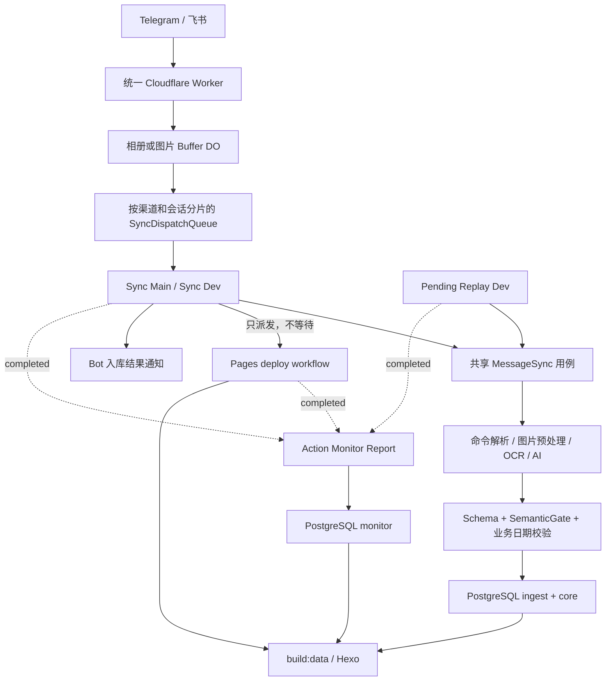

# 系统总览

## 系统定位

这是一个以 Telegram 和飞书采集训练、饮食、体脂、睡眠与随想数据的静态看板系统。Cloudflare Worker 负责入口校验、图片缓冲和顺序控制；GitHub Actions 执行业务同步；PostgreSQL 保存业务事实、接入审计和运行监控；Hexo 生成 GitHub Pages 或 Cloudflare Pages 静态站点。

## 当前总链路

## 生命周期边界

- Queue 的 Durable Object 名称由 `channel + chatId` 的稳定哈希生成。同一会话保持 FIFO，不同会话使用不同 DO，可以并行。
- Queue 只等待对应 sync workflow 完成；sync 成功后通过 `tools/dispatch-site-deploy.mjs` 派发站点部署，不轮询部署结果。
- Bot 的成功回复表示业务已接受或已入库，不代表站点已经发布。Pages 失败由部署 workflow 独立通知。
- `Action Monitor Report` 使用 `workflow_run` 监听 sync、deploy 和 pending replay，异步读取 run/jobs/steps 并写入分支对应的 `monitor.*`。
- webhook 请求不读取 Telegram polling offset；pending 只由 `SYNC_REPLAY_MODE=scheduled` 的独立 dev workflow 消费，新消息不替历史失败任务还债。

## 源码事实入口

| 领域 | 当前入口 |
| --- | --- |
| Worker 与队列 | `cloudflare/sync-dispatch-worker.mjs`、`cloudflare/sync-dispatch-queue.mjs` |
| Telegram / 飞书同步 | 共享编排 `src/app/use-cases/message-sync.use-case.mjs`（`runMessageSync`）；渠道装配 `src/app/use-cases/telegram-sync.use-case.mjs`、`src/app/use-cases/feishu-sync.use-case.mjs` |
| 图片识别 | `src/app/use-cases/image-recognition.use-case.mjs`、`src/adapters/image/`、`src/adapters/ocr/` |
| PostgreSQL 写入 | `src/db/training/write.mjs`、`src/adapters/postgres/source-batch-repository.pg.mjs` |
| `/分析` | `src/adapters/postgres/training-analysis-repository.pg.mjs`、`src/app/use-cases/training-analysis.impl.mjs` |
| 异步部署 | `tools/dispatch-site-deploy.mjs`、`.github/workflows/deploy-pages.yml`、`.github/workflows/deploy-cloudflare-pages-dev.yml` |
| pending replay | `.github/workflows/pending-replay.yml`、`ingest.pending_task` |
| Action 监控 | `.github/workflows/action-monitor-report.yml`、`tools/report-github-action-status.mjs` |
| 站点生成 | `src/app/use-cases/generate-training-data.use-case.mjs`、`src/site/*`、`themes/cactus/*` |

## 分层

| 层 | 目录 | 职责 |
| --- | --- | --- |
| Core | `src/core` | 实体、AI schema、语义校验和稳定业务契约。 |
| Domain | `src/domain` | 训练解析、日期工具、快照，以及 `buildTrainingDay`、`emptyNutrition`、`emptySleep`、类型规范化等来源无关基础规则。 |
| App | `src/app/use-cases` | 同步、识别、分析和数据生成编排。 |
| Adapters | `src/adapters` | PostgreSQL、AI、图片、OCR、Telegram、飞书、Hexo 适配。 |
| Site | `src/site` | Dashboard、训练监控和 Action monitor 视图模型。 |
| Tools | `tools` | 维护、部署派发、检查和通知 CLI。 |
| Cloudflare | `cloudflare` | Webhook、Buffer Durable Object、队列和 GitHub workflow dispatch。 |

依赖方向（以实际代码为准）：Core 的实体与服务（`core/entities/training-record.mjs`、`core/services/training-merge-service.mjs`）依赖 Domain 的来源无关基础规则（`domain/training/training-domain.mjs` 的 `buildTrainingDay`、`emptyNutrition`、`emptySleep`、类型规范化等），即 `Core → Domain` 单向依赖；Domain 不反向 import Core。Domain 在此层级中承担更底层的“来源无关规则”职责，Core 在其上组装稳定业务契约。

PostgreSQL 持久化层单向化（以实际代码为准）：`src/adapters/postgres` 是唯一的 PostgreSQL 适配层落点，连接配置与快照读实现均在此（`training-config.pg.mjs`、`training-read-client/queries/mapper.pg.mjs`）。`src/db/training` 仅保留读写编排入口（`read.mjs`/`write.mjs`/`pending-recognition.mjs`/`consistency-check.mjs`），单向依赖 `adapters/postgres`；`adapters/postgres` 不反向 import `db/training`。

渠道无关同步编排（以实际代码为准）：`src/app/use-cases/message-sync.use-case.mjs` 承载渠道无关的 `runMessageSync` 及共享子模块（`message-sync/`、`message-sync-{env,timings,handlers,thoughts}.mjs`）。`telegram-sync.use-case.mjs` 与 `feishu-sync.use-case.mjs` 各自只做渠道装配，均 import 中性编排模块；`feishu-sync` 不再 import 任何 telegram 命名模块。

## 运行入口

| 入口 | 命令或触发器 |
| --- | --- |
| Telegram 同步 | `npm run sync:telegram` |
| 飞书同步 | `npm run sync:feishu` |
| dev pending 重放 | `Pending Replay (Dev)` 定时或手工触发 |
| 站点构建 | `npm run build` |
| `/分析` | Telegram/飞书分析命令进入共享同步用例 |
| 数据一致性 | `npm run check:data-consistency` |
| 数据库维护 | `npm run maintenance:inspect`、`npm run sync:db` |
