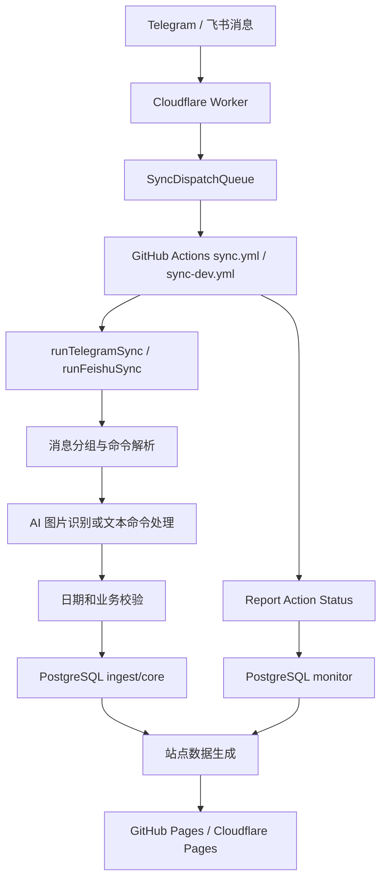

# 系统总览

## 系统定位

这是一个以消息通道采集训练、饮食、体脂、睡眠和随想数据的静态看板系统。消息来自 Telegram 或飞书，经 Cloudflare Worker 触发 GitHub Actions，在 Node 同步流程中调用 AI 识别图片，最终写入 PostgreSQL，并由 Hexo 构建静态站点。

## 总链路

## 源码证据

| 步骤 | 代码位置 |
| --- | --- |
| Worker fetch 入口 | `cloudflare/sync-dispatch-worker.mjs:22` |
| Telegram Worker 校验 | `cloudflare/telegram-sync-dispatch-worker.mjs:126` |
| 飞书 Worker 校验 | `cloudflare/feishu-sync-dispatch-worker.mjs:146,155,165` |
| Dispatch queue | `cloudflare/sync-dispatch-queue.mjs:21,311,375` |
| Telegram 用例入口 | `src/app/use-cases/telegram-sync.use-case.mjs:85,95` |
| 飞书用例入口 | `src/app/use-cases/feishu-sync.use-case.mjs:35` |
| 图片识别入口 | `src/app/use-cases/telegram-sync/image-processing.mjs`、`src/app/use-cases/image-recognition.use-case.mjs` |
| 数据写入 | `src/db/training/write.mjs:21` |
| Action 监控上报 | `tools/report-github-action-status.mjs`、`tools/github-action-monitor-server.mjs` |
| Action 监控用例 | `src/app/use-cases/github-action-monitor.use-case.mjs`、`src/app/use-cases/github-action-report-http.mjs` |
| Action 监控 PostgreSQL | `src/adapters/postgres/github-action-monitor-repository.pg.mjs` |
| 快照读取 | `src/domain/training/training-snapshot.mjs:15` |
| 站点生成 | `src/app/use-cases/generate-training-data.use-case.mjs`、`src/site/action-monitor-view.mjs`、`src/site/parameter-health-view.mjs` |

## 分层

| 层 | 目录 | 职责 |
| --- | --- | --- |
| Core | `src/core` | 实体、端口、AI schema、领域服务。 |
| Domain | `src/domain` | 训练数据解析、快照、导出和基础标准化。 |
| App | `src/app/use-cases` | 同步、识别、生成数据、分析等用例编排。 |
| Adapters | `src/adapters` | Telegram、飞书、PostgreSQL、AI、Hexo 适配。 |
| Site | `src/site` | Dashboard、训练监控等站点视图模型。 |
| Tools | `tools` | 维护、检查、通知等真实 CLI 入口。 |
| Cloudflare | `cloudflare` | Webhook 入口、缓冲、队列和 dispatch。 |

## 运行入口

| 入口 | 命令或触发器 | 代码 |
| --- | --- | --- |
| Telegram 同步 | `npm run sync:telegram` | `src/app/use-cases/telegram-sync.use-case.mjs` |
| 飞书同步 | `npm run sync:feishu` | `src/app/use-cases/feishu-sync.use-case.mjs` |
| 站点构建 | `npm run build` | `build:data` + `build:site` |
| Action 监控 HTTP 服务 | `npm run github-action-monitor:server` | `tools/github-action-monitor-server.mjs` |
| 数据一致性 | `npm run check:data-consistency` | `tools/check-training-data-consistency.mjs` |
| DB 同步维护 | `npm run sync:db` | `tools/training-maintenance.mjs sync` |
