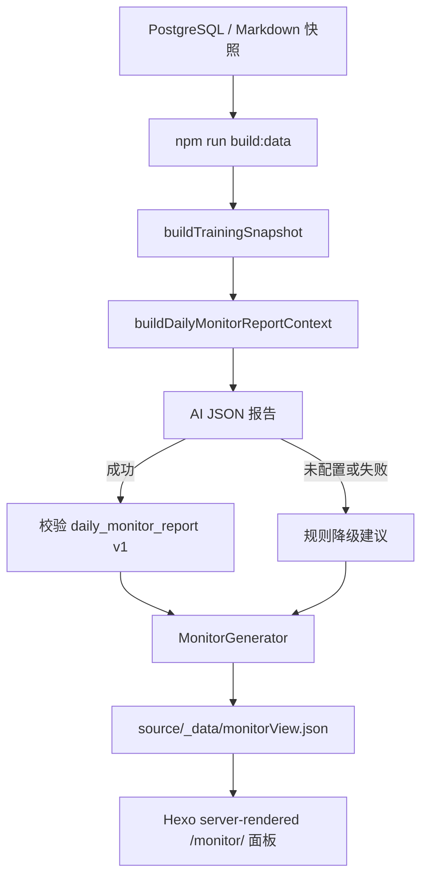

# 每日训练报告逻辑

`/monitor/` 是基于最新训练快照生成的每日报告面板。它不再渲染首页已有的趋势图、连续性和跨周期明细，而是展示最新一天的事实摘要，以及结合 AI 生成的训练、饮食、恢复和其他提醒。

## 流程

报告生成与首页使用同一份 `TrainingSnapshot`，不独立读取数据库，不写入 `core.*`、`ingest.*` 或 `monitor.*`。站点构建时才调用 AI，浏览器端不持有 AI Secret。

## 源码证据

| 内容 | 代码位置 |
| --- | --- |
| 数据生成入口 | `src/app/use-cases/generate-training-data.impl.mjs` |
| 每日报告用例 | `src/app/use-cases/daily-monitor-report.use-case.mjs` |
| 报告 JSON 合同 | `src/core/ai/daily-monitor-report-schema.mjs` |
| 报告 Prompt | `prompts/daily-monitor-report.md` |
| 监控视图模型 | `src/site/monitor-view.mjs` |
| Hexo 监控生成器 | `src/adapters/hexo/generators/monitor.generator.mjs` |
| 页面模板 | `themes/cactus/layout/monitor.ejs` |
| 页面样式 | `themes/cactus/source/css/training-monitor.styl` |
| 相关测试 | `test/daily-monitor-report.test.mjs`、`test/monitor-page.test.mjs` |

## 报告输入

`buildDailyMonitorReportContext(snapshot, now)` 只向 AI 提供以下结构化内容：

- 最新日期、数据源和最新体测：体重、体脂率、骨骼肌量、基础代谢。
- 最新一天训练：训练消耗、时长、活动类型和最多 5 条活动明细。
- 最新一天饮食：总摄入和餐次热量。
- 最新一天睡眠：总睡眠、睡眠评分、深睡、REM、HRV。
- 最新一天身体反馈，以及按日期排序的最近 7 天简化记录。

Prompt 要求 AI 只返回 `headline`、`training`、`nutrition`、`recovery`、`other` 五个字段。每个建议区块包含 `summary` 和 1 到 3 条 `actions`，通过 `daily_monitor_report v1` 合同校验后才进入页面。

## 页面契约

`monitorView.json` 的主要字段：

| 字段 | 含义 |
| --- | --- |
| `title` | 固定为 `每日训练报告`。 |
| `latestDataDate` | 当前快照中最新训练日。 |
| `dailyReport` | 报告状态、来源、生成时间、报告日期和四个建议区块。 |
| `summaryCards` | 体重、体脂率、睡眠、今日摄入四个最新事实卡片。 |
| `facts` | 身体、训练、饮食、恢复四组最新数据。 |
| `dataQuality` | 最新一天的关键数据完整率和缺失项；体测项以快照中的最新体测为准。 |
| `alerts` | 睡眠、摄入、训练或数据缺失的保守提醒。 |

`dailyReport.source` 为 `ai` 时表示 AI 报告通过合同校验；为 `rules` 时表示 AI 未配置或请求/校验失败，页面会标注“规则降级建议”。降级建议用于保持站点可发布，不把 AI 故障伪装成 AI 结果。

## 数据与安全边界

- AI 调用发生在 `build:data`，由共享 `.github/actions/site-build/action.yml` 仅在“Build site data and static files”步骤打开 `DAILY_MONITOR_REPORT_ENABLED=true`，并使用 dev/main Pages workflow 注入的 `AI_API_KEY`、`AI_BASE_URL`、`AI_MODEL` 和协议能力配置；测试步骤不会调用真实 AI。
- AI user message 只包含经过 `buildDailyMonitorReportContext` 裁剪的结构化数据，不包含数据库连接串、消息正文、图片 key 或 Secret。
- AI 返回空内容、非 JSON 或不符合合同，会记录安全错误摘要并切换到规则建议；不会把未校验内容写入静态页面。
- 饮食建议上限只有在存在正数配置时才参与差值和超量提醒；训练类型汇总缺失时从当天活动明细补齐。
- AI 请求不会增加数据库表、列或运行时 DDL，也不会写入训练事实。
- 站点页面采用 EJS 服务端渲染，不加载 Chart.js、`training-monitor.js` 或内嵌 JSON payload；首页看板继续独立维护自己的图表。

## 空数据行为

没有最新训练日和体测时，页面显示空状态，不调用 AI。存在最新数据但 AI 不可用时，页面显示最新事实和规则降级建议，并标注报告来源；缺失项会在数据状态区展示。
