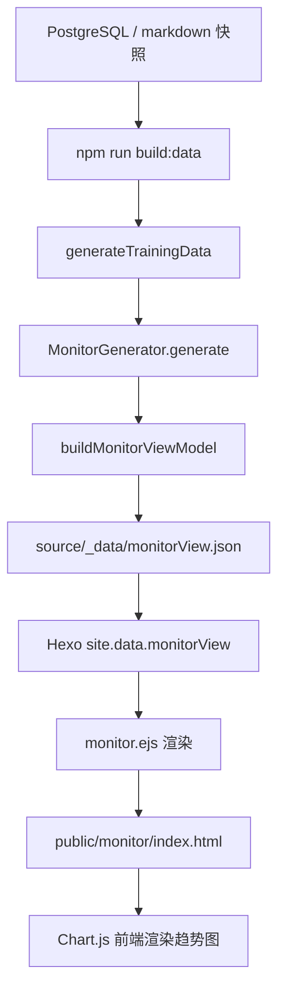

# 训练监控逻辑

`/monitor/` 健身监控总览页：复用站点构建快照，生成跨域视图模型 `monitorView.json`，在前端用 Chart.js 渲染核心指标卡片、近 30 天趋势图、连续性统计和预警。监控页只读快照，不写入训练事实。

## 流程

监控页与首页看板共享同一份快照（`TRAINING_SNAPSHOT_SOURCE`），不独立读取数据库，详见 `查询展示逻辑.md` 的数据源策略。

## 源码证据

| 步骤 | 代码位置 |
| --- | --- |
| 页面 front matter（`layout: monitor`） | `source/monitor/index.md:3` |
| 导航路由 | `_config.yml:37` |
| 导航中文名「监控」 | `themes/cactus/languages/zh-CN.yml:4` |
| 数据生成入口 | `src/app/use-cases/generate-training-data.use-case.mjs` |
| 注册 MonitorGenerator | `src/app/use-cases/generate-training-data.use-case.mjs` |
| 监控视图输出路径 | `src/app/use-cases/generate-training-data.use-case.mjs` |
| Hexo 生成器适配 | `src/adapters/hexo/hexo-generator.adapter.mjs` |
| 生成器聚合导出 | `src/adapters/hexo/generators/index.mjs:4` |
| 监控生成器 | `src/adapters/hexo/generators/monitor.generator.mjs:3` |
| 视图模型核心逻辑 | `src/site/monitor-view.mjs:11` |
| 页面模板 | `themes/cactus/layout/monitor.ejs:1` |
| 样式加载条件 | `themes/cactus/layout/_partial/head.ejs:59` |
| 样式 | `themes/cactus/source/css/training-monitor.styl` |
| 前端图表脚本 | `themes/cactus/source/js/training-monitor.js:1` |
| 视图模型单测 | `test/monitor-page.test.mjs:18` |
| 页面渲染集成测试 | `test/monitor-page.test.mjs:62` |

## 数据流

监控视图模型由 `buildMonitorViewModel(snapshot, options)` 生成，输入是站点快照 `snapshot`（含 `daily`、`charts`、`latest`），输出写入 `source/_data/monitorView.json`，模板经 `site.data.monitorView` 读取。

`MonitorGenerator` 通过 `options.monitorViewOptions` 接收配置，但 `generateTrainingData` 当前未传入该参数，因此生产环境使用 `defaultOptions` 默认值。

## 视图模型结构

`buildMonitorViewModel` 输出字段：

| 字段 | 含义 |
| --- | --- |
| `title` | 固定 `健身监控总览`。 |
| `generatedAt` / `updatedTime` | 快照生成时间及展示用的 `HH:MM` 标签。 |
| `latestDataDate` | 最新测量或训练日期，用于「最新数据」展示。 |
| `summaryCards` | 4 张核心指标卡片。 |
| `trendCards` | 4 张趋势图卡（仅描述，图表数据在 `chartPayload`）。 |
| `continuityStats` / `continuityText` | 连续性统计及拼接文本。 |
| `alerts` | 预警提示列表。 |
| `chartPayload` | 前端 Chart.js 渲染所需的窗口与图表系列。 |

### 核心指标卡片（summaryCards）

固定 4 张，顺序与 `id`：

| id | 指标 | 取值来源 | 进度计算 |
| --- | --- | --- | --- |
| `weight` | 体重 | `latestMeasurement.weightKg` | `weightGoalKg / weightKg`，目标达成百分比 |
| `bodyFat` | 体脂率 | `latestMeasurement.bodyFatPct` | 与 `bodyFatStandardMaxPct` 对照，达标固定 82% |
| `sleep` | 睡眠 | `latestSleep.sleepScore`（无评分时回退总睡眠时长） | 评分直接映射，或时长 / `sleepTargetMinutes` |
| `calorieBalance` | 热量平衡 | 摄入 - 建议上限 | 超额时进度下降，`tone` 随超额变 `rose` |

`secondary` 字段对体重为「目标 N kg」、体脂为「较上次 ±N%」、睡眠为评分差或目标时长、热量为相对建议上限的差额。计算逻辑见 `src/site/monitor-view.mjs:81`（`buildSummaryCards`）。

### 趋势图卡（trendCards）

固定 4 张，`chartId` 与对应 `chartPayload.charts` 系列：

| chartId | 图表 | 系列 |
| --- | --- | --- |
| `monitor-calorie-chart` | 热量摄入 vs 消耗 | `intakeCalories`、`trainingCalories` |
| `monitor-body-chart` | 体重 & 体脂率 | `weightKg`、`bodyFatPct` |
| `monitor-sleep-chart` | 睡眠时长 & 评分 | `sleepTotalMinutes`、`sleepScore`（右轴 0–100） |
| `monitor-workout-chart` | 锻炼时长 & 心率 | `workoutDurationMinutes`、`averageHeartRateBpm`（右轴） |

`chartPayload.charts` 共 8 个系列。`weightKg`、`bodyFatPct`、`intakeCalories`、`trainingCalories` 直接取自快照 `charts` 并按窗口过滤；`sleepTotalMinutes`、`sleepScore`、`workoutDurationMinutes`、`averageHeartRateBpm` 由 `daily` 按日构建（`buildDailyChart`），心率无汇总值时从 `activities` 计算（`calculateAverageHeartRate`）。构建逻辑见 `src/site/monitor-view.mjs:171`（`buildMonitorCharts`）。

### 连续性与预警

- **连续性**（`buildContinuityStats`）：`连续锻炼` 统计尾部 `trainingCalories > 0` 的连续天数；`睡眠达标连续` 统计尾部睡眠达标的连续天数，允许跳过未达标的前段。见 `src/site/monitor-view.mjs:188`。
- **预警**（`buildAlerts`）：昨日总睡眠 < 360 分钟提示「偏少」；摄入超建议上限提示超额；无异常时返回「当前无明显异常提示」。见 `src/site/monitor-view.mjs:201`。

## 配置参数

`defaultOptions`（`src/site/monitor-view.mjs:3`）：

| 参数 | 默认值 | 含义 |
| --- | --- | --- |
| `chartWindowDays` | `30` | 趋势图回看窗口天数。 |
| `weightGoalKg` | `65` | 体重目标，用于进度计算。 |
| `bodyFatStandardMaxPct` | `20` | 体脂率达标上限。 |
| `sleepTargetMinutes` | `420` | 睡眠达标时长（7 小时）。 |
| `calorieRecommendedMax` | `null` | 摄入建议上限；为 `null` 时从 `nutrition.meals[].recommendedMax` 求和推断（`resolveCalorieRecommendedMax`）。 |

## 空数据降级

无 `latestMeasurement` 且无 `latestDay` 时，返回空 `summaryCards`、空 `continuityStats`、单条 alert「暂无可展示的监控数据」、空 `charts`。模板据此渲染 `.monitor-empty` 占位，不加载 Chart.js。

## 前端渲染

`monitor.ejs` 将 `chartPayload` 以 `<script id="training-monitor-data" type="application/json">` 内联进页面（`monitor.ejs:96`），再加载 Chart.js 4.4.3（jsDelivr CDN，带 SRI `integrity`，`monitor.ejs:97`）与 `training-monitor.js`（`monitor.ejs:98`）。

`training-monitor.js`：

- 读取内联 JSON，按系列取并集日期并对齐缺失值为 `null`（`getUnionLabels` / `alignValues`）。
- 热量图为 `bar`，体重/体脂为 `line`，睡眠与锻炼图为 `bar` + 右轴 `line` 组合。
- 图例由 JS 动态写入 `[data-monitor-legend-for]` 容器（`renderLegend`），不依赖 Chart.js 内置 legend。
- 日期轴自动稀疏化，最多 7 个刻度，标签截取为 `MM-DD`。

## 维护要点

- 新增/调整指标卡片或趋势图时，需同步修改 `buildSummaryCards` / `buildTrendCards` / `buildMonitorCharts`、`monitor.ejs` 渲染循环与 `training-monitor.js` 的 `createChart` 配置，三者通过 `id` / `chartId` 对应。
- 修改 `defaultOptions` 默认值后，注意 `test/monitor-page.test.mjs` 用例显式传入了 `weightGoalKg`、`sleepTargetMinutes`、`calorieRecommendedMax`，断言基于这些值，需同步更新。
- Chart.js 通过 CDN 加载，升级版本时须同步更新 `monitor.ejs` 中的 URL 与 `integrity` SRI 值。
- 监控页样式独立为 `training-monitor.styl`，仅在 `page.layout === 'monitor'` 时加载，不影响其他页面。
- 视图模型核心逻辑与唯一导入路径均为 `src/site/monitor-view.mjs`。
