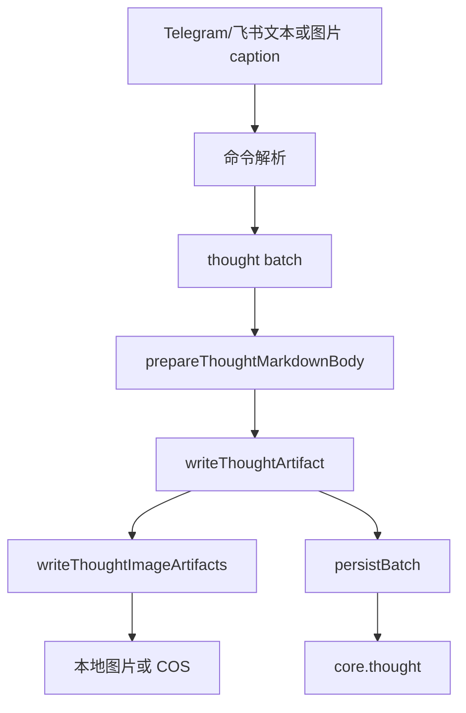

# 随想流程

## 支持能力

| 能力 | 命令解析代码 | 处理代码 |
| --- | --- | --- |
| 新增 | `parseThoughtCommand` | `analyzeThoughtBatch`、`handleThoughtSyncBatch` |
| 编辑 | `parseThoughtEditCommand`、edited message / reply edit | `analyzeThoughtEditBatch`、`handleThoughtSyncBatch` |
| 删除 | `parseThoughtDeleteCommand` | `analyzeThoughtDeleteBatch`、`PostgresThoughtRepository.persistMirror` |
| 移动 | `parseThoughtMoveCommand` | `analyzeThoughtMoveBatch`、`PostgresThoughtRepository.persistMirror` |

## 流程

## 源码证据

| 步骤 | 代码位置 |
| --- | --- |
| 命令 resolver | `src/adapters/telegram/sync-batch-logic.adapter.mjs:24-92` |
| 新增命令 | `src/adapters/telegram/sync-batch-logic.adapter.mjs` 中 `parseThoughtCommand` |
| 编辑命令 | `src/adapters/telegram/sync-batch-logic.adapter.mjs` 中 `parseThoughtEditCommand` |
| 删除命令 | `src/adapters/telegram/sync-batch-logic.adapter.mjs` 中 `parseThoughtDeleteCommand` |
| 移动命令 | `src/adapters/telegram/sync-batch-logic.adapter.mjs` 中 `parseThoughtMoveCommand` |
| 随想处理 | `src/app/use-cases/telegram-sync.use-case.mjs:1021` |
| Markdown 附件正文 | `src/app/use-cases/telegram-sync.use-case.mjs` 中 `prepareThoughtMarkdownBody` |
| 图片写入 | `src/app/use-cases/telegram-sync.use-case.mjs` 中 `writeThoughtArtifact` |
| 图片存储 | `tools/telegram-thoughts.mjs:51,493` |
| DB 镜像 | `src/db/training/write.mjs:72-73`、`src/adapters/postgres/thought-repository.pg.mjs` |

## 图片存储

`createImageStorage` 根据 `COS_ENABLED` 和 `COS_PROVIDER` 选择存储：

- 未启用 COS 时使用本地 `source/images/thoughts/...`，站点路径为 `/images/thoughts/...`。
- 启用 COS 时使用腾讯云 COS，要求 `COS_SECRET_ID`、`COS_SECRET_KEY`、`COS_BUCKET`、`COS_REGION`、`COS_DOMAIN`、`COS_PATH_PREFIX` 完整，并校验默认 HTTPS 域名格式。

图片引用最终进入 `core.thought.image_refs_json`。

## 飞书差异

飞书流程复用 `groupTelegramUpdates` 的命令解析，但飞书没有 Telegram `.md` / `.markdown` 文档附件下载语义。飞书图片下载由 `fetchFeishuImageResource` 完成。
