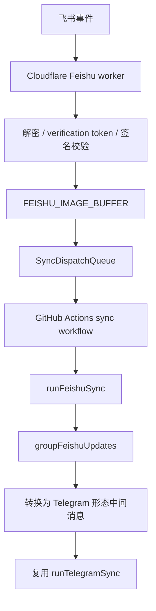

# 飞书流程

## 流程

## 源码证据

| 步骤 | 代码位置 |
| --- | --- |
| Worker 入口 | `cloudflare/feishu-sync-dispatch-worker.mjs:17-18` |
| 加密事件解密 | `cloudflare/feishu-sync-dispatch-worker.mjs:146` |
| verification token 校验 | `cloudflare/feishu-sync-dispatch-worker.mjs:155` |
| 签名校验 | `cloudflare/feishu-sync-dispatch-worker.mjs:164-165` |
| 飞书图片缓冲 | `cloudflare/feishu-sync-dispatch-worker.mjs:23,191-193` |
| GitHub dispatch | `cloudflare/feishu-sync-dispatch-worker.mjs:443-448` |
| 飞书用例入口 | `src/app/use-cases/feishu-sync.use-case.mjs:35` |
| 飞书 env 校验 | `src/app/use-cases/feishu-sync.use-case.mjs:232-249` |
| 飞书转共享同步 env | `src/app/use-cases/feishu-sync.use-case.mjs:257-264` |
| 飞书消息标准化 | `src/adapters/feishu/sync-batch-logic.adapter.mjs:5` |
| 飞书消息分组 | `src/adapters/feishu/sync-batch-logic.adapter.mjs:38` |

## 与 Telegram 的关系

飞书不是独立业务实现。`runFeishuSync` 加载飞书 API 配置后调用 `runTelegramSync`，并覆盖 adapter：

- `channel: feishu`
- `allowedChatIdsEnvName: FEISHU_ALLOWED_CHAT_IDS`
- `transportEnvName: FEISHU_SYNC_TRANSPORT`
- `sourceChannel: feishu`
- `groupUpdates: groupFeishuUpdates`
- `recognizeBatch` 使用飞书图片下载函数

飞书消息在 `groupFeishuUpdates` 内被转换为 Telegram updates 形状，再调用 `groupTelegramUpdates`。这保证图片、分析、随想新增/编辑/删除/移动走同一套业务语义。

## 飞书 API 使用

| 功能 | 代码 |
| --- | --- |
| 获取 tenant access token | `src/adapters/feishu/feishu-api.mjs`、`src/app/use-cases/feishu-sync.use-case.mjs:43-52` |
| 下载图片 | `src/app/use-cases/feishu-sync.use-case.mjs:53-64` |
| 发送消息 | `src/app/use-cases/feishu-sync.use-case.mjs:65-76` |
