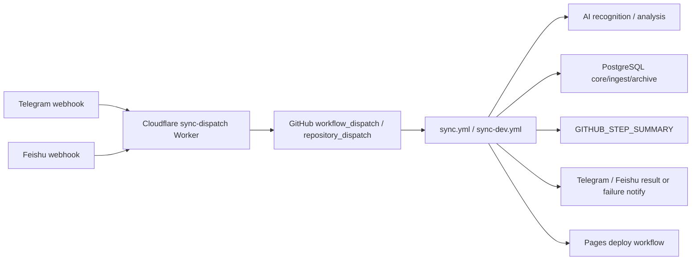

# GitHub Action 日志监控现状分析

## 当前系统如何处理 GitHub Actions

当前系统已经大量使用 GitHub Actions，但它处理的是“同步、构建、部署、通知”的运行链路，不是全量 Action 历史落库。

- GitHub workflow 位于 `.github/workflows/`，主要包括 `sync.yml`、`sync-dev.yml`、`deploy-pages.yml`、`deploy-cloudflare-pages-dev.yml`、`deploy-cloudflare-worker.yml`、`deploy-cloudflare-worker-dev.yml`、`ci-tests.yml`、`markdown-backup.yml`、`refresh-telegram-webhook.yml`。
- 生产和 dev 的公网 webhook 入口统一为 `cloudflare/sync-dispatch-worker.mjs`，由 `wrangler.toml` / `wrangler.dev.toml` 部署到 Cloudflare Worker。
- Worker 负责识别 Telegram / 飞书 webhook，然后通过 GitHub REST API 触发 `sync.yml` 或 `sync-dev.yml` 的 `workflow_dispatch`。
- `sync.yml` / `sync-dev.yml` 内部会执行 Telegram / 飞书同步、数据库写入、生成 summary、通知用户，并在需要时触发 Pages 部署 workflow。
- 当前 workflow 里已有少量 GitHub API 调用，例如同步 workflow 触发 Pages deploy 后，通过 GitHub API 查询 deploy workflow run 状态并等待完成。
- 当前 GitHub Actions 权限多为 workflow 局部声明，例如 sync workflow 使用 `contents: write` 和 `actions: write`，deploy workflow 使用 Pages 或 Cloudflare 所需权限。

## 是否已有日志记录能力

已有日志能力，但主要服务于“当次排障”和“通知”，没有完整落库。

- `tools/lib/action-logger.mjs` 生成 `[action-log]` 单行 JSON，负责 trace context、字段归一化和敏感字段脱敏。
- `tools/action-sync-summary.mjs` 将 Telegram / 飞书同步结果写入 `GITHUB_STEP_SUMMARY`。
- `tools/telegram-action-monitor.mjs` 和 `tools/feishu-action-monitor.mjs` 在 sync workflow 失败时读取 step outcome，向 Telegram / 飞书发送失败通知。
- `docs/02_系统核心逻辑/Action日志与失败补偿.md` 已记录当前 Action summary、traceId、queueTaskId、DB 写入摘要、AI 调用摘要和失败补偿方式。
- 数据库中已有 `ingest.ai_call_log`，用于 AI 调用审计，但没有 GitHub workflow run / job / step 级别的表。

## 是否存在重复机制

不存在完整重复机制，但有几个容易混淆的近邻能力：

- `tools/telegram-action-monitor.mjs` / `tools/feishu-action-monitor.mjs` 是失败通知脚本，只关心当前 sync workflow 的业务通知目标和失败阶段，不保存 run 历史。
- `tools/action-sync-summary.mjs` 是 step summary 生成器，只在 GitHub Actions 页面展示本次同步结果，不写 PostgreSQL。
- sync workflow 中等待 Pages deploy 的 shell 逻辑会短时查询另一个 workflow run，但只用于阻塞当前同步并写 summary，不沉淀为可统计数据。
- `ingest.ai_call_log` 只记录 AI 请求，不记录 GitHub Actions 运行生命周期。

因此新增模块不应复用通知脚本作为存储入口，也不应把 summary 文本当成事实源；它应该独立采集 GitHub API 的 run/job/step 结构化数据，并与现有通知机制并行。

## 当前缺失能力

- 没有记录每一次 workflow run 的 `run_id`、workflow、branch、commit、status、conclusion、耗时和 URL。
- 没有记录 job 和 step 明细，无法跨 run 统计失败集中在哪个 job / step。
- 没有 PostgreSQL 历史表支持成功率、失败率、平均耗时、dev/main 对比。
- 没有 run_id 级幂等入口，workflow 失败、取消或重复上报时无法安全覆盖最新状态。
- 没有面向 AI 失败归因的结构化 failure 数据，例如失败 job、失败 step、失败摘要、上下文 JSON。
- 只有 sync workflow 对业务失败通知较完整，其它 workflow 如 CI、Pages、Worker deploy、Markdown backup、Webhook refresh 没有统一失败归档。

## 数据流现状

当前事实数据流如下：

现状中 PostgreSQL 只接收业务数据和 AI 调用日志；GitHub Actions 自身的 run/job/step 生命周期没有进入数据库。

## 风险点

- 如果继续只依赖 GitHub 页面日志，历史分析会受 GitHub 日志保留周期、页面可读性和人工检索成本限制。
- 如果在 workflow 中传大量日志正文，会增加泄密面，也会让 workflow step 变脆弱。
- 如果采用轮询或定时任务，会制造无谓 API 消耗，并与当前 webhook/dispatch 驱动架构冲突。
- 如果把通知脚本扩展成数据库写入，会把“用户通知目标解析”和“运行监控存储”耦合在一起。
- Cloudflare Worker 是当前公网入口，但现有 PostgreSQL 写入代码基于 Node `pg`；直接在 Worker 内写 PostgreSQL 需要额外运行时能力或数据库 HTTP 网关，不能假设现有 `pg` adapter 可直接运行在 Worker 中。
- 所有 workflow 都要接入 `if: always()` 上报，否则成功、失败、取消覆盖会不完整。

## 扩展性问题

- 当前 action logger 的字段白名单适合运行日志，但不是数据库模型，难以支撑长期分析。
- workflow 内部失败阶段依赖手写 `STEP_*_OUTCOME`，只能覆盖 sync workflow 中显式列出的 step。
- dev/main 环境的 Action 配置分散在多个 workflow 中，缺少统一监控接入片段。
- GitHub API 数据、业务 summary、AI call log 之间没有统一 run_id 关联点。
- 后续 AI 失败分析需要稳定的 failure 表和 JSONB 扩展字段，而不是从自然语言通知里再反解析。
