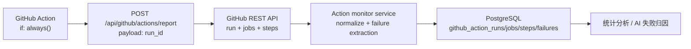

# GitHub Action 日志监控架构设计与实现方案

## 总体架构

目标数据流：



运行规则：

- workflow 只上报 `run_id`，不上传完整日志、step 输出、secret、payload 或业务数据。
- API 收到 `run_id` 后使用 GitHub API 读取权威结构化数据。
- dev 监控实例只允许写入 `head_branch=dev` 的 run；main 监控实例只允许写入 `head_branch=main` 的 run。
- 分支不匹配时 API 返回 `skipped=true`、`reason=branch_not_allowed`，不再拉取 jobs，也不写 PostgreSQL。
- 写库使用 `run_id`、`job_id`、`job_id + step_number` 做幂等键；重复上报只更新最新状态。
- GitHub API 或数据库失败时 API 返回明确错误，并记录结构化错误日志；workflow 上报步骤使用 `continue-on-error: true`，避免监控失败反向影响业务 workflow 结论。
- 对取消、失败、成功都统一落库。失败 run 额外生成 failure rows 和 `error_summary`。

## 数据采集策略

采用 run_id 触发模式：

- `run_id` 是 GitHub Actions 对一次 workflow run 的稳定唯一标识，可直接查询 run、jobs、steps。
- run_id 触发天然与 workflow 生命周期绑定，能覆盖手动触发、push、pull_request、schedule、repository_dispatch 和 workflow_dispatch。
- 重跑同一个 workflow 时 GitHub 会产生新的 run_id，不会覆盖历史。
- 同一个 run_id 重复上报时可以通过数据库主键幂等更新。

禁止轮询：

- 轮询会增加 GitHub API 消耗，并且无法保证精确知道哪些 run 必须采集。
- 当前系统已经是 webhook / dispatch 驱动，轮询会引入第二套调度机制。
- 定时扫描容易漏掉短周期上下文，也会和用户要求的“每一次 workflow run”形成延迟。

Workflow 仅传 run_id：

- 避免在 workflow 日志里拼接大量 JSON 和错误正文。
- 避免把业务 payload、聊天 ID、图片 key、DB URL、prompt 等敏感内容误传给监控 API。
- GitHub API 是 run/job/step 的权威来源；workflow 本身不应该承担数据建模职责。

## GitHub Action 接入方式

每个 workflow 的最后增加统一步骤：

```yaml
- name: Report Action Status
  if: always()
  continue-on-error: true
  env:
    GITHUB_ACTION_MONITOR_REPORT_URL: ${{ vars.GITHUB_ACTION_MONITOR_REPORT_URL }}
    GITHUB_ACTION_MONITOR_REPORT_URL_DEV: ${{ vars.GITHUB_ACTION_MONITOR_REPORT_URL_DEV }}
    GITHUB_ACTION_MONITOR_REPORT_URL_MAIN: ${{ vars.GITHUB_ACTION_MONITOR_REPORT_URL_MAIN }}
  run: |
    report_url="${GITHUB_ACTION_MONITOR_REPORT_URL:-}"
    if [ "${GITHUB_REF_NAME}" = "dev" ] && [ -n "${GITHUB_ACTION_MONITOR_REPORT_URL_DEV:-}" ]; then
      report_url="${GITHUB_ACTION_MONITOR_REPORT_URL_DEV}"
    elif [ "${GITHUB_REF_NAME}" = "main" ] && [ -n "${GITHUB_ACTION_MONITOR_REPORT_URL_MAIN:-}" ]; then
      report_url="${GITHUB_ACTION_MONITOR_REPORT_URL_MAIN}"
    elif [ "${GITHUB_REF_NAME}" != "dev" ] && [ "${GITHUB_REF_NAME}" != "main" ]; then
      echo "Branch ${GITHUB_REF_NAME} is not monitored by the Action monitor; skipping."
      exit 0
    fi
    if [ -z "${report_url:-}" ]; then
      echo "Action monitor report URL is not configured; skipping."
      exit 0
    fi
    curl -fsS -X POST "${report_url%/}/api/github/actions/report" \
      -H "Content-Type: application/json" \
      -d "{\"run_id\":\"${{ github.run_id }}\"}"
```

接入原则：

- 必须使用 `if: always()`，保证 success / failure / cancelled 的 run 都会尝试上报。
- 必须使用最小 payload，只传 `run_id`。
- dev/main 优先使用 `GITHUB_ACTION_MONITOR_REPORT_URL_DEV` / `GITHUB_ACTION_MONITOR_REPORT_URL_MAIN`，用于把 dev workflow 发到 dev 监控实例、main workflow 发到 main 监控实例。
- workflow 对非 dev/main 分支直接跳过上报；API 端仍用 `GITHUB_ACTION_MONITOR_ALLOWED_BRANCH` 做第二道保护。
- 使用 `continue-on-error: true`，监控链路失败不能改变原业务 workflow 结论。
- 所有 `.github/workflows/*.yml` 都接入；如果后续新增 workflow，`test/github-workflows.test.mjs` 应检查存在 `Report Action Status`。

## 数据处理流程

1. 接收请求
   - 校验 method 为 `POST`。
   - 校验 body JSON 中存在正整数 `run_id`。
   - 记录接收日志，包含 run_id，不包含 request body 原文。

2. GitHub API 拉取 workflow run
   - 调用 `GET /repos/{owner}/{repo}/actions/runs/{run_id}`。
   - 提取 workflow 名称、workflow_id、workflow 文件路径、event、branch、commit_sha、actor、status、conclusion、created_at、run_started_at、updated_at、html_url、run_attempt。

3. GitHub API 拉取 jobs
   - 调用 `GET /repos/{owner}/{repo}/actions/runs/{run_id}/jobs?per_page=100`，按分页读取全部 jobs。
   - 提取 job_id、name、status、conclusion、started_at、completed_at、html_url、runner 信息、labels。

4. Step 解析
   - 使用 jobs API 返回的 `steps` 数组。
   - 每个 step 记录 `job_id + step_number`、name、status、conclusion、started_at、completed_at、duration。

5. Failure extraction
   - run conclusion 非 success 时生成 run 级 failure 摘要。
   - job conclusion 为 `failure`、`cancelled`、`timed_out` 或 `action_required` 时生成 job 级 failure。
   - step conclusion 为失败类结论时生成 step 级 failure。
   - failure rows 使用稳定 `failure_key`，支持重复上报更新。

6. Error summary 生成逻辑
   - 优先列出失败 step：`JobName / StepName: conclusion`。
   - 如果没有失败 step，则列出失败 job。
   - 如果 job/step 仍缺失，则回退到 run conclusion。
   - 摘要限制长度，避免把完整日志塞入数据库摘要字段。

7. PostgreSQL 写入
   - 一个事务内 upsert run、jobs、steps、failures。
   - 对当前 run 旧 failures 先按 run_id 删除再插入最新 failure 集合，避免重跑状态变化后残留旧失败。
   - 使用 `raw_payload_json` / `metadata_json` 保存 GitHub API 原始安全结构，供未来扩展。

## 失败处理机制

- GitHub API 401/403：记录 `github_api_auth_failed`，返回 502，提示 token 失效或权限不足。
- GitHub API 404：记录 `github_run_not_found`，返回 404。
- GitHub API 网络异常：记录 `github_api_network_error`，返回 502。
- 数据缺失：允许 nullable 字段，但 `run_id`、`repository_full_name`、`status` 必须存在。
- 数据库写入失败：事务 rollback，记录 `db_write_failed`，返回 500。
- 重复请求：通过 primary key / unique index `on conflict do update` 保证安全。

## 扩展设计

AI 失败分析：

- `github_action_failures` 保存 failure level、job、step、conclusion、summary、context_json。
- 未来 AI 模块可读取失败 run 的 jobs/steps/failures，再按需调用 GitHub logs API 拉取少量失败 step 附近日志。
- AI 分析结果可另建 `github_action_failure_analysis`，通过 `run_id` 和 `failure_key` 关联。

成功率统计：

- `github_action_runs` 按 workflow、branch、event、conclusion、created_at 建索引。
- 可直接统计日/周/月成功率、失败率、取消率、平均耗时。

dev/main 对比：

- `monitor_environment` 字段保存当前监控实例环境，`branch` 字段保存 run 的 `head_branch`。
- dev 数据库的监控服务设置 `GITHUB_ACTION_MONITOR_ENVIRONMENT=dev` 与 `GITHUB_ACTION_MONITOR_ALLOWED_BRANCH=dev`。
- main 数据库的监控服务设置 `GITHUB_ACTION_MONITOR_ENVIRONMENT=main` 与 `GITHUB_ACTION_MONITOR_ALLOWED_BRANCH=main`。
- `monitor_environment + workflow_name + branch + created_at` 索引支持同一 workflow 在不同环境/分支的趋势比较。

commit 失败关联分析：

- `commit_sha`、`head_commit_message`、`actor_login` 和 `event` 支持按提交、触发人、触发类型聚合失败。
- 可与业务同步结果中的 `queueTaskId` / `traceId` 扩展关联，但当前阶段不把业务 payload 放入 Action 监控表。

## 与当前系统的一致性

- 保留现有 Telegram / 飞书成功和失败通知，不把通知脚本改造成存储入口。
- 保留现有 `[action-log]` 和 `GITHUB_STEP_SUMMARY`，新增 PostgreSQL 作为长期事实库。
- 不新增轮询、定时扫描或 workflow 内大 payload。
- API/service/repository 分层：GitHub API 拉取、failure 归纳、PostgreSQL upsert 分开实现，便于 Cloudflare/Node 部署边界演进。

## 当前实现映射

| 层级 | 文件 | 说明 |
| --- | --- | --- |
| HTTP API | `src/app/use-cases/github-action-report-http.mjs` | 实现 `POST /api/github/actions/report` 的 method、JSON 和 `run_id` 校验，返回 202/4xx/5xx JSON。 |
| 业务用例 | `src/app/use-cases/github-action-monitor.use-case.mjs` | 根据 `run_id` 调 GitHub API 拉取 run、jobs、steps，生成 failure rows 和 `error_summary`。 |
| PostgreSQL adapter | `src/adapters/postgres/github-action-monitor-repository.pg.mjs` | 在一个事务内 upsert run/job/step，并刷新当前 run 的 failures。 |
| Node API server | `tools/github-action-monitor-server.mjs` | 提供可运行的 HTTP server，启动命令为 `npm run github-action-monitor:server`。 |
| Workflow 接入 | `.github/workflows/*.yml` | 每个 workflow job 末尾增加 `Report Action Status`，使用 `if: always()`、`continue-on-error: true`，只发送 `run_id`。 |
| 行为测试 | `test/github-action-monitor.test.mjs`、`test/github-workflows.test.mjs` | 覆盖 GitHub API 拉取/归一化、HTTP handler、PostgreSQL upsert 和所有 workflow 上报步骤。 |

运行所需环境变量：

- `GITHUB_ACTION_MONITOR_REPORT_URL`：GitHub Actions 变量，workflow curl 的 API base URL。
- `GITHUB_ACTION_MONITOR_REPORT_URL_DEV`：GitHub Actions 变量，dev 分支优先使用的监控 API base URL。
- `GITHUB_ACTION_MONITOR_REPORT_URL_MAIN`：GitHub Actions 变量，main 分支优先使用的监控 API base URL。
- `GITHUB_OWNER`：API server 查询 GitHub API 时使用的 owner。
- `GITHUB_REPO`：API server 查询 GitHub API 时使用的 repo。
- `GITHUB_TOKEN`：具备读取 Actions run/jobs 权限的 GitHub token。
- `GITHUB_ACTION_MONITOR_DB_URL`：可选，监控写库 URL；未设置时回退 `TRAINING_DB_URL`。
- `GITHUB_ACTION_MONITOR_DB_APP_NAME`：可选，PostgreSQL application name；未设置时回退 `TRAINING_DB_APP_NAME`。
- `GITHUB_ACTION_MONITOR_ENVIRONMENT`：监控实例环境，dev 库设 `dev`，main 库设 `main`。
- `GITHUB_ACTION_MONITOR_ALLOWED_BRANCH`：监控实例允许写入的分支，dev 库设 `dev`，main 库设 `main`。
