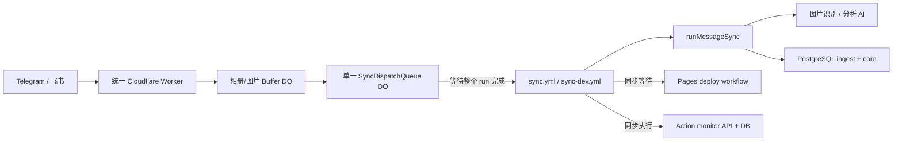
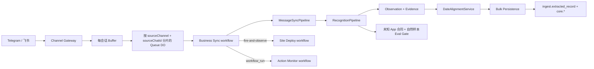

# Training Records 系统优化 0711：证据化重构方案与评审草案

> 文档日期：2026-07-11；澄清补证：2026-07-12
> 代码基线：`dev@ea433ad`（工作区存在用户未提交的 `sql/training_records/*.sql` 导出调整，本文只读取、不覆盖）
> 状态：**Go on dev**。本轮只以 dev 为实施和验收环境，main 不在范围内；关键运行时决策已确认，可直接进入 Phase 1。破坏性删表仍必须通过 dev 数据计数、孤儿、pending 和备份恢复门禁。
> 目标：在不更换 PostgreSQL、GitHub Actions、Cloudflare Workers 和现有 Bot 产品形态的前提下，缩短端到端延迟，建立通用多 App 识别与逐记录日期对齐能力，并清理已经有替代路径的历史兼容代码。

## 证据基线与结论摘要

本文不是从历史文档推演，而是重新读取了当前代码、SQL、workflow，并抽样核对了近期 GitHub Actions 真实运行。

| 证据 | 当前事实 | 结论 |
| --- | --- | --- |
| `package.json:34-43`、本地 `node_modules` | 9 个顶层依赖、332 个 lockfile package、`node_modules` 约 86 MB | 依赖规模可继续治理，但近期 Actions 的 `npm ci` 只有约 3-5 秒，不是首要瓶颈。 |
| GitHub run `29154527349`（2026-07-11，dev，2 图） | `npm ci` 3 秒；识别 wall time 18.369 秒；AI 累计 28.167 秒、15,540 tokens；持久化 9.746 秒；等待部署 89 秒；Action 监控约 13 秒 | 首要瓶颈是同步 workflow 等待下游部署、DB 串行往返和大 Prompt，不是冷启动安装。历史慢 operation 未记录，无法反查到具体 SQL。 |
| 2026-07-12 dev PostgreSQL 只读实查 | PostgreSQL 17、`transaction_read_only=on`；核心表仅 43-826 行；冲突键与 `archived_date` 均有索引；候选 SQL 服务端执行 0.026-0.170 ms。同连接 `SELECT 1` 往返中两次独立测试分别出现 7.930 s 和 2.202 s 的单次异常停顿 | 已排除“当前数据量下因缺索引/执行计划导致 9.746 秒”。最强候选是 DB 连接链路/代理的瞬时停顿命中某一条串行 query，但未启用 `pg_stat_statements` 且安全日志只保存 count，不能把历史 run 归因到某个 operation。 |
| GitHub run `29154606066`（2026-07-11，dev，飞书） | 同步 22 秒；等待部署 91 秒；Action 监控约 15 秒 | Worker/Action 主链已经可用，但部署等待把消息队列占用时间放大约 4 倍。 |
| GitHub run `29139356317`（main，`/分析`） | `/分析` 39.815 秒；读取 offset 1.613 秒；pending 读取 1.98 秒；Action 监控约 18 秒 | `/分析` 的模型请求占主时长；读取层仍会扫描全历史并打开 6 个 DB 连接，存在明确优化空间。 |
| `cloudflare/sync-dispatch-queue.mjs:67-168` | 单个 Durable Object 一次只维护一个 `processing`，直到 GitHub workflow 完成才取下一任务 | Telegram、飞书以及不同会话被全局串行。 |
| Cloudflare dev version `14915eda-09e7-4a07-a8b0-721b90159ba1`、Actions run `29154199180` | 2026-07-11 部署对应 `dev@ea433ad`；远程实际绑定 `SYNC_DISPATCH_QUEUE`、`TELEGRAM_ALBUM_BUFFER`、`FEISHU_IMAGE_BUFFER` | Q2 已闭环；dev Worker 不再需要“binding 缺失时直连 repository dispatch”的降级路径。 |
| GitHub `sync-dev.yml` / `sync.yml` 最近各 100 次 run | dev 样本覆盖 2026-06-21 至 2026-07-11，main 覆盖 2026-06-17 至 2026-07-11；200 次全部为 `workflow_dispatch`，`repository_dispatch=0` | 已知系统调用只经 Bot + Queue；旧 dispatch 可在 dev 删除，不再把无法举证的休眠个人脚本当作当前产品合同。 |
| `sql/training_records/*.sql`、`sql/migration.sql`、`sql/migration_phase2_generic_ingest.sql` | 用户确认前者是当前 dev 表结构；dev 已完成两阶段通用 ingest 升级，main 尚未执行两份迁移 | 本轮不等待 main；dev 不重跑回填迁移，只以当前导出结构和 dev 验收 SQL 为准。 |
| 2026-07-12 `npm test` | 767 tests，757 pass，10 fail；失败集中在用户正在删除/调整的 `sql/training_records/migrations/`、parameter health migration、rollback SQL 和导出索引合同 | 新增画像合同 2/2 通过；不擅自恢复用户 SQL 变更。当前全量 QA 门禁为红，需在 SQL 目录调整定稿后统一修正代码/测试路径。 |
| `src/db/training/read-client.mjs:60-87`、`src/db/training/read-queries.mjs:1-200` | `/分析` 为 6 张表各开一个连接并读取全历史，日期窗口只在 Node 映射后裁剪 | 应改为 1 个连接、1 次有界聚合 SQL。 |
| `src/adapters/telegram/sync-batch-logic.adapter.mjs:397-485` | 一个批次检测到多个日期即整体跳过；无日期图只能借用整个 batch 的唯一日期 | 当前不是逐记录日期对齐，无法稳健处理多 App、多日拼图或多图混发。 |
| `src/core/ai/telegram-recognition-schema.mjs:72-83`、`src/core/entities/training-record.mjs:98-113` | AI 只输出 `time/type/detail`，程序再用中文正则从 `detail` 反解热量、心率、距离、时长 | 通用 App 虽能识别，但结构化指标仍被华为/中文文本形态限制。 |
| `sql/training_records/ingest.sql:105-224` | 通用 `source_*`、`recognition_run` 已存在；旧 `telegram_*` 表仍同时存在 | 数据接入通用化已经完成一半，下一步应完成观察期验收并删除旧表。 |

**总体判断**：当前架构不需要推倒重来。正确方向是“解除串行阻塞 + 把识别结果改为逐观察记录 + 将日期决策下沉为确定性模块 + 将 DB 读写改为集合操作”，而不是继续增加 facade、微服务或更多兼容层。

---

# 1. 【🔍 待澄清疑问区（核心重点）】

2026-07-12 已完成 Q1-Q10 的产品、运行时与数据库证据核对。当前没有阻塞方案设计的待澄清项；仍需在下一次 dev 可控运行中补齐安全的慢 operation 日志，用于验证连接停顿候选，不作为开发前置阻塞。

## 1.1 已澄清决策（Q1-Q8、Q10）

| 问题 | 已确认事实 | 方案决策 |
| --- | --- | --- |
| Q1 数据库基线 | `sql/training_records/` 是当前 dev 真实表结构；dev 已完成 `sql/migration.sql` 和 `sql/migration_phase2_generic_ingest.sql`；main 未执行两份迁移 | 本轮只对 dev 设计、迁移和验收，不等待、不修复、不推演 main。dev 旧表删除只需通过 cleanup 脚本内置的新旧计数/孤儿检查、pending 核对和备份恢复演练。 |
| Q2 Cloudflare binding | dev 最新 Worker version 为 `14915eda-09e7-4a07-a8b0-721b90159ba1`，由 Actions run `29154199180` 在 `dev@ea433ad` 部署；Wrangler 远程详情列出三个 Durable Object binding | 在 dev 删除 Worker 直连 `/repos/.../dispatches` fallback。binding 缺失应该 fail closed 并告警，不应绕过队列语义。main 虽也已绑定，但不纳入本轮修改。 |
| Q3 实施分支 | 本轮仅基于 dev；dev 整体测试结束后再单独决定是否合并 main | 所有 Checklist、SQL、性能基线和退出条件都改为 dev-only。“同时验收 main”不再是当前任务的门禁。 |
| Q4 部署语义 | 采用推荐方案 | Bot 的成功回复只代表“已入库/已接受”；Pages 部署与 Action monitor 完全移出同步关键路径，失败通过独立通知暴露。 |
| Q5 外部调用方 | 当前系统支持的执行入口只有 Telegram 和飞书；无已知个人脚本清单。GitHub 实查 dev/main 最近各 100 次 sync run，`repository_dispatch=0` | 以“已声明产品范围 + 200 次实际运行”为删除证据；dev workflow 删除 `repository_dispatch` trigger 和旧 event type。完全休眠且未登记的私人脚本无法被技术证伪，不继续作为永久兼容理由。 |
| Q6 随想 id 语义 | id 用于页面内部展示，并作为 `/随想编 id`、`/随想删 id`、`/移动 id` 的定位句柄 | 保留所有已有数字不变，将字段/领域语义改为通用 `thought_id`；来源幂等仍由 `(source_channel, source_chat_id, source_message_id)` 负责，新飞书记录不再生成 Telegram hash 代理 ID。 |
| Q7 多 App 识别验收 | 当前无法提供多 App 真实截图；期望系统通过 OCR/多模态视觉自动读取可见数据，没有显示的字段留空 | App Profile 从“准入清单”改为“可选例外记忆”。未知 App 也必须走通用 schema；只读取图像/OCR 明确可见值，缺失项为 `null`，未知额外信息留在 raw/evidence，不猜测写 core。无真图不阻塞契约开发，但阻止“准确率已提高”的结论。 |
| Q8 AI Provider 边界 | 运行时可使用 OpenAI 原生模型，也可使用兼容 OpenAI `/chat/completions` 协议的其他模型 | 核心代码不绑定 packyapi 或任一 model。Provider adapter 显式声明 `vision/json_schema/json_object` 能力；`auto` 模式依次尝试 strict schema、`json_object`、纯文本 JSON，每层都必须经同一本地 SchemaValidator + SemanticGate，不把兼容协议等同完整能力。 |
| Q10 训练者画像 | 允许维护画像，且当前是单训练者系统 | 不新建数据库；在现有 `training_records.core` 新增 `trainee_profile`，SQL 为 `sql/migration_trainee_profile.sql`。画像只存稳定输入；age 由 birth date 计算，体重/心率/负荷/恢复继续从事实表聚合。 |

## 1.2 Q9 已闭环：dev 持久化慢 SQL 实查

### Q9. dev 持久化慢 SQL 实查

已通过 `.env.dev-db.local` 内的只读账号完成连接与计划验证，全程仅执行 `SELECT`、统计视图查询与 `EXPLAIN (ANALYZE, BUFFERS, FORMAT JSON)`：

- 连接到 `training_records_dev`，账号为 `training_reader`，PostgreSQL 17.0，`transaction_read_only=on`。
- `pg_stat_statements` 未安装/不可用；历史 run 没有 artifact，安全日志又只保存 `slowQueryCount=1`，因此**不可能 100% 反查出当时命中的 operation/SQL**。
- run 时间窗内存在 2 batches、4 messages、10 assets、4 recognitions；当前写入实现会对 messages/assets/recognitions 逐条串行 query，仅 ingest 就会产生至少 19 次往返，尚未计入 `BEGIN/COMMIT`、core 和 AI log。
- 真实行数：`source_batch=207`、`source_message=343`、`source_asset=826`、`recognition_run=264`、`training_day=92`、`activity=361`、`meal=183`、`sleep=43`。当前数据规模不足以解释秒级执行。
- `source_batch/source_message/source_asset/recognition_run` 冲突查找都命中索引，服务端执行 0.028-0.059 ms；`activity/meal/sleep` 日期汇总命中 `archived_date` 索引，整个汇总读执行 0.170 ms。
- `training_day` 在 92 行时被规划器选为顺序扫描，只读 7 个 shared-hit block；这是小表的正常计划，不是 9.746 秒的根因。
- 纯 `SELECT 1` 中位往返约 46-49 ms，但 10 次样本出现一次 7.930 s 停顿，另一连接的 30 次样本出现一次 2.202 s 停顿；服务端 SQL 工作量为零仍会慢，证明存在连接链路/代理层的瞬时延迟。

**Q9 结论**：历史 run 的具体慢 SQL 不可追溯，不得猜成 `sleep delete`、`training_day CTE` 或某个 upsert。已证实的问题是“跨网络串行往返数随消息/图片增长”，且任一往返都可能命中秒级链路停顿。因此集合式写入从“一般优化”升级为 P0；下一次 dev 运行必须安全输出 `operation/table/durationMs/queryOrdinal`（不输出 SQL 参数），并将 connection/BEGIN/query/COMMIT 分段计时。

---

# 2. 【技术重构方案】

## 2.1 当前架构与痛点中心



痛点中心不是某个长文件，而是**运行生命周期被串成一条同步链**：单一 Durable Object 要等 sync workflow 完成；sync workflow 又等 deploy workflow；最后还同步拉 GitHub jobs 并写监控 DB。任何一个 20 秒业务动作都会被放大为 2-3 分钟队列占用。

## 2.2 推荐目标架构



边界原则：

1. Worker 只负责鉴权、缓冲、顺序与 dispatch，不理解训练字段。
2. `MessageSyncPipeline` 只编排消息任务，不包含 Telegram 命名的通用状态/报告函数。
3. `RecognitionPipeline` 只输出“图片可见事实”，不决定最终归档日期。
4. `DateAlignmentService` 独占日期优先级、跨图传播和冲突处理。
5. Repository 隐藏 PostgreSQL 的批量写、幂等和事务；调用方不循环拼 SQL。
6. Pages 部署、Action 监控和 pending replay 是独立生命周期，不阻塞当前消息入库。

## 2.3 方向一：Actions 与系统速度优化

### P0-A：停止在 sync workflow 中等待 Pages 部署

当前 `sync.yml:345-472`、`sync-dev.yml:333-460` 最长可轮询 15 分钟。实际 run 中等待约 69-91 秒。

**Before**

```yaml
- name: Trigger and wait for site deploy
  run: |
    curl .../dispatches
    for attempt in $(seq 1 90); do
      curl .../actions/runs/${deploy_run_id}
      sleep 10
    done
```

**After**

```yaml
- name: Dispatch site deploy
  if: success() && steps.detect.outputs.db_content_changed == 'true'
  env:
    GITHUB_TOKEN: ${{ github.token }}
  run: node tools/dispatch-site-deploy.mjs
```

`dispatch-site-deploy.mjs` 只发送 workflow dispatch 并把 `queue_task_id`、目标 thought 校验信息传给 deploy workflow。deploy 自己写 summary、自己通知失败；sync 在“业务已入库并已提交 deploy 请求”后结束。

**交付目标**：从 sync job 关键路径删除 60-90 秒；Bot 的“已入库”回复不再被页面构建占用队列。

### P0-B：Action monitor 改为 `workflow_run` 异步采集

`sync.yml:511-543`、`sync-dev.yml:496-528` 当前同步拉取 run/jobs/steps 并写 DB，近期耗时约 13-18 秒。新增 `action-monitor-report.yml`：

```yaml
on:
  workflow_run:
    workflows: ["Sync (Main)", "Sync (Dev)", "Deploy GitHub Pages", "Deploy Cloudflare Pages (Dev)"]
    types: [completed]
```

监控 workflow 用 `workflow_run.id` 调用现有 `tools/report-github-action-status.mjs`。原业务 workflow 只保留一条轻量 summary，不再同步等待监控落库。

### P0-C：Queue 按会话分片，不再全局串行

当前 `enqueueSyncDispatchTask()` 固定 `idFromName('sync-dispatch')`（`sync-dispatch-queue.mjs:310-317`），且 `processing` 未完成前不出队下一任务（`67-168`）。改为：

```js
const shardKey = `${payload.source.channel}:${payload.notification?.chatId ?? 'unknown'}`;
const stubId = namespace.idFromName(shardKey);
```

- 同一会话仍保持顺序，保护 `/随想编`、删除、移动和连续图片。
- Telegram 与飞书、不同 chat 可以并行。
- 不建议按随机 N 分片：会破坏同一会话顺序，且需要额外分布式锁。

### P0-D：Webhook 快路径不读取 polling offset；pending replay 移出当前消息

`runMessageSync` 在已有 dispatch payload 时仍读取 offset（`telegram-sync.use-case.mjs:238-252`）并扫描 pending（`275-301`）。近期每次固定增加约 4 秒。

改造规则：

```js
const previousOffset = dispatchUpdates ? 0 : await offsetRepository.getLastProcessed();
const pendingEntries = replayMode === 'scheduled' ? await pendingRepository.claimDue() : [];
```

- webhook：不读 offset；只处理 payload。
- polling CLI：继续读取 `legacy_update_id`，直到明确删除 polling 功能。
- pending replay：独立 `pending-replay.yml` 定时或手工触发，使用 `FOR UPDATE SKIP LOCKED` claim；不让一条新消息先偿还历史失败任务。

### P1：精确缓存策略

| 缓存对象 | 当前 | 建议 | 原因 |
| --- | --- | --- | --- |
| npm 下载缓存 | `actions/setup-node@v4 cache:npm` | 保留 | 实测 `npm ci` 3-5 秒，已经有效。 |
| `node_modules` | 未缓存 | **不要新增** | `npm ci` 会删除重建，native `sharp` 跨 runner 缓存风险高，收益小。 |
| Hexo `db.json` | key 包含 `source/**`（`site-build/action.yml:35-40`） | key 只包含 lock/config/theme，增加 `restore-keys` | 当前每次内容变化都会导致 exact miss；Hexo 自己负责检测 source 变化。需用生成物一致性测试保护。 |
| AI 识别结果 | `cache_key = channel + fileUniqueId + prompt/schema/model` | 保留；增加命中率、过期和错误结果隔离指标 | 设计正确，不应改成模糊缓存。 |
| `/分析` 聚合上下文 | 无 | 暂不跨请求缓存；先做单 SQL | 数据量小且每次写后需要新鲜结果，缓存失效复杂度高于收益。 |

### P2：Runtime 精简的正确顺序

1. 先删除关键路径中的 deploy/monitor 等待；这是分钟级收益。
2. 再把 `hexo-front-matter` 设为直接依赖，避免业务代码隐式依赖 Hexo 的传递依赖。
3. 若 `npm ci` 在 20 次 run 的 p95 仍超过 10 秒，再评估 workspace：`packages/runtime-sync` 只装 `pg`、`sharp`、COS、front-matter；站点 build 保留 Hexo。
4. 不引入 esbuild/容器常驻 runner，除非冷启动重新成为 Top 3；当前证据不足。

## 2.4 方向二：通用图片识别与逐记录日期对齐

### 2.4.1 当前已经具备、应保留的能力

- strict `json_schema` → `json_object` → 无 response format 的 provider 兼容链。
- 图片压缩、旋转、尺寸/像素限制（`sharp-image-processor.mjs:8-62`）。
- 精确 cache key、fallback provider、AI 调用审计。
- `NormalizedRecognition` 已保存 `sourceApp/dataType/fields/evidence/runtime`。
- `ingest.recognition_run` 已能保存 OCR、图片元数据和 raw result。

### 2.4.2 当前局限

1. `detectedDate` 每图只有一个；batch 最终只有一个 `archivedDate`。
2. Prompt 要求“月日 + Telegram 消息年份”，但 `buildRecognitionMessages()` 没有把消息年份传给模型（`image-recognition.use-case.mjs:915-946`）。
3. 多日期 batch 被整体跳过，而不是按记录拆分。
4. 语义越界只写 warning（`recognition-semantic-validator.mjs:29-91`），仍可能进入 core。
5. workout 结构字段被压进 `detail`，再由中文正则反解，英语 App 或不同措辞易丢失指标。
6. Profile 只有华为和 Apple；Keep、小米、Zepp、Garmin 等没有 fixture 驱动的例外规则。

### 2.4.3 推荐识别管线

```text
SourceAsset
  -> ImagePreprocessor
  -> VisionObservationExtractor（只读图片可见事实）
  -> SchemaValidator（结构硬失败）
  -> SemanticGate（越界清空/拒绝，不只 warning）
  -> DateAlignmentService（结合消息时间、同批锚点、睡眠规则）
  -> RecordGrouper（同一 batch 可产生多个 archivedDate group）
  -> BulkPersistence
```

关键变化：AI 不再输出最终 `archivedDate`，只输出 `observedDateText`、日期证据和逐条 observation。最终日期由程序确定。

### 2.4.4 日期对齐规则

按每条 observation 独立处理：

1. 同一 observation 可见完整日期：`exact_image`。
2. 可见月日、年份未显示：用消息 `sentAt` 的年份补全；跨年边界只允许候选日期距消息日期不超过 183 天，标记 `derived_message_year`。
3. measurement 有可见完整测量时间：以测量时间日期为准。
4. sleep 有可见入睡日期：归档到入睡日；只有醒来日期时减一天，标记 `derived_sleep_start`。
5. 一个 batch 只有一个高可信显式日期，且无日期 observation 与锚点消息间隔不超过 10 分钟、App/profile 与内容类型不冲突：允许 `derived_batch_anchor`。
6. document 文件名日期仅作为最后 fallback；photo 丢失文件名时不猜。
7. 出现两个显式日期时，分别分组入库；只隔离无法归属的 observation，不跳过整个 batch。
8. `uncertain` / `unresolved` observation 进入 `ingest.extracted_record(status='needs_review')`，禁止写 core。

**Before**

```js
if (imageDates.size > 1) {
  return buildSkippedBatchResult(batch, { reason: 'conflicting detected dates' });
}
batch.archivedDate = resolveDetectedDate(imageDates);
```

**After**

```js
const aligned = dateAlignment.align({ observations, messages });
const groups = groupBy(aligned.accepted, (record) => record.archivedDate);

for (const [archivedDate, records] of groups) {
  await repository.persistDateGroup({ sourceBatchId: batch.batchId, archivedDate, records });
}
await repository.persistReviewQueue(aligned.unresolved);
```

### 2.4.5 多 App 泛化策略

App Profile 不是识别白名单，只维护“例外”：别名、单位、字段语义冲突、时间优先级。没有 Profile 的 App 仍按通用标签-数值-单位契约提取。

| App | 首批必须覆盖的例外 |
| --- | --- |
| 华为运动健康 | 夜间睡眠 vs 总睡眠；活动热量；斤；睡眠时间轴。 |
| Apple Health/Fitness | Active Energy、Exercise Minutes、Time Asleep、lb、英文日期。 |
| Keep | 训练总览/课程记录区分；运动时长、总消耗、平均心率、组次文本。 |
| 小米运动健康 / Mi Fitness | 活力值与活动热量区分；睡眠分段；体脂秤字段别名。 |
| Zepp / Garmin / Strava | 距离/配速/心率单位；活动详情页日期与时区。 |

开放 App 处理顺序：

1. 多模态模型直接阅读页面结构、标签、数值和单位；OCR 只是小字或密集文本的可选证据增强，不是唯一识别引擎。
2. 先匹配通用业务类型和字段，再尝试 App Profile 例外；不允许“先猜 App，再按模板补值”。
3. 图中未显示的 schema 字段统一输出 `null`；模型不得依据 App 常识、目标值或其他图片猜数字。
4. 无法映射但明确可见的额外字段留在 `raw_result_json/evidence_json`；只有通过 schema 和 SemanticGate 的标准字段才能写 core。
5. `sourceApp` 无法确定时为 `null`，不影响 observation 的结构化和入库资格。

无真实多 App 样本时，开发验收使用 schema fixture、未知 App 合成契约和既有自然样本；只验证“不拒绝未知 App、缺失留空、越界不入库”，不验收或宣称 Keep/小米等具体 App 的准确率。未来收到自然样本后再脱敏、标注并进入回归集。

### 2.4.6 强约束与幻觉阻断

- JSON Schema 添加 `minimum/maximum`、`oneOf/const`、`minLength`、`maxItems`。
- 扩展本地 validator 支持这些关键字，不能只依赖 provider。
- `SemanticGate` 分为：
  - `fatal`：日期非法、负时长、体脂 > 100、睡眠阶段和明显超过总睡眠；不写 core。
  - `sanitize`：单个越界字段置 `null`，raw result 保留，写 warning。
  - `review`：跨图日期不确定、同一字段多值冲突；进入人工复核。
- `confidence` 不是通行证。高 confidence 但违反硬约束仍拒绝。

### 2.4.7 OpenAI-compatible Provider 能力协商

当前 `openai-compatible.adapter.mjs` 只传递 `response_format`，`image-recognition.use-case.mjs:829-862` 在请求失败后依次降级。保留这个方向，但把能力判断收回 Provider adapter：

```js
{
  protocol: 'openai-chat-completions',
  vision: true,
  structuredOutput: 'auto', // json_schema | json_object | text_json | auto
  supportsJsonSchemaKeywords: 'unknown',
  maxImagesPerRequest: null
}
```

- OpenAI 原生或兼容服务都只是协议实现，不默认具有相同的 schema keyword、图片数或 token 能力。
- `structuredOutput=auto` 按 `json_schema -> json_object -> text_json` 降级；降级原因记录为结构化 metadata，不从自然语言报错中泄漏用户数据。
- 不论 Provider 返回哪一层格式，都经同一个本地 JSON parse、SchemaValidator、SemanticGate 和 DateAlignment；Provider strict 只是提前约束，不是安全边界。
- cache key 必须包含 provider name、base URL 的非可逆标识、model、capability mode、prompt/schema version，避免切换服务后误用旧结果。

## 2.5 方向三：升级 `/分析` 为训练闭环

### 2.5.1 数据读取改造

当前 `readTrainingSnapshotFromDatabaseWithParallelClients()` 同时开 6 个连接，并执行没有 WHERE 的全历史查询。推荐新建 `TrainingAnalysisRepository.loadContext({ asOf, days: 28 })`：一个只读连接、一个 SQL、一个 JSONB 结果。

上下文只保留：

- 当前 active `traineeProfile`：时区、按 asOf 计算的年龄、可选生理性别/身高、经验、长期目标、每周天数目标、器械/长期限制/偏好/日程；
- 7/14/28 天 coverage；
- 训练频率、总时长、训练热量代理、力量/有氧/HIIT 次数；
- 体重/体脂/骨骼肌首末值与测量数；
- 睡眠时长、评分、HRV/静息指标的可用天数与均值；
- 摄入热量覆盖和均值；
- 7 天身体反馈；
- 最近 5 天的有限明细。

禁止把完整 `detail`、完整历史、全部随想正文发送给模型。

`TRAINING_ANALYSIS_GOAL` 在画像上线迁移期只作缺表/缺行 fallback；稳定后业务真相源是 `core.trainee_profile.goal_text`，不长期保留环境变量和 DB 双所有者。

### 2.5.2 运动科学逻辑边界

当前数据不足以计算真实训练量、渐进超负荷或个体恢复能力，因此 Prompt 必须区分：

- **直接证据**：训练次数/时长、截图可见心率、睡眠、体测、身体反馈。
- **代理指标**：训练热量、连续训练天数、力量/有氧标签比例。
- **不可下结论**：精确增肌量、局部减脂、疾病诊断、未记录的动作重量或精确热量处方。蛋白质只有在 context 已根据最新体重 + 画像目标 + 版本化政策计算出 `derivedTargets.proteinRange` 时才能引用，并必须标记为派生建议而非已摄入事实。

画像提高的是“建议可执行性和边界”，不是将缺失事实变成已知事实：

- `availableEquipment` 用来排除无法执行的动作；`preferredActivities` 只在同等安全方案间做选择。
- `chronicLimitations` 是长期边界；近期 `bodyFeedback` 时效更高，冲突时优先降载而不是过度个性化。
- 画像值为 `null/unknown` 时必须承认未知，不根据名称、体测截图或常识反推性别、年龄、经验和器械。

推荐计算“近期 7 天 vs 前 21 天日均”的变化，不使用硬编码 ACWR 伤病阈值；只表达“负荷明显高于个人近期基线”，避免伪科学精确度。

### 2.5.3 闭环输出

模型先返回结构化 `analysis_decision_v2`，程序再渲染 Telegram/飞书文本：

- `decision`: train / reduce_load / recover / seek_professional_help / insufficient_data；
- `todayPlan`: 类型、时长区间、强度描述、规避动作；
- `nextCheck`: 下次需要观察的指标；
- `evidenceUsed`: 带时间窗的证据；
- `uncertainties`；
- `safetyFlags`。

这样可以测试“是否引用不存在的数据”“疼痛时是否给出安全边界”，而不是只对自然语言做模糊快照。

## 2.6 方向四：解耦、错误模型与日志

### 2.6.1 模块重组

```text
src/
  app/message-sync/              # 通用编排与 task 生命周期
  app/recognition/               # 识别、语义 gate、日期对齐
  app/analysis/                  # 上下文读取、决策请求、渲染
  adapters/telegram/             # Telegram payload/API
  adapters/feishu/               # 飞书 payload/API
  adapters/postgres/             # repository 实现和集合 SQL
  adapters/ai/                   # provider 协议
  core/records/                  # Observation、AlignedRecord、DateResolution
  shared/telemetry/              # 安全结构化 logger
```

不新增 `service/manager/helper` 空壳；每个模块必须隐藏一类复杂度。

### 2.6.2 清除 Telegram 命名泄漏

当前飞书仍直接依赖：

- `buildTelegramSyncReport`；
- `notifyTelegramSyncResultFrom*`；
- `sendTelegramMessage` 参数名；
- `taskId/sourceId` 的 `telegram:` 字符串替换（`feishu-sync.use-case.mjs:130-169`）。

目标命名：`buildMessageSyncReport`、`notifyMessageSyncResult`、`sendMessage`、`sourceChannel`。Telegram wrapper 只做入口适配，不再拥有通用合同。

### 2.6.3 类型化错误

当前 `classifyFailureCategory()` 依赖错误字符串正则（`telegram-sync/status.mjs:720-748`），容易把 schema 业务错误、HTTP 4xx、网络错误混为一类。

**After**

```js
class AppError extends Error {
  constructor(code, { category, retryable, disposition, cause, safeContext } = {}) {
    super(code, { cause });
    Object.assign(this, { code, category, retryable, disposition, safeContext });
  }
}

throw new AppError('recognition.schema_invalid', {
  category: 'ai_contract',
  retryable: true,
  disposition: 'retry_once_then_review',
});
```

只在最外层对未知第三方错误做一次兼容分类；内部模块不得再根据 message 正则决定重试。

### 2.6.4 结构化日志

当前 `src/` 仍有多处 `process.stderr.write()`，而安全 logger 主要只在 `tools/` 使用。统一事件格式：

```json
{
  "ts": "...",
  "level": "INFO",
  "domain": "RECOGNITION",
  "event": "recognition.completed",
  "traceId": "tr_xxx",
  "queueTaskId": "...",
  "sourceChannel": "telegram",
  "batchIdHash": "...",
  "durationMs": 18369,
  "recordCount": 3,
  "cacheStatus": "miss",
  "outcome": "stored"
}
```

Prompt、用户正文、原图、token、chat id、SQL 参数不得进入日志。

## 2.7 方向五：历史包袱清理清单

| 历史项 | 真实证据 | 判定 | 删除门禁 |
| --- | --- | --- | --- |
| Worker 直接 `/repos/.../dispatches` fallback | Telegram `367-394`；飞书 `442-469`；dev 远程 version `14915eda-...` 已绑定 Queue | `Delete on dev` | 删除 fallback 后，binding 缺失直接结构化报错并告警。 |
| workflow `repository_dispatch` 入口 | `sync.yml:28-31`、`sync-dev.yml:23-26`；最近 dev/main 各 100 次 run 均为 `workflow_dispatch` | `Delete on dev` | 当前声明入口仅 Bot；dev 删除 trigger、event type 和对应 contract test。 |
| `GITHUB_DISPATCH_EVENT_TYPE` 通用旧变量 fallback | `sync-dispatch-queue.mjs:324-349` | `Delete` | main/dev 均使用 channel-specific 变量。 |
| legacy 长 queue task id 截断匹配 | `sync-dispatch-queue.mjs:488-518` | `Delete after TTL` | 旧 processing/queue/dead letter 全空，最长旧 run 已过保留期。 |
| `ingest.telegram_batch/message/recognition/pending_batch` | dev 导出中通用表与旧表并存，生产代码无旧表查询 | `Prove first -> Delete on dev` | 仅核对 dev 计数、孤儿、pending 和备份；执行现有 cleanup SQL，不等 main。 |
| `source_message.legacy_message_id` | 新代码仍用于 thought/polling 兼容 | `Keep temporarily` | thought 主键迁移、polling 是否下线已决策。 |
| `source_message.legacy_update_id` | `getLastProcessedTelegramUpdateId` 仍查询 | `Keep or Remove with polling` | webhook 快路径不再使用；确认不再需要 polling CLI。 |
| `core.thought.telegram_message_id` 主键 | id 是内部展示/命令句柄，飞书当前需生成数字代理 | `Replace, preserve values` | 原值 1:1 重命名为 `thought_id`；source identity 继续唯一；新记录改由 DB 生成 id。 |
| 飞书调用 Telegram 命名的 report/notify | `feishu-sync.use-case.mjs:13-25,130-199` | `Replace` | 通用合同测试通过。 |
| 每次 webhook 读取 pending/offset | `telegram-sync.use-case.mjs:238-301` | `Delete from fast path` | pending 独立 workflow 可运行。 |
| sync 等待 deploy 和 monitor | workflow 真实耗时证据 | `Delete from critical path` | deploy/monitor 独立失败通知可用。 |
| archive sleep 重复日期索引 | `archive.sql:382-388` | `Delete one` | 线上 `pg_indexes` 确认二者等价。 |

---

# 3. 【数据库调整设计】

## 3.1 存储原则

1. `ingest` 保存来源事实、AI 原始结果、证据、日期决策和可重放状态。
2. `core` 只保存通过强校验、可用于展示和分析的业务事实。
3. App 名称不复制到每个 core 表；通过 ingest provenance 追溯，避免 core 与 App 强耦合。
4. 多日期不是 batch 字段问题，而是 record 字段问题。
5. 可计算的 coverage、趋势、风险信号不落表，由分析 SQL 计算。

## 3.2 关键实体逐字段审计

### 3.2.1 `ingest.source_batch`

| Target field | Type | Classification | Field nature | Existence justification | Current field | Current source | Change |
| --- | --- | --- | --- | --- | --- | --- | --- |
| `source_channel` | text | table column | — | 系统必要、参与主键 | 同名 | DB column | 保留 |
| `batch_id` | text | table column | — | 系统必要、幂等 | 同名 | DB column | 保留 |
| `status` | text | table column | — | 需要查询失败/ready | 同名 | DB column | 保留并加 check |
| `archived_date` | date | table column | — | 单日期 batch 的快速摘要 | 同名 | DB column | 保留，但仅在 distinct date=1 时写；多日期为 null |
| `date_resolution_status` | text | table column | — | 需要筛选 needs_review/multi_date | — | 未实现 | 新增 |
| `resolved_date_count` | int | runtime | — | 可由 extracted records 计算 | — | 未实现 | 不存储 |
| `warnings_json` | jsonb | config | content | 审计与排障，不作为主要过滤维度 | 同名 | DB column | 保留 |
| `payload_json` | jsonb | config | content | 重放原料 | 同名 | DB column | 保留 |

### 3.2.2 `ingest.recognition_run`

| Target field | Type | Classification | Field nature | Existence justification | Current field | Current source | Change |
| --- | --- | --- | --- | --- | --- | --- | --- |
| `recognition_id` | text | table column | — | 稳定运行身份 | 同名 | DB column | 保留 |
| `source_app` | text | table column | — | 需要按 App 评估准确率 | 同名 | DB column | 保留 |
| `data_type` | text | table column | — | 需要按类型统计 | 同名 | DB column | 改为 run 级主类型，可为 `mixed` |
| `fields_json` | jsonb | config | content | 原始标准化结果的可演进载体 | 同名 | DB column | 保留，改存 observation list 摘要 |
| `date_candidates_json` | jsonb | config | content | 保存图片可见日期证据 | — | raw_result 内隐含 | 新增 |
| `confidence` | numeric | table column | — | 质量筛选 | 同名 | DB column | 保留 |
| `raw_result_json` | jsonb | config | content | 审计与重新映射 | 同名 | DB column | 保留 |
| `source_app` on core rows | text | remove | — | 可由 provenance join；复制会放大变更 | — | 未实现 | 不新增 |

### 3.2.3 新实体 `ingest.extracted_record`

| Target field | Type | Classification | Field nature | Existence justification | Current field | Current source | Change |
| --- | --- | --- | --- | --- | --- | --- | --- |
| `record_id` | text | table column | — | 每条观察的幂等主键 | — | 未实现 | 新增 |
| `recognition_id` | text | table column | — | provenance FK | — | 未实现 | 新增 |
| `record_ordinal` | int | table column | — | 同图多条记录的稳定顺序 | — | 未实现 | 新增 |
| `record_type` | text | table column | — | 分发到 core 表、支持评估 | — | 未实现 | 新增 |
| `observed_at_text` | text | config | content | 保留图片原始时间文本 | `measuredAt/time/bedtime` 分散 | raw JSON | 新增 |
| `occurred_at` | timestamptz | table column | — | 可排序的明确时间 | — | 未实现 | 新增，可空 |
| `archived_date` | date | table column | — | core 分组与分析 | batch 级 | source_batch | 下沉到记录级 |
| `date_resolution` | text | table column | — | 区分 exact/derived/unresolved | `dateConfidence` 仅在 batch | runtime | 新增 |
| `date_confidence` | numeric | table column | — | review gate | batch confidence | runtime | 新增 |
| `fields_json` | jsonb | config | content | 不同 record type 的字段 | recognition fields | JSONB | 新增 |
| `evidence_json` | jsonb | config | content | OCR/date/label 证据 | raw result | JSONB | 新增 |
| `status` | text | table column | — | accepted/needs_review/rejected | — | 未实现 | 新增 |
| `source_app` | text | runtime | — | 由 recognition_run join | 同名在 run | DB column | 不复制 |

### 3.2.4 `core.thought` 身份字段

| Target field | Type | Classification | Field nature | Existence justification | Current field | Current source | Change |
| --- | --- | --- | --- | --- | --- | --- | --- |
| `thought_id` | bigint identity | table column | — | 页面展示及编辑/删除/移动命令的稳定句柄 | `telegram_message_id` | DB PK | 原值 1:1 保留并重命名；新记录由 DB 生成 |
| `source_channel` | text | table column | — | 来源幂等身份组成 | 同名 | DB column | 保留 |
| `source_chat_id` | text | table column | — | 来源幂等身份组成 | 同名 | DB column | 保留 |
| `source_message_id` | text | table column | — | 来源幂等身份组成 | 同名 | DB column | 保留 |
| `telegram_chat_id` | bigint | remove | — | 信息已由 `source_chat_id` 覆盖，且飞书无通用语义 | 同名 | DB column | 在所有查询转向 source identity 后删除 |

`thought_id` 是系统内部句柄，不再承担“来源消息身份”。这两个概念分开后，飞书无需把字符串 message id hash 成伪 Telegram 整数。

### 3.2.5 `core.trainee_profile` 实体审计

> 设计原则：画像只存“稳定、用户提供、不能从训练事实稳定推导”的输入；动态健康与训练信号继续从 `core.*` 事实表计算。

#### 1. Trainee Profile Table

| Target field | Type | Classification | Field nature | Existence justification | Current field | Current source | Change |
| --- | --- | --- | --- | --- | --- | --- | --- |
| `trainee_id` | text | table column | — | 系统必要，当前用 `default`，为未来多训练者保留稳定身份 | — | 未实现 | 新增 PK |
| `timezone` | text | table column | — | 日期窗口和年龄计算必需 | 运行环境默认 Asia/Shanghai | config | 新增，seed 当前时区 |
| `birth_date` | date nullable | table column | — | 用户提供后可计算年龄，不冗余 | — | 未实现 | 新增 |
| `sex_at_birth` | enum text nullable | table column | — | 仅在确有运动科学计算需要时使用；允许 `undisclosed` | — | 未实现 | 新增，不作必填 |
| `height_cm` | numeric(5,2) nullable | table column | — | 身高是稳定输入，可用于派生指标 | — | 未实现 | 新增 |
| `experience_level` | enum text nullable | table column | — | 影响动作复杂度、进阶速度和风险边界 | — | 未实现 | 新增 beginner/intermediate/advanced/unknown |
| `goal_text` | text | table column | — | 当前硬编码/环境目标的真正业务归属 | `TRAINING_ANALYSIS_GOAL`、默认“增肌减腹” | env/code | 新增并 seed 当前目标；环境变量只做迁移期 fallback |
| `weekly_training_days_target` | smallint nullable | table column | — | 用户可感知，可直接约束建议频率 | — | 未实现 | 新增，1-7 |
| `profile_version` | int | table column | — | 支持乐观更新和 AI 上下文审计 | — | 未实现 | 新增，每次业务更新递增 |
| `is_active` | boolean | table column | — | 多画像时需要明确有效性 | — | 未实现 | 新增 |
| `created_at/updated_at` | timestamptz | table column | — | 审计和缓存失效需要 | — | 未实现 | 新增 |

#### 2. Config Fields

| Target field | Type | Classification | Field nature | Existence justification | Current field | Current source | Change |
| --- | --- | --- | --- | --- | --- | --- | --- |
| `availableEquipment` | string[] | config | content | 影响方案可执行性，不需单独筛选 | — | 未实现 | 新增至 `profile_json` |
| `chronicLimitations` | string[] | config | content | 长期限制与急性身体反馈不同，可持续约束训练建议 | 身体反馈只在 `core.thought` | DB content | 新增稳定限制；不复制近期疼痛日志 |
| `preferredActivities` | string[] | config | content | 用户可感知，用于在多个等价方案中选择 | — | 未实现 | 新增至 `profile_json` |
| `scheduleNotes` | string|null | config | content | 日程约束会改变计划可执行性，但不是主查询维度 | — | 未实现 | 新增至 `profile_json` |

#### 3. Runtime Fields

- `ageYears`：按 `birth_date` + 画像 `timezone` + 分析 `asOf` 计算；source: `core.trainee_profile`；computed: 组装 `/分析` context 时。
- `latestWeightKg/bodyFatPct/skeletalMuscleKg`：从时间窗口内最新 `core.measurement` 计算，不写画像。
- `restingHeartRate/recovery/trainingLoad`：从 sleep/activity/body feedback 聚合，不写画像。
- `recommendedProteinRange` 或其他目标值：只有在体重、目标和分析政策齐备时才运行时计算，不持久化为事实。

#### 4. Related Entities

不新增 profile history 表。当前单用户只保留 `profile_version`；每次 AI 分析在审计 metadata 中记录 `trainee_id/profile_version`，已足够知道当次使用哪个版本。如未来需要重现画像全文，再以真实需求新增 revision 表。

#### 5. Change List

- **New fields/table**: 新增 `core.trainee_profile`，迁移文件为 `sql/migration_trainee_profile.sql`。
- **Moves**: `TRAINING_ANALYSIS_GOAL` 的业务所有权移到 `goal_text`；实现期只做短期 fallback，不长期双写。
- **Removals**: 画像不存 `age`、体重、体脂、静息心率、RPE 汇总、训练负荷或热量/蛋白目标。
- **API gaps**: 当前无画像读写命令/API；后续需 `TraineeProfileRepository.loadActive()` 与显式更新入口。

#### 6. Design Decisions

| Decision | Reasoning |
| --- | --- |
| 新表放 `core`，不新建数据库/schema | 画像是训练分析的核心业务输入，需要与 `core.*` 在同一只读事务中聚合；新库只会增加连接和一致性成本。 |
| 存 `birth_date` 不存 `age` | age 可计算且会自动变化，存储会制造过期数据。 |
| `profile_json` 只放不需筛选的可演进内容 | 器械、偏好、长期限制与日程不是当前查询维度，每增一项不应都做 DDL。 |
| 急性疼痛不合并到画像 | 身体反馈有时间语义，应保留在 `core.thought` 日志；画像只放长期稳定限制。 |

### 3.2.6 画像迁移产物

- SQL：`sql/migration_trainee_profile.sql`
- 合同测试：`test/trainee-profile-migration.test.mjs`
- 该 SQL 只新增现有数据库内的表，不创建新数据库；包含 PG17 约束、默认 `default` 画像、角色权限、只读验收查询和回滚说明。

## 3.3 推荐迁移 SQL

### 3.3.1 逐记录提取表

```sql
begin;

alter table ingest.source_batch
  add column if not exists date_resolution_status text not null default 'single_date';

alter table ingest.source_batch
  add constraint ck_source_batch_date_resolution_status
  check (date_resolution_status in ('single_date', 'multi_date', 'needs_review', 'not_applicable'))
  not valid;

alter table ingest.recognition_run
  add column if not exists date_candidates_json jsonb not null default '[]'::jsonb;

create table if not exists ingest.extracted_record (
  record_id text primary key,
  recognition_id text not null
    references ingest.recognition_run(recognition_id) on delete cascade,
  record_ordinal integer not null,
  record_type text not null,
  observed_at_text text,
  occurred_at timestamptz,
  archived_date date,
  date_resolution text not null,
  date_confidence numeric(5,4),
  fields_json jsonb not null default '{}'::jsonb,
  evidence_json jsonb not null default '{}'::jsonb,
  status text not null default 'accepted',
  created_at timestamptz not null default now(),
  updated_at timestamptz not null default now(),
  constraint ux_extracted_record_run_ordinal unique (recognition_id, record_ordinal),
  constraint ck_extracted_record_type check (
    record_type in ('measurement', 'activity', 'workout_summary', 'meal', 'nutrition_summary', 'sleep')
  ),
  constraint ck_extracted_record_date_resolution check (
    date_resolution in (
      'exact_image', 'derived_message_year', 'derived_batch_anchor',
      'derived_sleep_start', 'filename_fallback', 'unresolved'
    )
  ),
  constraint ck_extracted_record_status check (
    status in ('accepted', 'needs_review', 'rejected')
  ),
  constraint ck_extracted_record_date_confidence check (
    date_confidence is null or (date_confidence >= 0 and date_confidence <= 1)
  )
);

commit;

create index concurrently if not exists idx_extracted_record_date_type
  on ingest.extracted_record (archived_date desc, record_type)
  where status = 'accepted';

create index concurrently if not exists idx_extracted_record_review
  on ingest.extracted_record (updated_at asc)
  where status = 'needs_review';
```

### 3.3.2 core 硬约束（先 `NOT VALID`，清洗后再 VALIDATE）

```sql
alter table core.measurement
  add constraint ck_core_measurement_physical_ranges check (
    (weight_kg is null or weight_kg between 20 and 300)
    and (bmi is null or bmi between 8 and 80)
    and (body_fat_pct is null or body_fat_pct between 2 and 75)
    and (body_water_pct is null or body_water_pct between 20 and 85)
    and (protein_pct is null or protein_pct between 5 and 35)
    and (bone_mass_kg is null or bone_mass_kg between 0.5 and 8)
    and (basal_metabolism_kcal is null or basal_metabolism_kcal between 500 and 3500)
    and (fat_free_mass_kg is null or weight_kg is null or fat_free_mass_kg <= weight_kg)
  ) not valid;

alter table core.activity
  add constraint ck_core_activity_nonnegative check (
    (calories is null or calories >= 0)
    and (distance_km is null or distance_km >= 0)
    and (duration_seconds is null or duration_seconds >= 0)
    and (heart_rate is null or heart_rate between 25 and 250)
  ) not valid;

alter table core.meal
  add constraint ck_core_meal_ranges check (
    (calories is null or calories >= 0)
    and (recommended_min is null or recommended_min >= 0)
    and (recommended_max is null or recommended_max >= 0)
    and (recommended_min is null or recommended_max is null or recommended_min <= recommended_max)
  ) not valid;

alter table core.sleep
  add constraint ck_core_sleep_ranges check (
    (total_sleep_minutes is null or total_sleep_minutes between 0 and 1440)
    and (night_sleep_minutes is null or night_sleep_minutes between 0 and 960)
    and (nap_minutes is null or nap_minutes between 0 and 480)
    and (deep_sleep_ratio_pct is null or deep_sleep_ratio_pct between 0 and 100)
    and (light_sleep_ratio_pct is null or light_sleep_ratio_pct between 0 and 100)
    and (rem_sleep_ratio_pct is null or rem_sleep_ratio_pct between 0 and 100)
    and (average_spo2_pct is null or average_spo2_pct between 50 and 100)
  ) not valid;
```

### 3.3.3 `/分析` 查询索引与旧索引清理

```sql
create index concurrently if not exists idx_core_thought_body_feedback_time
  on core.thought (message_date_unix desc, updated_at desc)
  where status = 'active' and thought_module = 'body_feedback';

-- archive.sql 当前存在两个相同 archived_date 索引；保留命名统一的一项。
drop index concurrently if exists archive.idx_archive_training_sleep_archived_date;
```

现有 `core.activity/meal/measurement/sleep(archived_date)` 索引已足够支持 28 天有界读取，不重复新增复合索引，除非 `EXPLAIN (ANALYZE, BUFFERS)` 证明需要。

### 3.3.4 随想内部 ID 通用化

该迁移必须与 Repository、Markdown front matter、页面渲染和命令解析同一个 PR 原子切换，不长期保留双字段兼容。

```sql
begin;

alter table core.thought
  rename column telegram_message_id to thought_id;

alter table core.thought
  alter column thought_id add generated by default as identity;

select setval(
  pg_get_serial_sequence('core.thought', 'thought_id'),
  coalesce((select max(thought_id) from core.thought), 1),
  exists (select 1 from core.thought)
);

comment on column core.thought.thought_id is
  '系统内部随想 ID；用于展示及编辑、删除、移动命令，不等同于任一来源平台的 message id';

commit;
```

迁移脚本之外还必须：

- 将已有 Markdown front matter 的 `telegram_message_id` 一次性改为 `thought_id`，数值不变；
- 将 `findByTelegramMessageId` 改为 `findByThoughtId`；
- 当前 `telegram-sync.use-case.mjs:1029-1049` 先写 artifact 再入库，而 artifact/front matter 需要新的内部 id。改为先调用 `resolveOrAllocateThoughtId(sourceIdentity)`：已存在则复用原 id，否则从 identity sequence 预留一个 id，并把它写入 batch/pending payload；sequence 断号可接受，身份重复不可接受；
- `persistThoughtToCore` 使用已预留的 `thought_id` 显式插入，并以 `returning thought_id` 作为 Bot 回复和后续编辑的唯一 id；
- 删除飞书数字 hash 代理，编辑/删除时仅用 `thought_id` 定位内部行；
- 测试既有 id 迁移前后不变，新 Telegram/飞书随想都获得非冲突的 DB id。

### 3.3.5 训练者画像迁移

已提供独立 SQL：`sql/migration_trainee_profile.sql`。它只在现有 `training_records` 数据库创建 `core.trainee_profile`，不新建数据库，不修改当前 `sql/training_records/*.sql` 导出文件。

```bash
psql "$DEV_TRAINING_DB_MIGRATION_URL" \
  -v ON_ERROR_STOP=1 \
  -f sql/migration_trainee_profile.sql
```

执行前必须备份；执行后运行文件底部的只读验收查询。当前 migration runner 的目录正被用户调整，本轮不擅自恢复或改写该 runner；迁移正式纳入哪个目录，在 SQL 目录调整完成后再做机械移动。

## 3.4 一次性分析聚合 SQL（核心形态）

以下 SQL 代替“6 连接 + 全表扫描 + Node 裁剪”，返回一个 JSONB。字段可在实现时按现有 `buildTrainingAnalysisSummary` 精确对齐。

```sql
with params as (
  select
    $1::date as as_of,
    ($1::date - 27) as start_28,
    ($1::date - 13) as start_14,
    ($1::date - 6) as start_7,
    ($1::date - 4) as start_5
),
profile as (
  select coalesce((
    select jsonb_build_object(
      'traineeId', tp.trainee_id,
      'profileVersion', tp.profile_version,
      'timezone', tp.timezone,
      'ageYears', case
        when tp.birth_date is null then null
        else extract(year from age(p.as_of, tp.birth_date))::int
      end,
      'sexAtBirth', tp.sex_at_birth,
      'heightCm', tp.height_cm,
      'experienceLevel', tp.experience_level,
      'goal', tp.goal_text,
      'weeklyTrainingDaysTarget', tp.weekly_training_days_target,
      'config', tp.profile_json
    )
    from core.trainee_profile tp
    cross join params p
    where tp.is_active = true
    order by (tp.trainee_id = 'default') desc, tp.updated_at desc
    limit 1
  ), 'null'::jsonb) as value
),
days as (
  select d::date as archived_date
  from params p,
       generate_series(p.start_28, p.as_of, interval '1 day') d
),
day_fact as (
  select
    d.archived_date,
    coalesce(t.total_activities, 0) as total_activities,
    coalesce(t.total_duration_seconds, 0) as total_duration_seconds,
    coalesce(t.training_calories, 0) as training_calories,
    t.workout_duration_minutes,
    t.intake_calories,
    t.sleep_total_minutes
  from days d
  left join core.training_day t using (archived_date)
),
activity_fact as (
  select
    a.archived_date,
    count(*) filter (where a.activity_type ~ '力量|抗阻') as strength_count,
    count(*) filter (where a.activity_type ~ 'HIIT|间歇|冲刺') as hiit_count,
    count(*) filter (where a.activity_type ~ '骑行|跑|走|有氧') as cardio_count,
    jsonb_agg(
      jsonb_build_object(
        'time', a.activity_time,
        'type', a.activity_type,
        'durationSeconds', a.duration_seconds,
        'calories', a.calories,
        'heartRate', a.heart_rate,
        'distanceKm', a.distance_km
      ) order by a.activity_time
    ) filter (where a.archived_date >= p.start_5) as latest_details
  from core.activity a
  cross join params p
  where a.archived_date between p.start_28 and p.as_of
  group by a.archived_date
),
measurement_fact as (
  select jsonb_build_object(
    'count', count(*),
    'first', (jsonb_agg(jsonb_build_object(
      'date', archived_date, 'weightKg', weight_kg,
      'bodyFatPct', body_fat_pct, 'skeletalMuscleKg', skeletal_muscle_kg
    ) order by archived_date, measured_at))[0],
    'latest', (jsonb_agg(jsonb_build_object(
      'date', archived_date, 'weightKg', weight_kg,
      'bodyFatPct', body_fat_pct, 'skeletalMuscleKg', skeletal_muscle_kg
    ) order by archived_date desc, measured_at desc))[0]
  ) as value
  from core.measurement m
  cross join params p
  where m.archived_date between p.start_28 and p.as_of
),
feedback as (
  select coalesce(jsonb_agg(jsonb_build_object(
    'dateUnix', message_date_unix,
    'body', body
  ) order by message_date_unix desc), '[]'::jsonb) as value
  from core.thought t
  cross join params p
  where t.status = 'active'
    and t.thought_module = 'body_feedback'
    and t.message_date_unix >= extract(epoch from p.start_7::timestamptz)
)
select jsonb_build_object(
  'asOf', p.as_of,
  'traineeProfile', pr.value,
  'recent7', jsonb_build_object(
    'trainingDays', count(*) filter (
      where d.archived_date >= p.start_7 and d.total_activities > 0
    ),
    'totalDurationSeconds', sum(d.total_duration_seconds) filter (
      where d.archived_date >= p.start_7
    ),
    'trainingCaloriesProxy', sum(d.training_calories) filter (
      where d.archived_date >= p.start_7
    ),
    'recordedNutritionDays', count(d.intake_calories) filter (
      where d.archived_date >= p.start_7
    ),
    'recordedSleepDays', count(d.sleep_total_minutes) filter (
      where d.archived_date >= p.start_7
    )
  ),
  'recent14', jsonb_build_object(
    'trainingDays', count(*) filter (
      where d.archived_date >= p.start_14 and d.total_activities > 0
    )
  ),
  'measurementTrend28', m.value,
  'bodyFeedback7', f.value,
  'latestDays', coalesce(jsonb_agg(jsonb_build_object(
    'date', d.archived_date,
    'durationSeconds', d.total_duration_seconds,
    'trainingCaloriesProxy', d.training_calories,
    'intakeCalories', d.intake_calories,
    'sleepMinutes', d.sleep_total_minutes,
    'activities', a.latest_details
  ) order by d.archived_date) filter (where d.archived_date >= p.start_5), '[]'::jsonb)
)
from params p
cross join day_fact d
left join activity_fact a using (archived_date)
cross join measurement_fact m
cross join feedback f
cross join profile pr
group by p.as_of, p.start_7, p.start_14, m.value, f.value, pr.value;
```

实现前用真实 dev 数据执行 `EXPLAIN (ANALYZE, BUFFERS)`；若 p95 仍高，再考虑物化视图。当前数据量下不应预先增加物化刷新复杂度。

## 3.5 Q9 性能归因与连接治理

只读 `EXPLAIN` 已排除当前规模下的缺索引和候选 SQL 执行计划问题。不新增“为了消灭 seq scan”的冗余索引；`training_day` 92 行时的 seq scan 仅 0.170 ms 汇总读的一部分，强制走索引不会解决秒级延迟。

实施顺序：

1. 将 messages/assets/recognitions 改为每类一次集合写，降低命中链路尖刺的机会。
2. 慢 query 记录增加 `queryOrdinal`，并在最终 workflow summary 中保留 `operation/table/durationMs/thresholdMs`；禁止输出 SQL 参数、payload 和连接信息。
3. 将 `connect`、`BEGIN`、ingest 各集合写、core 各集合写、`COMMIT`、事务外 AI log 分段计时，区分连接、事务和 statement 延迟。
4. 在 dev 收集至少 20 个自然 run 的 DB 阶段 p50/p95/max。若仍出现“服务端计划亚毫秒、client wall time 秒级”，再携安全时间戳和 provider 向数据库服务商排查网络/代理，不在业务代码里盲目加 retry。
5. 只对整个幂等事务设计有上限的重试；禁止对单条 `INSERT/UPDATE` 未加判断地重试，避免在连接结果不明时制造重复/半事务语义。

## 3.6 集合式批量写

当前 `upsertMessages`、`upsertAssets`、`upsertRecognitions` 都在 JS `for` 循环中逐条 query。改为每类实体一次 `jsonb_to_recordset`：

```sql
insert into ingest.source_message (
  source_channel, source_chat_id, source_message_id, batch_id,
  source_event_id, legacy_message_id, legacy_update_id, media_group_id,
  sent_at, caption, message_text, payload_json, updated_at
)
select
  x.source_channel, x.source_chat_id, x.source_message_id, x.batch_id,
  x.source_event_id, x.legacy_message_id, x.legacy_update_id, x.media_group_id,
  x.sent_at, x.caption, x.message_text, x.payload_json, x.updated_at
from jsonb_to_recordset($1::jsonb) as x(
  source_channel text,
  source_chat_id text,
  source_message_id text,
  batch_id text,
  source_event_id text,
  legacy_message_id bigint,
  legacy_update_id bigint,
  media_group_id text,
  sent_at timestamptz,
  caption text,
  message_text text,
  payload_json jsonb,
  updated_at timestamptz
)
on conflict (source_channel, source_chat_id, source_message_id) do update set
  batch_id = excluded.batch_id,
  source_event_id = excluded.source_event_id,
  media_group_id = excluded.media_group_id,
  sent_at = excluded.sent_at,
  caption = excluded.caption,
  message_text = excluded.message_text,
  payload_json = excluded.payload_json,
  updated_at = excluded.updated_at;
```

messages/assets/recognitions/extracted_records 各一次 SQL；core 每个 record type 各一次 SQL。同一 batch 的 DB round trip 从“消息数 + 图片数 + 识别数 + core 写入数”收敛到固定 6-9 次。Q9 时间窗的 2 batches / 4 messages / 10 assets / 4 recognitions 仅 ingest 就至少 19 次串行往返，这是集合写的直接实数据。

## 3.7 旧表删除

不新写第二套 cleanup。继续使用已有 `sql/cleanup_phase2_legacy_ingest.sql`，本轮只允许在 dev 执行。执行前补充：

- dev 至少一个完整同步、pending replay、Markdown backup、deploy 周期；
- `recognition_run` 孤儿为 0；
- pending 各状态计数对齐；
- 仓库对旧表的运行时引用为 0；
- 备份恢复演练通过。

---

# 4. 【AI 提示词重构方案】

## 4.1 目录结构

```text
prompts/
  _source/
    shared/
      safety.json
      null-and-evidence.json
    recognition/
      policy.json
      date-evidence.json
      app-profiles/
        huawei-health.json
        apple-health.json
        keep.json
        mi-fitness.json
      schema-v4.json
    analysis/
      evidence-policy.json
      trainee-profile-policy.json
      coaching-policy.json
      response-schema-v2.json
  generated/
    health-image-recognition.md
    training-analysis.md
  manifest.json
```

迁移时原子修改 `prompt-generator.mjs` 和默认加载路径；不长期保留两份生成产物。`manifest.json` 保存 source hash、schema version、生成时间和兼容能力，cache key 继续包含版本。

## 4.2 通用图片识别 Prompt 模板

```text
你是健康与运动截图的“可见事实提取器”。

任务：只提取当前图片中明确可见的数据，输出符合 health_image_observations_v4 schema 的 JSON。

强制规则：
1. 不根据 App 常识、caption、用户目标、当前日期或同批其他图片补齐数值。
2. 图片没有显示年份时，不猜年份；把原始日期文字写入 dateEvidence.rawText，observedDate 填 null。
3. 每条 measurement、activity、workout_summary、meal、nutrition_summary、sleep 都是独立 observation；一张图允许多条 observation 和多个可见日期。
4. 数值只来自清晰标签与单位；看不清填 null。不要把区间中点、图表高度或颜色推算成精确值。
5. activity 的 durationSeconds、caloriesKcal、heartRateBpm、distanceKm、avgSpeedKmh 必须分别输出；detailText 只保留补充文本，不能作为结构字段替代品。
6. App 无法可靠识别时 sourceApp=null；不要为了命中 Profile 强行指定 App。
7. confidence 是当前 observation 的证据可靠度，不是整体页面美观度。
8. 只输出 JSON，不要 Markdown、解释或额外字段。

证据优先级：明确标签+数值+单位 > 同一区块标题 > OCR 文本块 > 图表近似。图表近似不得生成精确数值。

App Profile 只用于标签别名和单位换算；Profile 没写的 App 仍按通用规则提取。
```

## 4.3 识别 Schema v4 核心模板

Schema 源可使用 `$defs`，发送给 provider 前由生成器展开，避免代理不支持 `$ref`。本地 validator 必须支持 `oneOf`、`const`、`minimum/maximum`、`minItems/maxItems`。

```json
{
  "$schema": "https://json-schema.org/draft/2020-12/schema",
  "title": "health_image_observations_v4",
  "type": "object",
  "additionalProperties": false,
  "required": ["schemaVersion", "sourceApp", "observations", "warnings"],
  "properties": {
    "schemaVersion": { "const": "v4" },
    "sourceApp": { "type": ["string", "null"], "maxLength": 80 },
    "warnings": {
      "type": "array",
      "maxItems": 20,
      "items": { "type": "string", "maxLength": 240 }
    },
    "observations": {
      "type": "array",
      "maxItems": 50,
      "items": {
        "oneOf": [
          {
            "type": "object",
            "additionalProperties": false,
            "required": ["recordType", "observedDate", "observedTime", "dateEvidence", "confidence", "fields"],
            "properties": {
              "recordType": { "const": "measurement" },
              "observedDate": { "type": ["string", "null"], "pattern": "^\\d{4}-\\d{2}-\\d{2}$" },
              "observedTime": { "type": ["string", "null"], "maxLength": 40 },
              "dateEvidence": { "$ref": "#/$defs/dateEvidence" },
              "confidence": { "type": "number", "minimum": 0, "maximum": 1 },
              "fields": { "$ref": "#/$defs/measurement" }
            }
          },
          {
            "type": "object",
            "additionalProperties": false,
            "required": ["recordType", "observedDate", "observedTime", "dateEvidence", "confidence", "fields"],
            "properties": {
              "recordType": { "const": "activity" },
              "observedDate": { "type": ["string", "null"], "pattern": "^\\d{4}-\\d{2}-\\d{2}$" },
              "observedTime": { "type": ["string", "null"], "maxLength": 40 },
              "dateEvidence": { "$ref": "#/$defs/dateEvidence" },
              "confidence": { "type": "number", "minimum": 0, "maximum": 1 },
              "fields": { "$ref": "#/$defs/activity" }
            }
          },
          {
            "type": "object",
            "additionalProperties": false,
            "required": ["recordType", "observedDate", "observedTime", "dateEvidence", "confidence", "fields"],
            "properties": {
              "recordType": { "enum": ["workout_summary", "nutrition_summary"] },
              "observedDate": { "type": ["string", "null"], "pattern": "^\\d{4}-\\d{2}-\\d{2}$" },
              "observedTime": { "type": ["string", "null"] },
              "dateEvidence": { "$ref": "#/$defs/dateEvidence" },
              "confidence": { "type": "number", "minimum": 0, "maximum": 1 },
              "fields": { "$ref": "#/$defs/dailySummary" }
            }
          },
          {
            "type": "object",
            "additionalProperties": false,
            "required": ["recordType", "observedDate", "observedTime", "dateEvidence", "confidence", "fields"],
            "properties": {
              "recordType": { "const": "meal" },
              "observedDate": { "type": ["string", "null"], "pattern": "^\\d{4}-\\d{2}-\\d{2}$" },
              "observedTime": { "type": ["string", "null"] },
              "dateEvidence": { "$ref": "#/$defs/dateEvidence" },
              "confidence": { "type": "number", "minimum": 0, "maximum": 1 },
              "fields": { "$ref": "#/$defs/meal" }
            }
          },
          {
            "type": "object",
            "additionalProperties": false,
            "required": ["recordType", "observedDate", "observedTime", "dateEvidence", "confidence", "fields"],
            "properties": {
              "recordType": { "const": "sleep" },
              "observedDate": { "type": ["string", "null"], "pattern": "^\\d{4}-\\d{2}-\\d{2}$" },
              "observedTime": { "type": ["string", "null"] },
              "dateEvidence": { "$ref": "#/$defs/dateEvidence" },
              "confidence": { "type": "number", "minimum": 0, "maximum": 1 },
              "fields": { "$ref": "#/$defs/sleep" }
            }
          }
        ]
      }
    }
  },
  "$defs": {
    "dateEvidence": {
      "type": "object",
      "additionalProperties": false,
      "required": ["source", "rawText", "yearVisible"],
      "properties": {
        "source": { "enum": ["visible_full_date", "visible_month_day", "visible_time_only", "visible_filename", "none"] },
        "rawText": { "type": ["string", "null"], "maxLength": 120 },
        "yearVisible": { "type": "boolean" }
      }
    },
    "measurement": {
      "type": "object",
      "additionalProperties": false,
      "required": ["weightKg", "bmi", "bodyFatPct", "skeletalMuscleKg", "visceralFatLevel", "basalMetabolismKcal", "bodyWaterPct", "proteinPct", "boneMassKg", "fatFreeMassKg", "bodyAge", "bodyScore", "bodyType"],
      "properties": {
        "weightKg": { "type": ["number", "null"], "minimum": 20, "maximum": 300 },
        "bmi": { "type": ["number", "null"], "minimum": 8, "maximum": 80 },
        "bodyFatPct": { "type": ["number", "null"], "minimum": 2, "maximum": 75 },
        "skeletalMuscleKg": { "type": ["number", "null"], "minimum": 1, "maximum": 100 },
        "visceralFatLevel": { "type": ["number", "null"], "minimum": 0, "maximum": 100 },
        "basalMetabolismKcal": { "type": ["number", "null"], "minimum": 500, "maximum": 3500 },
        "bodyWaterPct": { "type": ["number", "null"], "minimum": 20, "maximum": 85 },
        "proteinPct": { "type": ["number", "null"], "minimum": 5, "maximum": 35 },
        "boneMassKg": { "type": ["number", "null"], "minimum": 0.5, "maximum": 8 },
        "fatFreeMassKg": { "type": ["number", "null"], "minimum": 1, "maximum": 300 },
        "bodyAge": { "type": ["number", "null"], "minimum": 1, "maximum": 120 },
        "bodyScore": { "type": ["number", "null"], "minimum": 0, "maximum": 100 },
        "bodyType": { "type": ["string", "null"], "maxLength": 80 }
      }
    },
    "activity": {
      "type": "object",
      "additionalProperties": false,
      "required": ["activityType", "rawType", "durationSeconds", "caloriesKcal", "heartRateBpm", "distanceKm", "avgSpeedKmh", "detailText"],
      "properties": {
        "activityType": { "type": "string", "minLength": 1, "maxLength": 80 },
        "rawType": { "type": ["string", "null"], "maxLength": 120 },
        "durationSeconds": { "type": ["integer", "null"], "minimum": 0, "maximum": 86400 },
        "caloriesKcal": { "type": ["number", "null"], "minimum": 0, "maximum": 10000 },
        "heartRateBpm": { "type": ["number", "null"], "minimum": 25, "maximum": 250 },
        "distanceKm": { "type": ["number", "null"], "minimum": 0, "maximum": 1000 },
        "avgSpeedKmh": { "type": ["number", "null"], "minimum": 0, "maximum": 200 },
        "detailText": { "type": ["string", "null"], "maxLength": 300 }
      }
    },
    "dailySummary": {
      "type": "object",
      "additionalProperties": false,
      "required": ["activityCaloriesKcal", "workoutDurationMinutes", "activeHours", "totalCaloriesKcal"],
      "properties": {
        "activityCaloriesKcal": { "type": ["number", "null"], "minimum": 0, "maximum": 10000 },
        "workoutDurationMinutes": { "type": ["number", "null"], "minimum": 0, "maximum": 1440 },
        "activeHours": { "type": ["number", "null"], "minimum": 0, "maximum": 24 },
        "totalCaloriesKcal": { "type": ["number", "null"], "minimum": 0, "maximum": 20000 }
      }
    },
    "meal": {
      "type": "object",
      "additionalProperties": false,
      "required": ["name", "mealSlot", "caloriesKcal", "recommendedMinKcal", "recommendedMaxKcal", "details"],
      "properties": {
        "name": { "type": "string", "minLength": 1, "maxLength": 160 },
        "mealSlot": { "enum": ["breakfast", "lunch", "dinner", "snack", "unknown"] },
        "caloriesKcal": { "type": ["number", "null"], "minimum": 0, "maximum": 10000 },
        "recommendedMinKcal": { "type": ["number", "null"], "minimum": 0, "maximum": 10000 },
        "recommendedMaxKcal": { "type": ["number", "null"], "minimum": 0, "maximum": 10000 },
        "details": { "type": "array", "maxItems": 30, "items": { "type": "string", "maxLength": 200 } }
      }
    },
    "sleep": {
      "type": "object",
      "additionalProperties": false,
      "required": ["sleepType", "bedtime", "wakeTime", "nightSleepMinutes", "totalSleepMinutes", "napMinutes", "deepSleepMinutes", "lightSleepMinutes", "remSleepMinutes", "awakeMinutes", "sleepScore", "deepSleepRatioPct", "lightSleepRatioPct", "remSleepRatioPct", "wakeCount", "averageHeartRateBpm", "hrvMs", "averageSpo2Pct", "averageRespiratoryRate", "analysisText", "suggestionText"],
      "properties": {
        "sleepType": { "enum": ["night", "nap", "unknown"] },
        "bedtime": { "type": ["string", "null"], "maxLength": 80 },
        "wakeTime": { "type": ["string", "null"], "maxLength": 80 },
        "nightSleepMinutes": { "type": ["integer", "null"], "minimum": 0, "maximum": 960 },
        "totalSleepMinutes": { "type": ["integer", "null"], "minimum": 0, "maximum": 1440 },
        "napMinutes": { "type": ["integer", "null"], "minimum": 0, "maximum": 480 },
        "deepSleepMinutes": { "type": ["integer", "null"], "minimum": 0, "maximum": 600 },
        "lightSleepMinutes": { "type": ["integer", "null"], "minimum": 0, "maximum": 900 },
        "remSleepMinutes": { "type": ["integer", "null"], "minimum": 0, "maximum": 600 },
        "awakeMinutes": { "type": ["integer", "null"], "minimum": 0, "maximum": 720 },
        "sleepScore": { "type": ["number", "null"], "minimum": 0, "maximum": 100 },
        "deepSleepRatioPct": { "type": ["number", "null"], "minimum": 0, "maximum": 100 },
        "lightSleepRatioPct": { "type": ["number", "null"], "minimum": 0, "maximum": 100 },
        "remSleepRatioPct": { "type": ["number", "null"], "minimum": 0, "maximum": 100 },
        "wakeCount": { "type": ["integer", "null"], "minimum": 0, "maximum": 100 },
        "averageHeartRateBpm": { "type": ["number", "null"], "minimum": 25, "maximum": 220 },
        "hrvMs": { "type": ["number", "null"], "minimum": 0, "maximum": 1000 },
        "averageSpo2Pct": { "type": ["number", "null"], "minimum": 50, "maximum": 100 },
        "averageRespiratoryRate": { "type": ["number", "null"], "minimum": 4, "maximum": 60 },
        "analysisText": { "type": ["string", "null"], "maxLength": 1000 },
        "suggestionText": { "type": ["string", "null"], "maxLength": 1000 }
      }
    }
  }
}
```

## 4.4 `/分析` Prompt 模板

```text
你是基于证据的训练决策助手。你的职责是把结构化训练上下文转成下一步可执行决策，不是诊断疾病，也不是补全缺失数据。

输入：
- question：用户原问题；
- focus：问题类型和主时间窗；
- context：服务端聚合后的 7/14/28 天证据；
- traineeProfile：训练者已确认的稳定画像，可能为 null；
- derivedTargets：服务端基于版本化政策计算的可选派生建议，可能为 null。

决策顺序：
1. 先检查 coverage 和 missingEvidence；覆盖不足时返回 insufficient_data。
2. 疼痛、麻木、肿胀、活动受限、胸闷头晕等 safety signal 优先于训练目标。
3. 比较最近 7 天与个人前 21 天基线；只能说“高于/低于近期基线”，不要使用未经输入支持的伤病概率。
4. 结合力量/有氧分布、连续训练、睡眠、身体反馈和体测趋势决定 train / reduce_load / recover。
5. 用 traineeProfile 排除无器械、不符合经验或违反长期限制的建议；画像缺失时不反推。近期 bodyFeedback 与画像冲突时，优先更保守的安全边界。
6. 只有 derivedTargets 明确提供范围时才能引用蛋白质等克数；必须说明这是派生建议，不是已摄入事实。
7. 每个数字必须来自 context/traineeProfile/derivedTargets，且 evidenceUsed 标注 window 与字段路径。
8. 不承诺局部减脂、快速掉秤或确定增肌；不做医疗诊断。

输出必须符合 analysis_decision_v2 JSON schema，不输出 Markdown。
```

建议输出合同：

```json
{
  "decision": "train | reduce_load | recover | seek_professional_help | insufficient_data",
  "summary": "不超过 160 字的结论",
  "todayPlan": {
    "trainingType": "string|null",
    "durationMinutesMin": "number|null",
    "durationMinutesMax": "number|null",
    "intensity": "low|moderate|high|null",
    "avoid": ["string"],
    "recovery": ["string"]
  },
  "evidenceUsed": [
    { "path": "recent7.trainingDays", "window": "7d", "value": "JSON scalar", "meaning": "string" }
  ],
  "uncertainties": ["string"],
  "safetyFlags": ["string"],
  "nextCheck": ["string"]
}
```

程序端再把该 JSON 渲染为 2-4 个短段落。这样可以做 schema 测试、证据引用测试、安全测试和多通道格式测试。

## 4.5 Prompt 性能控制

- 当前 2 图 run 的 AI 总 token 为 15,540。v4 的目标是减少重复规则和空字段输出，不能再把完整 schema 字段逐条复制进自然语言 Prompt。
- App Profile 只注入高置信命中的例外；未命中时直接使用通用规则，不因无 Profile 拒绝未知 App。候选判断可先用图片内可见品牌/OCR，OCR 未启用时不单独增加一次 AI 分类调用。
- OCR 默认保持关闭；仅在小字密集且首轮 schema/置信度失败时按需重试，避免每图固定两次模型调用。
- Prompt metadata 必须包含 `promptVersion/schemaVersion/appProfileVersions/providerCapabilityMode`，继续进入 cache key。训练者画像只进入 `/分析` context，不进入图片识别 Prompt，避免模型用个人信息补猜截图数值。

---

# 5. 【开发执行 Checklist】

| ID | 优先级 | 开发项 | 检查要点 | 交付标准 |
| --- | --- | --- | --- | --- |
| P0-01 | P0 | 固化性能基线 | 抽取 dev 20 个 sync run；分离 setup/install/sync/deploy wait/monitor | 生成 dev 基线表，含 p50/p95、run id、commit；main 样本仅作历史参考，不作验收门禁 |
| P0-02 | P0 | sync 不等待 deploy | 保持 deploy dispatch、目标 thought 校验参数和失败通知 | sync step 中无 90 次轮询；deploy 失败可独立通知；入库成功不被 deploy 失败回滚 |
| P0-03 | P0 | Action monitor 异步化 | `workflow_run` 防递归；分支 DB 隔离 | 原 sync workflow 无 GitHub jobs 拉取；监控表仍完整记录 run/job/step |
| P0-04 | P0 | Queue 按会话分片 | 同一 chat 顺序、跨 chat 并发、DO key 不泄露原 chat id | 并发测试证明两个 chat 可并行；同 chat edit/delete 顺序不乱 |
| P0-05 | P0 | webhook 跳过 offset | polling CLI 行为不变 | webhook run 的 `readOffset=0/skipped`；polling 测试继续通过 |
| P0-06 | P0 | pending replay 独立 workflow | claim、lease、重试、死信、`SKIP LOCKED` | 新消息不再读取全部 pending；定时 replay 可幂等恢复 |
| P0-07 | P0 | `/分析` 单 SQL | 只读连接、28 天上界、active trainee profile、body_feedback 过滤 | 一个 DB connection、一个 query；返回 `traineeProfile + 7/14/28d facts`，与 v2 context schema 一致 |
| P0-08 | P0 | Q9 安全可观测性 | 只读实查已完成；补 `queryOrdinal`、安全 operation/table/duration 和 connect/BEGIN/query/COMMIT 分段计时 | 已保存“历史不可追溯”证据；新 dev run 能定位慢阶段且日志不含 SQL 参数/凭据；新 `/分析` context SQL p95 <2 秒 |
| P0-09 | P0 | 集合式 ingest 写入 | messages/assets/recognitions 不得逐条 query；保持原冲突键与 FK 顺序 | batch 的 DB query 数不随 message/asset/recognition 数量线性增长；20-run 持久化 p95 低于 9.746 秒，且异常尖刺可归属到安全 operation |
| P0-10 | P0 | 修复 sleep backfill | 核对 `source_batch.payload_json` 字段名；消除 `ON CONFLICT ... second time` | 睡眠 run 无 catch 后继续的隐藏失败；目标日期 backfill 幂等 |
| P1-01 | P1 | schema v4 Observation | oneOf/const/min/max 本地校验 | provider 与本地 validator 对同一 fixture 给出一致 pass/fail |
| P1-02 | P1 | workout 结构化字段 | 不再依赖中文 detail 正则 | 英文 Apple/Keep 活动可直接写 calories/HR/distance/duration |
| P1-03 | P1 | SemanticGate | fatal/sanitize/review 三类 | 越界值不会写 core；raw result 和拒绝原因可审计 |
| P1-04 | P1 | DateAlignmentService | 完整日期、月日补年、睡眠、batch anchor、filename | 每条 record 都有 resolution；多日期 batch 不整体跳过 |
| P1-05 | P1 | `ingest.extracted_record` migration | migration checksum、回滚、索引并发创建 | dev migration dry-run/confirm 通过；旧代码不受新增表影响 |
| P1-06 | P1 | RecordGrouper | 单 batch 多 date group | 一个多日 fixture 产生多个 core 日期且无交叉污染 |
| P1-07 | P1 | 开放 App 合同 | App Profile 只存例外；未知 App 不被拒绝；缺失字段为 null；不写 App 专属业务 if | 合成未知 App fixture 可输出通用 observation；看不见/越界值不进 core；`sourceApp=null` 不影响标准字段入库 |
| P1-08 | P1 | 自然样本识别 eval | 有样本时实际调用配置模型；脱敏；成本上限 | 无样本时明确标记 `accuracy=not_measured`；有样本后报告 field/date accuracy、schema fail、review rate、tokens、latency |
| P1-09 | P1 | 分析结构化输出 | JSON schema、evidence path 校验、安全规则 | 不存在的 context path 无法进入最终回复；疼痛 fixture 触发安全边界 |
| P1-10 | P1 | 通用 MessageSync 命名 | 删除 Feishu 对 Telegram report/notify 的字符串修补 | 飞书代码不 import `buildTelegram*` / `notifyTelegram*` |
| P1-11 | P1 | 类型化错误 | retryable/disposition 不从 message regex 决定 | 单测覆盖 429、schema、DB、用户输入、未知错误 |
| P1-12 | P1 | 结构化日志 | trace、阶段时长、脱敏 | `src` 关键链路不再直接拼用户数据到 stderr；安全测试通过 |
| P1-13 | P1 | Provider capability negotiation | OpenAI 原生/兼容模型的 vision、json_schema、json_object、text_json 能力独立；所有路径共用本地 validator | contract test 覆盖 strict 成功、schema 降级、json_object 降级和无 vision 拒绝；cache key 包含 capability mode |
| P1-14 | P1 | 训练者画像 | 执行 `sql/migration_trainee_profile.sql`；Repository 读 active profile；age 运行时计算；不复制动态事实 | migration contract test 通过；`/分析` context 记录 `traineeId/profileVersion`；画像缺失不会被模型反推 |
| P2-01 | P2 | Hexo cache key 调整 | restore 后生成物一致性 | 冷/热 build 输出 hash 一致；缓存命中率提升有 run 证据 |
| P2-02 | P2 | Runtime workspace 评估 | 只在 npm ci p95 >10 秒时实施 | 有前后 run 数据；没有收益则停止，不为架构美观拆包 |
| P2-03 | P2 | Worker repository dispatch 删除 | 复核 dev version `14915eda-...` 的三个 binding，以及最近 100 次 dev sync run 的 event 类型 | dev 的 `/repos/.../dispatches` fallback、`repository_dispatch` trigger、event type 与测试全部删除；binding 缺失时 fail closed |
| P2-04 | P2 | legacy ingest 表清理 | dev 计数、孤儿、pending、备份 | dev 执行现有 cleanup SQL 成功；旧表 `to_regclass` 全 null；generic 表完好；不等 main |
| P2-05 | P2 | legacy queue task id 删除 | DO queue/processing/dead letter 无旧任务 | 截断匹配代码与 fixture 删除，无 run 匹配回归 |
| P2-06 | P2 | thought 通用主键迁移 | 既有数字 id 1:1 保留；`resolveOrAllocateThoughtId` 幂等预留；front matter/Repository/pending/命令/页面原子改名；删除飞书 hash 代理 | `thought_id` identity 生效；既有 `/随想编|删|移动 id` 不变；同一 source identity 重放不分配新 id；新 Telegram/飞书记录由 DB 返回通用 id |
| DOC-01 | P0 | 更新当前 docs | 配置、流程、排障、迁移状态分开 | 实现后同步 `docs/01`、`docs/02`、`docs/04`，规划移入重构历史 |
| QA-01 | P0 | 全量回归 | `npm test`、prompt generation、workflow contract、SQL migration | 全量测试 exit 0；生成文件无漂移；dev 人工消息矩阵通过 |

### 阶段退出与停止规则

- 任一阶段发现 dev 真实表结构与 `sql/training_records/` 不一致，立即停止对应数据库动作；main 差异不中断本轮 dev 实施。
- schema v4 可在 dev 以“未知 App 合同 + 本地校验 + review gate”验收；没有真实多 App 样本时，不宣称具体 App 准确率，也不以准确率作为后续 main 合并证据。
- 新日期算法的 unresolved rate 高于旧方案且没有更高的数据保全率，不通过 dev 验收，也不具备后续合并 main 的资格。
- DB migration 无回滚/备份或 `EXPLAIN` 出现明显退化，不在 dev 执行 confirm。
- deploy/monitor 异步化后若失败无法被发现，先补可观测性，不删除旧同步等待。

---

# 6. 【评审文档草案】

## 6.1 评审结论

**结论：Go on dev。** Q1-Q10 已闭环。Q9 无法从历史 run 反查具体 operation，但只读证据已排除当前表规模、缺索引和候选执行计划，并复现了纯往返的秒级瞬时停顿。因此首个性能 PR 应同时做集合写和安全分段计时；多 App 路线采用开放 schema，Provider 采用能力协商，训练者画像在现有数据库落一张最小表。最大的端到端收益仍来自消息入库 workflow 不再等待站点部署/监控。

## 6.2 评审边界

本次覆盖：dev 的 Cloudflare webhook/DO queue、GitHub Actions sync/deploy、Telegram/飞书共享同步、AI 图片识别、日期归档、PostgreSQL ingest/core、`/分析` 数据读取与 Prompt、旧接口清理。main 是 dev 全部验收后的独立合并决策，不属于本评审的实施范围。

不覆盖：替换 Hexo、替换 PostgreSQL、迁移到常驻服务器、训练页面 UI 重做、未确认的用户画像实体。

## 6.3 评审视角

1. 生命周期所有权：谁负责排队、业务完成、部署完成、监控完成。
2. 信息隐藏：日期规则、Provider 兼容、DB 批量写是否被深模块吸收。
3. 变更放大：新增 App 是否需要改 Prompt、parser、core、SQL 多处。
4. 数据所有权：raw evidence、最终日期、core 事实分别属于哪里。
5. 错误恢复：重试、pending、人工复核、deploy 失败是否相互独立。
6. 可验证性：未知 App 合同、自然样本 eval、Actions 时长、SQL EXPLAIN、migration 门禁。

## 6.4 方案比较

| 方案 | 内容 | 边界清晰度 | 成本 | 风险 | 结论 |
| --- | --- | --- | --- | --- | --- |
| A. 保守补丁 | 只加 SQL WHERE、调小 Prompt、保留同步等待和 batch 日期 | 中 | 低 | 旧瓶颈继续放大 | 不足 |
| B. 分阶段收口 | 异步 deploy/monitor、会话分片、Observation/DateAlignment、单 SQL、批量写 | 高 | 中 | 可分阶段回滚 | **推荐** |
| C. 全部移出 Actions | Worker 直接调 AI/PG，Pages 单独构建 | 理论高 | 高 | Secret、长调用、重试、审计全部重做 | 当前拒绝 |

为什么不选 A：它无法解决单一 DO 等整个 workflow 和 batch 单日期两个根问题。
为什么不选 C：当前 Actions 已提供审计、Secret、重试和部署环境；性能问题来自生命周期串联，不是 Actions 本身必然慢。

## 6.5 主要发现

### P1：全局队列等待“同步 + 部署 + 监控”完成

- **证据**：`sync-dispatch-queue.mjs:67-168`；`sync.yml:345-472,511-543`；真实 run 等待部署 89-91 秒。
- **复杂度症状**：变更放大与运行耦合；站点/CDN 慢会阻塞下一条 Bot 消息。
- **建议**：按会话分片，sync 只承诺业务入库，deploy/monitor 独立生命周期。

### P1：日期所有权混在 AI 与 batch 聚合中

- **证据**：Prompt 要模型补消息年份，但请求未提供年份；多日期 batch 整体 skip；`source_batch.archived_date` 单值。
- **复杂度症状**：未知未知；新增 App 或多图场景时，很难判断错误发生在 OCR、模型、日期 parser 还是 batch 合并。
- **建议**：AI 输出日期证据，`DateAlignmentService` 输出最终日期，`extracted_record` 保存决策。

### P1：`/分析` 发送的是摘要，但读取的仍是全历史

- **证据**：六个无 WHERE 查询；六连接并行；Node 最后才 `slice(-7/-30)`。
- **复杂度症状**：连接放大、性能随历史线性增长；业务 summary 与 DB 查询知识分散。
- **建议**：`TrainingAnalysisRepository` 用一次 SQL 返回 versioned context。

### P1：通用识别仍通过中文 detail 正则落结构字段

- **证据**：schema activity 只有 `time/type/detail`；实体层从“消耗/次每分钟/公里”中文正则提取。
- **复杂度症状**：App 泛化是表面通用，真正核心字段仍依赖中文格式。
- **建议**：v4 直接输出 duration/calories/HR/distance/speed，detail 仅辅助。

### P2：generic 与 legacy 路径同时存在

- **证据**：通用表已是生产写路径；旧表、repository dispatch、长 task id 兼容和 Telegram 命名仍由测试保护。
- **复杂度症状**：维护者无法知道哪些合同仍对外有效。
- **建议**：为每条兼容路径设置“调用量=0 + 观察期 + 删除日期”，不再无限期保留。

## 6.6 已经做得好的部分

- AI provider、图片处理、OCR、PostgreSQL、Telegram/飞书已有 adapter 边界。
- strict schema fallback、精确缓存键、AI 审计和 pending DB 队列方向正确。
- `ingest` 与 `core` 已分离 raw/normalized 与业务事实。
- workflow 已有结构化 summary、失败通知和分支数据库隔离。
- 本轮新增的画像 migration contract 2/2 通过。全量测试保护面很广，但当前因用户 SQL 目录/导出调整存在 10 个已知失败，不能将当前工作树声称为全绿。

## 6.7 红队 / 蓝队检查

| 推荐 | 红队攻击 | 蓝队防御 | 残余风险 |
| --- | --- | --- | --- |
| deploy 异步化 | 页面部署失败但用户以为全部成功 | 回复明确“已入库”；deploy 独立失败通知与 monitor 页面 | 用户可能仍把入库等同页面可见，需要文案确认 |
| Queue 会话分片 | 同一用户跨 Telegram/飞书同时写同一天导致覆盖 | DB 幂等键、事务、core 增量 merge；按 source identity | 不同来源同一业务事实的语义去重仍需 fixture |
| Observation 日期模型 | batch anchor 把无日期图错误归到有日期图 | 10 分钟窗口、App/type 兼容、derived 标记、review queue | 真实相册顺序语义仍需用户样本验证 |
| 强约束 schema | 合法极端值被范围误杀 | raw result 保留、NOT VALID 数据审计、范围配置版本化 | 成人单用户假设变化时需调整范围 |
| 单 SQL `/分析` | SQL 过大难维护 | Repository 隐藏、context schema 测试、EXPLAIN fixture | PostgreSQL JSON 构造逻辑需要版本化 |
| 删除 legacy | 休眠的仓库外脚本仍调用旧入口 | 已声明入口只有 Bot；dev/main 各 100 次 run 无 `repository_dispatch`；先在 dev 删除并保留 Git 回滚 | 完全离线且未登记的私人脚本仍无法发现，但不属于当前系统合同 |

## 6.8 目标定义与分期

### 目标结果

重构完成后：

- webhook 消息不再因站点部署和 Action 监控占用同步队列；
- 多图、多 App、混合日期可逐记录入库，无法确定的记录被保留并进入 review；
- `/分析` 只读有限窗口聚合上下文，所有建议能追溯到输入 evidence path；
- 一次 batch 的 DB 往返次数固定，不随图片/消息条数线性增加；
- generic 路径成为唯一生产入口，旧表与旧 dispatch 在证据门禁后删除。

### Phase 0：固化验收证据

- **入口条件**：本文评审通过。
- **工作**：Q1-Q10 已完成；保留 Q9 只读计划/往返证据，并采集 dev 20-run 分阶段性能基线。自然多 App 样本随实际使用积累，不伪造前置数据集。
- **退出证明**：dev 性能 p50/p95/max、connect/transaction/operation 分段证据、Provider 能力契约、画像 migration contract 均明确；安全日志不含凭据和 SQL 参数。
- **停止条件**：dev 运行证据与当前代码/SQL 基线不一致且无法解释。

### Phase 1：解除关键路径阻塞

- **工作**：deploy/monitor 异步；会话 Queue；webhook 跳过 offset；pending replay 独立；`/分析` 单 SQL；集合写。
- **退出证明**：run p50/p95 对比、业务矩阵、pending 恢复、deploy 失败通知通过。
- **停止条件**：异步后失败不可观测或同会话顺序被破坏。

### Phase 2：Observation 与日期模型

- **工作**：schema v4、SemanticGate、DateAlignment、extracted_record、未知 App 合同、可选 App exceptions 和 Provider capability negotiation。
- **退出证明**：未知 App/缺失留空/越界拒绝/多日期 fixture 通过；core 无越界数据；有自然样本时补充准确率报告，无样本时标记 `not_measured`。
- **停止条件**：provider 不支持 schema 且本地 fallback 不能稳定约束。

### Phase 3：分析闭环与通用命名

- **工作**：执行 trainee profile migration，接入 `TraineeProfileRepository`、analysis context v2、结构化决策、renderer、MessageSync 命名、类型化错误与日志。
- **退出证明**：证据路径、安全场景、多通道输出测试通过。
- **停止条件**：Prompt 引用不存在数据或给出超越画像的个体化结论。

### Phase 4：删除历史兼容

- **工作**：dev repository dispatch、旧表、长 task id、监控旧列 fallback；将 thought 主键原值保留地改为 `thought_id`。
- **退出证明**：dev 引用 0、实际 `repository_dispatch` 调用 0、备份恢复、Telegram/飞书命令人工验收。
- **停止条件**：任何外部调用方或旧数据计数无法解释。

## 6.9 Dry-run 结果

- 顺序必须先做生命周期解耦，再做 Prompt/Schema；否则准确率改造仍被 2-3 分钟队列占用掩盖。
- legacy 删除必须最后做；dev 结构已确认，剩余门禁是真实行计数、pending、孤儿和备份恢复，不再是 main 迁移状态。
- `core.thought` 结论已从“待决策”变为“保值重命名”，但它与图片识别仍不是同一目标，不混入首批性能 PR。
- Runtime 拆包收益目前只有秒级，不能排在分钟级 deploy/monitor 阻塞之前。
- 未知 App 合同和本地语义门禁是 schema v4 进入 dev 的硬依赖；具体 App 准确率必须等真实自然样本，在没有样本时明确标记未测量。

## 6.10 最终验收

```text
[ ] npm test exit 0
[ ] prompt source -> generated files 无漂移
[ ] migration dry-run / confirm / checksum / rollback 演练通过
[ ] dev Telegram：单图、多图、多日期、无日期、随想、编辑、删除、移动、/分析
[ ] dev 飞书：同等功能矩阵
[ ] 20 个 run 的 step p50/p95 报告
[ ] 未知 App/缺失留空/越界拒绝/多日期合同通过；有自然样本时附 field/date accuracy 报告
[ ] deploy 失败、AI 429、DB timeout、pending replay、manual review 故障注入通过
[ ] dev legacy cleanup 前的计数、孤儿、pending、备份恢复门禁通过
```

## 6.11 第一执行步

Q1-Q10 已闭环，不再阻塞实施。第一个代码 PR 直接做“sync 不等待 deploy + monitor `workflow_run` 异步化 + 对应 workflow contract tests”，不同时修改 Prompt 或数据库 schema，以便用 dev 真实 run 直接验证最大性能收益。后续的集合写 PR 同时补齐 `queryOrdinal` 和 DB 分段计时，以新 run 验证 Q9 的链路停顿候选。

## 6.12 本次实际审查证据

- `.github/workflows/sync.yml`、`sync-dev.yml`、`ci-tests.yml`、`deploy-pages.yml`、`deploy-cloudflare-pages-dev.yml`、`.github/actions/site-build/action.yml`
- `cloudflare/sync-dispatch-worker.mjs`、Telegram/飞书 dispatch worker、`sync-dispatch-queue.mjs`、`wrangler*.toml`
- `src/app/use-cases/telegram-sync.use-case.mjs`、`feishu-sync.use-case.mjs`、`image-recognition.use-case.mjs`、`training-analysis*.mjs`
- `src/adapters/telegram/sync-batch-logic.adapter.mjs`、`sync-dates.adapter.mjs`、AI/OCR/image/PostgreSQL adapters
- `src/core/ai/*`、`src/core/entities/training-record.mjs`、`src/db/training/read*.mjs`、`write.mjs`
- `sql/training_records/core.sql`、`ingest.sql`、`archive.sql`、`monitor.sql` 与 Phase 2 migration/cleanup
- `sql/migration_trainee_profile.sql`、`test/trainee-profile-migration.test.mjs`、`Q7-Q10执行目标.md`、`Q10画像迁移_TDD.md`
- `prompts/_source/*.json`、生成 Prompt、识别 eval 与相关测试
- Cloudflare 远程检查：`wrangler deployments list --config wrangler.dev.toml`、`wrangler versions view 14915eda-09e7-4a07-a8b0-721b90159ba1 --config wrangler.dev.toml`；三个 Durable Object binding 均存在
- GitHub Actions runs：`29154199180`、`29154527349`、`29154606066`、`29139356317`、`29133757242`、`29133840960`
- GitHub 事件审计：`sync-dev.yml` 最近 100 次（2026-06-21 至 2026-07-11）与 `sync.yml` 最近 100 次（2026-06-17 至 2026-07-11）均为 `workflow_dispatch`
- dev PostgreSQL 只读实查：核心 10 表真实计数、`pg_stat_user_tables`、`pg_indexes`、FK、候选读计划与两轮 `SELECT 1` 往返测量；全程 `BEGIN READ ONLY`，未输出连接信息
- 验证命令：`node --test test/trainee-profile-migration.test.mjs`（2/2 pass）；`npm test`（757/767 pass，10 fail，失败来自当前用户 SQL 目录/导出变更）
