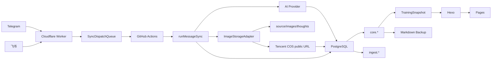

# 系统核心

本文是系统当前核心逻辑的唯一入口，覆盖系统是什么、架构、业务能力、消息链路、AI 识别、数据模型、运维排障、开发指南和命令接口参考。部署配置见 [系统配置](系统配置.md)；历史重构见 [重构历史](重构历史/README.md)。

## 目录

- [一、系统是什么](#一系统是什么)
- [二、系统架构](#二系统架构)
- [三、核心业务能力](#三核心业务能力)
- [四、消息链路](#四消息链路)
- [五、AI 识别体系](#五ai-识别体系)
- [六、一张图片如何识别并归档到某一天](#六一张图片如何识别并归档到某一天)
- [七、数据模型](#七数据模型)
- [八、运维与排障](#八运维与排障)
- [九、开发指南](#九开发指南)
- [十、命令与接口参考](#十命令与接口参考)


## 一、系统是什么

### 10 分钟系统导览

这个项目是个人训练记录系统。它把 Telegram 和飞书里的训练截图、饮食截图、体脂秤截图、睡眠截图、随想和分析请求，转成 PostgreSQL 中的结构化训练数据，再生成静态训练看板。

系统当前没有独立后台、OCR 服务后台或管理后台。主要维护入口是 Telegram Bot、PostgreSQL、npm scripts、GitHub Actions 和 `docs/` 文档；`训练记录.md` 是数据库派生备份。

### 一句话架构

```text
Telegram / 飞书
-> Cloudflare Worker
-> SyncDispatchQueue / GitHub Actions
-> 统一消息同步 Use Case
-> AI 识别或分析
-> PostgreSQL core.* / ingest.*
-> 随想图片本地 artifact 或腾讯云 COS URL
-> Markdown 备份与 Hexo 静态站点
```

### 系统为什么存在

目标不是做一个通用 OCR 工具，而是把个人训练相关事实长期、可恢复、可分析地存起来：

- 训练数据：活动、热量、时长、距离、心率。
- 饮食数据：餐次、摄入、建议范围。
- 体脂秤数据：体重、BMI、体脂率、骨骼肌、水分、基础代谢。
- 睡眠数据：入睡、醒来、睡眠阶段、评分、心率、HRV、血氧。
- 随想系统：训练感受、身体反馈、杂项记录，支持编辑、删除、移动。
- 分析系统：读取现有事实生成训练建议，不写入事实数据。

### 核心参与方

| 参与方 | 作用 |
| --- | --- |
| 用户 | 通过 Telegram 或飞书发送截图、随想、分析命令 |
| Cloudflare Worker | 验证 webhook、聚合图片 burst、触发同步任务 |
| GitHub Actions | 执行同步、构建、部署、备份和维护脚本 |
| AI Provider | 识别图片或生成训练分析 |
| PostgreSQL | 保存主数据、审计、pending、归档 |
| Hexo / Pages | 生成和发布静态训练看板 |
| Markdown | 人工可读备份和显式恢复入口 |

### 系统核心价值

1. 把训练相关事实稳定写入结构化数据库。
2. 保留外部消息和 AI 调用审计，便于追溯。
3. 当 AI、数据库、Action 或通道异常时，不静默丢数据。
4. 把页面展示、Markdown 备份和训练分析建立在同一份事实源上。

### 业务优先级

- 准确性优先于入库率。
- 可恢复性优先于链路简短。
- 业务状态优先于 Action 红绿状态。
- 双通道一致性优先于历史命名。

### 当前事实源

PostgreSQL 是事实源：

- `core.*` 保存业务主数据。
- `ingest.*` 保存原始消息、识别、pending、AI 调用审计。
- `archive.*` 保存构建快照和历史解析留痕。

Markdown 是派生备份，不是正常图片同步的主写入路径。

随想图片引用也是数据库事实的一部分。默认未启用 COS 时，新图片保存为本地 `/images/thoughts/...` 路径；启用腾讯云 COS 后，新图片上传到 COS，`core.thought.image_refs_json` 保存完整公有读 URL。历史本地图片路径不迁移，仍可和新 COS URL 共存。

### 当前状态与边界

当前状态：

- main/dev 的 Telegram 和飞书都进入统一 Cloudflare Worker。
- 消息同步由 GitHub Actions 执行，生产用 `sync.yml`，dev 用 `sync-dev.yml`。
- 应用层已有 `runMessageSync()` 统一编排；`runFeishuSync()` 通过飞书 adapter 复用同步主链路。
- 图片识别支持 `measurement`、`workout`、`nutrition`、`sleep`、`unknown`。
- `core.*` 是事实源；Markdown 是 DB 派生备份。
- 随想图片存储支持本地 artifact 和腾讯云 COS；COS 启用后由 GitHub Actions 上传，Cloudflare Worker 不接触 COS 凭据。
- pending 默认使用 PostgreSQL `ingest.telegram_pending_batch`；legacy NDJSON 只在显式开关下重放。
- AI 调用支持 OpenAI-compatible provider、超时、重试、识别 fallback 和 best-effort 审计日志。

不可破坏能力：

- Telegram 和飞书双通道采集。
- 训练、饮食、体脂秤、睡眠四类图片识别入库。
- 低置信度、缺少可靠日期、非目标图片不得强行入库。
- 随想新增、编辑、删除、移动和图片附件。
- Telegram Markdown 文档附件随想。
- `/analysis` 只读分析，不写事实数据。
- Markdown 导入是显式维护入口，具有整日替换语义。
- DB pending replay、幂等、事务和来源审计。
- DB -> Markdown 备份和 Hexo 静态站点生成。

当前命名债：

- `telegram_*` 表和部分函数承载通用消息同步审计，飞书通过 `source_channel='feishu'` 区分来源。
- `core.thought.telegram_message_id` 是 legacy 兼容字段，跨通道主身份应看 `source_channel/source_chat_id/source_message_id`。


## 二、系统架构

### 架构总览



### 分层

| 层 | 目录 | 职责 |
| --- | --- | --- |
| 核心域 | `src/core/` | 实体、Repository Port、领域服务、schema |
| 应用层 | `src/app/use-cases/` | 消息同步、数据生成、图片识别、训练分析 |
| 适配器 | `src/adapters/` | PostgreSQL、AI、Telegram、飞书、Hexo |
| 基础设施 | `src/infra/` | 配置和 app factory |
| 兼容 CLI | `tools/` | 维护脚本和历史 facade |
| 边缘入口 | `cloudflare/` | webhook、队列、dispatch |

### 核心边界

- 核心域不直接依赖 PostgreSQL、Telegram、飞书、AI 网络调用或文件系统。
- 应用层编排业务流程。
- 适配器负责外部系统差异。
- `tools/` 仍有历史 facade，未来可继续薄化，但当前文档按真实现状描述。

### 六边形架构

项目已经按 Ports and Adapters 方向演进，但仍保留部分历史 facade。

当前分布：

- `src/core/entities/`：业务实体。
- `src/core/repositories/`：Repository Port。
- `src/core/services/`：领域服务。
- `src/app/use-cases/`：用例编排。
- `src/adapters/postgres/`：PostgreSQL 实现。
- `src/adapters/telegram/`、`src/adapters/feishu/`：通道适配。
- `src/adapters/ai/`：AI Provider 适配器。
- `src/ai/`：AI provider facade、识别服务和兼容入口。
- `tools/`：CLI 和兼容 facade。

开发原则：

- 新业务规则优先进入 core 或 use case。
- 外部 I/O 差异放在 adapter。
- CLI 入口尽量薄化。
- 不为了命名纯净破坏现有双通道行为。

### 消息同步架构

消息同步的目标是把外部通道事件转成稳定、可审计、可重放的业务任务。

当前模型：

- Telegram 和飞书都是 channel。
- `runMessageSync()` 是共享编排入口。
- `runTelegramSync()` 注入 Telegram adapter。
- `runFeishuSync()` 注入飞书 adapter，再复用共享同步主链路。

处理顺序：

1. Cloudflare Worker 判断 channel。
2. Telegram secret header 或飞书签名/token 校验。
3. 图片 burst 进入对应 Durable Object 缓冲。
4. `SyncDispatchQueue` 排队触发 GitHub Actions。
5. workflow 判断 channel。
6. 同步脚本读取 dispatch payload。
7. 分流 help、analysis、thought、image。
8. 图片进入 AI 识别、缓存、校验。
9. ready batch 写入 `ingest.*` 和 `core.*`。
10. 返回 summary 和通道回执。

关键原则：

- 通道可以不同，业务语义不能不同。
- Action success 不等于业务 success。
- `taskStatus/failureDisposition` 是业务判断关键字段。
- 失败必须能归类为 `user_input`、`ai_service`、`database`、`channel_api`、`github_action` 或 `system_bug`。

### Markdown 与静态站点

Markdown 是人工可读备份和显式恢复入口，不是正常消息同步的主事实源。

| 文件/目录 | 角色 |
| --- | --- |
| `训练记录.md` | DB 派生训练备份，可显式导入 |
| `source/_posts` | 随想和文章备份，供 Hexo 渲染 |
| `source/images/thoughts` | 未启用 COS 时的随想图片本地 artifact；历史图片仍保留 |
| `source/_data/*.json` | 页面构建数据产物 |

随想图片写入边界位于 `tools/telegram-thoughts.mjs` 的 `ImageStorageAdapter`。`COS_ENABLED` 未启用时使用 `github_local` provider，写入本地 `source/images/thoughts`；启用 `COS_ENABLED=true` 且 `COS_PROVIDER=tencent_cos` 时，GitHub Actions 用腾讯云 COS SDK 上传图片，并把完整公有读 URL 交给 `core.thought.image_refs_json`。COS 只用于随想图片附件，不用于 Worker 侧处理，不用于训练截图识别原图归档。

Cloudflare Worker 不接触 COS，也不保存 COS Secret。Markdown backup 和 Pages 构建只消费数据库中的图片引用，不上传、不代理、不拼接图片 URL。

历史 `/images/thoughts/...` 和新 `https://...myqcloud.com/...` 可以同时存在；第一阶段不迁移历史图片，也不在随想删除时硬删除 COS 对象。

站点构建：

1. `npm run build:data` 生成 `source/_data/training.json` 和 `source/_data/dashboardView.json`。
2. `npm run build:site` 调用 Hexo。
3. Pages workflow 上传 `public/`。

禁止误用：

- 不要把 Markdown 备份当作最新事实。
- 不要在图片同步阶段直接编辑 Markdown 作为成功判定。
- 不要用旧 Markdown 覆盖未核对的 `core.*` 数据。
- 不要把 COS Secret 放入 Cloudflare Worker；COS 上传只发生在同步 workflow 的应用层边界。

### 架构决策记录（ADR）

| ADR | 决策 | 理由 |
| --- | --- | --- |
| 0001 | PostgreSQL 是训练数据事实源 | 支持结构化查询、pending、审计和恢复；避免 Markdown 合并导致同日模块覆盖 |
| 0002 | Telegram 和飞书使用统一消息同步管线 | 两个通道处理同一组业务能力；AI、DB、pending、summary、分析规则应一致 |
| 0003 | 保留 Hexo 静态站点 | 个人记录展示无需实时后台；静态部署简单成本低；页面作为派生视图 |
| 0004 | Markdown 是数据库派生备份 | 避免图片同步时整日覆盖其它模块；Markdown 作为人工可读备份；恢复需显式导入对账 |

ADR 影响：

- 页面构建和 `/analysis` 优先读取数据库。
- 文档按业务能力组织，不再以 Telegram 作为唯一中心。
- `ready + stored` 的业务成功不以 Markdown diff 为准。
- 任何绕过数据库直接修改事实的方案都需要单独 ADR。


## 三、核心业务能力

系统业务按能力组织，不按 Telegram 或飞书组织。

### 业务总览

| 业务 | 输入 | 主处理 | 事实落点 | 失败边界 |
| --- | --- | --- | --- | --- |
| 训练数据 | 运动/活动截图 | AI 识别活动、热量、时长、距离、心率 | `core.activity`、`core.training_day` | 无可靠日期、低置信度、AI/schema/DB 失败 |
| 饮食数据 | 饮食截图 | AI 识别餐次、热量、建议范围 | `core.meal`、`core.training_day` | 无日期、热量字段无效、AI/schema/DB 失败 |
| 体脂秤数据 | 体脂秤截图 | AI 识别体重、体脂、BMI 等 | `core.measurement`、`core.training_day` | 日期不可靠、数值异常、AI/schema/DB 失败 |
| 睡眠数据 | 睡眠截图 | AI 识别睡眠时段、阶段和健康指标 | `core.sleep`、`core.training_day` | 跨日推导不可靠、缺醒来日期、AI/schema/DB 失败 |
| 随想系统 | `/随想`、图片 caption、Telegram Markdown 附件 | 写入、编辑、删除、移动随想 | `core.thought` | 目标不存在、附件无效、DB 失败 |
| 分析系统 | `/分析` / `/analysis` | 读取 TrainingSnapshot 并调用 AI | 不写事实数据 | AI 失败、数据源不可读、通道回执失败 |

共同原则：

- 同一业务事实不因 Telegram 或飞书而改变含义。
- 图片识别成功不等于入库成功。
- 入库成功不等于页面已经部署完成。
- Action success 不等于业务 success。

系统只承认四类用户行为：图片输入、随想输入、分析输入、Markdown 输入。帮助命令、通知、pending replay 和部署任务是运行控制，不是用户业务行为。

### 训练数据

训练数据来自运动记录、活动列表或活动总览截图。

识别目标：

- 活动类型。
- 活动时间。
- 时长。
- 消耗热量。
- 距离、均速、心率等截图可见字段。
- 当日活动总览字段，如活动热量、锻炼时长、活动小时数。

落表：

- 明细写入 `core.activity`。
- 日汇总刷新 `core.training_day`。
- 原始消息和识别结果写入 `ingest.*`。

日期规则：

优先使用截图内可见可靠日期。截图只显示月日时，可结合消息年份补全年份。外部文件名只能作为程序后处理兜底，不是 AI 可编造的日期来源。

不允许：

- 不允许 AI 用历史训练习惯补动作。
- 不允许把活动总览强行拆成活动明细。
- 不允许因为入库率而猜日期、重量或热量。

### 饮食数据

饮食数据来自饮食、餐次、食物明细或热量摄入截图。

识别目标：

- 餐次名称。
- 餐次或食物热量。
- 建议摄入范围。
- 当日总摄入。
- 可读食物明细。

落表：

- 餐次写入 `core.meal`。
- 饮食汇总刷新 `core.training_day`。
- 原始识别写入 `ingest.telegram_recognition`，并通过 `source_channel` 区分通道。

失败边界：

- 没有可靠日期时跳过或进入人工处理。
- 没有可靠建议范围时字段为 `null`，不能伪造。
- 低置信度不能写入 core。

### 体脂秤数据

体脂秤数据来自体重、身体成分、体脂率等截图。

识别目标：

- 测量时间。
- 体重、BMI、体脂率。
- 骨骼肌、内脏脂肪、基础代谢。
- 水分、蛋白质、骨量、去脂体重、身体年龄、身体类型。

落表：

- 明细写入 `core.measurement`。
- 日汇总刷新 `core.training_day`。

日期边界：

测量时间写入 `measured_at`。是否归入前一日由程序规则决定，AI 不自行换算。

质量边界：

异常数值、缺少日期、低置信度不应强行入库。

### 睡眠数据

睡眠数据来自睡眠时长、入睡/醒来、睡眠阶段和健康指标截图。

识别目标：

- 入睡时间、醒来时间。
- 夜间睡眠、总睡眠、午睡。
- 深睡、浅睡、REM、清醒分钟数。
- 睡眠评分、心率、HRV、血氧、呼吸率。
- 睡眠解读和建议文本。

归档规则：

夜间睡眠按入睡日归档。常见场景是醒来日期减一天。AI 只提供截图可见时间和日期证据，程序负责最终 `archivedDate`。

落表：

- 明细写入 `core.sleep`。
- `core.training_day` 的睡眠字段从 `core.sleep` 聚合刷新。

排障重点：

判断睡眠是否成功不能只看 `archivedDate`。还要看 `dateSources`、`warnings`、`dateConfidence` 和 `core.sleep` 明细。

### 随想系统

随想系统记录训练感受、身体反馈和杂项内容。

能力：

- 新增随想。
- 编辑随想。
- 删除随想。
- 移动随想到不同模块。
- 图片随想。
- Telegram Markdown 文档附件随想。

模块：

- `workout`：锻炼随想；中文标签 `锻炼`、`锻炼随想`；默认模块。
- `misc`：杂七杂八；中文标签 `杂七杂八`。
- `body_feedback`：身体反馈；中文标签 `身体反馈`。

命令合同：

- 新增：`/随想 <正文>`、`/thought <body>`；也支持 `/随想 <模块> <正文>` 和 `/thought <模块> <body>`。
- 编辑：`/thought-edit`、`/thoughtedit`、`/edit-thought`、`/编随想`、`/随想编`、`/随便编`，格式为 `<命令> <id> [模块] <正文>`。
- 删除：`/thought-delete`、`/thoughtdel`、`/delete-thought`、`/删随想`、`/随想删`，格式为 `<命令> <id>`；回复目标随想时可省略 id。
- 移动：`/move`、`/移动`、`/thought`、`/随想` 都可承载移动语义；`/移动 <id> <模块>` 或 `/随想 <id> <模块>` 会移动目标随想到该模块，回复目标随想时也可用 `/移动 <模块>`。
- Reply edit：对已有随想消息回复 `/随想 ...` 或 `/thought ...`，会编辑被回复的随想，而不是新增。
- Edited message：Telegram edited message 如果对应已知随想身份，会作为随想编辑处理。
- 歧义拒绝：`/随想 <id> <模块> <内容>` 会被拒绝，原因是它疑似编辑命令；正确写法是 `/随想编 <id> <模块> <内容>`。
- Markdown 附件：仅 Telegram 支持 `.md` / `.markdown` 文档附件正文，附件大小上限 5MB；飞书当前不支持 Markdown 文档附件正文。

事实源：

`core.thought` 是事实源。`source/_posts` 和图片 artifact 由 DB -> Markdown 备份或站点构建链路派生。

随想图片引用保存在 `core.thought.image_refs_json`：

- 未启用 COS 时，引用通常是 `/images/thoughts/...` 本地静态路径。
- 启用腾讯云 COS 后，引用是完整公有读 URL。
- Markdown `photos` 和站点页面从数据库原样读取引用，不判断 provider。
- 删除随想是数据库软删除，不代表立即删除本地图片或 COS 对象。

身份字段：

跨通道主身份应使用 `source_channel + source_chat_id + source_message_id`。`telegram_message_id` 是 legacy 兼容字段。飞书会保存原始字符串 ID，并生成稳定数字代理以兼容旧字段。

随想行为细节：

- 新增：随想命令由 command resolver 识别。Telegram 和飞书共享命令语义；飞书先转为 Telegram-like update 再附加 `sourceChannel='feishu'`。新增随想写入 `core.thought`。
- 编辑：支持显式编辑命令、edited message 和 reply edit。编辑时先按 source identity 或 legacy Telegram message id 找到旧记录，再更新正文、模块、标签、图片引用等非空字段。
- 删除：删除命令不会物理删除 `core.thought`；数据库层使用 `status='deleted'` 和 `deleted_at` 软删除。若存在本地图片 artifact，删除流程会记录 deleted image refs。
- 模块迁移：`/移动` 只改变随想模块和标签，不改变原始来源身份。
- 图片附件：随想图片先经过图片存储边界，再把最终引用保存到 `core.thought.image_refs_json`。编辑随想并替换图片时，新图片全部写入成功后才更新 `image_refs_json`。删除或移动随想只更新数据库状态或模块，不硬删除 COS 对象。

通道差异：

- Telegram 支持 Markdown 文档附件正文。
- 飞书当前不支持 Markdown 文档附件正文。
- 两个通道都应保持随想新增、编辑、删除、移动的业务语义一致。

### 分析系统

分析系统读取已有训练事实，生成训练建议。

输入：

- Telegram `/分析` 或 `/analysis`。
- 飞书 `/分析` 或 `/analysis`。
- 可选用户问题。

数据来源：

分析读取 `TrainingSnapshot`，线上应优先来自 PostgreSQL `core.*`。

分析 Prompt 要求：

- 只输出纯文本。
- 不输出 Markdown 表格或 JSON。
- 1200 字以内。
- 基于结构化证据回答；数据不足时说明暂无足够数据。
- 默认围绕长期目标"增肌减腹"，但必须服从用户问题的时间窗和意图。

AI 边界：

- 分析 AI 是事实消费方，不是事实写入方。
- 分析失败不应影响 `core.*` 数据。
- 允许在 summary 或回执中暴露 `snapshotSource` 和 fallback 状态。

不允许：

- 不写 `训练记录.md`。
- 不写 `source/_posts`。
- 不写 PostgreSQL 主事实。
- 不把 Markdown fallback 伪装成 database 分析。

### Markdown 输入

Markdown 导入是显式维护入口，不是普通图片同步成功路径。`importTrainingMarkdownToDatabase()` 调用 `parseTrainingRecord()` 解析 Markdown，然后以 `sourceChannel='markdown_import'` 持久化到 core。

解析规则来自 Markdown 结构：

- 日期段由 `splitDateSections()` 拆分。
- `体脂秤` 块解析 measurement。
- `运动截图记录` 块解析 workout 和 daily summary。
- `饮食截图记录` 块解析 nutrition。
- `睡眠截图记录` 或 `睡眠记录` 块解析 sleep。

导入具有整日替换语义，必须谨慎使用。


## 四、消息链路

### 消息链路总览

消息链路覆盖 Telegram、飞书、Cloudflare、GitHub Actions、AI、数据库和 Markdown。

总链路：

```text
Telegram / 飞书
-> Cloudflare Worker
-> Durable Object buffer
-> SyncDispatchQueue
-> GitHub Actions sync.yml / sync-dev.yml
-> runMessageSync
-> AI / DB / 通道回执
-> 随想图片本地存储或 COS 上传
-> core.* / ingest.*
-> Markdown backup / Pages deploy
```

### Telegram 通道

输入：

- 图片或相册：训练、饮食、体脂、睡眠截图。
- `/随想` / `/thought`：随想。
- `/随想编`、`/随想删`、`/移动`：随想维护。
- `/分析` / `/analysis`：训练分析。
- `/help`、`帮助` 等：帮助命令。

Worker 行为：

- 校验 `X-Telegram-Bot-Api-Secret-Token`。
- 帮助消息可在 Worker 层直接回复。
- 图片 burst 进入 `TELEGRAM_ALBUM_BUFFER` 聚合。
- 其它消息进入 dispatch 队列。

GitHub Actions 行为：

生产触发 `sync.yml`，dev 触发 `sync-dev.yml`，最终执行 `npm run sync:telegram`。

如果消息是带图片的随想，workflow 会把 COS 运行时配置注入同步脚本。启用 COS 时，图片上传统计会出现在 workflow summary 的 `## Image storage` 小节。

特有能力：

- Telegram 文件方式可保留原始文件名，作为程序日期兜底来源。
- Telegram 支持 `.md` / `.markdown` 文档附件随想，单附件上限 5MB。

### 飞书通道

输入：

- 飞书 `im.message.receive_v1`。
- 图片消息。
- 文本随想。
- `/分析`。
- 帮助命令。

Worker 行为：

- 校验飞书 token、签名和可选加密信封。
- 处理 `url_verification` challenge。
- 图片 burst 进入 `FEISHU_IMAGE_BUFFER`。
- 触发 GitHub dispatch。

应用层行为：

`runFeishuSync()` 注入飞书 adapter 后复用共享同步管线：

- 飞书消息标准化为共享 batch。
- 图片通过飞书 Open API 下载后以内联 data URL 交给 AI。
- 带图片随想通过共享图片存储边界写入本地 artifact 或腾讯云 COS。
- 回执通过飞书 Open API 发送。
- core 子表写入 `source_channel='feishu'`。

特有限制：

飞书当前不支持 Markdown 文档附件随想正文。

### 双通道一致性

Telegram 和飞书是输入通道，不是业务边界。新增或修改核心能力时，默认要求双通道一致。

必须一致的业务能力：

| 能力 | Telegram | 飞书 | 一致性要求 |
| --- | --- | --- | --- |
| 图片识别 | 图片、相册 | 图片消息、burst 缓冲 | 同一类图片落同一组 core 表 |
| 随想新增 | `/随想`、`/thought`、caption | 文本命令 | 写入 `core.thought` |
| 随想编辑 | `/随想编` | 共享命令语义 | 更新同一身份记录 |
| 随想删除 | `/随想删` | 共享命令语义 | 软删除 |
| 随想移动 | `/移动` | 共享命令语义 | 模块字段一致 |
| 分析 | `/分析`、`/analysis` | `/分析`、`/analysis` | 只读快照并回执 |

带图片随想也属于双通道一致能力：两个通道都通过同一 `ImageStorageAdapter` 返回图片引用，并写入 `core.thought.image_refs_json`。

允许不同的平台实现：

- Telegram 用 `X-Telegram-Bot-Api-Secret-Token` 校验；飞书用 token、签名或加密信封校验。
- Telegram 图片可带原始文件名；飞书图片通过 Open API 下载并转为 inline data URL。
- Telegram 支持 `.md` / `.markdown` 文档附件随想正文；飞书当前不支持。
- Telegram 相册靠 `media_group_id`；飞书图片 burst 按同 chat 3 秒窗口聚合。
- 回执 API、消息 ID 形态和 webhook envelope 不同。

修改规则：

- 改共享业务逻辑时，同时检查 Telegram 和飞书测试。
- 新增通道特性时，必须写清楚是平台特性还是业务能力。
- 不能因为表名或函数名包含 `telegram` 就把飞书排除在共享链路之外。

### Cloudflare Workers

当前入口：

统一入口位于 `cloudflare/sync-dispatch-worker.mjs`。它根据请求判断 channel：

- Telegram：`X-Telegram-Bot-Api-Secret-Token`。
- 飞书：Lark 签名 headers 或飞书事件 envelope。

Durable Object：

- `TELEGRAM_ALBUM_BUFFER`：Telegram 图片 burst 聚合；类名 `TelegramAlbumBuffer`。
- `FEISHU_IMAGE_BUFFER`：飞书图片 burst 聚合；类名 `FeishuImageBuffer`。
- `SYNC_DISPATCH_QUEUE`：排队触发 GitHub workflow 并等待完成；类名 `SyncDispatchQueue`。

绑定名必须用 `wrangler.toml` / `wrangler.dev.toml` 里的 `name`。`SyncDispatchQueue` 是 Durable Object class name，不是 `env` 绑定名。

运维注意：

- Worker 只证明 webhook 层收到请求，不证明业务已入库。
- dispatch 失败、run lookup timeout、dead-letter 都需要看 Worker/Queue 日志。
- main/dev 的 wrangler 配置和外部平台 URL 必须匹配。

### Dispatch Queue 与 GitHub Actions

SyncDispatchQueue 负责：

- 生成稳定 task id。
- 按 sort key 顺序处理。
- 触发 GitHub workflow。
- 查询 workflow run。
- 等待完成。
- 重试或写入 dead-letter。

GitHub Actions workflow：

| Workflow | 作用 |
| --- | --- |
| `.github/workflows/sync.yml` | main Telegram/飞书同步 |
| `.github/workflows/sync-dev.yml` | dev Telegram/飞书同步 |
| `.github/workflows/deploy-pages.yml` | 生产 Pages 构建部署 |
| `.github/workflows/deploy-cloudflare-pages-dev.yml` | dev Pages 预览部署 |
| `.github/workflows/markdown-backup.yml` | DB -> Markdown 备份 |
| `.github/workflows/deploy-cloudflare-worker.yml` / `deploy-cloudflare-worker-dev.yml` | Worker 部署 |
| `.github/workflows/refresh-telegram-webhook.yml` | Telegram webhook 刷新 |

`sync.yml` 读取 main 的 `COS_*` 配置，`sync-dev.yml` 读取 `DEV_COS_*` 配置并在启用 COS 时校验 dev bucket/domain 不得等于 main。COS Secret 只进入同步 workflow，不进入 Worker、Pages deploy 或 Markdown backup workflow。

判断口径：

- workflow conclusion 是执行状态。
- `taskStatus` / `persistenceStatus` / `failureDisposition` 是业务状态。
- 业务状态优先用于判断同步是否真正成功。

### 失败状态与重试

常见失败分类：

| 分类 | 含义 | 常见处理 |
| --- | --- | --- |
| `user_input` | 输入不可入库，如无可靠日期、低置信度、未授权 chat | 重新发送或人工修正 |
| `ai_service` | AI 超时、限流、HTTP 失败、空响应、schema 失败 | 查 AI 配置、fallback、prompt/schema |
| `database` | DB 连接、权限、schema 或写入失败 | 修复 DB 后 pending replay |
| `telegram_api` | Telegram 下载或回执失败 | 查 Bot token、文件、网络 |
| `feishu_api` | 飞书 token、图片下载、回执失败 | 查 App 权限和 secret |
| `github_action` | workflow 安装、运行、提交、部署失败 | 查 Actions 日志 |
| `system_bug` | 未预期代码异常 | 本地复现并补测试 |

pending：

默认 pending 存在 PostgreSQL `ingest.telegram_pending_batch`。legacy `runtime/telegram-sync-pending.ndjson` 只在显式开关下重放。

人工介入：

以下情况不应靠无限重试解决：

- 缺少可靠日期。
- 低置信度。
- 非目标图片。
- 同批日期冲突。
- schema 通过但业务字段明显不可信。

### Markdown 备份链路

默认方向：

```text
PostgreSQL core.*
-> export markdown
-> 训练记录.md / source/_posts / source/images 或 COS URL 引用
```

显式导入：

`npm run import:markdown` 和 `npm run reconcile:markdown` 是维护入口。它们不是普通同步成功路径。

运维判断：

- DB 里有数据但 Markdown 没更新，通常是备份或部署问题，不是事实数据丢失。
- Markdown backup changed 但未 commit，需要看 workflow summary 的告警字段。
- COS 图片不会由 Markdown backup 或 Pages workflow 上传；它们只从 `core.thought.image_refs_json` 原样输出图片引用。


## 五、AI 识别体系

AI 在系统中的定位是结构化识别和训练分析，不是自由 OCR。

### 图片识别

图片识别输出必须符合 schema：

- `measurement`
- `workout`
- `nutrition`
- `sleep`
- `unknown`

### 图片分类

| imageType | 业务含义 | 入库目标 |
| --- | --- | --- |
| `measurement` | 体脂秤、身体成分、体重 | `core.measurement` |
| `workout` | 运动记录、活动总览、心率、距离、消耗 | `core.activity`、`core.training_day` |
| `nutrition` | 饮食、餐次、热量摄入 | `core.meal`、`core.training_day` |
| `sleep` | 睡眠时长、阶段、评分、健康指标 | `core.sleep`、`core.training_day` |
| `unknown` | 非目标图片或无法可靠分类 | 不写 core |

`unknown` 不写 core。低于 `0.75` 置信度的识别结果会被跳过。

红线：

- 不把所有图片压成 OCR 文本。
- 不猜测截图没有显示的事实。
- 不用历史数据补当前图片。
- 不把低置信度当成功。

### 识别 Schema

当前识别 schema 名为 `telegram_training_image`，版本为 `v2`。

事实源：

- `src/core/ai/telegram-recognition-schema.mjs`
- `tools/telegram-recognition-schema.mjs`
- `prompts/_source/recognition-rules.json`

顶层字段：

- `imageType`
- `detectedApp`
- `detectedDate`
- `dateEvidence`
- `records`
- `confidence`
- `warnings`

`records` 包含 measurement、activities、meals、totalCalories、details、dailyWorkoutSummary、sleep 等结构。字段缺失时应使用 `null` 或空数组，而不是省略或编造。

校验边界：

- 非 JSON 或 schema parse failure 会先尝试严格 JSON 重试。
- schema 通过后还要经过日期、置信度和业务规则校验。
- schema 成功不等于入库成功。

### Prompt 体系

源文件：

| 路径 | 作用 |
| --- | --- |
| `prompts/_source/recognition-rules.json` | 图片识别规则 |
| `prompts/_source/app-profiles.json` | APP 字段映射 |
| `prompts/_source/shared-rules.json` | 共享规则 |
| `prompts/_source/analysis-rules.json` | 分析规则 |
| `prompts/telegram-training-image-recognition.md` | 生成后的识别 prompt |
| `prompts/training-analysis.md` | 生成后的分析 prompt |

修改流程：

1. 修改 `_source/*.json`。
2. 运行 `node tools/prompt-generator.mjs`。
3. 运行 prompt 和 schema 相关测试。
4. 同步更新 AI 文档和业务字段说明。

生成器的事实源是 `tools/prompt-generator.mjs`。当前生成结果只应落在 `prompts/telegram-training-image-recognition.md` 和 `prompts/training-analysis.md`。

约束：

Prompt 是业务合同的一部分。字段、日期、分类和禁猜规则必须与 schema、写库逻辑和测试保持一致。

### Provider 与 Fallback

当前 AI 调用使用 OpenAI-compatible Chat Completions。

基础变量：

- `AI_API_KEY`
- `AI_BASE_URL`
- `AI_MODEL`
- `AI_PROVIDER`
- `AI_TIMEOUT_MS`

识别 fallback 使用历史命名：

- `TELEGRAM_RECOGNITION_FALLBACK_API_KEY`
- `TELEGRAM_RECOGNITION_FALLBACK_BASE_URL`
- `TELEGRAM_RECOGNITION_FALLBACK_MODEL`
- `TELEGRAM_RECOGNITION_FALLBACK_TIMEOUT_MS`

虽然变量带 `TELEGRAM_`，飞书图片识别也复用共享识别链路。

会 fallback 的情况：

- timeout
- HTTP 429
- HTTP 5xx
- 网络错误
- 空内容或可恢复服务异常

不应 fallback 的情况：

- 低置信度。
- 缺少可靠日期。
- 非目标图片。
- 用户输入导致的业务拒绝。
- schema 通过但业务字段不可信。

超时：

缺失或非法 `AI_TIMEOUT_MS` 默认应归一为 45000ms，避免请求无限挂起。

### AI 主备容灾演练

AI 主备容灾只处理可恢复的服务异常，不处理业务拒绝。

配置面：

识别主 provider：当前 `sync.yml` / `sync-dev.yml` 注入 `AI_API_KEY`、`AI_BASE_URL`、`AI_MODEL`、`AI_PROVIDER`、`AI_TIMEOUT_MS`、`AI_CONCURRENCY` 和 `TELEGRAM_RECOGNITION_MODEL`。代码在 `AI_SCHEDULER_ENABLED=true` 且运行时 env 存在时还支持 `AI_RECOGNITION_MODEL`、`AI_RECOGNITION_TIMEOUT_MS`、`AI_RECOGNITION_MAX_ATTEMPTS`，但当前 workflow 未注入这些 `AI_RECOGNITION_*` 变量。

识别 fallback：`TELEGRAM_RECOGNITION_FALLBACK_*`、`AI_RECOGNITION_FALLBACK_TIMEOUT_MS`。

分析 fallback：`AI_ANALYSIS_FALLBACK_*`。

演练步骤：

1. 在 dev 环境使用独立 AI 配置。
2. 将主 AI base URL 或模型临时配置为可恢复失败场景。
3. 发送一张有清晰日期的测试图片。
4. 检查同步 summary 是否出现 fallback attempt。
5. 检查 `ingest.ai_call_log` 是否记录 primary failure 和 fallback status。
6. 恢复主 AI 配置。
7. 再次发送测试图片，确认 primary 正常。

验收口径：

- fallback 成功时，业务结果仍必须经过 schema、日期、置信度和写库校验。
- fallback 失败时，必须返回可诊断失败分类，不应静默丢数据。
- 审计日志失败不阻断业务，但 summary 必须能判断业务结果。

### AI 可观测性

审计表：

`ingest.ai_call_log` 记录 AI 调用审计。典型字段：`ai_call_id`、`task_id`、`scene`、`provider`、`model`、`prompt_version`、`idempotency_key`、`status`、`latency_ms`、`failure_category`、`failure_reason`、token 和 cost 字段。

运行判断：

排查 AI 故障时先定位失败阶段：

1. 图片下载。
2. 缓存读取。
3. primary 调用。
4. 严格 JSON 重试。
5. fallback 调用。
6. schema 校验。
7. 业务校验。
8. DB persist。

告警建议：

- fallback 使用率异常升高。
- schema failure 持续出现。
- primary + fallback 同时失败。
- AI latency 接近或超过 timeout。
- token/cost 异常增长。

### 分析 AI

分析 AI 读取 `TrainingSnapshot`，根据用户问题生成训练建议。

配置：

- `TRAINING_ANALYSIS_GOAL`
- `TRAINING_ANALYSIS_PROMPT_PATH`
- `TRAINING_ANALYSIS_SNAPSHOT_POLICY`
- `AI_ANALYSIS_MODEL`
- `AI_ANALYSIS_TIMEOUT_MS`
- `AI_ANALYSIS_FALLBACK_*`

快照策略：

`strict_db` 表示数据库快照不可用时直接返回数据源异常。`allow_markdown_fallback` 允许回退 Markdown，但必须在 summary 或回执中暴露 fallback 状态。

### 图片识别字段映射

字段事实源是 `src/core/ai/telegram-recognition-schema.mjs`、`src/adapters/postgres/core-row-writer.pg.mjs` 和 SQL schema。

顶层字段：

| AI 字段 | 作用 | 入库影响 |
| --- | --- | --- |
| `imageType` | 图片分类 | 决定写入 measurement、activity、meal、sleep 或跳过 |
| `detectedDate` | 截图可见日期 | 参与归档日期计算 |
| `dateEvidence` | 日期证据说明 | 进入审计和 warnings 判断 |
| `confidence` | 识别置信度 | 低置信度不写 core |
| `warnings` | 风险提示 | 用于 summary 和人工介入 |

measurement：

| AI 字段 | core 字段 |
| --- | --- |
| `measuredAt` | `core.measurement.measured_at` |
| `bodyScore` | `body_score` |
| `weightKg` | `weight_kg` |
| `bmi` | `bmi` |
| `bodyFatPct` | `body_fat_pct` |
| `skeletalMuscleKg` | `skeletal_muscle_kg` |
| `visceralFatLevel` | `visceral_fat_level` |
| `basalMetabolismKcal` | `basal_metabolism_kcal` |
| `bodyWaterPct` | `body_water_pct` |
| `proteinPct` | `protein_pct` |
| `boneMassKg` | `bone_mass_kg` |
| `fatFreeMassKg` | `fat_free_mass_kg` |
| `bodyAge` | `body_age` |
| `bodyType` | `body_type` |

activities：

| AI 字段 | core 字段 |
| --- | --- |
| `time` | `core.activity.activity_time` |
| `type` | `activity_type` / `raw_type` |
| `detail` | `detail`，并由 parser 提取 calories、heart_rate、distance、duration |

`dailyWorkoutSummary` 刷新 `core.training_day` 的活动热量、锻炼分钟数、活跃小时数等投影字段。

meals：

| AI 字段 | core 字段 |
| --- | --- |
| `name` | `core.meal.meal_name` |
| `calories` | `calories` |
| `recommendedMin` | `recommended_min` |
| `recommendedMax` | `recommended_max` |

`totalCalories` 刷新 `core.training_day.intake_calories`。

sleep：

| AI 字段 | core 字段 |
| --- | --- |
| `sleepType` | `core.sleep.sleep_type` |
| `bedtime` | `bedtime` |
| `wakeTime` | `wake_time` |
| `nightSleepMinutes` | `night_sleep_minutes` |
| `totalSleepMinutes` | `total_sleep_minutes` |
| `napMinutes` | `nap_minutes` |
| `deepSleepMinutes` | `deep_sleep_minutes` |
| `lightSleepMinutes` | `light_sleep_minutes` |
| `remSleepMinutes` | `rem_sleep_minutes` |
| `awakeMinutes` | `awake_minutes` |
| `sleepScore` | `sleep_score` |
| `averageHeartRateBpm` | `average_heart_rate_bpm` |
| `hrvMs` | `hrv_ms` |
| `averageSpo2Pct` | `average_spo2_pct` |
| `averageRespiratoryRate` | `average_respiratory_rate` |
| `analysisText` | `analysis_text` |
| `suggestionText` | `suggestion_text` |

维护规则：

- 新增 AI 字段时先更新 schema，再更新 prompt source、写库逻辑、测试和本文。
- 字段缺失时使用 `null` 或空数组，不能让 AI 编造。
- AI schema 通过不代表业务成功，仍需日期、置信度和入库校验。


## 六、一张图片如何识别并归档到某一天

这是系统最核心的端到端逻辑。从用户发送一张截图到数据落库并显示在看板，全流程如下。

### 第 1 步：消息进入 Worker

用户在 Telegram 或飞书发送一张训练/饮食/体脂/睡眠截图（或相册）。

- Telegram：消息到达统一 Cloudflare Worker，校验 `X-Telegram-Bot-Api-Secret-Token`。单张图片是一条消息；相册是多条带同一 `media_group_id` 的消息，进入 `TELEGRAM_ALBUM_BUFFER` 聚合。
- 飞书：消息触发 `im.message.receive_v1`，校验飞书签名/token。图片消息会先转成 Telegram-like update，再进入 `FEISHU_IMAGE_BUFFER`；同一 chat 内 3 秒窗口的图片会组成一个 batch。

帮助消息可在 Worker 层直接回复，不进入后续链路。

### 第 2 步：队列触发 GitHub Actions

Worker 通过 `SyncDispatchQueue` 生成稳定 task id，按顺序触发 GitHub Actions：

- main 环境触发 `sync.yml`。
- dev 环境触发 `sync-dev.yml`。

workflow 判断 channel 后执行 `npm run sync:telegram` 或 `npm run sync:feishu`。

### 第 3 步：应用层分流

`runMessageSync()` 读取 dispatch payload，把消息分流为：

- `help`：帮助。
- `analysis`：训练分析（只读，不写事实）。
- `thought`：随想（caption 以 `/随想` 开头的图片走随想链路，不走训练识别）。
- `image`：训练图片识别。

普通图片或相册进入训练数据识别；caption 以 `/随想` 或 `/thought` 开头时进入随想链路，不进入训练图片识别。

### 第 4 步：AI 识别

`recognizeBatch()` 对 batch 中的每条消息做并发处理。每条消息只取 `message.photos.at(-1)` 这一张最终 photo 变体，通常是 Telegram 同一图片的最高规格版本；一批多图不是一条消息里的多张 photo，而是 batch 中多条消息各取自己的最终 photo 变体。图片会被下载为 URL 或 inline data URL，然后调用 `recognizeTelegramImageMessage()`。

识别 Prompt 来自 `prompts/telegram-training-image-recognition.md`，结构合同来自 `telegram_training_image` v2 schema。

AI 输出顶层字段：

- `imageType`：图片分类（`measurement`/`workout`/`nutrition`/`sleep`/`unknown`）。
- `detectedDate`：截图画面内可见的可靠日期。
- `dateEvidence`：日期证据说明。
- `records`：结构化识别结果。
- `confidence`：识别置信度。
- `warnings`：风险提示。

AI 红线：不能补数据、不能猜日期、不能用历史记录补字段。

### 第 5 步：图片归档日期计算（关键）

这是决定"图片归到哪一天"的核心步骤。规则如下：

1. **AI 只能输出截图画面内可靠日期**；截图只有月日时，可用消息年份补全年份。
2. **程序解析多个日期来源**：`detectedDate`、体脂测量时间、`dateEvidence`、带图片证据的 warnings。
3. **睡眠图片特殊规则**：按入睡日归档，常见场景是醒来日期减一天。AI 只提供截图可见时间和日期证据，程序负责最终 `archivedDate`。
4. **图片日期优先**：只要 batch 内有唯一可靠图片日期，就使用图片日期归档。
5. **同 batch 一致性**：同一 batch 内识别出的图片归档日期必须一致；多个图片日期会跳过该 batch。
6. **文件名只做兜底**：只有图片内没有可靠日期时，Telegram document 文件名日期才会作为程序兜底；普通 photo 通常没有原始文件名，飞书图片当前没有同等文件名兜底。
7. **文件名冲突处理**：如果文件名日期与图片日期不一致，记录 warning 并继续使用图片日期；如果没有图片日期且文件名里解析出多个不同日期，跳过该 batch。
8. **无日期则跳过**：当前未使用"系统接收时间"作为图片归档日期兜底；缺少可靠图片日期和文件名日期时会跳过该 batch。

理想优先级"图片内时间 -> 消息时间 -> 系统接收时间"与当前代码不完全一致：消息时间主要用于补全年份，不直接作为归档日期；系统接收时间没有作为图片归档兜底。

事实源代码：

- `src/adapters/telegram/sync-dates.adapter.mjs`
- `src/adapters/telegram/sync-batch-logic.adapter.mjs`

### 第 6 步：置信度与业务校验

识别结果还要经过：

- `confidence` 是否 >= `0.75`，低于则跳过。
- `imageType` 是否属于允许类型，`unknown` 不写 core。
- 日期证据是否可靠。
- 业务字段是否可入库。

低置信度、缺少可靠日期、非目标图片不得强行入库。schema 成功不等于入库成功。

### 第 7 步：写库

图片 batch 通过所有校验后，在一个事务内：

1. 写 `ingest.*`（批次状态、原始消息、识别结果、AI 审计）。
2. 写 core 明细表（按 imageType 决定）：
   - `measurement` → `core.measurement`
   - `workout` → `core.activity`
   - `nutrition` → `core.meal`
   - `sleep` → `core.sleep`
3. 刷新 `core.training_day` 日级投影。
4. 失败时回滚并进入 pending 或返回业务失败。

幂等保证：同一 `batch_id + payload_hash` 重复执行应返回 `unchanged`，不重复写 core。

### 第 8 步：失败补偿

如果数据库写入失败：

- 批次进入 `ingest.telegram_pending_batch` pending 队列。
- 数据库恢复后，下一次同步会先重放队列。
- 随想图片上传 COS 成功但 DB 写入失败时，可能产生短期孤儿 COS 对象，pending replay 会使用稳定 key 重试并写入同一 URL。

### 第 9 步：页面生成与部署

页面构建读取 `core.*`：

1. `npm run build:data` 生成 `source/_data/training.json` 和 `source/_data/dashboardView.json`。
2. `npm run build:site` 调用 Hexo 渲染。
3. Pages workflow 上传 `public/` 部署到 GitHub Pages（main）或 Cloudflare Pages（dev）。

内容变化后 workflow 只提交文件；站点构建部署由 push 或 DB-only 异步 deploy workflow 完成。

### 第 10 步：判断业务成功

Action 绿色只代表 workflow 执行成功，不代表业务成功。判断业务结果要看：

- `taskStatus`
- `persistenceStatus`
- `failureDisposition`
- `dateSources`
- `warnings`
- pending / dead-letter / summary

`stored` 且 `ready` 且无 pending（或明确的人工介入原因）才代表业务成功。


## 七、数据模型

### 数据模型总览

数据库按三层组织：

| Schema | 作用 |
| --- | --- |
| `core` | 主业务事实源 |
| `ingest` | 外部消息、AI 识别、pending、审计 |
| `archive` | 构建快照、Markdown 解析归档和历史运行留痕 |

事实源文件：

- `sql/training_records/core.sql`
- `sql/training_records/ingest.sql`
- `sql/training_records/archive.sql`
- `sql/pgsql17.sql`

`sql/pgsql17.sql` 是汇总初始化脚本，拆分 SQL 是分层维护入口。

### core Schema

`core.*` 是当前训练系统业务事实源。

| 表 | 说明 |
| --- | --- |
| `core.training_day` | 日级投影，一天一行，由明细聚合刷新 |
| `core.measurement` | 体脂秤测量明细 |
| `core.activity` | 活动和训练明细 |
| `core.meal` | 餐次明细 |
| `core.sleep` | 睡眠明细和健康指标 |
| `core.thought` | 随想正文、模块、图片引用和软删除状态 |

关键字段：

| 表 | 主键或幂等键 | 关键日期 | 来源字段 | 说明 |
| --- | --- | --- | --- | --- |
| `core.training_day` | `archived_date` | `archived_date` | `source_channel`、`source_batch_id` | 日级投影，按明细刷新 |
| `core.measurement` | `measurement_key` | `archived_date`、`measured_at` | `source_channel`、`source_batch_id` | 体脂秤明细 |
| `core.activity` | `activity_key` | `archived_date`、`activity_time` | `source_channel`、`source_batch_id` | 活动/训练明细 |
| `core.meal` | `meal_key` | `archived_date` | `source_channel`、`source_batch_id` | 餐次明细 |
| `core.sleep` | `sleep_key` | `archived_date`、`bedtime`、`wake_time` | `source_channel`、`source_batch_id` | 睡眠明细 |
| `core.thought` | `source_channel + source_chat_id + source_message_id` | `message_date_unix`、`updated_at` | `source_channel`、`source_chat_id`、`source_message_id` | 随想正文、模块、图片引用和软删除状态 |

来源字段：

`source_channel` 区分 `telegram`、`feishu`、`markdown_import`、`archive_backfill` 等来源。跨通道数据恢复和审计都必须保留该字段。

training_day：

`core.training_day` 是投影表，不是唯一明细事实源。SQL 主键只有 `archived_date`；`source_channel` 和 `source_batch_id` 是最近刷新来源字段，不参与主键。睡眠、训练、饮食、体脂明细优先看对应子表。

核心索引：

当前 SQL 在明细表上至少保留按 `archived_date` 的查询索引，供页面、分析和排障按日期读取。随想表保留来源身份唯一约束，用于跨通道幂等。

权威来源：

- `sql/training_records/core.sql`
- `src/adapters/postgres/core-row-writer.pg.mjs`
- `src/adapters/postgres/training-repository.pg.mjs`
- `src/adapters/postgres/thought-repository.pg.mjs`

维护规则：

- 新增 core 字段时，同时更新 SQL、写库 mapper、读取 mapper、测试和本文。
- 不把 `core.training_day` 当作唯一事实源；修复单日异常时先查明细表。
- 不删除 legacy 字段，除非已有迁移、回滚和通道兼容证明。

### ingest Schema

`ingest.*` 保存外部输入、识别和补偿状态。

| 表 | 说明 |
| --- | --- |
| `ingest.telegram_batch` | 批次状态、payload hash、warnings、issues |
| `ingest.telegram_message` | 原始消息摘要和 source identity |
| `ingest.telegram_recognition` | AI 识别结果缓存和 source identity |
| `ingest.telegram_pending_batch` | 数据库失败后的默认 pending replay 队列 |
| `ingest.ai_call_log` | AI 调用审计 |

命名说明：

表名中的 `telegram` 是历史命名。当前飞书也复用这些表，通过 `source_channel + source_chat_id + source_message_id` 区分原始来源。

pending：

`ingest.telegram_pending_batch` 是默认 pending 队列。legacy `runtime/telegram-sync-pending.ndjson` 只作为显式旧队列重放入口。

### archive Schema

`archive.*` 保存构建和 Markdown 解析历史，不是当前业务事实源。

| 表 | 说明 |
| --- | --- |
| `archive.training_parse_snapshot` | Markdown 原文 hash 去重后的解析快照 |
| `archive.training_parse_run` | 每次构建或导入运行记录 |
| `archive.training_day` | 历史日级归档 |
| `archive.training_measurement` | 历史体脂明细 |
| `archive.training_activity` | 历史训练明细 |
| `archive.training_meal` | 历史餐次明细 |
| `archive.training_sleep` | 历史睡眠明细 |

使用场景：

- 构建审计。
- 历史对账。
- archive -> core 回填。

边界：

archive 不是线上页面、分析和消息同步的首选读取源。

### 数据生命周期

图片数据：

```text
外部消息
-> ingest.telegram_message
-> AI recognition
-> ingest.telegram_recognition
-> core 明细表
-> core.training_day 投影刷新
-> TrainingSnapshot
-> 页面/分析/Markdown backup
```

随想数据：

```text
外部消息
-> 图片存储边界（本地 source/images 或腾讯云 COS）
-> core.thought
-> Markdown backup
-> source/_posts / source/images 或 COS URL 引用
-> Hexo 页面
```

随想图片引用：

`core.thought.image_refs_json` 是随想图片引用的唯一事实字段。当前没有新增图片资产表，也没有对象存储专用列。

字段允许两类值共存：

- 本地静态路径：`/images/thoughts/...`
- 腾讯云 COS 公有读 URL：`https://{bucket}.cos.{region}.myqcloud.com/{prefix}/thoughts/...`

Markdown 导出和站点页面按字符串原样使用该字段，不从 object key 拼 URL。启用 COS 后，如果图片上传成功但数据库写入失败，可能留下未被 active 随想引用的 COS 对象；这是对象存储层的孤儿对象，不改变数据库事实，后续重放使用稳定 key 写回同一 URL。

分析数据：

```text
用户问题
-> TrainingSnapshot
-> AI 分析
-> 通道回执
```

分析不写事实数据。

Markdown 导入：

Markdown 导入是显式维护入口，按日期整日替换子表明细后刷新 `core.training_day`。

### 幂等与事务

批次幂等：

同步批次使用 `batch_id` 和 `payload_hash` 判断重复处理。同一批次重复执行应返回 `unchanged` 或 upsert 合并，不应重复写 core。

来源身份：

跨通道身份使用 `source_channel + source_chat_id + source_message_id`。

core 明细 key：

明细 key 必须包含来源维度，避免 Telegram 和飞书同日相似事实互相覆盖来源审计。

事务边界：

图片 ready batch 应在一个事务内：

1. 写 ingest。
2. 写 core 明细。
3. 刷新 `core.training_day`。
4. 失败时回滚并进入 pending 或返回业务失败。

### 数据源策略

事实源层级：

1. PostgreSQL `core.*`：主业务事实。
2. PostgreSQL `ingest.*`：接入、识别、pending、AI 审计。
3. PostgreSQL `archive.*`：构建快照和历史解析。
4. Markdown / `source/_posts`：派生备份和静态站点内容。
5. `runtime/*.ndjson`：失败日志或 legacy 队列。

重要边界：

- 正常图片同步成功路径不即时写 `训练记录.md`。
- DB -> Markdown 备份由 `markdown-backup.yml` 或显式 `npm run export:markdown` 完成。
- Markdown 导入是显式维护入口，具有整日替换语义。
- 页面和分析应优先读取数据库快照。

配置口径：

- `TRAINING_SNAPSHOT_SOURCE=database`：线上推荐。
- `TRAINING_SNAPSHOT_SOURCE=markdown`：本地兼容或显式维护。
- `TRAINING_SNAPSHOT_STRICT_DATABASE=true`：数据库源失败时不回退 Markdown。

### 迁移与回滚

原则：

- 优先 additive migration。
- 不在未验证时 drop 旧列。
- 先 dev，后 main。
- 迁移前后必须能对照 SQL、schema preflight 和测试。

当前回滚资产：

- `sql/training_records/rollback_core_code_optimization_01.sql`
- git history
- Markdown backup
- archive snapshot
- pending 队列

验证：

```bash
npm test
npm run check:data-consistency
git diff --check
```

### 常用查询

按日期查看日投影：

```sql
select *
from core.training_day
where archived_date = date 'YYYY-MM-DD'
order by source_channel;
```

按日期查看明细：

```sql
select * from core.activity where archived_date = date 'YYYY-MM-DD' order by activity_time;
select * from core.meal where archived_date = date 'YYYY-MM-DD' order by meal_name;
select * from core.measurement where archived_date = date 'YYYY-MM-DD' order by measured_at;
select * from core.sleep where archived_date = date 'YYYY-MM-DD' order by bedtime;
```

查看随想：

```sql
select source_channel, source_chat_id, source_message_id, thought_module, status, updated_at, body
from core.thought
where source_channel = 'telegram'
order by updated_at desc
limit 20;
```

查看 pending：

```sql
select pending_id, batch_id, kind, status, failure_category, failure_reason, attempt_count, next_retry_at
from ingest.telegram_pending_batch
where status = 'pending'
order by next_retry_at;
```

查看 AI 审计：

```sql
select scene, provider, model, status, latency_ms, failure_category, created_at
from ingest.ai_call_log
order by created_at desc
limit 50;
```

索引口径：

- 明细表应支持按 `archived_date` 查询。
- ingest 表应支持按来源身份和 batch 查询。
- pending 表应支持按 `status + next_retry_at` 查询。
- 随想应以 `source_channel + source_chat_id + source_message_id` 作为跨通道身份。

维护规则：

- 新查询变慢时，先确认 SQL explain，再决定是否加索引。
- 加索引属于数据库变更，必须同步 SQL、迁移/回滚说明和测试。
- 不为一次性人工查询随意新增长期索引。


## 八、运维与排障

### 日常维护

每次排障先看：

1. GitHub Actions run。
2. workflow summary。
3. 通道回执。
4. DB core/ingest 状态。
5. Worker tail。

带图片随想启用 COS 时，同时看 workflow summary 的 `## Image storage`：确认 provider、bucket、pathPrefix、uploaded/skipped/failed 和 firstUrlHost。上传失败不应写入 `core.thought.image_refs_json`。

判断口径：

不要只看 Action 绿色。业务成功至少要看 `stored`、`ready`、无 pending 或明确的人工介入原因。

常用命令：

```bash
npm test
npm run build
npm run sync:db
npm run import:markdown
npm run export:markdown
npm run reconcile:markdown
npm run backfill:core
npm run backfill:thoughts
npm run check:data-consistency
npm run maintenance:inspect
npm run maintenance:inspect -- --batch-id <batchId>
npm run maintenance:sync
npm run maintenance:migrate -- --dry-run
node tools/telegram-sync-fallback.mjs inspect
TELEGRAM_SYNC_REPLAY_LEGACY_NDJSON_PENDING=true npm run sync:telegram
```

安全数据库修复：

`npm run sync:db` 是安全数据库修复入口，内部按维护阶段执行。常见阶段包括：

- archive backfill：`npm run backfill:core`。
- thoughts backfill：`npm run backfill:thoughts`。
- markdown import/reconcile：`npm run import:markdown`、`npm run reconcile:markdown`。
- all phase：`npm run maintenance:sync` 可统一调度，但写入前必须确认目标环境。

Markdown 导入具有整日替换语义。任何导入前都要先确认目标日期和来源，不能把旧 `训练记录.md` 当作最新事实直接覆盖数据库。

Pending 和 AI 监控字段：

`npm run maintenance:inspect` 应重点看：

- `pendingDatabaseOldestAgeMinutes`
- `pendingDatabaseMaxAttemptCount`
- `pendingDatabaseAlertLevel`
- `aiMonitoringFallbackRate`
- `aiMonitoringSchemaFailureCount`
- `aiMonitoringAvgRecognitionLatencyMs`
- `aiMonitoringTotalCostUsd`
- `recoveryTargetDays`

DB pending 是默认队列。legacy `runtime/telegram-sync-pending.ndjson` 只作为显式旧队列检查或重放入口；重放前应备份为 `telegram-sync-pending.ndjson.backup-<UTC timestamp>`。

GitHub Actions 队列异常：

队列任务必须能用 `queue_task_id` 关联 workflow run。若出现 workflow run 查找超时 / run lookup timeout，先确认：

1. `SyncDispatchQueue` 是否写入 dead-letter。
2. repository dispatch 或 workflow dispatch payload 是否包含 `queue_task_id`。
3. workflow 是否被取消、限流或权限拒绝。
4. 重跑 / rerun 是否使用同一 payload。

重复执行同一 `batch_id + payload_hash` 应返回 `unchanged`，不得重复写 core。

Markdown Backup 告警：

`markdown-backup.yml` 的 summary 可能出现：

- `changed_without_commit`：数据库导出产生差异，但 `MARKDOWN_BACKUP_COMMIT` 未启用。
- `workflow_failed_before_alert_evaluation`：workflow 在告警评估前失败，需要直接看 job 日志。

接手演练题卡：

- 画出主链路：Telegram/飞书 -> Worker -> Queue -> Action -> AI -> DB -> Pages。
- 解释 `Action success` 不等于 `业务 stored`：还要看 `taskStatus`、`persistenceStatus`、`failureDisposition`。
- 区分 `auto_retry`、`manual_intervention`、`skipped`：自动重试适合平台或服务抖动，人工介入适合输入或数据质量问题，跳过适合低置信度、无可靠日期或非目标图片。
- 说清事实和审计边界：`core.*` 是业务事实，`ingest.*` 是原始消息和 AI 审计，`archive.*` 是构建快照和历史解析留痕，`训练记录.md` 是数据库派生备份。
- 按"恢复优先级"做一次人工验收：定位 batch、日期、来源通道，确认恢复后 core 明细、summary 和页面都一致。

### 数据恢复

恢复来源优先级：

1. PostgreSQL `core.*`。
2. PostgreSQL `ingest.*` 原始消息和识别。
3. pending replay。
4. Markdown backup。
5. archive snapshot。
6. git history。

原则：

- 先备份，再恢复。
- 不用旧 Markdown 直接覆盖未核对的数据库。
- 恢复后运行一致性检查和页面构建。

恢复前确认：

1. 确认故障范围：单条消息、单日数据、整批同步、站点构建，还是数据库不可用。
2. 确认事实源：优先查 `core.*`，再查 `ingest.*` 和 pending。
3. 保存证据：记录 workflow run、batch id、source channel、chat/message id、错误 summary。

常用检查：

```bash
npm run maintenance:inspect
npm run check:data-consistency
npm run build:data
```

数据库可访问时，优先按日期和来源查：

```sql
select * from core.training_day where archived_date = date 'YYYY-MM-DD';
select * from core.activity where archived_date = date 'YYYY-MM-DD' order by activity_time;
select * from core.meal where archived_date = date 'YYYY-MM-DD' order by meal_name;
select * from core.measurement where archived_date = date 'YYYY-MM-DD' order by measured_at;
select * from core.sleep where archived_date = date 'YYYY-MM-DD' order by bedtime;
select * from core.thought where source_channel = 'telegram' and source_message_id = '<id>';
select * from ingest.telegram_pending_batch where status = 'pending' order by next_retry_at;
```

恢复路径：

| 场景 | 首选动作 | 验证 |
| --- | --- | --- |
| DB 短暂不可用，pending 已写入 | 修复数据库后运行 `npm run sync:telegram` 或 `npm run sync:feishu` 触发重放 | pending 状态变为 resolved，core 明细存在 |
| 单日 Markdown 需要回灌 | 先备份数据库，再运行 `npm run import:markdown` 或 `npm run reconcile:markdown` | `npm run check:data-consistency` |
| 页面未更新但 DB 正确 | 运行 `npm run build:data` 和 Pages workflow | `source/_data/*.json` 与页面包含目标日期 |
| 随想页面缺失 | 查 `core.thought`，再运行 Markdown 导出和站点构建 | `source/_posts` 和模块页面包含目标随想 |
| AI 识别结果错误 | 查 `ingest.telegram_recognition` 原始识别和图片来源，不直接改 core | 修正后重新入库或人工导入有审计记录 |
| COS 图片上传成功但 DB 写入失败 | 修复 DB 后重放 pending；稳定 key 会指向同一 COS URL | pending resolved，`core.thought.image_refs_json` 写入目标 URL |
| COS URL 写错或不可访问 | 先关闭 `COS_ENABLED` 阻止继续写错，再修正对应 `core.thought.image_refs_json` 或重新发送 | URL `curl -I` 可访问，Markdown 导出与 DB 一致 |

禁止动作：

- 不直接用旧 `训练记录.md` 覆盖数据库。
- 不在无法确认来源身份时手写 core 明细。
- 不用 dev 数据覆盖 main。
- 不把 Action 绿色当作数据恢复成功。

恢复优先级：`core.*` -> `ingest.*` -> pending replay -> Markdown backup -> `archive.*` -> git history。每次人工验收都要能指向 batch、日期、来源通道和恢复后检查结果。

### Pending Replay

默认队列：

默认 pending 队列是 `ingest.telegram_pending_batch`。

重放：

数据库恢复后，下一次同步会先读取 DB pending。也可以通过同步命令显式触发：

```bash
npm run sync:telegram
npm run sync:feishu
```

Legacy NDJSON：

`runtime/telegram-sync-pending.ndjson` 是 legacy 队列。只有显式设置 `TELEGRAM_SYNC_REPLAY_LEGACY_NDJSON_PENDING=true` 时才重放。

### Markdown 导入导出

导出：

```bash
npm run export:markdown
```

从数据库导出 Markdown 备份。

导入：

```bash
npm run import:markdown
npm run reconcile:markdown
```

导入具有整日替换语义，必须谨慎使用。

规则：

- 导出是常规备份。
- 导入是维护恢复。
- 不把导入当作正常同步路径。

### Dev 合并 Main

目标：合并代码和文档，同时保护 main 的生产派生数据。

原则：

- 不用 dev 的 `训练记录.md` 覆盖 main。
- 不用 dev 的 `source/_posts` 生产数据覆盖 main。
- 不用 dev 图片 artifact 覆盖 main。
- 不用 dev COS bucket/domain 覆盖 main 配置。

命令：

```bash
npm run merge:dev-to-main
npm run check:derived-data-merge -- --base origin/main
```

PR 到 `main` 会运行 `npm run check:derived-data-merge -- --base origin/main`。如果确实需要更新备份文件，应通过生产数据库导出的 `markdown-backup.yml` 或 `npm run export:markdown` 在 main 侧完成。

### 监控与告警

必看信号：

- workflow failure。
- `pending_replay` 增长。
- dead-letter。
- AI fallback 使用率。
- AI schema failure。
- DB timeout。
- Markdown backup changed without commit。

判断原则：

平台成功不等于业务成功。告警应覆盖业务状态字段，而不只覆盖 workflow conclusion。

### 故障排查

先判断故障发生在哪一层：

1. 通道入口。
2. Cloudflare Worker。
3. GitHub Actions。
4. AI。
5. 数据库。
6. Markdown backup。
7. Pages/CDN。

AI 异常排查顺序：

1. `AI_API_KEY`、`AI_BASE_URL`、`AI_MODEL`。
2. timeout、429、5xx、网络错误。
3. 是否触发 fallback。
4. JSON/schema parse failure。
5. 低置信度或业务拒绝。
6. `ingest.ai_call_log`。

低置信度和缺少可靠日期不是平台故障，不应通过无限重试解决。

GitHub Actions 异常排查顺序：

1. workflow 是否启动。
2. run 是否 cancelled、failed、timed out。
3. `queue_task_id` 是否能匹配 run。
4. summary 是否显示业务失败。
5. commit/push/deploy 是否失败。

关键区别：

- Action failed：执行失败。
- Action success + `partialFailure`：业务部分失败。
- Action success + `pending_replay`：已进入补偿。

队列失败排查 `queue_task_id`：

1. 在 Worker/Queue 日志中查 `queue_task_id`。
2. 在 workflow run name 或 dispatch payload 中查同一 ID。
3. 若 workflow run 查找超时，查 `SyncDispatchQueue` dead-letter。
4. 如果需要重跑，使用原始 payload，避免改变 `payload_hash`。

数据库异常：

表现：`persistenceStatus=pending_replay`、`failureCategory=database`、`ingest.telegram_pending_batch` 有 pending、构建读取 database 失败。

处理：检查 `TRAINING_DB_ENABLED` 和 DB URL → 检查网络、SSL、权限、schema → 数据库恢复后重放 pending → 运行一致性检查。

Telegram 异常常见问题：webhook URL 错误、secret header 不一致、Bot token 错误、chat 未授权、图片以 photo 发送导致无原始文件名、文件下载失败。快速判断：发送 `/help`，若无回复查 Worker 和 webhook；若有回复但同步失败查 Actions summary。

飞书异常常见问题：Request URL 指向错误环境、Encrypt Key / Verification Token 不一致、App 权限未发布、`FEISHU_ALLOWED_CHAT_IDS` 未包含目标 chat、图片下载缺 `im:resource`、App ID / Secret 错误。快速判断：先验证 URL challenge，再发送 `/帮助`，最后发送测试随想或带日期图片。

Cloudflare Worker 异常常见问题：Worker 未部署、route 或 Request URL 指错、Durable Object binding 缺失、`GITHUB_TOKEN` 缺失或权限不足、GitHub dispatch 失败、run lookup timeout、dead-letter。工具：`npx wrangler tail <worker-name> --format=pretty`。

图片存储异常常见问题：

- `COS_ENABLED=true` 但缺少 `COS_SECRET_ID`、`COS_SECRET_KEY`、`COS_BUCKET`、`COS_REGION`、`COS_DOMAIN` 或 `COS_PATH_PREFIX`。
- `COS_DOMAIN` 不是腾讯云默认 HTTPS 域名。
- dev bucket/domain 与 main 相同，`sync-dev.yml` fail fast。
- CAM 子账号缺少 `PutObject` / `HeadObject` / `GetObject` 权限。
- COS bucket 不是公有读，已落库 URL 无法浏览器访问。
- GitHub Actions 到 COS 网络超时，上传统计里 failed 增长。

判断：看 workflow summary 的 `## Image storage` → 确认 `imageUploadStats.failed` 是否大于 0 → 对首个 URL host 或完整图片 URL 执行 `curl -I` → 查 `core.thought.image_refs_json` → 若是配置问题先关闭 `COS_ENABLED`。COS 上传失败不是 AI 识别失败，也不是 Worker 故障。

数据质量问题常见问题：图片日期不可靠、睡眠跨日归档误读、同批多日期冲突、AI 识别字段为空但被误判成功、core 明细存在重复或来源丢失。判断时不要只看 `archivedDate`，同时查看 `dateSources`、`warnings`、`confidence`、`source_channel`、`core.*` 明细行、`ingest.*` 原始 payload。

静态站点与 CDN 问题：

页面没更新排查：数据是否写入 `core.*` → build:data 是否读取 database → Pages workflow 是否运行 → artifact 是否上传 → Cloudflare 缓存是否命中旧内容。

CDN：生产域名经 Cloudflare 代理时，CSS/JS/图片/HTML 可能有不同缓存策略。必要时清理缓存。COS 图片不经过 GitHub Pages 或 Cloudflare Worker 代理。


## 九、开发指南

### 基本命令

```bash
npm ci
npm test
npm run build
git diff --check
```

### 项目结构

| 路径 | 作用 |
| --- | --- |
| `src/core/` | 核心域 |
| `src/app/use-cases/` | 应用用例 |
| `src/adapters/` | 外部适配器 |
| `src/db/training/` | 数据库训练模块兼容层 |
| `tools/` | CLI 和维护脚本 |
| `cloudflare/` | Worker 和队列 |
| `prompts/` | Prompt source 和生成结果 |
| `sql/` | PostgreSQL schema |
| `test/` | Node test |
| `docs/` | 当前文档体系 |
| `source/` | Hexo 内容源 |
| `themes/cactus/` | Hexo 主题 |

### 本地开发

安装：

```bash
npm ci
```

构建：

```bash
npm run build:data
npm run build
```

预览：

```bash
npm run server
```

数据源：

本地未配置数据库时可显式使用 Markdown 数据源。验证线上口径时应使用 database 数据源。

### 核心模块

消息同步：

- `src/app/use-cases/telegram-sync.use-case.mjs`
- `src/app/use-cases/feishu-sync.use-case.mjs`
- `src/app/use-cases/telegram-sync/*`

AI：

- `src/ai/provider.mjs`
- `src/ai/recognition-service.mjs`
- `src/adapters/ai/openai-compatible.adapter.mjs`
- `src/app/use-cases/image-recognition.use-case.mjs`
- `src/core/ai/telegram-recognition-schema.mjs`

数据库：

- `src/adapters/postgres/*`
- `src/db/training/*`
- `tools/training-db-*.mjs`

站点：

- `src/app/use-cases/generate-training-data.use-case.mjs`
- `src/site/*`
- `themes/cactus/*`

### 调试方式

消息同步：

- 看 GitHub Actions summary。
- 看 batch 的 `taskStatus`、`persistenceStatus`、`failureDisposition`。
- 用 `maintenance:inspect` 查询批次。

数据库：

```bash
npm run check:data-consistency
npm run maintenance:inspect
```

AI：

- 查看 schema parse failure。
- 查看 fallback 是否尝试。
- 查看 `ingest.ai_call_log`。

Worker：

- 看 `wrangler tail`。
- 查 dispatch payload、queue task id、dead-letter。

### 测试方式

全量：

```bash
npm test
```

快速：

```bash
npm run test:fast
```

常用 targeted tests：

```bash
node --test test/telegram-sync.test.mjs test/telegram-sync-runner.test.mjs
node --test test/feishu-sync.test.mjs test/feishu-dispatch-worker.test.mjs
node --test test/github-workflows.test.mjs test/cloudflare-config.test.mjs
node --test test/training-db-core.test.mjs test/training-maintenance.test.mjs
node --test test/ai-provider.test.mjs test/ai-recognition-service.test.mjs test/ai-schema-validator.test.mjs
```

### 端到端验收标准

图片识别：

| 能力 | 验收口径 | 证据 |
| --- | --- | --- |
| 训练图片 | 有可靠日期的运动截图写入 `core.activity` 并刷新 `core.training_day` | 同步 summary、core 明细、`dateSources` |
| 饮食图片 | 餐次写入 `core.meal`，建议范围缺失时为 `null` | core 明细、识别 warnings |
| 体脂秤图片 | 测量字段写入 `core.measurement` | core 明细、schema 校验通过 |
| 睡眠图片 | 睡眠明细写入 `core.sleep`，日汇总刷新 | core 明细、睡眠日期证据 |
| 非目标或低置信度图片 | 不写 core，返回人工介入或用户输入类失败 | `failureDisposition`、warnings |

随想系统：

| 能力 | 验收口径 | 证据 |
| --- | --- | --- |
| 新增 | 写入 `core.thought`，模块正确 | source identity、module |
| 编辑 | 原身份记录正文更新，保留来源身份 | `updated_at`、body |
| 删除 | 软删除为 `status='deleted'` | `deleted_at` |
| 移动 | `thought_module` 更新，页面模块唯一出现 | core 记录、部署页验证 |
| 图片附件 | 图片引用进入 `image_refs_json`，页面可渲染 | core 记录、`source/images` 或导出结果 |

分析系统：

- `/analysis` 或 `/分析` 只读取 `TrainingSnapshot`。
- 分析结果不写 `core.*`、不写 Markdown、不创建随想。
- 数据库快照不可用时，必须按 `TRAINING_ANALYSIS_SNAPSHOT_POLICY` 暴露 fallback 或失败。

Markdown 导入导出：

- 导出只从数据库生成 Markdown 备份。
- 导入是显式维护入口，具有整日替换语义。
- 导入后必须运行 `npm run check:data-consistency`。

双通道一致性：

Telegram 和飞书在图片识别入库、随想新增/编辑/删除/移动、分析请求、Markdown 导入上必须保持业务语义一致。平台差异只能存在于 webhook、附件、消息格式、文件下载和回执实现层。

验证命令：

```bash
npm test
npm run test:fast
npm run check:data-consistency
npm run build:data
git diff --check
```

### 改动 Checklist

改消息链路：

- [ ] Telegram 和飞书语义一致。
- [ ] 对照双通道一致性检查能力差异是否只是平台差异。
- [ ] summary 可判读业务状态。
- [ ] pending/重试/人工介入边界清楚。

改 AI：

- [ ] Prompt source、schema、写库字段一致。
- [ ] fallback 只处理可恢复服务异常。
- [ ] 低置信度和缺日期不入库。
- [ ] 字段变化同步图片识别字段映射。
- [ ] 文档更新。

改数据库：

- [ ] SQL、repository、preflight、测试一致。
- [ ] 保留来源字段和幂等。
- [ ] migration 可回滚。
- [ ] 索引或查询变化同步。

改核心能力：

- [ ] 对照端到端验收标准明确验收证据。
- [ ] 新增或修改能力后补 targeted test。

改部署：

- [ ] main/dev 不串环境。
- [ ] secrets/variables 文档同步。
- [ ] workflow summary 不掩盖业务失败。


## 十、命令与接口参考

### CLI Scripts

| 命令 | 作用 |
| --- | --- |
| `npm test` | 运行全部测试 |
| `npm run test:fast` | 快速测试 |
| `npm run build:data` | 生成训练数据和视图数据 |
| `npm run build` | 构建站点 |
| `npm run server` | 本地预览 |
| `npm run sync:telegram` | Telegram 同步 |
| `npm run sync:feishu` | 飞书同步 |
| `npm run sync:db` | 安全同步 archive/ingest/随想到数据库 |
| `npm run export:markdown` | DB 导出 Markdown |
| `npm run import:markdown` | Markdown 导入 DB |
| `npm run reconcile:markdown` | Markdown 与 DB 对账 |
| `npm run check:data-consistency` | 数据一致性检查 |
| `npm run maintenance:inspect` | 维护检查 |
| `npm run merge:dev-to-main` | dev 合并 main 并保护派生数据 |
| `npm run backfill:core` | 重放/补齐 archive 到 core |
| `npm run backfill:thoughts` | 随想 Markdown 回填 core |
| `npm run telegram:webhook` | 刷新 Telegram webhook |

### 环境变量索引

AI 通用 provider：

- `AI_API_KEY`
- `AI_BASE_URL`
- `AI_MODEL`
- `AI_PROVIDER`
- `AI_TIMEOUT_MS`
- `AI_CONCURRENCY`
- `AI_CONCURRENCY_MAX`

识别场景：

- `AI_SCHEDULER_ENABLED`
- `AI_RECOGNITION_MODEL`
- `AI_RECOGNITION_TIMEOUT_MS`
- `AI_RECOGNITION_MAX_ATTEMPTS`
- `AI_RECOGNITION_FALLBACK_TIMEOUT_MS`
- `TELEGRAM_RECOGNITION_MODEL`
- `TELEGRAM_RECOGNITION_PROMPT_PATH`
- `TELEGRAM_RECOGNITION_IMAGE_INPUT_MODE`
- `TELEGRAM_RECOGNITION_CACHE_ENABLED`
- `TELEGRAM_RECOGNITION_FALLBACK_*`

分析场景：

- `TRAINING_ANALYSIS_GOAL`
- `TRAINING_ANALYSIS_PROMPT_PATH`
- `TRAINING_ANALYSIS_SNAPSHOT_POLICY`
- `AI_ANALYSIS_*`

说明：

- `AI_SCHEDULER_ENABLED` 开启时，识别优先读取 `AI_RECOGNITION_*`，再回退到 `TELEGRAM_RECOGNITION_MODEL` 或通用 `AI_*`。
- 当前 `sync.yml` / `sync-dev.yml` 只注入 `TELEGRAM_RECOGNITION_MODEL`，不注入 `AI_RECOGNITION_MODEL` 或 `AI_RECOGNITION_TIMEOUT_MS`；这些 `AI_RECOGNITION_*` 只在运行时显式提供时生效。
- 识别 fallback 的历史变量仍使用 `TELEGRAM_RECOGNITION_FALLBACK_*`，飞书图片识别也复用这组变量。
- 分析 fallback 使用 `AI_ANALYSIS_FALLBACK_*`，不应与识别 fallback 混用。

数据库：

- `TRAINING_DB_ENABLED`
- `TRAINING_DB_URL`
- `DEV_TRAINING_DB_URL`
- `TRAINING_DB_TIMEOUT_MS`
- `TRAINING_DB_APP_NAME`
- `DEV_TRAINING_DB_APP_NAME`
- `TRAINING_DB_LOG_PATH`
- `TRAINING_SNAPSHOT_SOURCE`
- `TRAINING_SNAPSHOT_STRICT_DATABASE`
- `TRAINING_BUILD_ARCHIVE_WRITE`
- `TRAINING_ANALYSIS_SNAPSHOT_POLICY`

Telegram：

- `TELEGRAM_BOT_TOKEN`
- `DEV_TELEGRAM_BOT_TOKEN`
- `TELEGRAM_ALLOWED_CHAT_IDS`
- `TELEGRAM_SECRET_TOKEN`
- `DEV_TELEGRAM_SECRET_TOKEN`
- `TELEGRAM_POLL_LIMIT`
- `TELEGRAM_TRANSPORT`
- `TELEGRAM_SYNC_TRANSPORT`
- `TELEGRAM_SYNC_NOTIFY`
- `TELEGRAM_SYNC_NOTIFY_STAGE`
- `TELEGRAM_SYNC_RESULT_PATH`
- `TELEGRAM_SYNC_REPLAY_LEGACY_NDJSON_PENDING`
- `TELEGRAM_WEBHOOK_URL`
- `DEV_TELEGRAM_WEBHOOK_URL`
- `TELEGRAM_WEBHOOK_ALLOWED_UPDATES`
- `TELEGRAM_WEBHOOK_DROP_PENDING_UPDATES`
- `TELEGRAM_API_BASE_URL`

飞书：

- `FEISHU_APP_ID`
- `FEISHU_APP_SECRET`
- `FEISHU_ALLOWED_CHAT_IDS`
- `DEV_FEISHU_APP_ID`
- `DEV_FEISHU_APP_SECRET`
- `DEV_FEISHU_ALLOWED_CHAT_IDS`
- `FEISHU_API_BASE_URL`
- `FEISHU_SYNC_TRANSPORT`
- `FEISHU_SYNC_NOTIFY`
- `FEISHU_SYNC_NOTIFY_STAGE`
- `FEISHU_SYNC_RESULT_PATH`
- `FEISHU_RECOGNITION_IMAGE_INPUT_MODE`
- `FEISHU_ENCRYPT_KEY`
- `FEISHU_VERIFICATION_TOKEN`
- `FEISHU_SIGNATURE_MAX_SKEW_SECONDS`
- `FEISHU_EVENT_LOGGING`

Cloudflare/GitHub：

- `GITHUB_TOKEN`
- `GITHUB_OWNER`
- `GITHUB_REPO`
- `GITHUB_API_BASE_URL`
- `GITHUB_DISPATCH_EVENT_TYPE`
- `GITHUB_DISPATCH_EVENT_TYPE_TELEGRAM`
- `GITHUB_DISPATCH_EVENT_TYPE_FEISHU`
- `GITHUB_SYNC_WORKFLOW_FILE`
- `GITHUB_SYNC_REF`
- `GITHUB_RUN_LOOKUP_TIMEOUT_MS`
- `CLOUDFLARE_API_TOKEN`
- `CLOUDFLARE_PAGES_API_TOKEN`
- `CLOUDFLARE_ACCOUNT_ID`
- `CLOUDFLARE_ZONE_ID`
- `CLOUDFLARE_PAGES_BASE_URL`
- `CLOUDFLARE_PAGES_DEV_BASE_URL`
- `CLOUDFLARE_PAGES_DEV_PROJECT_NAME`

图片存储：

main 同步 workflow 使用：`COS_ENABLED`、`COS_PROVIDER`、`COS_SECRET_ID`、`COS_SECRET_KEY`、`COS_BUCKET`、`COS_REGION`、`COS_DOMAIN`、`COS_PATH_PREFIX`。

dev 同步 workflow 使用：`DEV_COS_ENABLED`、`DEV_COS_PROVIDER`、`DEV_COS_SECRET_ID`、`DEV_COS_SECRET_KEY`、`DEV_COS_BUCKET`、`DEV_COS_REGION`、`DEV_COS_DOMAIN`、`DEV_COS_PATH_PREFIX`。

说明：

- `COS_PROVIDER` 默认 `tencent_cos`。
- `COS_ENABLED=true` 时必须提供 Secret、bucket、region、domain 和 path prefix。
- 当前 `COS_DOMAIN` 必须是腾讯云默认 HTTPS 域名，格式为 `https://{COS_BUCKET}.cos.{COS_REGION}.myqcloud.com`。
- dev 配置由 `sync-dev.yml` 注入为运行时 `COS_*`，并校验 dev bucket/domain 不等于 main。
- COS Secret 只用于同步 workflow，不配置到 Cloudflare Worker。

Markdown Backup：

- `MARKDOWN_BACKUP_ENABLED`
- `MARKDOWN_BACKUP_FREQUENCY`
- `MARKDOWN_BACKUP_BRANCH`
- `MARKDOWN_BACKUP_COMMIT`

维护口径：

- GitHub Secrets 和 Cloudflare Worker secrets 的值不能从仓库反读，本文只记录变量名和用途。
- 新增变量时必须同步检查 `.github/workflows/*.yml`、`wrangler*.toml`、`src/`、`tools/`、`cloudflare/`。
- 删除变量前必须确认没有 workflow、Worker、CLI 或测试仍在读取。

### 内部接口索引

完整接口仍以源码为准。本文给出当前常用入口。

消息同步：

- `runMessageSync(options)`
- `runTelegramSync(options)`
- `runFeishuSync(options)`
- `buildTelegramSyncReport(result)`
- `buildFeishuSyncReport(result)`

关键 report 字段：`aiCallLogStatus`、`recognitionAttemptKinds`、`syncStages`、`dateConfidence`、`dateStages`、`taskStatus`、`persistenceStatus`、`failureDisposition`。

AI：

- `createAiProvider(env)`
- `createRecognitionAiProvider(env, primaryProvider)`
- `buildRecognitionSchema()`

数据：

- `persistNormalizedBatch(input)`
- `readPendingRecognitionBatches(input)`
- `appendPendingRecognitionBatch(input)`
- `buildTrainingSnapshot(options)`
- `generateTrainingData(options)`
- `importTrainingMarkdownToDatabase(options)`
- `exportDerivedTrainingMarkdown(options)`

维护阶段：`--phase markdown`、`--phase archive`、`--phase thoughts`、`--phase all`。

CLI 对应：`npm run import:markdown`、`npm run export:markdown`、`npm run reconcile:markdown`、`npm run maintenance:sync`。

站点：

- `buildDashboardViewModel(snapshot)`
- `runHexoCommand(command)`

### 消息命令参考

Telegram：

- `/help`、`/帮助`：帮助。
- `/随想 <正文>`、`/thought <body>`：新增随想。
- `/随想 <模块> <正文>`、`/thought <模块> <body>`：指定模块新增；模块标签为 `锻炼`、`锻炼随想`、`杂七杂八`、`身体反馈`。
- `/thought-edit`、`/thoughtedit`、`/edit-thought`、`/编随想`、`/随想编`、`/随便编`：编辑随想，格式 `<命令> <id> [模块] <正文>`。
- `/thought-delete`、`/thoughtdel`、`/delete-thought`、`/删随想`、`/随想删`：删除随想，格式 `<命令> <id>`。
- `/move`、`/移动`、`/thought`、`/随想`：移动随想，格式 `<命令> <id> <模块>`；`/随想 <id> <模块> <内容>` 会被拒绝为疑似编辑命令。
- `/分析 <问题>`、`/analysis <question>`：训练分析。

飞书：

飞书复用大多数文本命令，但不支持 Telegram Markdown 文档附件随想正文。Telegram `.md` / `.markdown` 附件正文上限为 5MB。

图片：

普通图片或相册进入训练数据识别；caption 以 `/随想` 或 `/thought` 开头时进入随想链路，不进入训练图片识别。

### 术语表

| 术语 | 含义 |
| --- | --- |
| `TrainingSnapshot` | 页面构建和分析使用的统一快照 |
| `core.*` | 主业务事实源 |
| `ingest.*` | 接入、识别、pending 和审计 |
| `archive.*` | 构建和 Markdown 解析历史 |
| `source_channel` | 来源通道，如 telegram、feishu、markdown_import |
| `pending_replay` | 数据库失败后等待重放 |
| `manual_intervention` | 需要人工处理 |
| `failureDisposition` | 失败处置建议 |
| `dateSources` | 日期来源证据 |
| `archivedDate` | 最终归档日期，不等同于可靠性证明 |
| `fallback` | 主 AI 可恢复失败后的备用 provider |
| `DB-only` | 数据库内容变化但仓库文件无直接 diff |
| `ImageStorageAdapter` | 随想图片写入边界，当前支持本地 `github_local` 和腾讯云 `tencent_cos` |
| `imageUploadStats` | 同步结果中的图片上传统计，用于 workflow summary |
| `COS URL` | 写入 `core.thought.image_refs_json` 的腾讯云 COS 公有读图片 URL |


## AI Agent 接手指引

面向接手项目维护的 AI Agent 的事实边界、任务路由、安全边界和验证方式。

### 事实与不变量

当前事实源：

- PostgreSQL `core.*` 是训练、饮食、体脂、睡眠、随想和分析读取的事实源。
- Markdown 和 `source/_posts` 是数据库派生备份或静态站点内容。
- Telegram 和飞书是消息通道，不是业务边界。
- Cloudflare Worker 只做入口校验、帮助回复和 GitHub dispatch。
- GitHub Actions 负责同步、构建、备份和部署。
- 随想图片引用保存在 `core.thought.image_refs_json`；启用 COS 时为腾讯云 COS 公有读 URL，未启用时为本地 `/images/thoughts/...`。
- 图片识别 schema 位于 `src/core/ai/telegram-recognition-schema.mjs`。
- Prompt 生成结果是 `prompts/telegram-training-image-recognition.md` 和 `prompts/training-analysis.md`。

不变量：

- AI 输出必须经过 schema、置信度、日期和业务规则校验后才可入库。
- 数据库写入失败时应进入 pending 队列，等待恢复后重放。
- `/分析` 只读取数据并回发建议，不写入训练事实。
- `训练记录.md` 不应被当作正常图片同步成功路径的即时写入目标。
- `重构历史/` 和 `后续规划_未实现/` 不维护当前事实。
- Cloudflare Worker 不接触 COS Secret；COS 上传只发生在 GitHub Actions 同步 workflow 的图片存储边界。
- Telegram 和飞书核心业务语义必须一致；平台差异只能停留在 webhook、附件、消息格式、文件下载和回执层。

### 安全改动边界

允许直接整理：

- 修正文档链接、目录索引和过期入口。
- 将历史方案收敛到 `重构历史/`，并在正式文档中保留当前事实。
- 补充只描述现状的开发、运维、排障说明。

需要验证后修改：

- SQL schema、迁移和回滚路径。
- Telegram、飞书、Cloudflare、GitHub Actions 链路。
- AI prompt、schema、provider fallback 和置信度规则。
- Markdown 导入导出和 pending replay。

不应顺手修改：

- 生产 secret、平台控制台配置和线上数据库状态。
- 与当前任务无关的运行逻辑。
- `重构历史/` 和 `后续规划_未实现/` 中的历史或未实现文档内容。

### 验证命令

```bash
git diff --check
npm test
npm run build:data
npm run build
```
