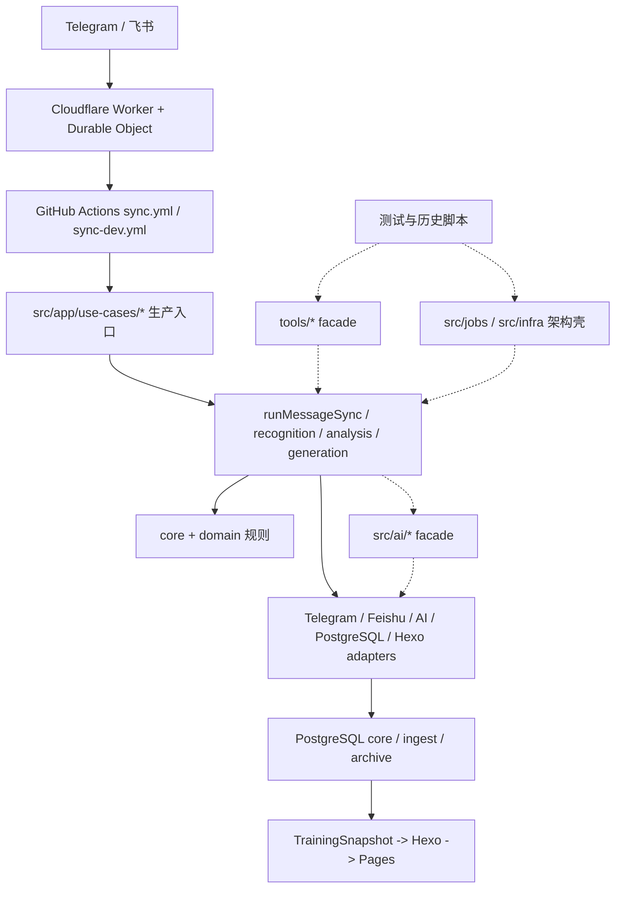
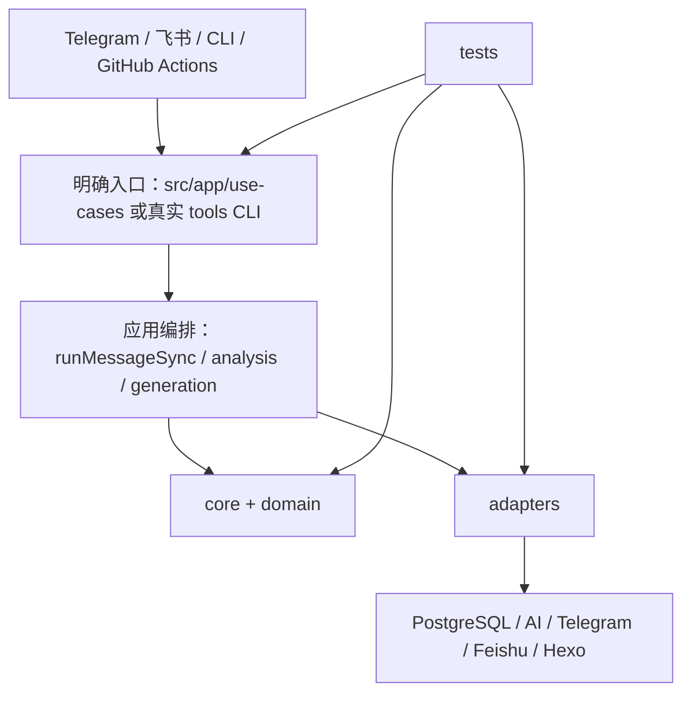

# Training Records 整体重构优化方案

> 文档日期：2026-07-11
>
> 状态：已实施（2026-07-11；代码、SQL、当前文档与自动化验证已完成，外部人工消息验收继续按运行手册执行）
>
> 适用仓库：`training_records`
>
> 核心约束：不影响 Telegram、飞书、AI 识别、PostgreSQL、Markdown 备份和站点展示等现有功能；优先删除代码，不新增架构层和兼容层。

## 实施结果摘要

- 已删除无生产价值的 barrel、facade、`src/jobs` / `src/infra` 架构壳和 `tools` 纯 re-export，生产入口保持原命令不变。
- 飞书直接进入共享 `runMessageSync`；Telegram 保留明确通道 wrapper；同步报告唯一集合统一为 `batches`。
- 已删除运行时 schema preflight、旧 NDJSON pending 文件与 inspect 工具；DDL 只走 migration，pending 只走 PostgreSQL。
- 已修正 SQL 重复索引定义和 legacy 字段注释，并同步当前配置、核心逻辑、排障文档与 `CHANGELOG.md`。
- 行为保护采用 RED -> GREEN：结构边界、同步合同、飞书共享入口、导出、数据库、workflow 与全量回归均作为删除门槛。

## 1. Go / No-Go

- **判断**：Go after decisions（完成 Phase 0 的生产证据确认后，按阶段执行）。
- **可以立即开始的范围**：无运行时引用、无 package/workflow 入口的转发文件、测试专用架构壳和失效注释清理。
- **暂时不能直接开始的范围**：数据库 legacy 字段、`ingest.telegram_*` 表名、运行时 schema preflight、旧 NDJSON inspect、AI 环境变量别名和同步结果字段删除。这些范围需要 dev/main 配置、真实数据库和线上 run 证据。
- **原因**：本地代码与测试已经足以证明大量 facade 是薄转发，但仓库无法证明外部平台变量、线上数据库 migration 状态和人工 CLI 使用情况。先清理确定性冗余，再处理需要生产证据的兼容边界，风险最低。

## 2. 目标结果

重构完成后，系统应同时满足以下结果：

1. `package.json` 和 GitHub Actions 只指向明确的应用入口或真实 CLI。
2. `tools/` 只保留可执行的构建、维护、通知、监控和质量命令，不再保留纯 re-export 模块。
3. `src/app/use-cases/` 是业务编排入口；协议转换留在 adapters；领域规则留在 core/domain；PostgreSQL 细节留在数据库实现中。
4. 同一个能力只有一个权威 import 路径，不再同时存在 `tools/*`、`src/ai/*`、barrel/index 和 facade 四套入口。
5. Telegram 与飞书继续复用同一业务管线，但飞书不再通过语义误导的 Telegram facade 进入通用逻辑。
6. 同步结果只保留一个主集合结构，不再长期同时输出 `batchResults`、`batches`、`tasks` 三套 1:1 数据。
7. schema migration 是唯一 DDL 入口；日常同步、导出和读取不承担 ALTER/CREATE 职责。
8. 所有删除都有引用证明、测试证明、dev 验收和回滚点；任何阶段失败都能单独回退。

## 3. 目标定义

- **类型**：技术 / 质量 / 运维。
- **范围内**：`src/`、`tools/`、`cloudflare/`、`.github/`、`test/`、`docs/`、`sql/training_records/` 的入口、依赖方向、兼容接口、重复模块和删除顺序。
- **范围外**：新增业务功能、重新设计 UI、替换 Hexo、替换 PostgreSQL、引入新框架、拆微服务、重写 AI prompt、修改训练业务规则。
- **延期范围**：数据库表的通用化重命名、删除 `telegram_message_id`/`markdown_path`、Markdown 备份彻底下线。这些都需要独立数据迁移目标，不应混入代码清理。
- **完成证明**：引用扫描无旧路径；全量测试通过；构建通过；SQL 合同通过；dev Telegram/飞书功能通过；main Telegram/飞书功能通过；当前 docs 已同步。
- **证据来源**：代码调用链、package/workflow 入口、测试、SQL、历史重构记录、dev/main 真实 run 和数据库验收 SQL。
- **通过标准**：删除后功能矩阵全部保持，未出现非预期 `pending_replay`/`manual_intervention`，页面与 `core.*` 一致，无旧入口残留。
- **信心说明**：本地结构与测试证据为高；外部 GitHub/Cloudflare/生产数据库状态为中低，必须在实施时补证。
- **判断责任**：本地合同由 CI 判定；dev/main 运行由实际 workflow summary、数据库结果和页面结果共同判定。

## 4. 当前系统架构图



实线是当前生产主链路；虚线是主要冗余区。当前最痛的复杂度不在业务算法，而在“一个实现对应多套入口”，导致新维护者无法快速判断应该 import 哪个路径、哪些文件可删、哪些 facade 仍被生产使用。

## 5. 审查边界与方法

### 5.1 本次采用的架构视角

1. **边界与所有权**：判断 app、adapter、domain、tools 谁拥有真实行为。
2. **依赖方向**：确认生产代码是否绕经兼容 facade，或只在测试中存在架构层。
3. **模块深度与信息隐藏**：删除只转发、不隐藏复杂度的浅模块。
4. **变更放大**：减少同一接口变更需要同时修改 facade、barrel、测试和 workflow 的情况。
5. **迁移与兼容成本**：代码路径可原子迁移；数据库字段和外部变量必须分阶段。
6. **测试与验证面**：把 732 项本地测试、workflow 合同和线上验收组合成删除门禁。

### 5.2 未审计或无法从仓库确认的范围

- GitHub Secrets/Variables 的真实配置值与人工调用习惯。
- Cloudflare 已部署 Worker 的实际版本和远程旧资源。
- dev/main PostgreSQL 是否都已执行全部 migration、是否还存在旧索引或旧字段依赖。
- 仓库外脚本是否直接 import 私有文件。`package.json` 为 `private: true`，但仍需人工确认个人运维脚本。

## 6. 当前状态与关键事实

### 6.1 已经完成、应保留的重构成果

- `package.json` 已让 `build:data`、`sync:telegram`、`sync:feishu` 直接进入 `src/app/use-cases/`。
- `src` 不再反向 import `tools`，生产依赖方向基本闭合。
- Telegram 与飞书共享 `runMessageSync` 语义，图片、分析、帮助、随想新增/编辑/删除/移动保持一致。
- PostgreSQL 已建立 `core`、`ingest`、`archive`、`maintenance` 边界。
- `source_channel + source_chat_id + source_message_id` 已成为跨通道身份主方向。
- 旧 NDJSON pending 已从同步主链路下线，数据库 pending 是恢复事实源。
- DDL migration 已有 `maintenance:migrate` 和 checksum 记录机制。
- 2026-07-11 本地基线：`npm test`，732 tests / 732 pass / 0 fail，约 37.8 秒。

### 6.2 仍然存在的结构债务

#### P1：入口和 facade 仍未真正收口

- `src/app/use-cases/telegram-sync.use-case.mjs:4`、`training-analysis.impl.mjs:13`、`feishu-sync.use-case.mjs:4` 仍通过 `src/ai/provider.mjs` 二次转发到 AI adapter。
- `telegram-sync/image-processing.mjs:3,7` 同时通过 `src/ai/recognition-service.mjs` 和 `src/ai/provider.mjs` 访问真实实现。
- `src/adapters/postgres/training-write.facade.mjs` 只把 `src/db/training/write.mjs` 再导出一次，应用层仍依赖这个反向 facade。
- 多个 `tools/*.mjs` 只有一行 re-export；旧测试继续保护旧路径，使本应临时的兼容层长期存在。

**复杂度症状**：认知负担 + 变更放大。一个 AI 或 DB 入口调整需要判断真实实现、src facade、tools facade、barrel 和测试中的多个路径。

#### P1：`src/jobs` 与 `src/infra/app-factory` 是测试保护的架构壳

- `src/jobs/telegram-sync-job.mjs`、`generate-training-data-job.mjs`、`training-analysis-job.mjs` 都只调用下一层函数，没有调度、重试、事务或协议转换。
- `src/jobs/service-adapter-contract.mjs` 明确写着为“future service or queue migration”准备，目前只有通用对象包装。
- 静态调用图中，`src/jobs/index.mjs` 只有测试引用；`src/infra/app-factory.mjs` 也只有 `test/hexagonal-adapters.test.mjs` 引用。
- 生产 package scripts 已绕过 jobs，直接进入 use case。

**判断**：这些层没有隐藏真实复杂度，属于浅模块和未来扩展预留。保留它们只会让架构图比运行事实更复杂。

#### P1：同步输出同时维护三套结构

- `buildTelegramSyncReport()` 同时输出 `batchResults`、`batches`、`tasks`。
- `batchResults` 与 `batches` 是同一数组的双别名；`tasks` 当前也是从 batches 1:1 派生。
- main/dev workflow 仍使用 `result.batchResults ?? result.batches`。
- `tools/action-sync-summary.mjs` 又使用 `report.batches ?? report.batchResults`。
- 生产代码没有消费 `tasks`，主要由合同测试保护。

**判断**：选择 `batches` 作为唯一主输出。若未来真的出现一个 batch 拆成多个 task 的需求，再基于真实需求引入 task 模型；当前不为假设性扩展保留重复结构。

#### P1：飞书仍通过 Telegram facade 进入通用同步

`runFeishuSync()` 最终调用 `runTelegramSync()`，再由后者调用 `runMessageSync()`。功能正确，但命名泄漏 Telegram 历史，排障时容易误以为飞书依赖 Telegram 专属规则。

**目标**：飞书直接调用 `runMessageSync({ adapter: feishu })`；`runTelegramSync()` 只作为 Telegram 的明确入口保留，不再承担跨通道 facade 职责。

#### P2：过渡 DDL 入口仍留在运行时代码

- `src/db/training/write.mjs:100-102` 在开关开启时运行 `ensureCoreSchema()`。
- `tools/export-training-markdown.mjs:58-93` 也保留 schema preflight 重试逻辑。
- migration 文档已经明确把历史 runtime preflight 迁入 `001_runtime_schema_preflight_backfill.sql`。

**判断**：这是“已建立替代机制但旧机制尚未删除”的典型过渡债务。不能立即删，必须先确认 dev/main migration 均已应用、日常账号无 DDL 依赖，再删除代码和环境变量。

#### P2：legacy NDJSON 存在重复实现

- `src/app/use-cases/telegram-sync/fallback.mjs` 保留 NDJSON 读取、写入、备份和 Markdown 重建函数。
- `src/jobs/pending-store.mjs` 又实现一套文件 pending store。
- 当前正式文档说明同步主链路不再重放 NDJSON，只保留 `tools/telegram-sync-fallback.mjs inspect` 只读核对。

**判断**：短期保留唯一只读 inspect 即可；写入、append、rewrite、通用 file store 不应继续存在。待历史文件确认归档后，inspect 也可以删除。

#### P2：SQL 分片文件包含可确认冗余和过期语义

- `sql/training_records/archive.sql:375-380` 对 `archive.training_sleep(archived_date)` 创建两个完全相同的索引。
- `sql/training_records/core.sql:180` 仍把 `telegram_message_id` 描述为稳定定位 ID，但该表主键已经是 source identity。
- `core.thought.markdown_path` 明确是兼容层字段，不能在本轮直接删除，但注释和使用边界需要更清楚。

**判断**：SQL 文件中的重复索引可直接修正；线上数据库是否 DROP 重复索引必须先查询。legacy 字段只做“证明后删除”，不与代码 facade 清理混在一起。

## 7. 方案比较

| 方案 | 边界清晰度 | 改动成本 | 运行风险 | 后续维护 | 结论 |
| --- | --- | --- | --- | --- | --- |
| A. 保守清理 | 只删零引用文件，保留所有 facade/aliases | 低 | 低 | 仍有多套入口 | 不足以完成目标 |
| B. 分阶段收口 | 删零引用 + 迁移测试/脚本 + 收口输出 + 证明后删运行时兼容 | 中 | 可控 | 最佳 | **推荐** |
| C. 一次性大重构 | 同时改代码入口、表名、字段、环境变量、Markdown 流程 | 高 | 高 | 理论最干净 | 当前不采用 |

推荐 B。它不新增文件和新架构层，主要动作是改 import、删 facade、删重复输出、删过渡代码；数据库高风险兼容项单独设证明门槛。

### 为什么不只做方案 A

零引用文件只是表面垃圾。真正造成长期成本的是仍被生产代码或测试引用的多层 facade，以及 `batchResults/batches/tasks` 多套合同。只删零引用文件后，权威路径仍然不清楚。

### 为什么不做方案 C

代码路径可以在一个 PR 内原子迁移，但数据库字段、GitHub Variables、Cloudflare、Markdown 备份和外部脚本不共享同一事务。把它们一次改完会扩大回滚面，也违背“不影响现有功能”的约束。

## 8. Hai Razor 分类

### 8.1 Razor 结论

- **原则**：一个模块只有在隐藏真实复杂度、保护协议边界、承载运行入口或保护数据兼容时，才值得独立存在。
- **总体判断**：保留业务深模块和真实 CLI；删除纯转发与未来预留；合并重复入口；数据库兼容字段先证明再处理。

### 8.2 证据表

| 证据 | 观察 | 支持的判断 | 信心 |
| --- | --- | --- | --- |
| `package.json:10,26,29` | 三个生产任务已直达 use case | jobs/tools facade 不是必需入口 | 高 |
| `src/app/use-cases/telegram-sync.use-case.mjs:85-95` | `runTelegramSync` 仅包装 `runMessageSync` | Telegram wrapper 可保留，但不能作为飞书入口 | 高 |
| `src/app/use-cases/feishu-sync.use-case.mjs:91` | 飞书调用 Telegram wrapper | Replace 为直接调用通用入口 | 高 |
| `src/jobs/*-job.mjs` | 每个 wrapper 仅转发一次调用 | Delete / Merge | 高 |
| import graph | `src/jobs/index.mjs`、`src/infra/app-factory.mjs` 只有测试引用 | 测试专用架构壳 | 高 |
| 多个一行 `tools/*.mjs` | 仅 re-export 真实实现 | Delete（迁移引用后） | 高 |
| `status.mjs:21-46` | 三套同步输出结构并存 | Merge 到 `batches` | 高 |
| migration + runtime preflight | 新旧 DDL 入口并存 | Replace，需生产证明 | 中 |
| `archive.sql:375-380` | 同列重复索引 | Delete 一个定义 | 高 |
| legacy DB 字段与 fallback 查询 | 仍有实际读写路径 | Prove first，不直接删除 | 高 |

### 8.3 模块分类表

| 概念 / 文件组 | 删除后会破坏什么 | 隐藏责任归属 | Verdict | 处理 |
| --- | --- | --- | --- | --- |
| `src/app/use-cases/*` 生产入口 | package/workflow 无法运行 | 应用层 | Keep | 保留并作为唯一编排入口 |
| Telegram/Feishu/AI/Postgres/Hexo adapters | 协议、网络、存储转换丢失 | adapters | Keep | 保留协议边界 |
| `src/core`、`src/domain/training` 真实规则 | 解析、合并、快照、实体行为丢失 | core/domain | Keep | 不按文件大小拆分 |
| 真实 `tools` CLI | 构建、维护、通知、监控入口丢失 | tools CLI | Keep | 只保留 executable wrapper/实现 |
| `src/ai/provider.mjs`、`recognition-service.mjs` | 现有 import 断裂 | 真实责任已在 adapter/use case | Replace | 改直连后删除 |
| `src/adapters/postgres/training-write.facade.mjs` | 现有 import 断裂 | 真实责任在 `src/db/training/write.mjs` | Replace | 改直连后删除 |
| `src/jobs/*-job.mjs` | 仅测试合同失效 | 责任已在 use case | Delete | 删除 wrapper 与对应测试 |
| `src/jobs/service-adapter-contract.mjs` | 未来设想辅助对象消失 | 当前无真实 owner | Delete | 不为未来队列预留代码 |
| `src/infra/app-factory.mjs` | 仅测试失效 | 运行入口没有使用 | Delete | 若未来需要 composition root，再按真实需求设计 |
| 仅测试使用的 barrel/index | 测试 import 路径变化 | 真实模块自身 | Delete | 测试直接 import 行为所有者 |
| 一行 `tools` re-export | 测试/旧脚本 import 变化 | `src` 实现 | Delete | 原子迁移仓库内引用后删除 |
| `batchResults` alias | 旧 workflow/test 读取失败 | `batches` | Merge | 同 PR 更新所有消费者 |
| `tasks` 1:1 派生结构 | 当前仅合同测试失效 | `batches` 已表达同一事实 | Delete | 无真实多 task 场景前不保留 |
| runtime schema preflight | 未迁移数据库可能缺列 | migration | Replace | migration 证明后删除 |
| NDJSON 写入/rebuild/file store | 旧文件写入能力消失 | DB pending | Delete | 先收敛为只读 inspect，再归档删除 |
| `telegram_message_id`、`markdown_path` | 飞书兼容、导出和历史查询可能失败 | source identity / 派生备份 | Prove first | 本轮不删字段 |
| `ingest.telegram_*` 表名 | 大量 SQL、代码、数据迁移受影响 | ingest 模型 | Defer | 不为命名整洁承担迁移风险 |
| archive 重复索引定义 | 无业务行为损失 | 单一 archived_date 索引 | Delete | 修 SQL；线上先查再 DROP |

### 8.4 必须保留的复杂度

| 复杂度 | 为什么不能误删 |
| --- | --- |
| Telegram/飞书协议 adapter | 协议转换本身虽然浅，但它隔离外部格式，是必要边界。 |
| `runMessageSync` 编排 | 集中处理授权、pending、AI、持久化、回执和状态，属于复杂度汇聚点。 |
| source identity 复合键 | 防止跨通道相同 message id 互相覆盖。 |
| pending 数据库队列 | 防止 AI/DB 故障导致数据丢失。 |
| Markdown import/export | 仍承担显式恢复和派生备份，不可在代码清理中顺手删除。 |
| migration history/checksum | 防止 schema 漂移和运行时 DDL。 |
| workflow/Worker 合同测试 | 本地无法直接验证外部平台，合同测试是重要防线。 |

## 9. 目标架构



目标结构中不再保留 jobs、infra factory、src/ai facade、postgres write facade 和纯 re-export tools。测试直接验证真实入口和行为所有者。

## 10. 文件处理清单

### 10.1 第一批：无生产引用、优先删除候选

删除前仍执行一次 `rg`，并确认没有个人仓库外脚本使用。

#### src 中的无效入口或 barrel

- `src/ai/errors.mjs`
- `src/ai/openai-compatible-provider.mjs`
- `src/ai/schema-validator.mjs`
- `src/core/index.mjs`
- `src/db/training/core-row-writer.mjs`
- `src/db/training/incremental-write.mjs`
- `src/domain/index.mjs`
- `src/domain/telegram/index.mjs`
- `src/shared/index.mjs`
- `src/site/view-model-notes.mjs`
- `src/telegram/sync.mjs`

#### tools 中当前无仓库内消费者的纯转发

- `tools/lib/markdown-render.mjs`
- `tools/lib/snapshot-fallback.mjs`
- `tools/telegram-sync-dates.mjs`
- `tools/telegram-sync-lib.mjs`
- `tools/telegram-sync-markdown.mjs`
- `tools/telegram-sync-status.mjs`
- `tools/telegram-thoughts.mjs`
- `tools/training-analysis-focus.mjs`
- `tools/training-analysis-request.mjs`
- `tools/training-analysis-summary.mjs`
- `tools/training-db-config.mjs`
- `tools/training-db-read.mjs`
- `tools/training-domain.mjs`
- `tools/training-prompt.mjs`

### 10.2 第二批：迁移测试或脚本引用后删除

- `tools/dashboard-view.mjs` -> 测试改 import `src/site/dashboard-view.mjs`。
- `tools/monitor-view.mjs` -> 测试改 import `src/site/monitor-view.mjs`。
- `tools/prompt-generator.mjs` -> 测试改 import `src/core/ai/prompt-generator.mjs`。
- `tools/telegram-recognition-schema.mjs` -> 测试改 import `src/core/ai/telegram-recognition-schema.mjs`。
- `tools/telegram-sync-image-processing.mjs` -> 测试改 import use case 子模块。
- `tools/training-analysis.mjs` -> 测试改 import `src/app/use-cases/training-analysis.impl.mjs`。
- `tools/training-db-archive.mjs` -> 测试改 import PostgreSQL archive adapter。
- `tools/training-parser.mjs` -> 测试改 import domain parser。
- `tools/training-snapshot.mjs` -> `tools/export-training-markdown.mjs` 改直连 domain snapshot。
- `tools/lib/thought-modules.mjs` -> 导出/回填 CLI 改直连 core 模块。
- `tools/telegram-transport.mjs` -> notify CLI 改直连 Telegram adapter。
- `tools/training-db-write.mjs` -> 删除只验证 facade 存在的测试。
- `tools/training-db-core.mjs` -> 维护、导入、导出、backfill CLI 分别直连真实 owner 后删除聚合 facade。

### 10.3 第三批：删除架构壳

- `src/jobs/index.mjs`
- `src/jobs/telegram-sync-job.mjs`
- `src/jobs/generate-training-data-job.mjs`
- `src/jobs/training-analysis-job.mjs`
- `src/jobs/service-adapter-contract.mjs`
- `src/jobs/pending-store.mjs`
- `src/infra/app-factory.mjs`
- `src/infra/config.mjs`（先确认没有计划把它作为唯一配置入口；当前生产未使用）
- 仅用于验证这些壳存在的 `test/src-boundary.test.mjs`、`test/hexagonal-adapters.test.mjs`、`test/hexagonal-v13-progress.test.mjs` 对应断言应删除或改为验证真实边界。

### 10.4 必须保留的 tools 类型

- `tools/training-maintenance.mjs`
- `tools/run-hexo-command.mjs`
- `tools/check-*`
- `tools/merge-dev-to-main.mjs`
- `tools/action-sync-summary.mjs`
- `tools/*-notify.mjs`
- `tools/*-action-monitor.mjs`
- `tools/report-github-action-status.mjs`
- `tools/telegram-webhook.mjs`
- `tools/eval-recognition.mjs`
- 当前仍被 workflow/package 直接执行的其它脚本

保留标准不是“文件在 tools”，而是“它是否是一个真实可执行入口或运维实现”。

## 11. 分阶段执行路线

### Phase 0：冻结行为合同与生产证据

- **目的**：先定义什么不能变，并补齐仓库无法确认的外部状态。
- **入口条件**：本方案已评审。
- **规则**：只读检查，不改生产代码和数据。
- **任务**：
  - [x] 保存 `npm test` 基线：732/732。
    - **Surface**：test。
    - **Proof**：完整测试日志。
  - [x] 导出 package/workflow/Cloudflare 的实际入口清单。
    - **Surface**：package、workflow、Worker。
    - **Proof**：入口表与 `rg` 输出一致。
  - [ ] 查询 dev/main migration history，确认 `001_runtime_schema_preflight_backfill.sql` 已应用且 checksum 一致。
    - **Surface**：database。
    - **Proof**：`maintenance.schema_migration` 查询。
  - [x] 检查 legacy NDJSON 文件数量、大小、最后更新时间，确认无待处理批次。
    - **Surface**：runtime。
    - **Proof**：只读 inspect 输出。
  - [ ] 确认仓库外没有脚本 import 第一、二批候选文件。
    - **Surface**：operations。
    - **Proof**：人工确认记录。
- **退出证明**：形成“可删 / 待迁移 / 不可删”冻结清单。
- **停止条件**：发现线上仍依赖旧入口、migration 未应用或 NDJSON 有未处理数据。

### Phase 1：删除零引用文件和测试专用架构壳

- **目的**：先获得最大确定性收益，不改变任何运行路径。
- **入口条件**：Phase 0 完成；第一批候选无外部消费者。
- **规则**：不改业务行为、不改数据库、不改环境变量、不新增替代层。
- **任务**：
  - [x] 删除 10.1 的零引用文件。
  - [x] 删除 `src/jobs`、`src/infra/app-factory` 等测试专用架构壳。
  - [x] 将“验证 facade 存在”的测试改为“验证真实行为/边界”，或直接删除无业务价值断言。
  - [x] 更新 `docs/02_系统核心逻辑/系统总览.md`，移除未进入生产链路的 Infra/Jobs 描述。
- **Proof**：`rg` 无引用；`npm test`；`git diff --check`。
- **退出证明**：生产入口、package scripts、workflow 命令完全不变。
- **停止条件**：任何删除导致非测试运行入口变化。

### Phase 2：收口 facade 和 import 路径

- **目的**：让每个能力只有一个权威路径。
- **入口条件**：Phase 1 通过。
- **规则**：同一 PR 内迁移全部仓库内消费者并删除旧 facade，不新增 deprecated shim。
- **任务**：
  - [x] `src/ai/provider.mjs` 消费者改 import AI adapter factory。
  - [x] `src/ai/recognition-service.mjs` 消费者改 import image recognition use case。
  - [x] `training-write.facade.mjs` 消费者改 import `src/db/training/write.mjs`。
  - [x] 迁移第二批 tools 消费者，删除纯 re-export。
  - [x] 拆除 `tools/training-db-core.mjs` 聚合 facade，让各 CLI 只依赖所需模块。
- **Proof**：

```bash
rg -n "src/ai/|training-write\.facade|tools/(dashboard-view|monitor-view|training-db-core|training-db-write|training-snapshot)" src tools test
npm test
git diff --check
```

- **退出证明**：扫描仅命中历史文档，不命中当前代码、测试、package 或 workflow。
- **停止条件**：需要新建一个同等功能 facade 才能继续；这说明 owner 尚未决定，应先停下。

### Phase 3：统一消息同步内部接口

- **目的**：移除 Telegram 历史语义泄漏和重复结果结构。
- **入口条件**：Phase 2 通过。
- **规则**：不改 batch 处理结果、不改通知文本、不改数据库写入。
- **任务**：
  - [x] `runFeishuSync()` 直接调用 `runMessageSync()`。
  - [x] `runTelegramSync()` 只保留 Telegram adapter wrapper。
  - [x] 选定 `batches` 为唯一结果集合。
  - [x] main/dev workflow、summary、notify、tests 全部迁移到 `batches`。
  - [x] 删除 `batchResults` alias。
  - [x] 删除当前 1:1 派生且无生产消费者的 `tasks`。
- **Proof**：Telegram/飞书合同测试、workflow YAML 测试、通知测试、全量测试。
- **退出证明**：全仓只存在一个同步结果主集合；两个通道业务 summary 不变。
- **停止条件**：发现外部脚本或线上 summary 仍读取旧字段。

### Phase 4：删除过渡运行时兼容

- **目的**：让 migration 和数据库 pending 成为唯一机制。
- **入口条件**：dev/main migration、权限、NDJSON 状态均有证明。
- **规则**：每类兼容单独 PR；先 dev 后 main；不与 schema 字段删除混合。
- **任务**：
  - [x] 删除 `TRAINING_DB_SCHEMA_PREFLIGHT_ENABLED`、preflight retry 配置和运行时 `ensureCoreSchema` 调用。
  - [x] 删除 `schema-preflight.pg.mjs` 及其已迁移测试。
  - [x] 删除 NDJSON append/write/rebuild/file pending store。
  - [x] 确认历史文件为空后，删除 inspect CLI 和 runtime 路径说明。
  - [ ] 迁移 workflow/GitHub Variables 到 canonical AI 场景变量后，再删除 `TELEGRAM_RECOGNITION_*` 中已被 `AI_RECOGNITION_*` 替代的别名；图片输入、缓存等 Telegram 语义变量单独判断，不机械改名。
- **Proof**：migration 查询、权限审计、dev/main 同步、Markdown export、maintenance inspect。
- **退出证明**：日常业务账号不执行 DDL；pending 只走数据库。
- **停止条件**：任一环境依赖 preflight 自动补列，或 NDJSON 仍有待恢复数据。

### Phase 5：SQL 与文档事实收敛

- **目的**：让 SQL 分片、canonical schema、代码和当前 docs 一致。
- **入口条件**：前四阶段稳定。
- **规则**：SQL 文件修复与线上 DROP 分开；不直接删除 legacy 字段。
- **任务**：
  - [x] 删除 `archive.sql` 的重复 archived_date 索引定义。
  - [ ] 查询 dev/main 是否真的存在两个等价索引；有则独立 migration DROP 一个。
  - [x] 修正 `core.thought.telegram_message_id` 注释：它是 legacy numeric alias，不是跨通道主身份。
  - [x] 明确 `markdown_path` 是派生备份兼容字段。
  - [x] 更新 `docs/01_系统配置`、`docs/02_系统核心逻辑`、`docs/04_问题与排查`。
  - [x] 实施完成后将本目录移入 `重构历史/`，并更新 `后续规划_未实现/README.md`。
- **Proof**：SQL 合同测试、migration dry-run、docs 链接扫描、全量测试。
- **退出证明**：当前文档不再引用已删除入口，历史文档明确只作追溯。
- **停止条件**：SQL 文件与线上 schema 差异无法解释。

## 12. 功能不回归验收矩阵

| 能力 | 本地合同 | dev 验收 | main 验收 |
| --- | --- | --- | --- |
| Telegram 图片识别入库 | sync/recognition/DB tests | 发一批图片，stored/unchanged，核对 core | 同左 |
| 飞书图片识别入库 | feishu/shared sync tests | 发一批图片，核对 source identity | 同左 |
| 随想新增/编辑/删除/移动 | thought repository + sync tests | 四类命令与页面结果 | 同左 |
| `/分析` | analysis + channel tests | 回执文本、model、snapshotSource | 同左 |
| AI fallback | provider/recognition tests | 故障注入或可观察 fallback run | 观察真实 run |
| pending replay | pending DB tests | 制造可恢复失败并重放 | 至少 inspect 无异常堆积 |
| Markdown import/export | maintenance/export tests | dry-run、导出数量、diff | backup workflow |
| 站点构建 | dashboard/thought/monitor tests | Cloudflare Pages preview | GitHub Pages |
| Worker/Queue | worker/workflow tests | dev webhook + queue | main webhook + queue |
| 数据库 migration | SQL tests | dry-run + acceptance SQL | dry-run + acceptance SQL |

线上 run 必须同时检查 Action conclusion 和业务状态。`success` 但出现非预期 `pending_replay`、`manual_intervention`、页面缺数据或数据库未写入，均判定失败。

## 13. 每个 PR 的固定门禁

```bash
git status --short
git diff --check
npm test
rg -n "from ['\"].*tools|src/ai/|training-write\.facade" src
rg -n "batchResults|result\.tasks|report\.tasks" src tools .github test
npm run check:data-consistency
```

涉及页面生成时再执行：

```bash
npm run build
```

涉及 SQL 时再执行：

```bash
npm run maintenance:migrate -- --dry-run
```

注意：`npm run build` 会生成派生文件，提交前必须确认 diff 只包含预期内容，不能把 dev 数据覆盖到 main。

## 14. 回滚方案

1. 每个 Phase 分独立 PR，Phase 内再按一个边界一个提交拆分。
2. facade 删除必须与消费者迁移同提交，回滚时整体回滚，不保留半迁移状态。
3. 不使用“重新加一层兼容 wrapper”作为常规回滚；优先回滚该提交。
4. 运行时 preflight、NDJSON、环境变量别名均先在 dev 移除，至少完成一次真实通道验收后再进 main。
5. SQL DROP 使用独立 migration；生产回滚优先恢复备份或回滚 migration，不靠应用代码猜测 schema。
6. 任一阶段出现数据不一致，立即停止后续删除，保留现场并运行 `maintenance:inspect`。

## 15. 红队 / 蓝队检查

### 攻击 1：删除 facade 后，个人脚本突然失效

- **红队**：仓库内 `rg` 无引用不代表仓库外没有 import。
- **蓝队**：Phase 0 明确要求确认个人运维脚本；仓库为 private，不承诺外部公共 API；删除记录写入变更说明。
- **残余风险**：遗忘的本地脚本仍可能失败，但不会影响生产 workflow。

### 攻击 2：删除 jobs/infra 后，未来无法扩展队列

- **红队**：未来可能需要统一 composition root 和 job contract。
- **蓝队**：当前 queue 已在 Cloudflare DO，Node job wrapper 没有承载该复杂度；未来出现真实需求时按真实队列语义设计，比保留空壳更安全。
- **残余风险**：未来会重新增加模块，但会有明确责任而不是提前占位。

### 攻击 3：收口同步结果字段导致 workflow 误判

- **红队**：main/dev 内联 Node 脚本、summary、notify 或外部读取仍使用 `batchResults`。
- **蓝队**：同 PR 原子迁移所有消费者，workflow 合同测试覆盖 YAML，dev 真实 run 先验收。
- **残余风险**：仓库外读取 result JSON 的脚本需要人工确认。

### 攻击 4：删除 schema preflight 后旧环境缺列

- **红队**：某环境 migration 未执行，下一次同步直接 SQL 失败。
- **蓝队**：必须先查 `maintenance.schema_migration`、验收列和索引、确认业务账号无 DDL 权限，再删除。
- **残余风险**：临时/新建数据库需要通过标准 migration 初始化，不能再依赖运行时自修复。

## 16. Dry-Run 发现

1. 历史 v13 已明确计划最终删除 tools facade、`src/ai` facade 和 runtime NDJSON，但后续重构主要完成了“迁移实现”，没有完成“删除临时壳”。本方案是完成这条未闭环路线，不另起架构。
2. 历史 checklist 曾把 `runTelegramSync`、`batchResults`、`tasks` 作为“保留一轮”的兼容项；当前仍在，说明兼容期没有明确终点。
3. 直接删除全部 tools 会破坏真实 CLI；必须按“可执行入口”和“纯 re-export”分类。
4. 直接重命名 `ingest.telegram_*` 或删除 `telegram_message_id` 会把代码清理升级为数据迁移，不符合本轮低风险目标。
5. `src/jobs`/`src/infra` 删除会减少文件和代码，但不会减少生产能力，因为 package/workflow 当前不经过它们。
6. 先拆大文件不是优先项。`runMessageSync`、图片识别、同步 batch 逻辑虽然较大，但它们确实汇聚复杂度；本轮应先清理浅模块和重复接口，避免增加更多文件。

## 17. 最终验证

全部 Phase 完成后必须满足：

- [x] `npm test` 全量通过：重构前基线 732/732；本次删除 14 个兼容/架构壳合同，rebase 合入远端参数健康监控测试后最终为 751/751。
- [x] `npm run build` 通过，构建产生的本地派生数据已核对并撤销，未纳入重构 diff。
- [x] `npm run check:data-consistency` 正常返回 `skipped: disabled`，当前本地未配置数据库连接。
- [x] package/workflow/Cloudflare 入口清单与当前文档一致。
- [x] `tools/` 不含本轮确认的纯 re-export。
- [x] `src` 不含仅为转发而存在的 `src/ai`、jobs、infra factory、postgres write facade。
- [x] 同步结果只有一个主集合结构。
- [x] 日常运行路径不执行 DDL。
- [x] pending 主路径只有 PostgreSQL。
- [ ] dev Telegram、dev 飞书、main Telegram、main 飞书四类 run 成功且业务状态正常。
- [ ] 随想、分析、Markdown 备份、页面构建均完成真实验收。
- [x] 当前 docs 已更新，本规划已归档到重构历史。

## 18. 第一执行步骤

先执行 Phase 0，不写代码：生成“入口/引用冻结清单”，重点确认三件事：

1. 仓库外是否仍有人直接调用 `tools/telegram-sync.mjs`、`tools/feishu-sync.mjs` 或 import 第二批 facade。
2. dev/main 是否都已应用 migration 001。
3. `runtime/telegram-sync-pending.ndjson` 是否长期为空且无需恢复。

确认后，第一个实施 PR 只删除“无生产引用文件 + 测试专用 jobs/infra 壳”，不触碰同步输出、数据库和环境变量。

## 19. Evidence Reviewed

### 当前事实

- `README.md`、`package.json`。
- `docs/README.md`、`docs/01_系统配置/*`、`docs/02_系统核心逻辑/*`、`docs/05_日常规则/*`。
- Telegram/飞书同步、图片识别、分析、数据库写入、快照、Hexo 生成、Worker/Queue 入口。
- `sql/training_records/core.sql`、`ingest.sql`、`archive.sql`、migration 与 rollback。
- package scripts、GitHub Actions、测试引用和模块 import graph。

### 历史记录

- `v13-数据统一与六边形架构` 的 Phase B、Phase C、审查意见和 checklist。
- `v18` 飞书 adapter 复用方案。
- `v19/v20` dev/main Worker 与 Action 合并方案。
- `v21-v23` 文档入口与历史资料收敛。
- `核心代码优化01` 路线图、实施 checklist、数据库与消息链路记录。
- `20260701_优化高中优先级落地` 的冗余代码与旧接口清理、实施顺序与验收。
- `系统健康审计` 最终可信风险清单与最终验收报告。
- 数据库权限收敛与运行时 DDL 下线记录。

### 实际执行的关键检查

- `rg --files`、目录/行数盘点。
- package/workflow 入口搜索。
- `src`、`tools`、`cloudflare`、`test` 的静态 import graph。
- legacy/facade/NDJSON/schema preflight/source identity 搜索。
- `npm test`：重构前 732/732；rebase 合入最新 `origin/dev` 后最终 751/751 通过。
- 测试后 `git status --short`：工作区干净。
