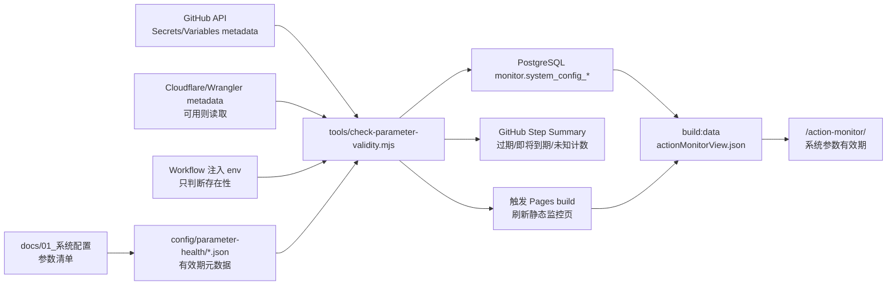

# 参数有效时间监控方案

## 归档状态

- **状态**：已落地并归档。
- **归档日期**：2026-07-07。
- **当前事实入口**：
  - [dev 环境配置](../../../01_系统配置/dev.md)
  - [main 环境配置](../../../01_系统配置/main.md)
  - [Action 日志与失败补偿](../../../02_系统核心逻辑/Action日志与失败补偿.md)
  - [数据库模型](../../../02_系统核心逻辑/数据库模型.md)
  - [Action 日志排查](../../../04_问题与排查/Action日志.md)
- **落地说明**：原“有效期”方案已修正为参数健康监控：当前入口是 `config/parameter-health/<env>.json` registry、`tools/check-parameter-health.mjs` 审计命令、`.github/workflows/parameter-health-audit.yml` workflow、`monitor.system_config_parameters` / `monitor.system_config_parameter_checks` 表，以及 `/action-monitor/` 的“系统参数健康”展示模块。本文件保留方案背景和实施路线，不再作为当前操作入口。

## Go / No-Go

- **Judgment**: Go
- **Reason**: 当前 action 监控已经具备 PostgreSQL `monitor.*` 事实库、`build:data` 读取入口和 `/action-monitor/` 页面展示能力；新增参数有效期监控可以复用这条链路，不需要改动业务同步主流程，也不需要读取 Secret 明文。

## Target Outcome

在 `/action-monitor/` 模块中新增“系统参数有效期”监控，持续展示 dev/main 环境关键配置参数是否已过期、即将过期、缺失或缺少有效期元数据，方便后续轮换 GitHub Secrets、GitHub Variables、Cloudflare Worker Secrets、AI/数据库/Telegram/飞书/COS 等配置。

完成后应满足：

- 能按 dev/main 环境独立查看参数有效期状态。
- 能区分 `ok`、`warning`、`expired`、`missing`、`unknown`。
- 每次参数有效期 audit 后，用户能从 GitHub Actions summary 或刷新后的 `/action-monitor/` 页面看到最新结论，不能只把结果写入数据库后停住。
- 不保存、不展示、不输出 Secret 明文、DB URL、token、API key、聊天 ID、COS key 或其它敏感值。
- action 监控失败或参数过期告警不得反向改变业务 workflow 结论。
- 当前系统文档只在功能落地后写入事实；本归档目录只保留历史方案，不作为当前事实入口。

## Goal Definition

- **Type**: operational / technical
- **Boundary**: 只设计参数有效时间监控方案、数据模型、采集策略、页面接入和验收路径；不在本方案阶段直接改生产代码。
- **Non-goals**:
  - 不尝试读取 Secret 明文。
  - 不自动轮换第三方 token / key。
  - 不把参数过期作为业务 workflow 失败条件。
  - 不把 GitHub Actions 日志正文、业务 payload 或完整 provider 响应写入监控库。
- **Deferred work**:
  - AI 自动生成轮换建议。
  - 通过 GitHub / Cloudflare API 自动更新 Secret。
  - 企业级多 owner 审批流。
- **Verification rule**: 后续实现时，测试和页面数据必须证明参数有效期可被计算、落库、读取和展示。
- **Evidence source**: 单元测试、repository 测试、view model 测试、workflow 契约测试、`source/_data/actionMonitorView.json`、`/action-monitor/` 页面。
- **Pass criteria**: 构造已过期、30 天内到期、未配置、未知有效期四类样例后，页面和 JSON 均展示正确状态且无敏感值。
- **Confidence note**: 方案复用现有 action 监控的 DB / view model / 页面边界，新增数据只进入 `monitor` schema，符合现有日志安全规则。
- **Judgment owner**: 自动化测试 + 人工验收 `/action-monitor/` 页面。

## Current State

### 已有 action 监控链路

| 能力 | 当前依据 |
| --- | --- |
| workflow 最终上报 | `.github/workflows/*.yml` 均有 `Report Action Status`，使用 `if: always()` 和 `continue-on-error: true`。 |
| 本地 reporter | `tools/report-github-action-status.mjs` 优先使用分支 DB URL 写入 `monitor.*`，无 DB URL 时才走 HTTP 兜底。 |
| 归一化用例 | `src/app/use-cases/github-action-monitor.use-case.mjs` 拉取 GitHub run/jobs/steps 并生成 failure summary。 |
| PostgreSQL adapter | `src/adapters/postgres/github-action-monitor-repository.pg.mjs` 负责 `monitor.github_action_runs/jobs/steps/failures` 写入和读取。 |
| 站点数据 | `src/app/use-cases/generate-training-data.impl.mjs` 的 `loadActionMonitorViewFromPostgres()` 生成 `actionMonitorView.json`。 |
| 页面展示 | `src/site/action-monitor-view.mjs`、`themes/cactus/layout/action-monitor.ejs`、`themes/cactus/source/js/action-monitor.js`。 |
| 当前文档边界 | `docs/02_系统核心逻辑/Action日志与失败补偿.md` 明确 action 监控不保存业务 payload、日志正文或 Secret。 |

### 现有不足

- `monitor` schema 只记录 GitHub Actions run/job/step/failure，不记录系统配置参数。
- `docs/01_系统配置/dev.md` 和 `docs/01_系统配置/main.md` 列出了参数名称、位置和用途，但没有 `valid_from`、`expires_at`、`review_after_at` 或轮换周期。
- GitHub / Cloudflare / 第三方服务通常不能反读 Secret 明文；即使能读到 `updated_at`，也不能直接知道 provider 侧真实失效时间。
- 参数目前分散在 GitHub Secrets、GitHub Variables、Cloudflare Worker Secrets、`wrangler*.toml`、workflow env 映射和运行时代码中，缺少统一的“有效期事实源”。

## Recommended Architecture

推荐采用“参数有效期注册表 + 监控库检查结果 + action monitor 页面展示”的三层方案。



核心原则：

- 有效期事实由注册表维护，不从 Secret 值推断。
- 能用 API 拿到的只读 metadata 只作为补充证据，例如 GitHub Secret/Variable `updated_at`。
- 运行时只检查“是否注入 / 是否存在 / 元数据是否过期”，不打印具体值。
- 所有过期结果只进入 `monitor` schema 和页面摘要，不阻断原 workflow。
- 参数 audit workflow 必须提供即时可见出口：至少写入 GitHub Step Summary；如果希望 `/action-monitor/` 当天可见，还必须触发或复用一次 Pages build，让静态 `actionMonitorView.json` 重新生成。

## Parameter Registry

新增建议路径：

```text
config/parameter-health/
  dev.json
  main.json
  schema.json
```

注册表只保存参数元数据：

```json
{
  "environment": "dev",
  "parameters": [
    {
      "key": "dev.github.secret.DEV_TRAINING_DB_URL",
      "name": "DEV_TRAINING_DB_URL",
      "scope": "github_actions_secret",
      "category": "database",
      "required": true,
      "sensitive": true,
      "validityMode": "rotation_cycle",
      "validFrom": "2026-07-01",
      "expiresAt": "2026-10-01",
      "warningDays": 30,
      "criticalDays": 7,
      "owner": "ops",
      "sourceDoc": "docs/01_系统配置/dev.md",
      "sourceCode": [".github/workflows/sync-dev.yml", "src/db/training/config.mjs"]
    }
  ]
}
```

字段含义：

| 字段 | 必填 | 说明 |
| --- | --- | --- |
| `key` | 是 | 稳定主键，建议格式为 `<env>.<scope>.<name>`。 |
| `name` | 是 | 参数名，不含值。 |
| `scope` | 是 | `github_actions_secret`、`github_actions_variable`、`cloudflare_worker_secret`、`wrangler_var`、`runtime_env`、`config_file`。 |
| `category` | 是 | `database`、`ai`、`telegram`、`feishu`、`cos`、`cloudflare`、`github`、`monitor`、`site`。 |
| `required` | 是 | 是否必配。 |
| `sensitive` | 是 | 是否敏感；敏感参数禁止展示值和 hash。 |
| `validityMode` | 是 | `fixed_expires_at`、`rotation_cycle`、`review_after`、`non_expiring_manual_review`、`provider_metadata`。 |
| `validFrom` | 否 | 开始使用日期。 |
| `expiresAt` | 否 | 明确过期时间。 |
| `reviewAfterAt` | 否 | 没有真实过期时间时的复核时间。 |
| `rotationCycleDays` | 否 | 按轮换周期从 `validFrom` 或 metadata `updated_at` 计算过期时间。 |
| `warningDays` | 否 | 默认 30 天。 |
| `criticalDays` | 否 | 默认 7 天。 |
| `owner` | 否 | 维护责任方。 |
| `sourceDoc` | 是 | 配置文档来源。 |
| `sourceCode` | 否 | 读取或注入该参数的代码 / workflow。 |

## Parameter Coverage

第一阶段应覆盖会导致系统不可用或安全风险的参数。

### dev GitHub Settings

| 分类 | 参数 |
| --- | --- |
| 数据库 | `DEV_TRAINING_DB_URL`、`DEV_TRAINING_DB_READONLY_URL`、`DEV_TRAINING_DB_MIGRATION_URL`、`TRAINING_DB_TIMEOUT_MS`、`DEV_TRAINING_DB_APP_NAME` |
| AI | `AI_API_KEY`、`AI_BASE_URL`、`AI_MODEL`、`AI_TIMEOUT_MS`、`AI_CONCURRENCY`、`TELEGRAM_RECOGNITION_MODEL`、`TELEGRAM_RECOGNITION_FALLBACK_API_KEY`、`TELEGRAM_RECOGNITION_FALLBACK_BASE_URL`、`TELEGRAM_RECOGNITION_FALLBACK_MODEL` |
| Telegram | `DEV_TELEGRAM_BOT_TOKEN`、`DEV_TELEGRAM_SECRET_TOKEN`、`TELEGRAM_ALLOWED_CHAT_IDS`、`DEV_TELEGRAM_WEBHOOK_URL` |
| 飞书 | `DEV_FEISHU_APP_ID`、`DEV_FEISHU_APP_SECRET`、`DEV_FEISHU_ALLOWED_CHAT_IDS` |
| COS | `DEV_COS_SECRET_ID`、`DEV_COS_SECRET_KEY`、`DEV_COS_ENABLED`、`DEV_COS_BUCKET`、`DEV_COS_REGION`、`DEV_COS_DOMAIN`、`DEV_COS_PATH_PREFIX` |
| Cloudflare / Pages | `CLOUDFLARE_ACCOUNT_ID`、`CLOUDFLARE_API_TOKEN`、`CLOUDFLARE_PAGES_API_TOKEN`、`CLOUDFLARE_PAGES_DEV_PROJECT_NAME`、`CLOUDFLARE_PAGES_DEV_BASE_URL` |
| Action monitor | `GITHUB_ACTION_MONITOR_REPORT_URL_DEV`、`GITHUB_ACTION_MONITOR_REPORT_URL`、`GITHUB_ACTION_MONITOR_REPORT_URL_MAIN` |

### main GitHub Settings

| 分类 | 参数 |
| --- | --- |
| 数据库 | `TRAINING_DB_URL`、`TRAINING_DB_READONLY_URL`、`TRAINING_DB_MIGRATION_URL`、`TRAINING_DB_ENABLED`、`TRAINING_DB_TIMEOUT_MS`、`TRAINING_DB_APP_NAME` |
| AI | `AI_API_KEY`、`AI_BASE_URL`、`AI_MODEL`、`AI_TIMEOUT_MS`、`AI_CONCURRENCY`、`TELEGRAM_RECOGNITION_MODEL`、`TELEGRAM_RECOGNITION_FALLBACK_API_KEY`、`TELEGRAM_RECOGNITION_FALLBACK_BASE_URL`、`TELEGRAM_RECOGNITION_FALLBACK_MODEL` |
| Telegram | `TELEGRAM_BOT_TOKEN`、`TELEGRAM_SECRET_TOKEN`、`TELEGRAM_ALLOWED_CHAT_IDS`、`TELEGRAM_WEBHOOK_URL` |
| 飞书 | `FEISHU_APP_ID`、`FEISHU_APP_SECRET`、`FEISHU_ALLOWED_CHAT_IDS` |
| COS | `COS_SECRET_ID`、`COS_SECRET_KEY`、`COS_ENABLED`、`COS_BUCKET`、`COS_REGION`、`COS_DOMAIN`、`COS_PATH_PREFIX` |
| Cloudflare / Pages | `CLOUDFLARE_ACCOUNT_ID`、`CLOUDFLARE_API_TOKEN`、`CLOUDFLARE_PAGES_API_TOKEN`、`CLOUDFLARE_ZONE_ID`、`CLOUDFLARE_PAGES_BASE_URL` |
| Action monitor | `GITHUB_ACTION_MONITOR_REPORT_URL_MAIN`、`GITHUB_ACTION_MONITOR_REPORT_URL`、`GITHUB_ACTION_MONITOR_REPORT_URL_DEV` |

### Cloudflare Worker Secrets

dev 和 main 都应登记：

- `GITHUB_TOKEN`
- `TELEGRAM_SECRET_TOKEN`
- `TELEGRAM_BOT_TOKEN`
- `FEISHU_ENCRYPT_KEY`
- `FEISHU_VERIFICATION_TOKEN`
- `FEISHU_APP_ID`
- `FEISHU_APP_SECRET`

其中 `GITHUB_TOKEN` 通常是 Personal Access Token 或等价凭证，应优先配置明确 `expiresAt` 或 `reviewAfterAt`。

## Validity Rules

| 状态 | 判定规则 | 页面语义 |
| --- | --- | --- |
| `ok` | 未到 warning 窗口，且必填参数存在或可证明存在。 | 正常。 |
| `warning` | 距 `expiresAt` / `reviewAfterAt` 小于等于 `warningDays`，但尚未过期。 | 需要计划轮换或复核。 |
| `expired` | 当前时间大于 `expiresAt` / `reviewAfterAt`。 | 需要立即处理。 |
| `missing` | 注册表标记 required，但 GitHub / Cloudflare metadata 或运行时注入检查显示不存在。 | 配置缺失。 |
| `unknown` | 注册表缺少有效期字段，或 provider metadata 无法读取。 | 需要补齐有效期元数据。 |

默认阈值：

- `warningDays = 30`
- `criticalDays = 7`
- `rotationCycleDays` 未设置时不自动推断过期时间，状态为 `unknown`。

## Database Design

新增 `monitor` schema 表：

```sql
CREATE TABLE monitor.system_config_parameters (
  parameter_key text PRIMARY KEY,
  monitor_environment text NOT NULL,
  parameter_name text NOT NULL,
  scope text NOT NULL,
  category text NOT NULL,
  required boolean NOT NULL DEFAULT false,
  sensitive boolean NOT NULL DEFAULT true,
  validity_mode text NOT NULL,
  valid_from timestamptz,
  expires_at timestamptz,
  review_after_at timestamptz,
  rotation_cycle_days integer,
  warning_days integer NOT NULL DEFAULT 30,
  critical_days integer NOT NULL DEFAULT 7,
  owner text,
  source_doc text,
  source_code_json jsonb NOT NULL DEFAULT '[]'::jsonb,
  metadata_json jsonb NOT NULL DEFAULT '{}'::jsonb,
  created_at timestamptz NOT NULL DEFAULT now(),
  updated_at timestamptz NOT NULL DEFAULT now()
);

CREATE TABLE monitor.system_config_parameter_checks (
  check_id bigserial PRIMARY KEY,
  parameter_key text NOT NULL REFERENCES monitor.system_config_parameters(parameter_key) ON DELETE CASCADE,
  monitor_environment text NOT NULL,
  run_id bigint REFERENCES monitor.github_action_runs(run_id) ON DELETE SET NULL,
  checked_at timestamptz NOT NULL DEFAULT now(),
  status text NOT NULL,
  days_until_due integer,
  evidence_source text NOT NULL,
  message text,
  details_json jsonb NOT NULL DEFAULT '{}'::jsonb,
  created_at timestamptz NOT NULL DEFAULT now()
);

COMMENT ON TABLE monitor.system_config_parameters IS '系统配置参数有效期主表，记录每个需监控参数的元数据、有效期规则和维护来源，不保存参数值';
COMMENT ON COLUMN monitor.system_config_parameters.parameter_key IS '参数稳定主键，建议格式为 <env>.<scope>.<name>，例如 dev.github.secret.DEV_TRAINING_DB_URL';
COMMENT ON COLUMN monitor.system_config_parameters.monitor_environment IS '监控环境，例如 dev 或 main，用于分库/分支隔离展示';
COMMENT ON COLUMN monitor.system_config_parameters.parameter_name IS '参数名称，只保存配置项名称，不保存配置值';
COMMENT ON COLUMN monitor.system_config_parameters.scope IS '参数所在范围，例如 github_actions_secret、github_actions_variable、cloudflare_worker_secret、wrangler_var、runtime_env、config_file';
COMMENT ON COLUMN monitor.system_config_parameters.category IS '参数业务分类，例如 database、ai、telegram、feishu、cos、cloudflare、github、monitor、site';
COMMENT ON COLUMN monitor.system_config_parameters.required IS '是否为当前环境必填参数，必填参数缺失时检查状态应为 missing';
COMMENT ON COLUMN monitor.system_config_parameters.sensitive IS '是否为敏感参数；敏感参数禁止展示值、部分值或 value hash';
COMMENT ON COLUMN monitor.system_config_parameters.validity_mode IS '有效期计算模式，例如 fixed_expires_at、rotation_cycle、review_after、non_expiring_manual_review、provider_metadata';
COMMENT ON COLUMN monitor.system_config_parameters.valid_from IS '参数开始使用时间，可作为轮换周期计算起点';
COMMENT ON COLUMN monitor.system_config_parameters.expires_at IS '明确过期时间，当前时间超过该值时检查状态应为 expired';
COMMENT ON COLUMN monitor.system_config_parameters.review_after_at IS '复核时间；适用于没有真实过期时间但需要定期确认仍有效的配置';
COMMENT ON COLUMN monitor.system_config_parameters.rotation_cycle_days IS '轮换周期天数；配合 valid_from 或 provider metadata updated_at 计算下一次到期时间';
COMMENT ON COLUMN monitor.system_config_parameters.warning_days IS '到期前预警天数，默认 30 天';
COMMENT ON COLUMN monitor.system_config_parameters.critical_days IS '到期前高危提醒天数，默认 7 天';
COMMENT ON COLUMN monitor.system_config_parameters.owner IS '参数维护责任方或责任人标识';
COMMENT ON COLUMN monitor.system_config_parameters.source_doc IS '参数来源文档路径，例如 docs/01_系统配置/dev.md';
COMMENT ON COLUMN monitor.system_config_parameters.source_code_json IS '读取或注入该参数的代码、workflow 或配置文件路径 JSON 数组';
COMMENT ON COLUMN monitor.system_config_parameters.metadata_json IS '非敏感补充元数据，例如 provider updated_at、visibility、metadata_read_status 等，不保存参数值';
COMMENT ON COLUMN monitor.system_config_parameters.created_at IS '监控参数记录创建时间';
COMMENT ON COLUMN monitor.system_config_parameters.updated_at IS '监控参数记录更新时间';

COMMENT ON TABLE monitor.system_config_parameter_checks IS '系统配置参数有效期检查结果表，记录每次 audit 对参数的状态判定';
COMMENT ON COLUMN monitor.system_config_parameter_checks.check_id IS '检查结果自增主键';
COMMENT ON COLUMN monitor.system_config_parameter_checks.parameter_key IS '被检查参数主键，关联 monitor.system_config_parameters.parameter_key';
COMMENT ON COLUMN monitor.system_config_parameter_checks.monitor_environment IS '本次检查所属监控环境，例如 dev 或 main';
COMMENT ON COLUMN monitor.system_config_parameter_checks.run_id IS '触发本次检查的 GitHub Action run_id，可为空；为空表示本地维护命令或非 Action 来源';
COMMENT ON COLUMN monitor.system_config_parameter_checks.checked_at IS '本次参数有效期检查时间';
COMMENT ON COLUMN monitor.system_config_parameter_checks.status IS '检查状态：ok、warning、expired、missing、unknown';
COMMENT ON COLUMN monitor.system_config_parameter_checks.days_until_due IS '距离过期或复核日期的剩余天数；已过期时可为负数，无法计算时为空';
COMMENT ON COLUMN monitor.system_config_parameter_checks.evidence_source IS '状态证据来源，例如 registry、github_metadata、cloudflare_metadata、runtime_env、registry+github_metadata、metadata_unavailable';
COMMENT ON COLUMN monitor.system_config_parameter_checks.message IS '给页面和 summary 使用的简短处理提示，不包含敏感值';
COMMENT ON COLUMN monitor.system_config_parameter_checks.details_json IS '非敏感检查细节 JSON，例如缺失原因、metadata 读取状态、采用的 dueAt 字段';
COMMENT ON COLUMN monitor.system_config_parameter_checks.created_at IS '检查结果记录创建时间';

CREATE INDEX idx_system_config_parameter_checks_env_time
  ON monitor.system_config_parameter_checks (monitor_environment, checked_at DESC);

CREATE INDEX idx_system_config_parameter_checks_status_time
  ON monitor.system_config_parameter_checks (monitor_environment, status, checked_at DESC);
```

设计理由：

- `system_config_parameters` 保存“应该监控什么”和有效期规则。
- `system_config_parameter_checks` 保存每次检查结果，便于追踪哪次 Action / scheduled audit 发现过期。
- 不保存参数值，不保存 value hash，避免把敏感凭证变成长期可关联指纹。
- `run_id` 可关联 action 监控历史，但允许为空，兼容本地维护命令。

## Checker Design

新增建议脚本：

```text
tools/check-parameter-validity.mjs
src/app/use-cases/parameter-validity-monitor.use-case.mjs
src/adapters/postgres/parameter-validity-monitor-repository.pg.mjs
src/site/action-monitor-parameter-validity.mjs
```

命令形式：

```bash
node tools/check-parameter-validity.mjs --environment dev --registry config/parameter-health/dev.json --write-monitor
node tools/check-parameter-validity.mjs --environment main --registry config/parameter-health/main.json --write-monitor
```

检查步骤：

1. 读取 registry 并校验 schema。
2. 用 GitHub API 查询 repository secrets / variables metadata，只使用 `name`、`updated_at`、`visibility` 等非敏感字段。
3. 可选读取 Cloudflare Worker secret 名称列表；如果当前权限或 API 不支持，则把 evidence 标记为 `unsupported`，不失败。
4. 对 workflow 已注入 env 只判断 `Boolean(process.env.NAME)`，不得输出值。
5. 根据 `expiresAt`、`reviewAfterAt`、`rotationCycleDays`、`warningDays` 计算状态。
6. upsert 参数元数据，并插入本次 check rows。
7. 输出 compact summary：总数、过期数、即将到期数、缺失数、未知数；不输出敏感值。

## Action Monitor Integration

### 采集入口

推荐新增一个独立 workflow，而不是塞进所有业务 workflow：

```yaml
name: Parameter Validity Audit

on:
  workflow_dispatch:
  schedule:
    - cron: '20 1 * * *'
```

理由：

- 参数有效期是环境健康检查，不是每次业务同步的副作用。
- 独立 workflow 可以 daily 检查，也可以手动触发。
- 该 workflow 自身也保留现有 `Report Action Status` step，因此能出现在 `/action-monitor/` 的 Action 日志里。
- 如果参数过期，只让检查结果为 `expired`，不让 workflow 失败；除非 registry JSON 格式错误或 DB 写入异常需要暴露维护问题。

### 可见性出口

必须同时设计“写库”和“让用户看到”两条路径：

| 出口 | 作用 | 最小要求 |
| --- | --- | --- |
| GitHub Step Summary | audit run 完成后立即可见。 | 输出总数、已过期、即将到期、缺失、未知有效期，以及 Top N 风险参数名；不得输出参数值。 |
| PostgreSQL `monitor.system_config_*` | 长期事实源。 | 保存参数元数据和每次检查结果，供趋势和页面读取。 |
| `/action-monitor/` 页面 | 面向用户的统一监控入口。 | audit workflow 写库后触发一次 Pages build，或把参数 audit 放入已有站点构建链路，保证 `actionMonitorView.json` 刷新。 |
| 可选通知 | 过期参数需要主动提醒。 | 只在 `expired` / `missing` 大于 0 时发送 Telegram / 飞书摘要，仍不让业务 workflow 失败。 |

如果只实现写库，不触发站点构建，那么 `/action-monitor/` 作为静态页面会继续显示上一次 `build:data` 的结果，用户无法稳定看到最新参数有效期状态。

### 页面读取

扩展 `loadActionMonitorViewFromPostgres()`：

- 继续读取 `monitor.github_action_runs`。
- 新增读取 `monitor.system_config_parameters` 和每个参数最新一条 `monitor.system_config_parameter_checks`。
- 合并进 `actionMonitorView.parameterValidity`。

建议 JSON 结构：

```json
{
  "parameterValidity": {
    "summaryCards": [
      { "label": "监控参数", "value": "42 个", "hint": "dev 环境" },
      { "label": "已过期", "value": "1 个", "hint": "需要立即处理" },
      { "label": "即将到期", "value": "3 个", "hint": "30 天内" },
      { "label": "未知有效期", "value": "5 个", "hint": "需要补齐元数据" }
    ],
    "items": [
      {
        "key": "dev.github.secret.DEV_TRAINING_DB_URL",
        "name": "DEV_TRAINING_DB_URL",
        "scope": "github_actions_secret",
        "category": "database",
        "status": "warning",
        "statusLabel": "即将到期",
        "dueAt": "2026-10-01T00:00:00.000Z",
        "daysUntilDue": 21,
        "lastCheckedAt": "2026-09-10T01:20:00.000Z",
        "evidenceSource": "registry+github_metadata",
        "message": "距离轮换日期 21 天"
      }
    ]
  }
}
```

### 页面展示

在 `/action-monitor/` 页面中 Action 历史上方或下方新增“系统参数有效期”区块：

- 摘要卡：监控参数数、已过期、即将到期、未知有效期。
- 表格 / 列表字段：参数名、分类、位置、状态、到期/复核时间、剩余天数、最近检查、处理提示。
- 默认排序：`expired`、`missing`、`warning`、`unknown`、`ok`，同状态按到期时间升序。
- 敏感参数只展示参数名，不展示值、不展示部分值、不展示 hash。

## Implementation Phases

### Phase 1: Registry and status calculation

- **Purpose**: 先把“哪些参数要监控”和“如何判断过期”稳定下来。
- **Entry condition**: 当前系统配置文档已确认 dev/main 参数清单。
- **Phase rules**:
  - 只新增 registry、schema 和纯函数测试。
  - 不接触 Secret 明文。
- **Todos**:
  - [ ] 新增 `config/parameter-health/schema.json`。
    - **Surface**: config
    - **Proof**: schema 校验测试覆盖必填字段和非法 `validityMode`。
  - [ ] 新增 `config/parameter-health/dev.json` 和 `main.json`。
    - **Surface**: config
    - **Proof**: 参数名覆盖 `docs/01_系统配置/dev.md`、`main.md` 的第一批高风险参数。
  - [ ] 实现 `evaluateParameterValidity()`。
    - **Surface**: app use-case
    - **Proof**: 测试覆盖 `ok`、`warning`、`expired`、`missing`、`unknown`。
- **Exit proof**: `node --test test/parameter-validity.test.mjs` 通过。
- **Stop condition**: 无法确定某类参数是否应该有真实过期时间时，先标记为 `review_after`，不要发明 provider 过期规则。

### Phase 2: PostgreSQL monitor storage

- **Purpose**: 把参数和检查结果纳入 `monitor` schema。
- **Entry condition**: Phase 1 状态计算稳定。
- **Phase rules**:
  - DDL 必须走显式 migration，不走运行时 preflight。
  - 写库失败不得泄漏参数值。
- **Todos**:
  - [ ] 新增 migration SQL。
    - **Surface**: `sql/training_records/migrations/`
    - **Proof**: dry-run 能列出 migration，SQL 包含表注释和索引。
  - [ ] 新增 repository adapter。
    - **Surface**: `src/adapters/postgres/`
    - **Proof**: repository 测试覆盖 upsert 参数、插入 check、读取 latest checks。
- **Exit proof**: repository 测试通过，SQL review 确认无敏感字段。
- **Stop condition**: 日常业务 DB 用户缺少 `monitor` 写权限时，先修正权限方案，不在业务代码里执行 DDL。

### Phase 3: audit workflow and CLI

- **Purpose**: 让检查能定时运行和手动运行。
- **Entry condition**: monitor 表可写。
- **Phase rules**:
  - workflow 使用 `continue-on-error` 的 Action monitor reporter，但参数检查本身应在 registry 格式错误时失败。
  - compact summary 只能输出计数、状态和参数名。
- **Todos**:
  - [ ] 新增 `tools/check-parameter-validity.mjs`。
    - **Surface**: CLI
    - **Proof**: 本地 dry-run 不需要 DB；write-monitor 模式能写测试 repository；GitHub Step Summary 只输出计数和参数名。
  - [ ] 新增 `.github/workflows/parameter-health-audit.yml`。
    - **Surface**: workflow
    - **Proof**: workflow 契约测试确认有 `Report Action Status`、`GITHUB_TOKEN`、分支 DB URL 映射，并在写库后触发或复用 Pages build。
- **Exit proof**: 手动运行 workflow 后 `monitor.system_config_parameter_checks` 出现最新记录，GitHub Step Summary 出现风险摘要，并且新生成的 `actionMonitorView.json` 反映本次检查。
- **Stop condition**: GitHub / Cloudflare metadata 权限不足时，不阻断 registry 日期检查；只把 evidence 标记为 metadata unavailable。

### Phase 4: action monitor page integration

- **Purpose**: 在 `/action-monitor/` 展示参数有效期。
- **Entry condition**: monitor 表已有检查结果。
- **Phase rules**:
  - 空数据时显示“暂无参数有效期数据”，不能隐藏整个 action 监控页面。
  - UI 不展示敏感值。
- **Todos**:
  - [ ] 扩展 `loadActionMonitorViewFromPostgres()` 和 view model。
    - **Surface**: `src/app/use-cases/generate-training-data.impl.mjs`、`src/site/action-monitor-view.mjs`
    - **Proof**: view model 测试覆盖 summary 和排序。
  - [ ] 扩展 `themes/cactus/layout/action-monitor.ejs`、CSS 和分页脚本。
    - **Surface**: frontend
    - **Proof**: 页面测试确认出现“系统参数有效期”、过期状态和空状态。
- **Exit proof**: `npm run build:data` 生成的 `source/_data/actionMonitorView.json` 包含 `parameterValidity`，页面渲染正确。
- **Stop condition**: 如果展示字段过多影响页面阅读，应先保留摘要 + Top N 风险参数，完整列表再分页。

### Phase 5: docs sync and rollout

- **Purpose**: 功能落地后同步当前事实文档。
- **Entry condition**: 前四阶段实现并验收。
- **Phase rules**:
  - 当前系统文档只写已落地事实。
  - 未实现或 deferred 内容继续留在本目录。
- **Todos**:
  - [ ] 更新 `docs/01_系统配置/dev.md` 和 `main.md`，说明有效期元数据维护方式。
    - **Surface**: docs
    - **Proof**: 文档指向实际 registry、workflow 和页面。
  - [ ] 更新 `docs/02_系统核心逻辑/Action日志与失败补偿.md`、`docs/02_系统核心逻辑/数据库模型.md`。
    - **Surface**: docs
    - **Proof**: monitor schema 和页面链路描述与代码一致。
  - [ ] 更新 `docs/04_问题与排查/Action日志.md`。
    - **Surface**: docs
    - **Proof**: 包含参数过期、缺失、unknown 的排查步骤。
- **Exit proof**: 文档和代码互相引用的文件路径存在，测试通过。
- **Stop condition**: 如果部分平台 metadata 无法自动读取，文档必须明确“只依赖 registry 日期，不代表 provider 侧真实过期时间”。

## Dry-Run Findings

- 不能把“Secret 更新时间”直接等同于“Secret 过期时间”；它只能作为轮换周期计算的起点或辅助证据。
- GitHub Actions `github.token` 是短期自动 token，不应纳入人工轮换监控；但 Cloudflare Worker 中的 `GITHUB_TOKEN` 是人工配置 Secret，应纳入。
- `CLOUDFLARE_ACCOUNT_ID`、`CLOUDFLARE_ZONE_ID`、bucket name、base URL 等不是凭证，不存在真实过期，但仍可设置 `reviewAfterAt` 防止环境迁移后配置陈旧。
- 参数有效期检查属于环境健康，不应让同步、部署、备份 workflow 因“某参数即将过期”失败。
- `/action-monitor/` 是静态站点页面，只有 `build:data` 重新生成后才会展示最新 DB 检查结果；daily audit 如果只写数据库，不足以让用户在页面上清楚看到最新状态。
- 当前 `docs/01_系统配置` 已说明 Secret 实际值不能从仓库反读；方案必须坚持元数据监控。

## Final Validation

后续实现完成后执行：

```bash
node --test test/parameter-validity.test.mjs
node --test test/github-action-monitor.test.mjs
node --test test/github-workflows.test.mjs
npm run build:data
```

人工验收：

1. 在 registry 中放入一个已过期参数、一个 30 天内到期参数、一个缺少有效期参数。
2. 运行参数有效期 audit。
3. 打开本次 audit 的 GitHub Step Summary，确认出现过期、即将到期、缺失和未知有效期计数。
4. 确认 audit 触发或复用 Pages build，并打开 `source/_data/actionMonitorView.json`，确认 `parameterValidity` 状态正确。
5. 打开 `/action-monitor/`，确认页面展示参数有效期摘要和风险列表。
6. 搜索 Action 日志和生成文件，确认没有 Secret 明文、DB URL、token、API key、聊天 ID 或 COS key。

## First Execution Step

先创建 `config/parameter-health/schema.json`、`dev.json`、`main.json` 的最小版本，并为 `evaluateParameterValidity()` 写红绿测试。第一批只纳入高风险 Secret：数据库连接、AI key、Telegram token、飞书 app secret、COS key、Cloudflare API token、Worker `GITHUB_TOKEN`。
