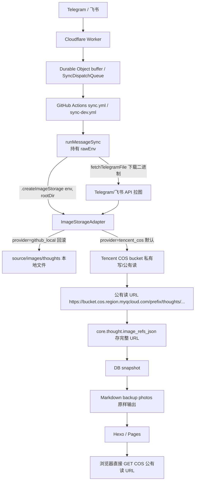

# 02 架构与实施设计

> 状态：已实现。v1.3.1 已按本文第一阶段完成腾讯云 COS 随想图片存储扩展；当前正式行为以 `docs/总览/系统行为手册.md`、`docs/部署运维/部署运维.md` 和 `04_实施结果与验收报告.md` 为准。

## 不变约束（最高优先级，不可违反）

1. **桶权限 = 私有写 / 公有读**。这是唯一标准访问模型，禁止改为私有读。
   - 理由：`core.thought.image_refs_json` 与 Markdown `photos` 存的是**静态永久字符串**。COS 预签名 URL 强制带 `Expires`，无法生成永久有效签名。改私有读会让已落库 URL **整批失效且无刷新层**。
2. **数据库 `image_refs_json` 保存完整 `https://` 公有读 URL**，不保存 object key。
3. **PostgreSQL 是唯一事实源**，Markdown 永远从数据库派生。
4. **dev / main 完全隔离**：独立 bucket、独立 CAM 子账号、独立 domain、独立 prefix。
5. **Cloudflare Worker 职责不变**：只做 webhook 接入、缓冲、队列、dispatch，不碰对象存储。

## 目标架构图



## 需要变化的代码点（按调用栈自上而下）

> 以下代码引用基于当前 dev 分支快照，落地前请以最新代码为准；行号可能因后续提交漂移，以函数/字段名为准。

### 改点 1：`runMessageSync()` 注入 COS 配置（`src/app/use-cases/telegram-sync.use-case.mjs`）

`runMessageSync` 已持有 `rawEnv`（`options.env ?? process.env`，line 96），是 COS 配置的唯一合理来源。当前它把 `env` 传给 `handleThoughtSyncBatch`（line 1012）→ `writeThoughtArtifact({..., env})`（line 1044-1051），但 **`writeThoughtArtifact`（line 1233）未消费 `env`，也未把 `env`/`imageStorage` 转发给 `writeThoughtImageArtifacts`**。需要补这条链路。

落地做法：

```js
// runMessageSync 内，解析 COS 配置（在读取 env 之后、循环 grouped 之前）
const imageStorage = createImageStorage({
  env: rawEnv,
  rootDir: activeRootDir,
});
// ...
// handleThoughtSyncBatch 调用处增加 imageStorage（见改点 2）
const thoughtResult = await measureSyncStage(timings, 'persist', () =>
  handleThoughtSyncBatch({
    batch: persistedBatch,
    kind: persistedBatch.kind,
    thoughtsDir,
    activeRootDir,
    now,
    env: rawEnv,
    imageStorage,            // 新增
    persistBatch,
    appendPendingPersistenceBatch: appendPendingRecognitionBatch,
    fetchTelegramFile: options.fetchMessageFile ?? fetchTelegramFileById,
  }),
);
```

`createImageStorage({ env, rootDir })` 内部读 `COS_ENABLED` 决定 provider，并在 `COS_ENABLED=true` 时做 fail-fast 校验（校验规则见 03）。**校验放在 adapter 工厂内、在循环之前执行一次**，避免每条随想重复校验，且让配置错误在同步开始即失败。

`env` / `imageStorage` 经 `handleThoughtSyncBatch` → `writeThoughtArtifact`（line 1233）→ `writeThoughtImageArtifacts` 透传。这是一条新参数链，不经过数据库层、不经过 Markdown 导出层。

### 改点 2：`writeThoughtArtifact` + `writeThoughtImageArtifacts` 增加 `imageStorage` 参数

`writeThoughtArtifact`（`telegram-sync.use-case.mjs:1233`）是真正调 `writeThoughtImageArtifacts` 的两层，**两处签名都要加 `imageStorage`**：

- `writeThoughtArtifact({ batch, kind, thoughtsDir, activeRootDir, fetchTelegramFile, imageStorage })`，并在它两处调 `writeThoughtImageArtifacts`（line 1241 thought、line 1257 thought_edit+replacePhotos）透传 `imageStorage`。
- `writeThoughtImageArtifacts({ batch, rootDir, fetchTelegramFile, imageStorage, overwrite = false })`（`telegram-thoughts.mjs:48`）。

`writeThoughtImageArtifacts` 不再直接调用 `writeThoughtImageFiles` 写本地文件，而是把图片二进制 + 元数据交给 `imageStorage.upload(imageItems)`，由 provider 决定写本地还是写 COS。返回值仍是 `photoPaths`（字符串数组：本地 provider 返回 `/images/...`，COS provider 返回完整 `https://` URL）。

> 关键不变量：**`photoPaths` 始终是字符串数组**，下游 `attachThoughtStorageMetadata`（line 703-766）把它原样放进 `storage.photoPaths`，再由 `PostgresThoughtRepository.persistMirror` 写入 `image_refs_json`。这一段上下游契约**不需要改动**。
>
> 注意 `thought_delete` / `thought_move` 走 `buildDatabaseOnlyThoughtWriteResult`（line 1267-1268），**不调用 `writeThoughtImageArtifacts`**，因此删除/移动不会触发 COS 上传或删除——与第一阶段「删除不删对象」策略天然一致。

### 改点 3：图片二进制仍由现有 `fetchTelegramFile` 下载，adapter 只负责「写」

下载逻辑（`selectThoughtImagePhoto`、`inferThoughtImageExtension`、`fetchTelegramFile`）保持不变。adapter 接收的是已下载的 `{ data, extension, channelSlug, dateParts, sourceMessageId, index }`，负责：生成稳定 key → 写存储 → 返回最终引用字符串。

### 改点 4：编辑/删除时本地文件删除逻辑需感知 COS（见下「图片编辑替换流程」「图片删除流程」）

`editThoughtPost`（line 72）/ `deleteThoughtPost`（line 149）调用的 `deleteThoughtPhotoFiles` 用 `photoPath.startsWith('/images/')` 过滤（line 410-422、387-408）。COS URL 不匹配此前缀会被自动跳过，**不会误删、也不会报错**，但会静默保留旧 COS 对象。第一阶段这是可接受行为，需在文档显式记录。

## 设计边界

### 保持不变

- Cloudflare Worker 继续只负责 webhook 接入、缓冲、队列、workflow dispatch。
- Telegram 和飞书继续共用 `runMessageSync()`。
- PostgreSQL 继续作为事实源。
- Markdown 继续作为派生备份。
- `core.thought` 继续保存随想正文、模块、状态、图片引用；**不新增列、不做 schema migration**。
- 历史 `/images/thoughts/...` 引用继续可访问（第一阶段不迁移、不删除）。
- 图片二进制下载（Telegram/飞书 API 拉图）、扩展名推断、消息身份解析逻辑不变。
- `attachThoughtStorageMetadata` → `PostgresThoughtRepository.persistMirror` → `image_refs_json` 的下游契约不变；`photoPaths` 始终是字符串数组。

### 需要变化

- `writeThoughtImageFiles()` 背后的图片写入逻辑从本地 `writeFile` 扩展为 `ImageStorageAdapter`（provider 由 `COS_ENABLED` 选择），见改点 1-3。
- `storage.photoPaths` 的值从 `/images/thoughts/...` 变为完整 COS 公有读 URL（COS provider 下）。
- `sync.yml` / `sync-dev.yml` 增加 COS 环境变量与 fail-fast 校验。
- 检测和提交范围从「图片文件变更」逐步收敛为「Markdown/数据派生文件变更」，最终不再提交新图片文件（见「workflow 检测与提交范围」）。

## 推荐对象路径（稳定 key，幂等基础）

COS key 使用与现有本地路径同构的稳定路径：

```text
{COS_PATH_PREFIX}/thoughts/{yyyy}/{MM}/{yyyy-MM-dd}-{channelSlug}-thought-{sourceMessageId}-{index}.{ext}
```

示例：

```text
main/thoughts/2026/06/2026-06-13-telegram-thought-570-1.jpg
dev/thoughts/2026/06/2026-06-13-feishu-thought-3531894827668242-1.jpg
```

即使 dev/main 使用完全独立 bucket，仍保留 `COS_PATH_PREFIX`：便于后续按业务域划分、批量迁移和清理。

**幂等约束（强制）**：key 仅由稳定业务身份决定：

```text
source_channel + source_chat_id + source_message_id + image_index + extension
```

**禁止**把 AI attempt id、workflow run id、当前时间戳放入 key。这样重试/replay/重复触发都写同一对象，不产生多份图片。

## 图片上传流程

### 新增随想

```text
1. GitHub Action 收到 webhook payload。
2. runMessageSync 识别为 thought batch。
3. 按当前逻辑从 Telegram / 飞书下载图片二进制。
4. ImageStorageAdapter 生成稳定 COS key。
5. PutObject 上传到当前环境 COS bucket（私有写）。
6. 失败则重试（有限次）；超时则 HeadObject 校验是否已写入。
7. 上传成功后用 `COS_DOMAIN + key` 拼出最终公有读 URL。第一阶段 `COS_DOMAIN` 使用腾讯云 COS 默认公网域名，例如 `https://training-images-prod-1250000000.cos.ap-shanghai.myqcloud.com`；自定义域名待域名备案后再切换。
8. 将 URL 写入 batch.thought.storage.photoPaths。
9. PostgresThoughtRepository.persistMirror 写入 core.thought.image_refs_json。
10. deploy / markdown backup 从数据库读取 image_refs_json 原样输出。
```

### 编辑随想并替换图片

```text
1. 识别 thought_edit 且 replacePhotos=true。
2. 上传新图片到 COS。
3. 上传全部成功后，数据库更新 image_refs_json 为新 URL 列表。
4. 旧图片不立即硬删除（第一阶段无资产表，立即删除放大误操作风险）。
```

**与现有本地删除逻辑的兼容**：`editThoughtPost`（`telegram-thoughts.mjs:72`）在 `replacePhotos` 时会调用 `deleteThoughtPhotoFiles`，该函数用 `photoPath.startsWith('/images/')` 过滤要删的本地文件（`telegram-thoughts.mjs:410-422`）。COS URL（`https://...`）不匹配此前缀，会被自动跳过——**不会误删、不会报错**，旧 COS 对象自然保留。这正是第一阶段期望的「逻辑删除」行为，无需改动 `deleteThoughtPhotoFiles`。

> 注意：`writeThoughtArtifact`（`telegram-sync.use-case.mjs:1255`）对 `thought_edit + replacePhotos` 走 `writeThoughtImageArtifacts(..., overwrite: true)`。COS provider 的 `overwrite` 语义 = PutObject 覆盖同一 key（因 key 由稳定身份决定，新旧图通常是不同 key，不会覆盖；同一身份重发同图才会覆盖）。本地 provider 的 `overwrite` 语义保持现有 `writeThoughtImageFiles` 行为。### 删除随想

当前代码对随想删除采用数据库软删除（`status='deleted'`、`deleted_at`）。COS 第一阶段保持同样策略：

- 删除随想时**不删除 COS 对象**。
- 数据库软删除仍是事实状态，页面和 Markdown 导出过滤 active 记录。
- 后续通过人工审计或延迟清理任务删除孤儿对象（第二阶段，依赖资产表）。

**与现有本地删除逻辑的兼容**：`deleteThoughtPost`（`telegram-thoughts.mjs:149`）会 `unlink` 随想 Markdown 文件并调用 `deleteThoughtPhotoFiles` 删本地图片。但注意——当前 `runMessageSync` 对 `thought_delete` 走 `buildDatabaseOnlyThoughtWriteResult`（`telegram-sync.use-case.mjs:1267`），**根本不调用 `deleteThoughtPost`**，即删除时不触碰任何图片文件（本地或 COS 都不删）。因此 COS 下删除流程天然是「只软删 DB，不动对象存储」，与第一阶段策略一致，无需特殊处理。

> 风险提示：若未来有人把 `thought_delete` 改为调用 `deleteThoughtPost`，则其 `deleteThoughtPhotoFiles` 会因 COS URL 不匹配 `/images/` 前缀而跳过（安全），但会 `unlink` 本地 Markdown 文件——需重新评估是否仍走 database-only。第一阶段维持 database-only 删除即可。

## 图片访问流程

```text
Markdown photos / 站点页面
-> https://{COS_BUCKET}.cos.{COS_REGION}.myqcloud.com/{COS_PATH_PREFIX}/thoughts/...
-> 浏览器直接公网 GET（公有读）
```

数据库保存完整 URL，而非相对路径。理由：

- `tools/export-training-markdown.mjs` 已原样写出 `thought.imageRefs`。
- 历史 `/images/thoughts/...` 和新 `https://...` 可在同一数组中共存。
- 不需要 Markdown 层判断 provider，不需要站点构建时拼域名。

## 图片删除流程

第一阶段逻辑删除，不做同步硬删除：

```text
删除随想
-> core.thought.status='deleted'
-> 页面和 Markdown 导出过滤 active 记录
-> COS 对象保留
```

后续清理工具（非第一阶段）：

```text
读取 core.thought 全量 active image_refs_json
-> 列出 COS prefix 下对象
-> 计算未被 active 记录引用的孤儿对象
-> 输出 dry-run 报告
-> 人工确认后批量删除
```

第一阶段无法精准定位孤儿对象（DB 无 `object_key` 列），清理工具延后到第二阶段 `core.thought_image` 资产表。这是已知短期负债，必须知情接受。

## GitHub Action 中的上传位置

COS 上传放在**图片 artifact 写入边界内部**（`tools/telegram-thoughts.mjs`），而不是 workflow shell 中。

原因：

- 这里已掌握图片二进制、扩展名、日期、通道、message id、图片顺序。
- Telegram 和飞书最终都经过这里。
- 上层 `handleThoughtSyncBatch()` 只接收 `photoPaths`，不用理解本地文件或 COS 差异。
- 数据库写入层继续只接收图片引用数组。

## ImageStorageAdapter 接口契约

adapter 是一个 provider 抽象，工厂 `createImageStorage({ env, rootDir })` 按 `COS_ENABLED` 选择实现。两个 provider 必须满足同一契约，返回值格式一致。

### 契约

```js
// 工厂
createImageStorage({ env, rootDir }) -> ImageStorage

// ImageStorage 接口
interface ImageStorage {
  provider: 'github_local' | 'tencent_cos'

  // 上传一批图片，返回与 imageItems 一一对应的引用字符串数组
  // github_local 返回: ['/images/thoughts/2026/06/...jpg', ...]
  // tencent_cos 返回: ['https://training-images-prod-1250000000.cos.ap-shanghai.myqcloud.com/main/thoughts/2026/06/...jpg', ...]
  upload(imageItems: ImageItem[]): Promise<string[]>
}

interface ImageItem {
  data: Uint8Array | Buffer       // 已下载的图片二进制
  extension: string               // '.jpg' | '.png' | ...（已规整，见 inferThoughtImageExtension）
  channelSlug: 'telegram' | 'feishu'
  dateParts: { date: 'YYYY-MM-DD' }  // 与本地路径同构的日期分段
  sourceMessageId: string | number
  index: number                   // 从 1 开始，与本地命名一致
}
```

### 不变约束

- **返回数组长度必须等于输入 `imageItems` 长度，顺序一一对应**。下游 `attachThoughtStorageMetadata` 直接把数组放进 `storage.photoPaths`，长度错位会写错 `image_refs_json`。
- **引用字符串必须是「页面/Markdown 最终使用的值」**：本地 provider 返回 `/images/...`，COS provider 返回完整 `https://` URL。不在 adapter 外层做二次拼接。
- **稳定 key 仅由 `channelSlug + dateParts.date + sourceMessageId + index + extension` 决定**，与 `writeThoughtImageFiles` 现有命名一致。禁止把 attempt id、run id、时间戳放入 key。

### github_local provider（保持当前行为）

复用现有 `writeThoughtImageFiles` 的本地写入逻辑：`path.join(rootDir, 'source', 'images', 'thoughts', year, month, fileName)` + `writeFile` + 返回 `/images/thoughts/...`。**此 provider 必须与改造前行为逐字节一致**，是回滚兜底，不可改变。

### tencent_cos provider

```text
for each ImageItem:
  key = `${COS_PATH_PREFIX}/thoughts/${yyyy}/${MM}/${date}-${channelSlug}-thought-${sourceMessageId}-${index}${extension}`
  # 幂等：先 HeadObject(key) → 存在且大小>0 视为成功，跳过上传
  #       不存在或大小为 0 → PutObject(key, data)（有限次重试）
  url = `${COS_DOMAIN}/${key}`   // COS_DOMAIN 已含 https://，无尾斜杠
  result.push(url)
return result
```

- HeadObject 用于网络超时判定（见 03「网络超时」），放在 PutObject 之前可实现「重复触发跳过」。
- `content-type` 由 extension 推断（`image/jpeg` 等），与本地 `inferThoughtImageExtension` 规则保持一致。
- **失败处理**：adapter 内重试有限次后仍失败 → 抛错，由 `handleThoughtSyncBatch` 捕获进入 `batch 失败 / pending`。**不要在 adapter 内把失败图片替换成 `/images/...` 静默 fallback**（见 03「不推荐」）。

## workflow 检测与提交范围

两个 workflow 的「Detect changes」「Commit」步骤当前都把 `source/images` 纳入检测和提交：

```yaml
# sync.yml / sync-dev.yml
git status --porcelain -- 训练记录.md source/_posts source/images
git add 训练记录.md source/_posts source/images
```

启用 COS 后新随想不再产生 `source/images` 变更，但**历史图片仍在该目录、仍需被提交保留**。第一阶段建议：

- **Detect / Commit 范围保持不变**（继续包含 `source/images`）。理由：历史 GitHub 图片仍需随仓库分发到 Pages；删掉 `source/images` 会让历史图片链接失效。
- 这样做的副作用：`source/images` 不再有新增，`git add` 实际只会处理历史文件，无性能问题。
- 第二阶段历史图片全部迁移到 COS 后，再评估从检测/提交范围移除 `source/images` 并清空目录。

> 不要在第一阶段就把 `source/images` 从 `git add` 移除：会触发「历史 `/images/...` 失效」这一不可接受失败模式（见 03）。

## 不放在 Cloudflare Worker

- Worker 当前不下载最终随想图片、不写数据库，只负责接入和队列。
- 把上传前移会让 Worker 同时承担 webhook、缓冲、对象存储、失败补偿职责。
- COS 密钥需进入 Cloudflare Worker Secrets，增加一套配置面。
- 当前 DB 写入发生在 GitHub Action 内，Worker 上传成功但 Action/DB 失败会产生更多孤儿对象。

## 不保存 object key 再拼 URL

- 当前 `image_refs_json` 已被读取 mapper 映射为 `thought.imageRefs`，导出时原样写 Markdown。
- 保存 key 需新增读取层或导出层拼接逻辑。
- dev/main 域名、bucket、prefix 差异会进入 Markdown 生成逻辑。
- 历史 `/images/...` 与新 key 需额外 provider 判断。

保存完整 URL 更符合低改造路径。

## 数据库形态

第一阶段**不新增列、不做 schema migration**。只改写入值：

```json
// 历史 GitHub 图片
["/images/thoughts/2026/06/2026-06-13-telegram-thought-570-1.jpg"]

// 新 COS 图片
["https://training-images-prod-1250000000.cos.ap-shanghai.myqcloud.com/main/thoughts/2026/06/2026-06-25-telegram-thought-700-1.jpg"]

// 渐进迁移期混合形态（可共存，导出层原样输出）
["/images/thoughts/2026/06/old.jpg", "https://training-images-prod-1250000000.cos.ap-shanghai.myqcloud.com/main/thoughts/2026/06/new.jpg"]
```

`image_refs_json` 的语义从「本地文件路径」收敛为「页面和 Markdown 应使用的**最终图片引用**」。

## 历史图片迁移策略

采用「新图进 COS，历史 GitHub 图片保持可访问，后续渐进迁移」：

- 第一阶段：新随想图片写 COS；历史 `/images/...` 不动、不删；`source/images/thoughts` 不再新增。
- 第二阶段（非本次）：生成 old ref → COS URL 映射清单 → dev 小批量迁移 → main 分批迁移 → 观察期后清理。

回滚以数据库引用为核心：把 `image_refs_json` 从 COS URL 改回 `/images/...` → `npm run export:markdown` → 部署。前提是历史 GitHub 图片未删。

不推荐第一阶段批量迁移的原因：无独立图片资产表、无对象级迁移状态，一次性迁移风险集中，不符合低复杂度目标。

## 架构红蓝评估

- **Red team**：未来开发者可能把 COS URL 直接写到 Markdown 而忘记写数据库，导致 MD 与 DB 不一致。
- **Blue team**：上传成功后只允许通过 `batch.thought.storage.photoPaths -> persistMirror -> core.thought.image_refs_json` 进入系统；Markdown 导出继续只读数据库。
- **残余风险**：COS 上传成功但 DB 写入失败会产生孤儿对象。第一阶段通过保留对象 + pending replay 接受该风险；后续用资产表治理。

## 第一阶段不做的事

- 不把 COS 上传放到 Cloudflare Worker。
- 不新增 `storage_provider`、`cos_key`、`upload_status` 到 `core.thought`。
- 不批量迁移全部历史图片。
- 不删除 `source/images/thoughts` 历史图片。
- 不做 Git 历史重写。
- 不让 Markdown 直接成为迁移事实源。
- 不做图片内容 hash 去重（当前以消息身份幂等，不以图片内容复用资产）。
- 不从 workflow 的 `git add` / `git status` 检测范围移除 `source/images`（历史图片仍需随仓库分发）。
- 不改动 `deleteThoughtPhotoFiles` 的 `/images/` 前缀过滤逻辑（COS URL 会自动跳过，符合第一阶段逻辑删除策略）。

## 性能与成本

- **存储成本**：随想图片低频增量（日均个位数），COS 标准存储单价极低，非瓶颈。
- **请求次数**：每次同步 PutObject 按条计，请求量远低于免费/低价档。
- **上传耗时**：同步运行在 GitHub Actions，图片上传是 `runner -> 腾讯云 COS` 的公网链路。它只发生在新随想/替换图片时，不进入站点构建，也不需要把图片提交到 Git。实现时必须串行小批量或有限并发上传，并在 workflow summary 记录 COS 上传耗时，避免把网络慢误判为数据库或 AI 慢。
- **访问耗时**：页面托管在 GitHub Pages / Cloudflare Pages，图片由浏览器直接访问 COS 默认域名。GitHub Pages 不代理图片，因此站点 HTML 加载和图片加载是两个域名、两条链路；图片首包耗时取决于用户到腾讯云 COS 地域的网络质量。
- **默认域名影响**：因域名未备案，第一阶段使用 `*.myqcloud.com` 默认域名。它可满足公有读和静态引用，但品牌一致性、浏览器连接复用、未来 CDN 接入能力都弱于自定义域名。
- **CDN 是否必要**：第一阶段不接 CDN。原因是自有域名未备案，且当前图片访问量低；若验收中发现图片加载 P95 明显影响阅读体验，再把「域名备案 -> 自定义域名 -> CDN 回源 / COS 全球加速」作为第二阶段性能专项。
- **图片压缩**：从 Telegram/飞书下载的已是通道侧压缩图，第一阶段无需二次压缩。
