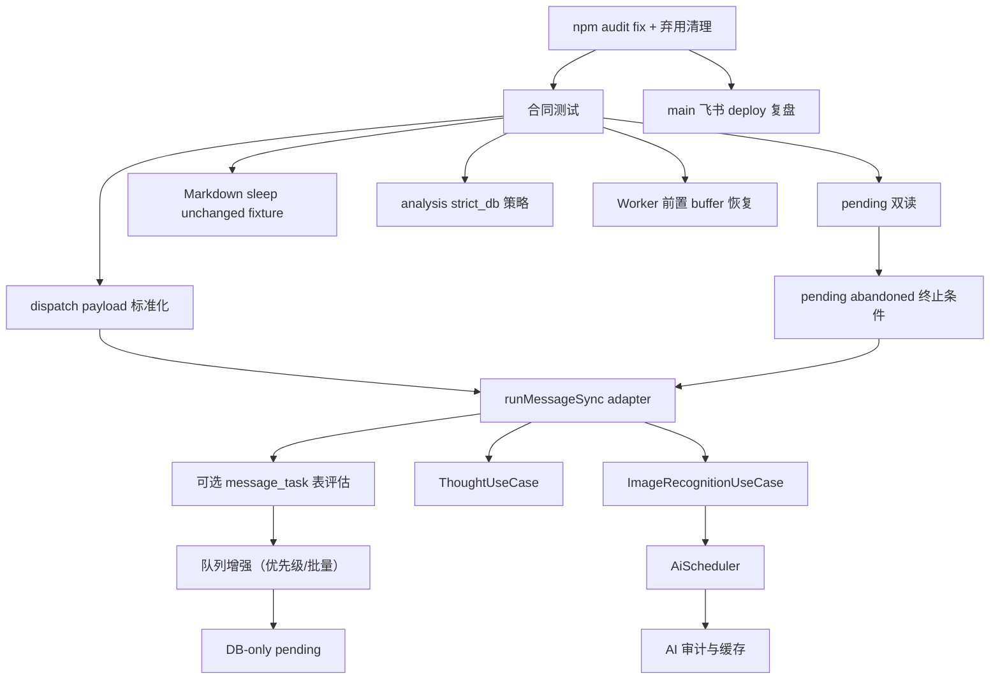

# 优化实施路线图

## 短期优化（1~2周）

| 任务 | 优先级 | 风险等级 | 依赖 | 验证 | 回滚 |
| --- | --- | --- | --- | --- | --- |
| 复盘 main 飞书 sync -> deploy 历史失败并补防复发 | P0 | P1 | 无 | `gh run view <failed-run-id> --log` 定位失败步骤和原因；最新 main 飞书链路保持成功 | 保持现有 workflow 不变 |
| `npm audit fix` 修复 4 个 vulnerable packages | P0 | P1 | 无 | `npm audit --omit=dev` 输出 0 vulnerable packages | `git checkout package-lock.json` |
| Node.js 弃用警告清理（`url.parse()`、`punycode`） | P1 | P2 | npm audit fix | Actions 日志无 `[DEP0040]`/`[DEP0169]` 警告 | 回退依赖版本 |
| 配置 `AI_TIMEOUT_MS` 和限流策略 `AI_CONCURRENCY` | P1 | P1 | 无 | GitHub Variables 中已配置；文档标明 `AI_CONCURRENCY` 代码默认 3，配置 2 是飞书图片限流策略，并对 env 增加硬上限 | 删除变量或调高上限 |
| Markdown 导入链路合同测试 | P0 | P1 | 现有 `import:markdown` / `reconcile:markdown` | 正常导入、空/坏 Markdown、`skipIfUnchanged`、whole-day replacement 边界均有 fixture | 删除新测试 |
| 补 MessageSyncTask 合同测试 | P0 | P1 | 无 | `node --test test/telegram-sync.test.mjs test/feishu-sync.test.mjs` | 删除新测试 |
| dispatch payload 增加 `task_id/channel/trace` | P0 | P1 | 合同测试 | Worker 测试 | 保留旧 payload 字段 |
| pending DB/NDJSON 双读测试 | P0 | P1 | 现有 pending 表 | DB core 测试 | 继续读 NDJSON |
| workflow `run:` shell 语法测试 | P0 | P1 | `js-yaml` / bash | `bash -n` 解析后的 run 脚本 | 删除新增断言 |
| AI 错误分类测试 | P1 | P1 | 现有 provider 测试 | AI 测试 | 回退旧 classify |
| DB pending 最大重试与 abandoned 合同 | P0 | P1 | 现有 `ingest.telegram_pending_batch` | 超过最大重试后不再被普通 pending 读取，summary 输出人工处理 | 保持旧 pending 读取 |
| FeishuImageBuffer 前置失败恢复合同 | P1 | P1 | 现有 `FEISHU_IMAGE_BUFFER` DO | 进入 SyncDispatchQueue 前连续失败有最大次数或可观测告警 | 保持当前指数退避 |
| TelegramAlbumBuffer dispatch 失败恢复合同 | P1 | P1 | 现有 `TELEGRAM_ALBUM_BUFFER` DO | dispatch 失败且通知失败时不清空 updates，超过阈值进入 dead-letter | 最大重试设为 1 但保留 dead-letter |
| 飞书签名 timestamp 新鲜度校验 | P1 | P1 | Feishu webhook 签名测试 | 旧 timestamp/nonce replay 被拒绝或记录 replay warning | 临时放宽 skew，不关闭校验 |
| Markdown sleep `skipIfUnchanged` 修复 | P1 | P1 | Markdown 导入 fixture | 只修改 sleep 的 Markdown 导入返回 stored，不被误判 unchanged | 临时关闭 sleep skip，但 summary 标记需人工核对 |
| core 明细来源覆盖策略 | P1 | P1 | DB core fixture | Telegram/Feishu/Markdown 相同业务事实不覆盖丢失来源元数据 | 停读新增来源表或回退 key 变更 |
| `/analysis` strict_db 策略显式化 | P1 | P2 | analysis tests | `database/fallback_markdown/strict_db_error` 三种 source 可区分 | 配置回 allow_markdown_fallback |
| AI 用户文本边界 | P1 | P1 | recognition/analysis prompt tests | caption/text/question 超长、HTML、Emoji、控制字符均可控 | 调大 max chars，不回到无限长 |
| env contract 测试扩展 | P1 | P2 | 现有 workflow/config 测试 | cloudflare/github workflow 测试 | 删除新增断言 |
| 飞书业务状态告警规则 | P1 | P1 | dev Action summary | pending_replay/manual_intervention 能被汇总 | 仅文档告警 |
| 图片日期归档与业务状态 gate | P1 | P1 | sync summary / `dateSources` | `dateConfidence=exact/derived/uncertain/missing` 合同测试；`no reliable image or filename date` 进入 `manual_intervention` | 保留旧 `archivedDate` 逻辑，只新增告警 |

短期目标：不改大结构，先复盘 main 分支飞书 deploy 链路历史失败并补防复发措施，同时修复安全漏洞，再把行为合同、追踪字段和图片日期归档 gate 补齐。

## 中期优化（1~2月）

| 任务 | 优先级 | 风险等级 | 依赖 | 验证 | 回滚 |
| --- | --- | --- | --- | --- | --- |
| 评估 `ingest.message_task` 是否需要落地 | P2 | P2 | SyncDispatchQueue 指标和 DB pending 终止条件 | 证明 DO queue 保留周期/观测不足后再新增 | 继续使用 SyncDispatchQueue |
| 新增 `ingest.ai_call_log` | P1 | P2 | SQL migration | AI 测试 | 日志 best-effort |
| 抽取 `runMessageSync({ adapter })` | P1 | P1 | MessageSyncTask | sync 测试 | facade 回退 |
| 抽取 ThoughtUseCase | P1 | P2 | thought_id migration | thought 测试 | 旧 handleThoughtSyncBatch |
| 抽取 ImageRecognitionUseCase | P1 | P1 | AI scheduler | recognition 测试 | 旧 recognizeBatch |
| Workflow 业务逻辑脚本化 | P2 | P2 | summary fixture | workflow 测试 | 恢复 YAML 内联 |
| 飞书图片链路观测 | P1 | P1 | AI/DB 日志 | cache timeout、schema failure、DB timeout 可分别统计 | 关闭指标写入 |
| CI 增加 `npm audit --audit-level=high` 检查 | P1 | P2 | npm audit fix | CI 通过 | 移除 CI 步骤 |

中期目标：统一任务模型和核心 use case，运行时失败状态可审计。`ingest.message_task` 不是中期必选前置；先让现有 Cloudflare queue 与 DB pending 的状态边界收敛。

## 长期架构升级

| 任务 | 优先级 | 风险等级 | 依赖 | 验证 | 回滚 |
| --- | --- | --- | --- | --- | --- |
| Cloudflare 队列增强（优先级、批量合并、监控） | P1 | P1 | SyncDispatchQueue 已实现基础功能 | 端到端灰度 | 切回无优先级模式 |
| 删除 Telegram 命名通用表依赖 | P2 | P2 | 新表运行一轮 | 数据一致性检查 | 旧表保留归档 |
| DB-only pending，清理 NDJSON | P2 | P2 | pending 表稳定 | pending replay 测试 | 还原 NDJSON 备份 |
| 分析 strict_db 默认化 | P2 | P2 | DB 可用性稳定 | analysis 测试 | 允许 fallback |
| 配置漂移自动巡检 | P2 | P3 | env contract | check-env-contract | 只告警不阻断 |

长期目标：系统从“可用的统一入口”升级为“可审计的任务处理系统”。

## 长期运行风险窗口

| 连续运行窗口 | 可能问题 | 监控信号 | 处置策略 |
| --- | --- | --- | --- |
| 30 天 | pending 未收敛、Action summary 中反复出现 `manual_intervention`、AI timeout 或 fallback 使用率升高、Markdown Backup 未启用 | `pendingDatabaseCount`、最老 pending 时间、fallback 使用率、backup run summary | 每周检查 `npm run maintenance:inspect`；处理人工介入截图；开启或手动验证 Markdown Backup |
| 90 天 | `ingest.telegram_batch/message/recognition` 数据量增长，查询和识别缓存变慢；GitHub Actions run 数量和日志排查成本上升；AI 成本趋势不透明 | DB 表大小、查询耗时、Actions run duration、provider 账单 | 增加按日期/来源查询索引；定义保留策略；落地 `ingest.ai_call_log` 和成本汇总 |
| 180 天 | `core.training_day` 投影逻辑升级后旧数据重建成本增加；Markdown 导入 whole-day replacement 与图片增量写入边界被遗忘；source 元数据被覆盖影响审计 | `check:data-consistency` 差异、source_channel/source_batch_id 异常、重复/缺失 core 明细 | 定期做 core/archive/ingest 对账；补来源明细表或 key 来源维度；将 Markdown 导入变成强制 dry-run 后确认 |
| 365 天 | 数据库备份/恢复流程未演练；Worker DO dead-letter 和 pending 堆积历史不可读；依赖安全漏洞和平台 API 变更累积；Token/费用失控 | 年度恢复演练结果、deadLetters 数、npm audit、Cloudflare/GitHub/AI API deprecation 通知、年度成本 | 每季度恢复演练；每月 `npm audit --omit=dev`；记录平台变更；设置 AI/Actions/DB 成本预算和阈值 |

长期运行验收不能只看功能仍可用，还要看失败是否收敛、成本是否可解释、数据是否可恢复、告警是否有人处理。

## 每阶段依赖关系



## 风险控制策略

- 每阶段只改一个边界：payload、DB、Use Case、Workflow、AI 调度不得同 PR 混改。
- main 只接受 dev 端到端验证后的变更。
- dev 端到端验证必须同时检查 Action conclusion 和业务 summary；`success` run 中的 `pending_replay` / `manual_intervention` 不能算通过。
- 图片端到端验证必须同时检查 `archivedDate/dateSources/warnings/dateConfidence`；`sleep_bedtime`、`no_date`、缺少年份 warning 不能被绿色 Action 掩盖。
- Markdown 导入端到端验证必须单列：它是 whole-day replacement，不适用图片增量写入的同日保留假设。
- Markdown 导入端到端验证必须包含“只修改 sleep 字段”的 fixture，不能被 `skipIfUnchanged` 判为 unchanged。
- 分析端到端验证必须检查 snapshot source；`fallback_markdown` 不能伪装成 database，`TRAINING_SNAPSHOT_STRICT_DATABASE` 不能被误当作当前 `/analysis` strict 开关。
- Worker 前置缓冲验证必须覆盖 TelegramAlbumBuffer 与 FeishuImageBuffer，两者都要有失败恢复或 dead-letter。
- 飞书 webhook 验证必须覆盖 timestamp skew 与 nonce replay。
- AI prompt 验证必须覆盖用户 caption/text/question 的长度、控制字符、HTML 和 Emoji，且不把普通特殊字符误判为 JSON 序列化问题。
- 所有新增 schema 先 additive，再迁移读写，再考虑清理旧字段。
- 所有新能力必须有 feature flag。
- 回滚优先使用配置开关，不优先 revert 数据结构。
- `npm audit fix` 在 dev 先验证，确认无 breaking change 后再合入 main。
- main 分支飞书 deploy 历史失败需先定位根因和复发条件，不在未查明原因前修改 workflow 结构。

## 阶段验收标准

| 阶段 | 验收标准 |
| --- | --- |
| 短期 | 测试能证明旧行为不变，summary 可看到 task_id；Markdown 导入、pending abandoned、AI fallback 边界均有合同测试 |
| 中期 | Telegram/飞书都通过 `runMessageSync`，旧 facade 仍可用；飞书图片失败能分阶段审计；分析能暴露 snapshot source |
| 长期 | 失败任务可在 DB 中查询、重放、归档；runtime NDJSON 不再是默认路径 |

## 最终验证命令

```bash
npm test
npm run check:data-consistency
node --test test/cloudflare-config.test.mjs test/github-workflows.test.mjs test/sync-dispatch-worker.test.mjs
node --test --test-name-pattern "workflow" test/github-workflows.test.mjs
```
