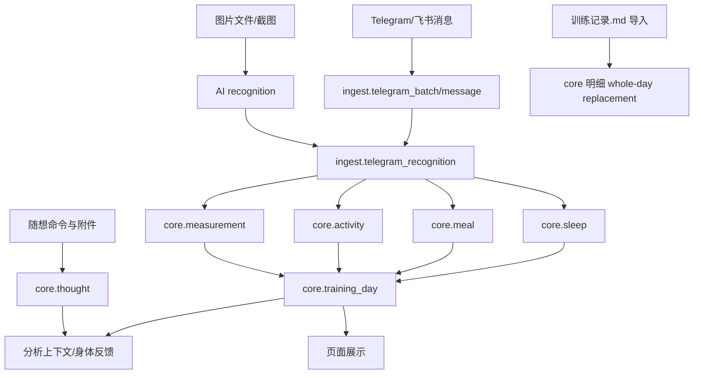

# 数据结构优化方案

## 第四轮数据库业务模型校准

### 数据库在系统中的定位

PostgreSQL 是系统的持久事实源。聊天通道、Markdown 文件、Hexo 页面和分析回复都不是最终事实源：它们要么是输入入口，要么是派生展示，要么是维护入口。数据库重构必须先保护“事实可追溯、来源可审计、失败可重放、投影可重建”四件事。

### Schema 分层

| Schema / 表族 | 当前表 | 业务定位 | 不能误解为 |
| --- | --- | --- | --- |
| `archive.*` | Markdown 解析快照、历史归档相关表 | 保存从 Markdown/历史记录解析出的归档结果，用于迁移、比对和恢复 | 日常图片采集的主事实源 |
| `ingest.*` | `telegram_batch`、`telegram_message`、`telegram_recognition`、`telegram_pending_batch` | 外部事件、消息、AI 识别结果和失败重放审计。虽然表名带 Telegram，当前也承载飞书规范化后的事件 | 业务明细事实表 |
| `core.*` 明细 | `measurement`、`activity`、`meal`、`sleep`、`thought` | 系统真正的结构化业务事实 | 页面缓存或临时结果 |
| `core.training_day` | 按日期汇总的业务日投影 | 页面和分析读取加速，应该由明细刷新 | 唯一事实源或可手写覆盖的主表 |

### 核心业务表与数据依赖



| 事实类型 | 表 | 来源 | 生命周期 |
| --- | --- | --- | --- |
| 体脂秤/身体指标 | `core.measurement` | 图片识别、Markdown 导入 | 图片增量 upsert；Markdown 导入可按天替换 |
| 训练/运动 | `core.activity` | 训练截图识别、Markdown 导入 | 按业务字段幂等写入，刷新 `training_day` |
| 饮食 | `core.meal` | 饮食图片识别、Markdown 导入 | 低置信度不得写入；同日可多餐 |
| 睡眠 | `core.sleep` | 睡眠截图识别、Markdown 导入 | 跨日规则影响归档日期，必须保留日期来源 |
| 随想/身体反馈 | `core.thought` | Telegram/飞书命令、图片附件、模块迁移 | 支持新增、编辑、删除、移动；身体反馈参与分析 |
| 业务日投影 | `core.training_day` | 明细聚合刷新 | 可重建，不应成为唯一事实 |

### 数据流转状态

| 状态 | 所在层 | 含义 | 验收要求 |
| --- | --- | --- | --- |
| `received` | Worker / ingest | 外部消息已接收并通过通道鉴权 | 保留 channel、chat、message/event ID |
| `recognized` | AI / ingest recognition | 图片已得到结构化识别结果 | schema、confidence、warnings、dateSources 可追溯 |
| `stored` | core | 业务事实已入库并刷新投影 | transaction 成功，source_channel/source_batch_id 不丢 |
| `unchanged` | ingest/core | 幂等命中，无需重复写入 | 不得产生重复明细 |
| `pending_retry` | pending | AI/DB 等可恢复失败等待重放 | attempt_count、next_retry_at、failure_category 明确 |
| `abandoned` | pending | 超过重试上限或人工终态 | 普通 sync 不再无限重放 |
| `skipped/manual_intervention` | summary/回执 | 用户输入或日期证据不足，不应自动写入 | 不得被 Action success 掩盖 |

### 图片增量写入与 Markdown 导入的边界

图片识别链路是增量写入：一次 batch 只对本批识别出的 `measurement/activity/meal/sleep` 做 upsert，并刷新目标日期的 `core.training_day`。

Markdown 导入是 whole-day replacement：`importTrainingMarkdownToDatabase()` 会解析 `训练记录.md` 中出现的日期，并对这些日期的 core 明细执行整日替换。它用于维护、恢复和校正，不应套用图片链路“不删除同日其它模块”的安全假设。

因此数据库重构必须单独验收：

- 图片增量写入不会覆盖同日未出现在本批图片中的其它事实。
- Markdown 导入空文件、坏格式、缺日期段时不会静默覆盖有效 core 数据。
- `skipIfUnchanged` 比较必须覆盖 sleep，否则只改睡眠会被误判 unchanged。
- Markdown 来源必须写入 `sourceChannel=markdown_import` 或等价来源标记。

## 表结构问题

| 问题 | 当前结构 | 影响范围 | 优先级 | 风险等级 |
| --- | --- | --- | --- | --- |
| ingest 表以 Telegram 命名但承载多通道 | `ingest.telegram_batch/message/recognition/pending_batch`（硬编码于 `src/db/training/write.mjs`） | 飞书审计、跨渠道幂等 | P1 | P2 |
| pending 失败类型混杂 | `telegram_pending_batch.failure_category` 同时存 AI/DB/系统失败 | 重试策略、人工排障 | P1 | P1 |
| pending abandoned/claim 需保留真实 DB 验收 | 原始审计发现 SQL 只有 `abandoned` 注释；当前本地实现已在 `readPendingRecognitionBatches()` 中先把超过 retry limit 的 pending 置为 `abandoned`，再用 `FOR UPDATE SKIP LOCKED` claim | AI/DB 失败批次不应长期无限重放；真实 dev/main pending 队列仍需演练 | P1 | P1 |
| 随想 source identity 仍需真实历史数据验收 | 原始 schema 以 `telegram_message_id` 为主键；当前本地/schema 合同已新增 `source_channel/source_chat_id/source_message_id`，`core.thought` 导出 schema 主键和 repository upsert 均使用 source identity，legacy message id 仅保留 fallback | 飞书随想、后续新通道；真实历史数据迁移/回放仍需验收 | P1 | P2 |
| AI 调用审计表已落地但真实 DB 验收仍需完成 | 当前 schema/preflight 已有 `ingest.ai_call_log`；图片 recognition、pending replay 和 `/analysis` 已 best-effort 写入 AI 调用审计，本地测试覆盖 started/succeeded/failed 与审计失败不阻断主流程 | 容灾、成本、质量回溯；真实 dev/main migration/export 仍需验收 | P1 | P1 |
| `training_day` 是投影但缺少投影版本 | 当前按日期刷新 | 回溯聚合逻辑变更 | P2 | P2 |
| Markdown 导入写 core 的覆盖边界未在本轮 DB 方案中单列 | `importTrainingMarkdownToDatabase()` 解析 `训练记录.md` 后对 snapshot 中日期做 core replacement | Markdown 导入与图片增量 upsert 混用时，误改 facade 可能覆盖或丢失同日数据 | P0 | P1 |
| `persistNormalizedBatch` payloadHash 原子 upsert 需保留回归保护 | 原始审计发现 `existingPayloadHash` 查询与 `upsertBatch` 分离；当前 `PostgresTelegramBatchRepository.upsertBatch()` 已用 `ON CONFLICT ... WHERE ingest.telegram_batch.payload_hash <> excluded.payload_hash`，`rowCount=0` 返回 `unchanged` | 防止同 payload 重跑重复写入；真实并发压力仍需 DB 环境演练 | P0 | P1 |
| 随想 bigint ID 精度需保留回归保护 | 原始审计发现 `normalizeBigIntValue()` 使用 `Number(value)` 会截断大整数；当前本地实现对超出 safe integer 的字符串/bigint 保持字符串传 SQL | Telegram/飞书随想定位；真实历史数据仍需迁移验收 | P1 | P1 |
| Pending 队列行级 claim 需保留回归保护 | 原始审计发现 pending 查询无行级锁；当前读取在事务内用 `FOR UPDATE SKIP LOCKED` claim，避免多 worker 同时处理同一批 | 防止 AI 重复调用；真实多 worker DB 演练仍需完成 | P1 | P1 |
| `incremental-write.pg.mjs` sourceChannel 默认硬编码为 `telegram` | `src/adapters/postgres/incremental-write.pg.mjs:22` 中 `sourceChannel` 默认 `'telegram'`，Feishu 调用未传时数据标记错误 | 跨渠道数据审计、来源追踪 | P1 | P1 |
| 随想 ID 全链路仍需端到端保护 | repository 层已保留大整数 SQL 字符串且支持 source identity 查找；Telegram 命令解析仍含数字转换路径，超大目标 ID 的通道端输入需继续保留回归测试 | edit/delete/move 目标定位；真实通道超大 ID 场景仍需端到端验收 | P1 | P1 |
| `transactionStarted` 标志不保护 ROLLBACK 自身失败 | 原始审计发现 `src/db/training/write.mjs:137-144` 中 `ROLLBACK` 失败会遮蔽原始错误；当前本地合同已单独捕获 rollback 失败、记录 stderr、重新抛原始错误，并在 `finally` 中 `client.end()` | 本地连接释放与错误可观测性已保护；真实连接池监控仍需外部环境验证 | P2 | P2 |
| 非 image 数据库失败 pending 重试需保留回归保护 | 原始审计发现 `shouldQueueRecognitionFailure()` 对非 image 类型提前返回；当前本地实现已让 thought/analysis/help 的 `ready + database` 失败进入 pending replay，用户输入类失败仍不重试 | 随想/分析的 DB 写入失败可自动恢复；真实 dev/main pending 重放仍需演练 | P2 | P2 |
| Markdown `skipIfUnchanged` sleep 比较需保留回归保护 | 原始审计发现 `normalizeDayForComparison()` 不比较 `day.sleep`；当前本地实现已比较 sleep 记录、睡眠阶段和睡眠健康字段，只改 sleep 的 fixture 会返回 `stored` | 防止只修改睡眠数据时误判 `unchanged`；真实 dev/main Markdown 导入仍需验收 | P1 | P1 |
| core 明细幂等 key 来源隔离需保留回归保护 | 原始审计发现 key 未纳入来源；当前 measurement/activity/meal/sleep key 生成已包含 `sourceChannel`，Telegram/飞书同业务事实不会互相覆盖 | 来源审计已由本地合同保护；是否进一步纳入 `source_batch_id` 或来源明细表仍属后续设计 | P1 | P1 |
| ingest/core source identity 需保留真实数据验收 | 原始审计发现 `message_id` 全局主键缺少 chat/channel 维度；当前 schema preflight 与导出 schema 已为 `core.thought`、`ingest.telegram_message`、`ingest.telegram_recognition` 增加 source identity 唯一索引，`core.thought` 主键已是 `(source_channel, source_chat_id, source_message_id)` | 跨通道兼容 ID、未来多 chat/proxy 数据；真实 migration/backfill 仍需 dev DB 验收 | P1 | P2 |

> **实际 schema 备注**：`core.thought` 表（定义于 `sql/pgsql17.sql` 和 `sql/training_records/core.sql`）已包含 `source_channel`、`source_chat_id`、`source_message_id`，并以 `(source_channel, source_chat_id, source_message_id)` 作为主键/唯一身份；`telegram_message_id`、`telegram_chat_id` 仍保留为 legacy 兼容列和旧 ID fallback。SQL 文件分布于 `sql/pgsql17.sql`（完整 DDL）和 `sql/training_records/` 下按 schema 拆分的 `archive.sql`、`core.sql`、`ingest.sql`。

## 索引优化方案

### P0：pending 队列索引

保留现有：

```sql
idx_ingest_telegram_pending_batch_status_retry(status, next_retry_at)
```

新增跨渠道任务表后使用：

```sql
create index if not exists idx_ingest_message_task_status_retry
on ingest.message_task(status, next_retry_at, channel, source_chat_id);
```

### P2：core 明细来源追踪索引

现有明细按 `archived_date` 查询已有索引。来源追踪索引当前没有明确高频查询证据，属于审计/排障优化，不应阻塞 P0/P1 修复：

```sql
create index if not exists idx_core_activity_source on core.activity(source_channel, source_batch_id);
create index if not exists idx_core_measurement_source on core.measurement(source_channel, source_batch_id);
create index if not exists idx_core_meal_source on core.meal(source_channel, source_batch_id);
create index if not exists idx_core_sleep_source on core.sleep(source_channel, source_batch_id);
```

### P1：随想跨渠道索引

```sql
create unique index if not exists ux_core_thought_identity
on core.thought(source_channel, source_chat_id, source_message_id);
```

注意：当前本地/schema 合同已经具备 `source_chat_id` / `source_message_id` 列和 source identity 唯一索引；真实 dev/main 数据库仍需执行并导出验证结果，且旧 `telegram_message_id` 查找 fallback 仍需保留一轮。

## 查询优化方案

| 查询 | 当前风险 | 优化 |
| --- | --- | --- |
| 构建训练快照 | 多表按日期读取 | 保持 archived_date 索引，按日期范围查询 |
| 同步最后 update id | Telegram 单通道语义 | 改为按 `channel` 查询最大 offset |
| pending 重试 | 只按状态和时间 | 增加 `channel/chat` 维度便于串行重放 |
| 分析快照 | 当前 DB 失败时可 fallback Markdown | 目标可改为 main strict_db，但文档必须标明这是目标策略，不是当前行为；验收要暴露 `database` / `fallback_markdown` |
| Markdown 导入 | 解析 `训练记录.md` 后 whole-day replacement | 单列验收导入、空文件、格式损坏、`skipIfUnchanged` 和与图片增量写入的覆盖边界 |
| Markdown `skipIfUnchanged` | 原始审计发现比较不覆盖 sleep；当前本地实现已比较 sleep 记录、睡眠阶段和睡眠健康字段 | 保留 sleep 比较回归测试；真实 dev/main Markdown 导入仍需检查 affected days 和 DB 对账 |

## 数据一致性设计

### 事实源层级

| 层级 | 表/文件 | 定位 |
| --- | --- | --- |
| 原始事件 | `ingest.message_task`（拟新增）、当前 `ingest.telegram_batch/message` | 审计与幂等 |
| AI 输出 | `ingest.ai_call_log`（当前本地/schema 合同已落地）、`ingest.telegram_recognition`（当前识别缓存，message/source identity 为主键） | 模型审计和缓存 |
| 核心事实 | `core.measurement/activity/meal/sleep/thought` | 业务事实 |
| 投影 | `core.training_day` | 页面和分析读取加速 |
| 派生备份 | `训练记录.md`、`source/_posts`、`source/images` | 人工可读备份 |

> **注意**：当前 AI 识别缓存存储在 `ingest.telegram_recognition`，不是独立的缓存表。当前本地/schema 合同已使用 `(source_channel, source_chat_id, source_message_id)` 作为 recognition 写入身份，`message_id` 只保留 legacy index/兼容字段。拟新增 `ingest.image_recognition_cache` 升级为 `channel + imageFingerprint + promptVersion + model` 缓存 key（详见模块文档 `图片处理.md`），仍属于后续缓存模型优化，不等同于当前主键状态。
>
> **Markdown 导入注意**：`训练记录.md` 既是派生备份，也是维护入口。`import:markdown` / `reconcile:markdown` 会把 Markdown 重新写回 `core.*`，其风险高于普通导出备份，必须在数据库重构中单列保护。

### 事务规则

- 同一图片任务写入时，`ingest`、`core`、`training_day` 投影刷新在一个 DB transaction 内完成。
- AI 调用日志可以先写 `started`，失败时独立更新；不能因为日志更新失败回滚 core 写入。
- `core.training_day` 永远从明细表刷新，不允许直接手写覆盖明细不存在的数据。
- Markdown 导入的 `replaceCoreDays()` 是 whole-day replacement，不能套用图片增量 upsert 的“不删除同日其它模块”假设；导入前后必须比较 affected days 和 snapshot 完整性。

## 幂等机制设计

### task 幂等

```text
task_id = channel + ":" + source_chat_id + ":" + source_message_group_or_message_id
payload_hash = sha256(canonical_json(payload))
```

规则：

- 已存在相同 `task_id + payload_hash`：返回 `unchanged`。
- 已存在相同 `task_id` 但 payload hash 不同：更新任务 payload，进入重新处理。
- 相同 `image_cache_key`：跳过 AI 调用。
- pending 重放超过最大次数：从 `pending_retry` 收敛到 `abandoned`，不再被普通 sync 自动读取。

### core 明细幂等

| 明细 | key |
| --- | --- |
| measurement | date + measured_at + source_channel + stable metric payload |
| activity | date + activity_time + activity_type + duration + calories + source_channel |
| meal | date + meal_name + calories + source_channel |
| sleep | date + sleep_type + bedtime + wake_time + total_sleep_minutes + source_channel |
| thought | channel + source_chat_id + source_message_id |

当前实现注意事项：

- `core-row-writer.pg.mjs` 当前 `measurementKey/activityKey/mealKey/sleepKey` 已纳入 `sourceChannel`，本地测试确认 Telegram/飞书同业务事实不会互相覆盖；是否进一步纳入 `source_batch_id` 或新增来源明细表，仍需在后续数据模型优化中单独决策。
- `snapshotDaysEqual()` 当前已比较 `sleep`，本地 fixture 确认只修改睡眠字段时 `skipIfUnchanged=true` 不会误判 unchanged；真实 dev/main Markdown 导入仍需端到端验证 affected days 和 DB 对账。

## 防重复写入设计

1. Worker 只生成 task，不直接写 core。
2. Use Case 开始处理前检查 task 状态和 payload hash。
3. AI 输出缓存按 image + prompt + model 命中。
4. DB 写入使用 `insert ... on conflict do update`。
5. GitHub Action 重跑时只会产生 `unchanged` 或幂等 upsert。

## 生产数据库故障与恢复

数据库是生产事实源，恢复动作必须比普通重跑更谨慎。发生数据异常时，优先保留证据，再决定恢复来源。

### 故障推演

| 场景 | 当前行为 | 处理方式 | 文档/实现缺口 |
| --- | --- | --- | --- |
| 数据库连接失败 | `pg.Client` 使用 `TRAINING_DB_TIMEOUT_MS`；sync 中读取 offset/pending 在 dispatch 场景可降级，写入失败会进入 pending | 查 `TRAINING_DB_URL`、网络、SSL、账号权限；运行 `npm run maintenance:inspect`；恢复后运行 `npm run sync:telegram` 或 `npm run sync:feishu` 重放 | pending 行级 claim 已有本地合同，真实多 worker DB 演练仍待完成 |
| 图片/随想写入失败 | ready batch catch 后写入 `ingest.telegram_pending_batch`，`persistenceStatus=pending_replay` | 看 summary 的 batchId、failureCategory、failed ids；DB 恢复后触发下一次 sync 或手动 sync | pending abandoned 已有本地合同；真实 dev/main pending 恢复仍需记录 |
| 数据重复 | batch 层用 `batch_id + payload_hash` 原子 upsert，core 明细 key 包含 `source_channel` | 重跑时预期 `unchanged`；若 core 行重复，按 `source_channel/source_batch_id/archived_date` 定位重复来源 | 真实并发 webhook/DB 压测仍需演练；source_batch_id 是否纳入 key 属后续设计 |
| 数据损坏或 AI 错误写入 | ingest 保留 batch payload 和 recognition_json，archive/Markdown 可作参考 | 先冻结相关 sync；导出当前 DB；查 `ingest.telegram_batch` 和 `core.*`；按来源恢复目标日期 | 缺少专门的按日期恢复脚本，需人工 SQL 或 Markdown 导入 |
| 数据误删 | `core.thought` 软删；Markdown 导入 whole-day replacement 可能覆盖当日 core | 确认误删类型；随想可查 `core.thought status/deleted_at` 和 Git 历史；训练数据按 `archive.*`、ingest recognition、Markdown 备份恢复 | Markdown 导入前缺强制 dry-run/affected days 审核 |

### 恢复来源优先级

| 恢复来源 | 适用场景 | 风险 |
| --- | --- | --- |
| `ingest.telegram_batch/message/recognition` | 图片识别已成功但 core 写入失败或部分丢失 | ingest 表名仍是 Telegram，但承载飞书；恢复时必须保留 `source_channel` |
| `ingest.telegram_pending_batch` | AI/DB 可恢复失败等待重放 | 当前本地合同已有 retry limit -> `abandoned` 收敛；长期 pending 仍需人工判断和真实 DB 演练 |
| `archive.*` | 从历史 Markdown 解析结果回填 core 缺失日 | archive 是历史归档，不一定包含最新聊天输入 |
| `训练记录.md` | 人工确认 Markdown 是比 DB 更可信的完整快照 | `import:markdown` 是 whole-day replacement，可能覆盖同日图片增量 |
| Git 历史中的 `source/_posts` / `source/images` | 随想页面 artifact 或图片引用恢复 | 不是事实源，需同步回 `core.thought` |

### 数据恢复操作准则

1. 先执行只读检查：`npm run maintenance:inspect`、`npm run check:data-consistency`，并保存当前 GitHub run summary。
2. 恢复前导出当前数据库快照或至少导出目标日期相关 `core.*`、`ingest.*` 行。
3. 图片识别失败或 DB timeout 优先走 pending 重放，不直接手改 core。
4. AI 错误写入优先按 `batchId` 定位 `ingest.telegram_recognition.recognition_json`，确认错误字段，再决定删除/修正目标 `core.*` 行并刷新 `core.training_day`。
5. 只有当 Markdown 已确认比 DB 更可信，才运行 `npm run import:markdown` 或 `npm run reconcile:markdown`；执行后必须检查 affected days 和页面构建。
6. 任何恢复动作完成后都要验证：目标日期 `core.*` 明细、`core.training_day` 投影、`npm run build:data`、来源通道回执或页面展示。

## 建议新增表

> **状态校准**：`ingest.ai_call_log` 已落地在 `sql/pgsql17.sql`、`sql/training_records/ingest.sql` 和 schema preflight 中；下方保留 DDL 是为了说明当前审计表合同。`ingest.message_task` 仍是后续跨通道任务表目标，不属于当前已完成 schema。

```sql
create table if not exists ingest.message_task (
  task_id text primary key,
  channel text not null,
  source_chat_id text,
  source_message_ids_json jsonb not null default '[]'::jsonb,
  kind text not null,
  status text not null,
  payload_hash text not null,
  payload_json jsonb not null,
  failure_category text,
  failure_reason text,
  attempt_count integer not null default 0,
  next_retry_at timestamptz,
  trace_json jsonb not null default '{}'::jsonb,
  created_at timestamptz not null default now(),
  updated_at timestamptz not null default now()
);

create table if not exists ingest.ai_call_log (
  ai_call_id text primary key,
  task_id text,
  scene text not null,
  provider text not null,
  model text not null,
  prompt_version text,
  idempotency_key text,
  status text not null,
  latency_ms integer,
  failure_category text,
  failure_reason text,
  created_at timestamptz not null default now(),
  updated_at timestamptz not null default now()
);
```

## Bug 修复方案（本轮审计新发现）

### P0-2：`persistNormalizedBatch` payloadHash 检查与写入非原子

**实施状态（本地）**：已完成本地合同校准。当前 `PostgresTelegramBatchRepository.upsertBatch()` 已把 payload hash 判断合并进 `INSERT ... ON CONFLICT ... WHERE ingest.telegram_batch.payload_hash <> excluded.payload_hash`，`persistNormalizedBatch()` 在 `rowCount === 0` 时回滚并返回 `unchanged`；`test/training-db-core.test.mjs` 覆盖 `persistNormalizedBatch returns unchanged from atomic batch upsert when payload hash matches`。真实 PostgreSQL 并发压力仍需 dev/main 环境演练。

#### 1. 代码级修复

- **文件**：`src/db/training/write.mjs:76-92`
- **修复**：将 `existingPayloadHash` 查询与 `upsertBatch` 合并为一条原子操作，使用 `INSERT ... ON CONFLICT` + `WHERE payload_hash <> excluded.payload_hash`。

```js
// 原逻辑（伪代码，展示问题）
const existing = await client.query('SELECT payload_hash FROM ingest.telegram_batch WHERE batch_id = $1', [batchId]);
if (existing.rows[0]?.payload_hash === payloadHash) {
  return { status: 'unchanged' };
}
// 此处并发事务可能同时通过检查
await upsertBatch(batchId, payloadHash, ...);
```

```js
// 修复后
const upsertRes = await client.query(
  `INSERT INTO ingest.telegram_batch (batch_id, payload_hash, ...)
   VALUES ($1, $2, ...)
   ON CONFLICT (batch_id)
   DO UPDATE SET payload_hash = EXCLUDED.payload_hash, updated_at = now()
   WHERE ingest.telegram_batch.payload_hash <> EXCLUDED.payload_hash`,
  [batchId, payloadHash, ...]
);
if (upsertRes.rowCount === 0) {
  return { status: 'unchanged' };
}
```
- **行号范围**：`write.mjs` 第 76-92 行替换为上述原子 upsert 逻辑；若保留事务包裹，需确保整个方法在一个 `BEGIN ... COMMIT` 内。

#### 2. 测试策略

- 编写并发 stress test：同时启动 10 个 worker 用相同 `batchId` 与 `payloadHash` 调用 `persistNormalizedBatch`，断言数据库中最终只有 1 条 batch 记录且 `rowCount === 0`。
- 验证不同 `payloadHash` 时，后续调用能正确触发更新。

#### 3. 回滚计划

- 若原子 upsert 导致写入异常，可回退为旧的双步查询 + 条件写入（需接受并发窗口）。
- 保留 `payload_hash` 列的 `NOT NULL` 约束，回滚时无需修改 schema。

---

### P1-2：随想 ID 全链路 `Number()` 丢失大整数精度

**实施状态（本地）**：repository 层已完成本地合同校准。当前 `PostgresThoughtRepository.normalizeBigIntValue()` 对 safe integer 仍可返回 number，对超出 safe integer 的字符串/bigint 保持字符串传给 PostgreSQL bigint；`test/core-repositories.test.mjs` 覆盖 `PostgresThoughtRepository preserves bigint thought ids as SQL strings without precision loss`。通道命令解析层的大整数端到端 fixture 仍需继续保留/补强。

#### 1. 代码级修复

- **文件**：
  - `src/adapters/postgres/thought-repository.pg.mjs:299-301`
  - `src/adapters/telegram/sync-batch-logic.adapter.mjs:1442,1480,1489,1515`
- **修复**：随想目标 ID 从命令解析、batch payload、repository normalize 到 SQL 参数全链路保持字符串或 `BigInt`，禁止在业务层使用 `Number()`。

```js
// 修复前（299-301 行）
function normalizeBigIntValue(value) {
  return Number(value); // 原始风险：丢失精度
}

// 修复后
function normalizeBigIntValue(value) {
  if (value === null || value === undefined || value === '') return null;
  const text = String(value).trim();
  return /^-?\d+$/.test(text) ? text : null;
}
```
- 命令解析函数返回 `targetMessageIdText`，旧 `targetMessageId` 仅在 `Number.isSafeInteger()` 时为兼容层填充。
- SQL 参数可传整数字符串给 PostgreSQL bigint，避免 JS number 精度损失。

#### 2. 测试策略

- 单元测试传入 `9007199254740993` 的字符串，断言 edit/delete/move batch 中仍保留原字符串。
- repository 测试验证 `normalizeBigIntValue('9007199254740993')` 返回字符串且 SQL 查询命中。
- 端到端测试：用超大 message ID fixture 执行 create/edit/delete/move，不产生 `9007199254740992` 之类截断值。

#### 3. 回滚计划

- 推荐回滚目标也是字符串存储，不回滚到 `Number()`。
- 如部分旧调用方只能接受 number，临时只允许 `Number.isSafeInteger()` 范围内转换，超出范围返回 `manual_intervention`。

---

### P1-3：Pending 队列读取无行级锁

**实施状态（本地）**：已完成本地合同校准。当前 `readPendingRecognitionBatches()` 在事务中执行 pending claim，并使用 `FOR UPDATE SKIP LOCKED` 跳过已锁定行；同一函数会先把超过 retry limit 的 pending 收敛为 `abandoned`。`test/training-db-core.test.mjs` 覆盖 `readPendingRecognitionBatches claims pending rows so concurrent workers do not process the same batch` 和 abandoned 相关合同。真实多 worker DB 演练仍需单独完成。

#### 1. 代码级修复

- **文件**：`src/db/training/pending-recognition.mjs:21-38`
- **修复**：在 SELECT 语句后追加 `FOR UPDATE SKIP LOCKED`，确保多 worker 竞争时不会重复读取同一批。

```sql
-- 修复前（21-38 行对应 SQL）
SELECT * FROM ingest.telegram_pending_batch
WHERE status = 'pending' AND next_retry_at <= now()
ORDER BY next_retry_at
LIMIT $1;

-- 修复后
SELECT * FROM ingest.telegram_pending_batch
WHERE status = 'pending' AND next_retry_at <= now()
ORDER BY next_retry_at
LIMIT $1
FOR UPDATE SKIP LOCKED;
```
- **注意**：调用该查询前需确保已处于事务中（`BEGIN`），否则 `FOR UPDATE` 不生效。

#### 2. 测试策略

- 并发测试：启动 3 个 worker 同时读取 pending 队列，断言同一 batch 不会被多个 worker 同时处理。
- 锁超时测试：模拟慢事务持有锁，验证 `SKIP LOCKED` 正确跳过被锁行。

#### 3. 回滚计划

- 若 `FOR UPDATE SKIP LOCKED` 导致高并发下锁等待或死锁，可回退为无锁查询 + 应用层分布式锁（Redis/DB advisory lock），但需接受重复处理的兜底幂等。

---

### P1-8：`incremental-write.pg.mjs` sourceChannel 默认硬编码为 `telegram`

#### 1. 代码级修复

- **文件**：`src/adapters/postgres/incremental-write.pg.mjs:22`
- **修复**：删除默认值，将 `sourceChannel` 设为必填参数，缺失时直接抛出异常。

```js
// 修复前（22 行附近）
async function writeIncrementalData({ data, sourceChannel = 'telegram' }) {

// 修复后
async function writeIncrementalData({ data, sourceChannel }) {
  if (!sourceChannel) {
    throw new Error('writeIncrementalData: sourceChannel is required and must not be empty');
  }
```
- 扫描所有调用方，确保 Feishu 入口显式传入 `sourceChannel: 'feishu'`。

#### 2. 测试策略

- 单元测试：调用 `writeIncrementalData({ data: {} })` 应抛出 `Error`。
- 集成测试：Feishu 同步链路端到端验证 `sourceChannel` 正确写入 `ingest` / `core`。
- 回归测试：Telegram 链路仍正常工作，不影响现有功能。

#### 3. 回滚计划

- 若强制必填导致部分旧调用点崩溃，可临时恢复默认值，但需标记为 **deprecated**，并限期修复所有调用方后再次移除默认值。

---

### P1-9：Markdown `skipIfUnchanged` 漏比较 sleep 字段

**实施状态（本地）**：已完成本地合同校准。当前 `normalizeDayForComparison()` 已把 `sleep` 纳入 stable comparison，覆盖 `sleepType/bedtime/wakeTime/nightSleepMinutes/totalSleepMinutes/napMinutes/sleepStageText/sleepStageDetail` 和睡眠健康字段；`test/training-db-core.test.mjs` 覆盖 `importTrainingMarkdownToDatabase stores when only sleep fields changed`。真实 dev/main Markdown 导入仍需检查 affected days、`sourceChannel=markdown_import` 和 DB 对账。

#### 1. 代码级修复

- **文件**：`src/db/training/write.mjs:525-556`
- **修复**：在 `normalizeDayForComparison()` 中加入 sleep normalize，字段应覆盖 `sleepType/bedtime/wakeTime/nightSleepMinutes/totalSleepMinutes/napMinutes/sleepScore/sleepStageText/睡眠健康字段`，与 `core.sleep` 读模型保持一致。

```js
function normalizeDayForComparison(day) {
  return {
    date: normalizeDateKey(day.date),
    measurement,
    measurements,
    activities: (day.activities ?? []).map(normalizeActivityForComparison),
    workoutSummary: normalizeWorkoutSummary(day.workoutSummary),
    nutrition: normalizeNutritionForComparison(day.nutrition),
    sleep: (day.sleep ?? []).map(normalizeSleepForComparison),
  };
}
```

#### 2. 测试策略

- 构造同一天只有 `sleep.totalSleepMinutes` 或 `sleepScore` 变化的 Markdown fixture，`skipIfUnchanged=true` 时必须返回 `stored`。
- 构造 sleep 顺序不同但内容相同的 fixture，normalize 后应判定 unchanged，避免重复导入。
- 覆盖空 sleep、无 sleep、多个睡眠片段、睡眠健康字段变化。

#### 3. 回滚计划

- 若 sleep normalize 与 parser 字段不一致导致误判，可临时关闭 `skipIfUnchanged` 的 sleep 分支，但不得把只改睡眠的导入标为完整通过；summary 必须提示需要人工核对。

---

### P1-10：core 明细幂等 key 未包含来源维度

**实施状态（本地）**：已完成本地合同校准。当前 `core-row-writer.pg.mjs` 的 measurement/activity/meal/sleep key 生成已包含 `sourceChannel`，本地测试 `core detail keys keep Telegram and Feishu sources from overwriting each other` 验证同业务事实来自 Telegram 和飞书时 key 不同，不会互相覆盖来源。是否进一步把 `source_batch_id` 纳入 key 或新增来源明细表仍是后续数据模型设计，不在本地合同内宣称完成。

#### 1. 代码级修复

- **文件**：`src/adapters/postgres/core-row-writer.pg.mjs`
- **原始问题**：measurement/activity/meal/sleep key 曾只由日期和业务字段生成，`source_channel/source_batch_id` 只在冲突时更新；相同业务事实来自不同 channel/batch 时可能覆盖来源元数据。
- **当前剩余边界**：本地合同已把 `source_channel` 纳入 key，解决 Telegram/飞书跨通道覆盖；但 `source_batch_id` 是否也进入 key，或是否新增 `core.source_event` / `core.*_source` 多来源表，仍是后续数据模型优化，不能在本轮文档中宣称完成。
- **后续选项**：
  1. 若业务上相同事实应该合并：保留当前 `source_channel + 业务字段` key，但新增 `core.source_event` 或 `core.*_source` 表记录多来源，不再覆盖唯一来源。
  2. 若业务上不同批次也应独立审计：把 `source_batch_id` 或稳定 `task_id` 继续纳入 key。

#### 2. 测试策略

- 同一天同一 meal/measurement 分别来自 Telegram 和 Feishu，断言来源不会被后一次写入覆盖丢失。
- Markdown import 与图片增量写入同日同值数据，断言来源策略符合文档选择。

#### 3. 回滚计划

- additive 新增来源明细表可直接停止读取；不要 drop 旧 key。
- 若 key 变更造成重复明细，回滚到旧业务 key，并保留来源明细用于排障。

---

### P2-4：`transactionStarted` 标志不保护 ROLLBACK 自身失败

#### 1. 代码级修复

- **文件**：`src/db/training/write.mjs:137-144`
- **实施状态（本地）**：已完成。`persistNormalizedBatch()` 在事务出错后单独捕获 `ROLLBACK` 失败，写出 `[training-db] rollback failed after persistNormalizedBatch error...`，随后重新抛出原始业务/DB 错误，并由外层 `finally` 执行 `client.end()`。
- **修复**：将 `ROLLBACK` 与 `client.end()` 解耦，确保 `ROLLBACK` 抛错时不会覆盖原始错误，也不会阻止连接释放。

```js
// 修复前（137-144 行简化）
if (transactionStarted) {
  await client.query('ROLLBACK'); // 若此处抛错，下面的 end() 不会执行
}
await client.end();

// 修复后
let clientReleased = false;
try {
  if (transactionStarted) {
    try {
      await client.query('ROLLBACK');
    } catch (rollbackErr) {
      // 记录 rollback 失败，但继续执行释放连接
      logger.warn({ err: rollbackErr }, 'ROLLBACK failed, will force release client');
    }
  }
} finally {
  if (!clientReleased) {
    await client.end();
    clientReleased = true;
  }
}
```

#### 2. 测试策略

- Mock `client.query('ROLLBACK')` 抛错，断言 `client.end()` 仍被调用且仅调用一次，并断言调用方收到的是原始错误而不是 `rollback failed`。
- 连接池监控：长时间运行后确认无泄漏连接。

#### 3. 回滚计划

- 若 `try-finally` 引入未捕获异常导致进程崩溃，可简化逻辑为 `await client.query('ROLLBACK').catch(() => {}); await client.end();`。

---

### P2-5：非 image 数据库失败 pending 重试回归保护

**实施状态（本地）**：已完成本地合同校准。当前 `shouldQueueRecognitionFailure()` 会先判断 `batch.status === 'ready' && batch.failureCategory === 'database'` 并返回 `true`，所以 thought/analysis/help 等非 image 数据库失败可以进入 pending replay；非数据库的用户输入失败仍返回 `false`，避免空随想、错误命令等不可恢复输入被无限重试。`test/training-db-core.test.mjs` 覆盖 `shouldQueueRecognitionFailure allows non-image database failures to enter pending replay`；`test/telegram-sync-runner.test.mjs` 和 `test/feishu-sync.test.mjs` 分别覆盖 Telegram/飞书随想数据库失败进入 pending 的共享管线。真实 dev/main pending 重放仍需端到端演练。

#### 1. 实施要求

- **文件**：`src/db/training/pending-recognition.mjs:159-178`
- **要求**：保留“数据库失败可重试、用户输入失败不重试”的顺序，不能把 `kind !== 'image'` 提前返回移到 database 判断之前。

```js
function shouldQueueRecognitionFailure(batch) {
  if (batch.status === 'ready' && batch.failureCategory === 'database') {
    return true;
  }
  if (batch.kind !== 'image') {
    return false;
  }
  // image AI/partial failure retry logic...
}
```
- 若后续扩展非 image 重试范围，必须按 `failureCategory` 分层，不能让 `user_input` / 空内容 / 命令错误进入自动重试。

#### 2. 测试策略 / 当前覆盖

- 单元测试：`kind = thought|analysis|help` 且 `failureCategory=database` 返回 `true`。
- 边界测试：`kind=thought` 且 `failureCategory=user_input` 返回 `false`。
- 集成测试：Telegram/飞书 thought DB 写入失败进入 pending replay。
- 待验：真实 dev/main pending 重放成功后 `status=resolved`，超过最大重试后 `abandoned`。

#### 3. 回滚计划

- 若非 image pending 引发非预期重放，不回滚为“所有非 image 不重试”；应先收紧 `failureCategory` 白名单，只保留 `database` / 可恢复系统失败，并保留用户输入失败不重试。

## 回滚方案

- 所有新增表和列均 additive，不删除旧表。
- 通过 `MESSAGE_TASK_V2_ENABLED=false` 切回旧 `ingest.telegram_*`。
- 新索引可 `drop index concurrently` 回滚。
- 数据迁移先复制，不移动；旧读取路径保留一轮。

## 验证

```bash
npm run check:data-consistency
node --test test/training-db-core.test.mjs test/core-repositories.test.mjs test/core-entities.test.mjs
```
