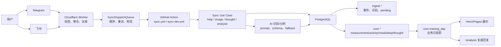

# 核心代码优化 01：总体重构设计

## Goal Document: 核心代码优化 01

### Go / No-Go

- **Judgment**: Go
- **Reason**: 当前系统已经完成 PostgreSQL 单一事实源、六边形架构雏形、Telegram/飞书统一 Worker 与统一 GitHub Action，但同步任务、AI 调度、失败重放、数据库幂等与环境一致性仍有跨层语义耦合。本轮只输出可执行重构设计与 checklist，不直接修改生产代码，风险可控。

### Target Outcome

在 `docs/优化重构/核心代码优化01/` 下形成一套可执行、可验证、可回滚、可审计、可追踪的核心代码优化方案，覆盖总体设计、模块级方案、数据库、消息链路、AI 容灾、分支环境一致性与实施路线图，且明确不破坏核心能力清单中的任何链路。

### Goal Definition

- **Type**: technical / quality / operational
- **Boundary**: 本轮输出优化设计文档，不执行源码改造；范围覆盖随想、图片处理、分析、Cloudflare Action、数据库、消息链路、AI 容灾和 dev/main 环境一致性。
- **Non-goals**:
  - 不重写 Telegram/飞书业务行为。
  - 不改变 PostgreSQL 当前事实源原则。
  - 不删除现有兼容层、Workflow、Worker 或 SQL 文件。
  - 不迁移真实线上数据。
- **Deferred work**:
  - 后续按路线图分阶段实现数据库迁移、同步任务表、ChannelAdapter、AI 调度器与观测面板。
- **Verification rule**: 指定目录和文件存在，且每份文档包含影响范围、优先级、风险等级、回滚方案或验证路径。
- **Evidence source**: 本仓库源码、SQL、GitHub Actions、Cloudflare Worker 和既有架构文档静态审计。GitHub repo Variables/Secrets 名称、dev/main 分支近期 Action 日志属于外部运行观察，只能作为风险线索，不能替代 repo 内可复验依据。
- **Pass criteria**: 文档包满足 `/Users/soulgo/Downloads/系统重构优化.md` 的全部输出结构与约束。
- **Confidence note**: 方案基于当前代码文件与已有 v13/v20 架构文档，未依赖无法反读的线上 secrets 或控制台状态。
- **Judgment owner**: 用户验收 + 后续实施阶段的自动化测试和线上回执。

## 第四轮系统认知校准补充

### 系统核心价值

本系统的核心价值不是“聊天机器人”或“训练记录页面生成器”，而是把用户在聊天工具中自然发送的训练、饮食、体脂秤、睡眠截图和主观反馈，低摩擦、可追溯地转成 PostgreSQL 结构化事实，再服务于长期复盘、页面展示和 AI 分析。

一句话概括：

```text
多通道自然输入 -> AI 识别与结构化 -> 日期/置信度/业务校验 -> ingest 审计 -> core 事实入库 -> training_day 投影 -> 页面与分析消费
```

### 核心业务、辅助功能和不可破坏功能

| 分类 | 内容 | 重构含义 |
| --- | --- | --- |
| 核心业务 | 训练图片、饮食图片、体脂秤截图、睡眠截图的采集、识别、校验、入库；随想和身体反馈沉淀；分析模块读取结构化事实生成复盘 | 任何重构必须先保护这些链路的语义，再谈模块拆分和性能优化 |
| 辅助功能 | help 命令、通知、部署、Markdown 导出备份、archive 历史快照、CI、配置巡检、运行日志汇总 | 可以优化或替换，但不能反向改变核心事实写入 |
| 受保护维护能力 | Markdown 导入、Markdown reconcile、pending 重放、DB fallback 审计 | 不属于日常主路径，但会写入或恢复核心数据，必须单独验收 |
| 不可破坏功能 | Telegram/飞书双通道核心能力、AI 不猜测规则、日期证据和 warning 保留、DB transaction/幂等/pending、随想新增编辑删除迁移和图片附件、分析只读、Markdown whole-day replacement 边界 | 上线验收必须覆盖，不能只用 GitHub Action 绿色作为通过依据 |

### 系统业务总览



### 核心链路的业务解释

1. 训练、饮食、体脂秤、睡眠图片是同一类“外部事实采集”问题：用户发送截图，系统用 AI 只提取图片中可见事实，经过 schema、日期、置信度和业务规则校验后写入 `core.*` 明细表。
2. 随想系统是“主观事实采集”问题：用户记录训练感受、身体反馈或杂项观察，系统保留新增、编辑、删除、模块迁移和图片附件能力，并把可分析内容镜像到 `core.thought`。
3. 分析系统是“事实消费”问题：它读取训练、饮食、睡眠、体脂和身体反馈，不应写入核心事实，也不能把分析失败扩大成数据损坏。
4. Markdown 导入是“维护与恢复入口”问题：它不是普通导出备份，而是会把 `训练记录.md` 解析后以 whole-day replacement 写回 `core.*`，因此必须和图片增量写入分开验收。

### 双通道系统边界

所有核心采集能力必须同时支持 Telegram 和飞书。两个通道可以在 webhook 验证、消息 ID 形态、图片下载、回执发送、Telegram Markdown 附件支持等实现细节上不同，但不能在业务语义上不同：

- 图片类型含义不能不同：`workout`、`nutrition`、`measurement`、`sleep`、`unknown` 在两个通道必须映射到同一套识别目标和入库目标。
- 数据准确性规则不能不同：不可猜测、低置信度跳过、日期证据保留、warning 输出、manual intervention 语义必须一致。
- 入库目标不能不同：同一业务事实必须进入同一组 `core.*` 表，并保留 `source_channel` / `source_batch_id` 等来源信息。
- 随想生命周期不能不同：新增、编辑、删除、移动、图片附件应保持同一业务能力，只允许通道资源能力差异导致表现不同。
- 分析语义不能不同：分析只读，回复到来源通道，不能因为通道差异改变读取范围或写入核心数据。

### 业务优先级原则

- 数据准确性优先于性能：宁可 `skipped/manual_intervention`，也不能把不可靠日期或 AI 猜测写成事实。
- 稳定性优先于复杂设计：pending、幂等、事务和来源审计是重构前置保护，不是附加优化。
- 核心功能优先于架构命名：先确保双通道核心采集和入库行为一致，再推动 `Telegram` 语义命名泛化。
- Action 成功不等于业务成功：业务验收必须查看 `taskStatus`、`persistenceStatus`、`failureDisposition`、`dateSources`、`warnings` 和回执内容。

## 当前架构问题总结

| 问题 | 证据 | 影响范围 | 优先级 | 风险等级 |
| --- | --- | --- | --- | --- |
| 通用消息同步仍以 Telegram 语义命名 | `src/app/use-cases/feishu-sync.use-case.mjs` 通过 `runTelegramSync()` 注入飞书 I/O | 飞书、Telegram、测试、通知摘要 | P1 | P1 |
| 失败重放存在双轨 | 数据库 `ingest.telegram_pending_batch` 与本地 `runtime/telegram-sync-pending.ndjson` 并存 | 数据库不可用、CI、GitHub Actions 重试 | P0 | P1 |
| DB 写入 facade 仍承担事务、幂等、分支路由 | `src/db/training/write.mjs` 仍是核心写入口 | 图片入库、随想、Markdown 导入、archive 回填 | P1 | P1 |
| ingest 表仍以 telegram 命名 | `ingest.telegram_batch/message/recognition/pending_batch` 承载飞书 payload | 数据审计、幂等键、跨渠道追踪 | P1 | P2 |
| AI 调度能力散落在识别/分析链路 | 原始审计发现识别有 fallback、分析主要通过通用 provider 重试；当前本地实现已支持 recognition/analysis 场景配置，analysis 在 scheduler 开启时可使用 `AI_ANALYSIS_MODEL`、`AI_ANALYSIS_TIMEOUT_MS`、`AI_ANALYSIS_MAX_ATTEMPTS` 和 `AI_ANALYSIS_FALLBACK_*`，并在 batch/report 中暴露 `analysisAttemptKind/model/snapshotSource`。真实 dev/main `/analysis` 端到端仍需验收 | 图片识别、训练分析、通道回执 | P1 | P1 |
| Workflow 内嵌大量业务判断 | `.github/workflows/sync.yml` 与 `sync-dev.yml` 包含 channel 判定、DB-only 变更、summary 解析 | main/dev 一致性、维护成本 | P2 | P2 |
| 环境漂移缺少机器可读契约 | `wrangler.toml`、`wrangler.dev.toml`、GitHub Variables/Secrets 只能靠文档和测试部分覆盖 | dev/main、Worker、Actions | P1 | P2 |
| Action 绿色不等于业务成功 | dev 最近 10 次 run 顶层全绿，但 `27677722244` 出现 `partialFailure` / `pending_replay` / `auto_retry`，`27726387902` 出现 `skipped` / `manual_intervention` | 飞书图片识别、DB 重放、告警 | P1 | P1 |
| 飞书与 Telegram 不是完全等价通道 | 飞书使用字符串 `message_id`、`image_key`、tenant token、签名/加密校验；Telegram 使用整数 message_id、file_id、secret header | 随想、图片、回执、环境隔离 | P1 | P2 |
| main 分支飞书 sync -> deploy 链路在历史窗口反复失败 | 最近 20 次全分支扫描中 4 次失败（`27700045978`、`27700072997`、`27698033957`、`27698068999`），均发生在 2026-06-17 22:53-23:29（Asia/Shanghai）；最新 10 次 Actions 已恢复全绿 | 飞书数据入库后页面未更新、用户体验受损；仍需复盘防复发 | P0 | P1 |
| npm 依赖存在 4 个 vulnerable packages | `npm audit --omit=dev` 报告 2 moderate + 2 high（dompurify XSS/sanitization bypass、form-data CRLF、js-yaml DoS、ws 内存耗尽） | HTML sanitization、AI/飞书 API 请求、YAML 解析、Worker 开发链 | P1 | P1 |
| AI 调用超时与限流仍需真实环境验收 | 原始审计发现 `AI_TIMEOUT_MS` 缺失时存在卡死风险；当前本地实现已在 `openai-compatible` adapter 中把缺失/非法值默认到 45000ms 并注入 AbortController，`AI_CONCURRENCY` 保持默认 3 且支持硬上限 clamp；真实 GitHub Variable 与 dev/main 端到端仍需验收 | Action 慢请求风险已有代码级缓解，但真实运行耗时和调参仍需平台证据 | P1 | P1 |
| Markdown 导入链路未进入核心保护清单 | `package.json` 提供 `import:markdown` / `reconcile:markdown`，`src/db/training/write.mjs#importTrainingMarkdownToDatabase()` 会解析 Markdown 并替换 core day | Markdown 上传、解析、内容入库和异常处理若在重构中被破坏，可能造成历史数据缺失或覆盖 | P0 | P1 |
| 图片日期归档置信度模型需保留真实平台验收 | 原始审计发现 `27726311686` 中消息时间为 `2026-06-18 07:28:01 Asia/Shanghai`，warning 提示截图只显示 `6月18日`，但 `sleep_bedtime` 推导到 `archivedDate=2026-06-17`；`27723440758` 同批混合 `image/sleep_bedtime/no_date`。当前本地合同已补 `dateConfidence/dateStages` 并进入 Telegram/飞书 summary；真实 dev/main 图片端到端仍需验收 | 图片入库、睡眠跨日、飞书/Telegram summary、人工复核 | P1 | P1 |
| `isTelegramImageBatch` 空图片误判需保留回归保护 | 原始审计发现 `kind === 'image'` 但无 `photos` 可能误入图片链路；当前本地实现已要求显式 image batch 至少包含一条 `photos`，并保留旧批次缺失 `kind` 的兼容路径 | 图片入库、批次状态；dev/main 图片端到端仍需验收 | P0 | P1 |
| `SyncDispatchQueue` alarm 存在竞态条件 | `cloudflare/sync-dispatch-queue.mjs` 中 `setStateAlarm` 在多处被调用，DO 单线程但 alarm 设置与执行可能存在竞态 | 任务重复处理或丢失 | P1 | P1 |
| `notifyTaskNotStarted` 通知失败可观测性需保留回归保护 | 原始审计发现通知失败可能静默；当前本地实现已记录 Telegram/飞书 task-start 通知失败，仍需真实 Worker tail/DO storage 演练 | 死信队列可观测性 | P2 | P2 |
| Markdown `skipIfUnchanged` sleep 比较需保留回归保护 | 原始审计发现比较函数漏掉 `day.sleep`；当前本地实现的 snapshot 比较已覆盖 sleep 记录和睡眠健康字段，只改 sleep 的 Markdown fixture 会写库 | Markdown 导入、睡眠恢复；真实 dev/main 导入仍需验收 | P1 | P1 |
| core 明细幂等 key 来源隔离需保留回归保护 | 原始审计发现业务 key 冲突可能覆盖来源字段；当前本地 key 生成已包含 `source_channel`，Telegram/飞书同日同事实不会互相覆盖，但仍需保留来源审计回归测试 | 跨通道/跨批次相同业务事实的来源审计 | P1 | P1 |
| `/analysis` strict_db 策略需保留真实端到端验收 | 原始审计发现分析只按 `TRAINING_SNAPSHOT_SOURCE=database` 决定是否 fallback Markdown；当前本地实现已通过 `TRAINING_ANALYSIS_SNAPSHOT_POLICY=strict_db|allow_markdown_fallback` 显式区分 `strict_db_error` 与 `fallback_markdown`，且不把 `TRAINING_SNAPSHOT_STRICT_DATABASE` 误当作分析 strict 开关 | main 分析必须在 summary/回执中可判读 snapshotSource；真实 dev/main 端到端仍需验收 | P1 | P2 |
| TelegramAlbumBuffer dispatch 失败恢复需保留真实平台验收 | 原始审计发现 dispatch 失败后清空缓冲；当前本地实现已保留 `updates`、退避重试，超过最大次数写 `deadLetters`，通知失败记录日志 | Action 未启动且通知失败时的 Worker 层恢复路径；真实 Cloudflare DO 仍需演练 | P1 | P1 |
| 飞书签名 timestamp/replay 防护需保留真实平台验收 | 原始审计发现 HMAC 校验缺少 timestamp 新鲜度；当前本地实现已拒绝过旧/过远未来 timestamp，并对同窗口 nonce/signature 重放记录 warning | 入口防重放；真实飞书回调与时间偏差仍需演练 | P1 | P1 |

## 重构目标

1. 把“Telegram 管线”升级为“统一消息同步任务管线”，Telegram 和飞书成为 ChannelAdapter。
2. 把失败重放统一迁移到 PostgreSQL，运行时 NDJSON 只作为本地降级出口并设置清理边界。
3. 把图片识别、随想、分析、数据库写入的任务状态统一审计，支持按 `task_id` 追踪端到端链路。
4. 把 AI 调用统一为可配置的调度器，支持主备、超时、退避、熔断、审计日志与幂等防重。
5. 把 dev/main 的配置契约写成可测试规范，防止 Worker、Action、DB、AI、通道变量漂移。
6. 为图片归档补 `dateConfidence`、`dateSources` 和 `warnings` 的合同，区分可靠日期、推导日期、不确定日期和缺失日期。
7. 保持核心能力不破坏：随想写入/编辑/删除/移动、训练/饮食/体脂秤图片识别入库、训练分析回复、Markdown 导入入库、Cloudflare 到 GitHub Actions 的自动同步。

## 重构原则

- **DB-first**: PostgreSQL `core.*` 和 `ingest.*` 是事实源，Markdown 和 runtime 文件只作派生或降级。
- **行为先锁定**: 每阶段先补合同测试，再做实现。
- **兼容先并行**: 新表、新接口先双写或灰度读取，稳定后再切换。
- **可回滚**: 每次迁移保留旧入口和旧数据读取路径，回滚以配置开关优先。
- **幂等优先**: 所有外部消息、AI 调用、数据库写入和 GitHub dispatch 均必须有稳定 key。
- **审计优先**: 业务失败不能只体现在 GitHub Action 红绿状态，必须落到任务状态和失败分类。
- **运行证据优先**: 设计文档必须引用近期 Action 日志、GitHub 配置和通道回执，不只引用源码结构。

## 核心链路优化方案

### 1. 统一消息任务模型

新增概念 `MessageSyncTask`，不再以 Telegram batch 作为通用模型名。

建议字段：

| 字段 | 含义 |
| --- | --- |
| `taskId` | `channel:eventId/messageId/mediaGroupId` 生成的稳定幂等键 |
| `channel` | `telegram` / `feishu` |
| `sourceChatId` | 原始 chat/open_chat_id |
| `sourceMessageIds` | 原始消息 ID 列表 |
| `kind` | `image` / `thought` / `analysis` / `help` / `system` |
| `payloadHash` | 规范化 payload 的 sha256 |
| `status` | `received` / `recognized` / `stored` / `pending_retry` / `failed` |
| `failureCategory` | `ai_service` / `database` / `channel_api` / `user_input` / `system_bug` |
| `trace` | Worker dispatch id、GitHub run id、AI request id、DB tx metadata |

### 2. ChannelAdapter 抽象

把 Telegram/飞书差异收敛为：

- `verifyWebhook(request, env)`
- `groupEvents(events)`
- `downloadImage(message)`
- `sendText(chatId, text)`
- `normalizeCommand(message)`
- `buildTaskId(event)`

当前 `runFeishuSync()` 继续复用 `runTelegramSync()` 是合理过渡，但目标是 `runMessageSync({ adapter })`。

### 3. 数据写入分层

将 `src/db/training/write.mjs` 的职责拆为：

- `IngestTaskRepository`: 原始任务、消息、识别、失败重放。
- `CoreTrainingRepository`: measurement/activity/meal/sleep 增量 upsert。
- `CoreThoughtRepository`: 随想 mirror、编辑、删除、移动。
- `TrainingDayProjectionService`: 从子表刷新 `core.training_day`。
- `TrainingWriteUseCase`: 编排事务和幂等。

### 4. AI 调度层

新增 `AiScheduler`：

- 按场景区分 `recognition` / `analysis`。
- 每个场景配置 primary/fallback provider、timeout、max attempts、并发、熔断窗口。
- 所有 AI 调用写入 `ingest.ai_call_log`。
- AI 输出缓存使用 `taskId + imageFingerprint + promptVersion + model`。

### 5. 环境契约

新增 `docs/优化重构/核心代码优化01/分支与环境一致性.md` 所述契约，并逐步补测试：

- `wrangler.toml` 与 `wrangler.dev.toml` 的 worker 名称、dispatch type、Durable Object binding 必须可测试。
- `sync.yml` 与 `sync-dev.yml` 的 channel、DB URL、bot token、Feishu secret 来源必须可测试。
- 关键变量缺失时 CI 给出明确错误，不允许运行到业务中途才失败。

## 风险控制策略

| 风险 | 控制策略 | 回滚方式 |
| --- | --- | --- |
| 新任务模型影响旧 Telegram batch | 先做适配层映射，旧 `batchResults` 输出保持不变 | 配置切回 `runTelegramSync()` |
| pending 数据迁移丢失 | NDJSON 与 DB pending 双读，DB 成功后再清理文件 | 保留 NDJSON 重放脚本 |
| AI fallback 误重复执行 | AI 调用日志加入 idempotency key 与输出缓存 | 关闭 `AI_SCHEDULER_ENABLED` |
| SQL schema 迁移失败 | 只 additive migration，不 drop 旧表旧列 | 回滚 migration 或停用新读路径 |
| dev/main 配置不一致 | 合同测试和配置清单共同约束 | 回退到已知稳定 workflow/worker 配置 |
| main 飞书 deploy 链路断裂 | 先定位根因（deploy 触发超时 vs 构建失败 vs 页面验证），不在未查明前改 workflow 结构 | 保持现有 workflow 不变 |
| npm 安全漏洞被利用 | `npm audit fix` 修复已知漏洞，CI 增加 `npm audit --audit-level=high` | `git checkout package-lock.json` |
| Node.js 弃用模块导致 CI 失败 | 定位 `url.parse()` 和 `punycode` 来源并替换 | 回退依赖版本 |

## 数据一致性设计

- `core.training_day` 仍作为投影表，不作为唯一明细事实源。
- `core.measurement/activity/meal/sleep/thought` 是结构化事实源。
- `ingest.*` 记录原始事件、识别结果、失败任务和 AI 审计。
- Markdown 导入是受保护写入链路：`import:markdown` / `reconcile:markdown` 会把 `训练记录.md` 解析为 snapshot，并以 `sourceChannel=markdown_import` 写入 `core.*`。该链路不是 Markdown 备份的反向操作，重构 DB facade、parser 或 training_day 投影时必须单独验收。
- Markdown 导入的 `skipIfUnchanged` 必须覆盖 sleep；当前本地实现已把 `day.sleep` 纳入 stable comparison，只改睡眠的 fixture 会返回 `stored`。真实 dev/main Markdown 导入仍需检查 affected days、`sourceChannel=markdown_import` 和 DB 对账，未完成前不能作为上线验收通过证据。
- 同一任务多次执行必须满足：
  - 相同 `taskId + payloadHash` 返回 `unchanged`。
  - 相同业务明细 upsert 不产生重复行。
  - 相同业务明细来自多个通道/批次时，不能覆盖丢失来源元数据；要么来源多值化，要么 key 纳入来源维度。
  - `training_day` 只由明细聚合刷新。
- `source_channel` 必须从 `telegram` / `feishu` 贯穿到 core 子表和 thought。

## 消息处理优化设计

统一处理顺序：

1. Worker 验证来源（Telegram：`X-Telegram-Bot-Api-Secret-Token` 共享密钥比对；飞书：verification token + HMAC-SHA256 签名校验 + 可选 AES-CBC 加密信封解密）。
2. Durable Object 聚合图片 burst（`TelegramAlbumBuffer` / `FeishuImageBuffer`，3 秒窗口合并同 chat 图片消息）。
3. `SyncDispatchQueue` Durable Object 生成 `task_id` 并串行派发 `workflow_dispatch`（带指数退避重试和死信队列）。
4. GitHub Action 接收 `dispatch_payload`，解析 channel，运行对应 sync 命令。
5. Use Case 加载 grouped batches，按 `kind` 分流（help / analysis / thought* / image）。
6. 图片任务进入 AI 识别和缓存。
7. ready task 进入 DB 事务。
8. 结果写任务状态和通道回执。

顺序队列策略（当前已实现）：

- `SyncDispatchQueue` 按 `sortKey` 顺序处理同队列任务。
- 同一 `channel + chatId` 的图片消息在 Durable Object 层合并为单批。
- repository_dispatch fallback 无原生顺序保证，但 `cancel-in-progress: false` 防止相互取消。

最近 10 次 Actions 与 dev Action 日志中的运行事实：

- 最新 10 次仓库 Actions 顶层均为 success，其中 main `Sync (Main)` / `Deploy GitHub Pages` 已有恢复成功样本。
- `Sync (Dev) #57` 飞书图片链路成功，但 recognition 约 37.7s、persist 约 6.6s，说明飞书 inline 图片识别和 DB 写入都需要独立耗时预算。
- `Sync (Dev) #53` 出现 recognition cache timeout、AI schema parse failure、DB timeout，最终 `persistenceStatus=pending_replay`、`failureDisposition=auto_retry`，Action 仍是 success。
- `Sync (Dev) #56` 出现 `taskStatus=skipped`、`failureReason=no reliable image or filename date`、`failureDisposition=manual_intervention`，Action 仍是 success。
- `Sync (Main)` / `27726311686` 中，消息时间是 `2026-06-18 07:28:01 Asia/Shanghai`，识别 warning 提示截图只显示 `6月18日` 且缺少年份，但睡眠跨日规则把 `archivedDate` 推导为 `2026-06-17`。
- `Sync (Main)` / `27723440758` 中，同批图片同时出现 `6月18日` warning、`image header: 2026-06-17`、`sleep_bedtime` 和 `no_date`，但 Action 仍是 success。
- 最近的 dev deploy run 中，只有携带 target thought 输入时才执行 `Verify deployed thought module page`；无 target 输入时该步骤 skipped 是正常行为，不能用来证明随想模块校验已覆盖。

图片日期归档的目标状态：

- `archivedDate` 继续作为最终入库日期，但不得单独代表日期可靠。
- `dateSources` 原样保留每张图片的日期证据和来源。
- `warnings` 中的日期相关风险必须进入 summary。
- 新增 `dateConfidence=exact|derived|uncertain|missing`，作为 deploy/通知/人工介入 gate 的稳定输入。
- `manual_intervention`、`dateConfidence=missing` 和高风险 `dateConfidence=uncertain` 不能算完整业务通过。

## AI 容灾设计

- recognition 与 analysis 分别配置超时和 fallback。
- recognition 失败按图片消息维度局部失败，不阻断同批其它图片。
- analysis 失败只影响回复，不写 core。
- `/analysis` 当前通过 `TRAINING_ANALYSIS_SNAPSHOT_POLICY=strict_db|allow_markdown_fallback` 显式控制 database snapshot 失败后的行为；`TRAINING_SNAPSHOT_STRICT_DATABASE` 不是当前分析链路的 strict 开关。真实 dev/main 仍需验证 summary/回执能清晰暴露 `snapshotSource=database|fallback_markdown|strict_db_error`。
- 所有 AI 错误按 `timeout`、`rate_limit`、`server_error`、`invalid_schema`、`empty_content`、`network` 分类。
- fallback 只在可恢复错误上触发，不在 schema 业务校验失败上无限重试。当前代码中 provider/network/timeout/429/5xx/empty content 等会触发 primary -> fallback；AI 返回非 JSON 或 schema parse 失败先在同一 provider 上用严格 JSON 提示重试，仍失败后才记为 schema 失败，不应笼统写成“schema 错误都会 fallback”。
- 图片 caption/text 与分析 question 由 `JSON.stringify` 包装成请求体，不会因为普通引号直接破坏 JSON；原始审计发现的真实风险是无长度上限、控制字符和 prompt 注入边界。当前本地合同已通过 `sanitizePromptUserText()` 与 `normalizeAnalysisQuestion()` 限长、移除控制字符，并在 prompt 中标注用户文本仅作为上下文；真实 dev/main 超长、HTML、Emoji、控制字符端到端仍需验收。

## Cloudflare Worker 当前架构

```
cloudflare/
  sync-dispatch-worker.mjs       # 入口，channel 检测 + 路由
  telegram-sync-dispatch-worker.mjs  # Telegram webhook 处理 + TelegramAlbumBuffer DO
  feishu-sync-dispatch-worker.mjs    # 飞书 webhook 处理 + FeishuImageBuffer DO
  sync-dispatch-queue.mjs            # SyncDispatchQueue DO（队列+重试+死信）
```

三个 Durable Object 绑定：

- `TELEGRAM_ALBUM_BUFFER` — 3 秒窗口合并 Telegram 同 chat 图片消息
- `FEISHU_IMAGE_BUFFER` — 3 秒窗口合并飞书同 chat 非文本消息
- `SYNC_DISPATCH_QUEUE` — 串行派发 workflow_dispatch，三阶段状态机，指数退避重试，死信队列

## 当前 GitHub 配置事实

仓库级 Variables 已确认包含：

- AI：`AI_BASE_URL=https://www.packyapi.com/v1`、`AI_MODEL=gpt-5.4-mini`
- 识别 fallback：`TELEGRAM_RECOGNITION_FALLBACK_BASE_URL=https://api.moonshot.cn/v1`、`TELEGRAM_RECOGNITION_FALLBACK_MODEL=kimi-k2.6`、`TELEGRAM_RECOGNITION_FALLBACK_TIMEOUT_MS=30000`
- 页面地址：`CLOUDFLARE_PAGES_BASE_URL=https://soulgo.chat`、`CLOUDFLARE_PAGES_DEV_BASE_URL=https://training-records-dev.pages.dev`
- 通道：`TELEGRAM_ALLOWED_CHAT_IDS`、`FEISHU_ALLOWED_CHAT_IDS`、`DEV_FEISHU_ALLOWED_CHAT_IDS`
- DB：`TRAINING_DB_ENABLED=true`、`TRAINING_DB_TIMEOUT_MS=3000`、`TRAINING_SNAPSHOT_SOURCE=database`

Secrets 值不可反读，但名称已确认存在：`AI_API_KEY`、`TRAINING_DB_URL`、`DEV_TRAINING_DB_URL`、`TELEGRAM_BOT_TOKEN`、`DEV_TELEGRAM_BOT_TOKEN`、`FEISHU_APP_ID`、`FEISHU_APP_SECRET`、`DEV_FEISHU_APP_ID`、`DEV_FEISHU_APP_SECRET`、Cloudflare 相关 token 等。

GitHub Environment 当前只有 `github-pages`，且 environment-level variables/secrets 为空；配置隔离主要依赖 repo-level vars/secrets 和 workflow 条件。

## 核心能力保护清单

| 核心能力 | 不破坏约束 | 验证 |
| --- | --- | --- |
| 随想 | `/thought`、`/thought-edit`、`/thought-delete`、`/thought-move` 行为和 Markdown 备份派生不变 | `test/telegram-sync.test.mjs`、`test/feishu-sync.test.mjs`、thought module 测试 |
| 图片处理 | measurement/workout/nutrition/sleep 识别与增量入库不删除同日其它模块 | `test/ai-recognition-service.test.mjs`、`test/training-db-core.test.mjs` |
| 分析 | `/analysis` 只回复，不写 DB/Markdown；snapshotSource 必须暴露 `database/fallback_markdown/strict_db_error` | `test/training-analysis.test.mjs` |
| Markdown 导入 | `import:markdown` / `reconcile:markdown` 保持 Markdown 上传、解析、whole-day 写入和异常返回语义；空/损坏 Markdown 不得静默覆盖有效 core 数据；只改 sleep 不得被 `skipIfUnchanged` 跳过 | `test/training-db-core.test.mjs`、Markdown parser/import fixture |
| Cloudflare Action | Telegram/飞书 webhook 仍 dispatch 到正确 workflow | `test/sync-dispatch-worker.test.mjs`、`test/github-workflows.test.mjs` |

## 第五轮生产就绪补充

本轮审查结论：当前文档包已经能指导开发和重构分阶段推进，但距离“未来运维人员仅靠文档处理线上问题”仍是**有条件通过**。主要缺口不是源码中完全没有容灾能力，而是容灾能力分散在 Worker、GitHub Actions、数据库 pending、Markdown 备份和历史维护文档中，核心重构目录此前缺少集中化的生产故障处理准入标准。

生产运行时必须先建立四层成功定义：

| 层级 | 成功定义 | 不能误判为成功的状态 |
| --- | --- | --- |
| Worker 接收 | Telegram/飞书 webhook 鉴权通过，任务进入 `SyncDispatchQueue` 或 fallback dispatch 成功 | HTTP 202/200 但队列后续 dead-letter、TelegramAlbumBuffer dispatch 失败后缓冲被清空 |
| GitHub Action 执行 | `sync.yml` / `sync-dev.yml` run 完成，并写出 channel summary | Action conclusion 为 success 但 batch 是 `pending_replay`、`manual_intervention`、`skipped`、`partial_failed` |
| 业务入库 | `taskStatus=ready` 且 `persistenceStatus=stored/unchanged`，必要时 `core.training_day` 已刷新 | `pending_replay`、DB-only deploy 未触发、`dateConfidence=uncertain/missing` |
| 用户可见 | 来源通道收到回执，页面或分析读取到最新 DB snapshot | 通知步骤 `continue-on-error` 静默失败、Cloudflare cache 未清理、Deploy workflow 超时 |

### 生产角色阅读入口

| 角色 | 第一阅读文件 | 必须能回答的问题 |
| --- | --- | --- |
| 系统架构师 | 本文、`消息链路.md`、`数据库优化.md` | 核心事实从哪里来、哪里可以丢、哪里必须幂等、哪些链路不能被 Action 绿色掩盖 |
| SRE 工程师 | `消息链路.md`、`AI 容灾与调度优化.md`、`分支与环境一致性.md` | 哪些指标告警、哪些失败自动重试、何时进入人工介入、如何防止无限重试 |
| 运维工程师 | `实施checklist.md`、`数据库优化.md`、`docs/问题排查/常见问题排查.md` | 如何根据 summary、pending、Worker tail 和 DB 查询定位并恢复 |
| 新接手开发人员 | `实施checklist.md` 的阅读路径、模块文档 | 从入口、同步、AI、DB、Markdown 导入到页面的端到端调用关系 |

### 生产故障响应总原则

1. 先区分**平台故障**、**业务拒绝**和**数据风险**：平台故障可重试，业务拒绝通常需要用户重发或人工判断，数据风险先冻结写入再恢复。
2. 先看 `Sync (Main)` / `Sync (Dev)` summary，再看 workflow conclusion。summary 中 `failureDisposition=auto_retry` 表示待补偿，不代表业务完成。
3. 对图片任务，必须同时看 `archivedDate`、`dateSources`、`warnings` 和目标 `dateConfidence`。只有 `archivedDate` 不能证明日期可靠。
4. 对数据库故障，优先运行 `npm run maintenance:inspect` 查看 pending 数量和 DB 可用性；不要直接用旧 Markdown 覆盖 `core.*`。
5. 对 Markdown 导入或数据恢复，必须把 `训练记录.md` 当作写库输入，不是只读备份；恢复前先导出或备份当前数据库快照。

## Final Validation

```bash
find docs/优化重构/核心代码优化01 -type f | sort
npm test
node --test test/cloudflare-config.test.mjs test/github-workflows.test.mjs test/sync-dispatch-worker.test.mjs
```

## Bug 修复方案（本轮审计新发现）

### P0-4: `isTelegramImageBatch` 空图片误判

**修复方案**：
- 修改 `src/db/training/write.mjs:652-654`：
  ```js
  function isTelegramImageBatch(batch) {
    return (batch?.kind ?? 'image') === 'image' &&
           (batch?.messages?.some((m) => (m.photos?.length ?? 0) > 0) ?? false);
  }
  ```
- 增加测试：`test/training-db-core.test.mjs` 中补充 `kind === 'image'` 但 `photos` 为空时的断言。
- 回滚方案：如引入新断言导致旧数据不兼容，可临时回退到旧逻辑。

### P1-5: `SyncDispatchQueue` alarm 竞态条件

**修复方案**：
- 修改 `cloudflare/sync-dispatch-queue.mjs`：
  1. `setStateAlarm` 前增加 `await this.state.storage.get('processing')` 校验，如已有任务在处理中则跳过。
  2. 在 `continueProcessing` 入口处增加幂等判断：如果同一 `task.id` 已在处理中，直接返回。
  3. DO 单线程已保证执行串行，但 alarm 触发与外部请求可能并发，需增加 `processing.task.id === task.id` 校验。
- 增加测试：`test/sync-dispatch-worker.test.mjs` 中补充并发 enqueue 同一 task 的场景。

### P2-6: `notifyTaskNotStarted` 静默吞掉异常

**修复方案**：
- 修改 `cloudflare/sync-dispatch-queue.mjs:596-599`：
  ```js
  try {
    return await fetchImpl(...);
  } catch (error) {
    const msg = `[sync-dispatch-queue] notification failed: ${error instanceof Error ? error.message : String(error)}`;
    process.stderr.write(msg + '\n');
    // 可选：写入死信日志或 metrics
    return null;
  }
  ```
- 增加 stderr 输出，确保通知失败时有可见日志。
- 增加测试：模拟 `sendMessage` 失败，断言 stderr 包含 "notification failed"。

## First Execution Step

按 `优化实施路线图.md` 的短期阶段，先补“消息任务模型合同测试”和“数据库 pending 双读测试”，不先改线上入口。
