# 系统代码重构实施方案（历史实施方案）

> 本方案以 [当前系统代码分析](01_当前系统代码分析.md) 的真实代码审计为依据。目标不是机械增加层级，而是把平台协议、图片/OCR/AI 技术细节、训练业务规则和持久化策略分别放回唯一 owner。

## 1. 目标架构

```mermaid
flowchart LR
  TG["Telegram Adapter"] --> M["SourceMessage"]
  FS["Feishu Adapter"] --> M
  M --> C["Message Sync Coordinator"]
  C --> A["ImageAsset Loader"]
  A --> P["Image Processor"]
  P --> O["OCR Provider"]
  P --> V["Vision Understanding Provider"]
  O --> U["Recognition Fusion"]
  V --> U
  U --> N["NormalizedRecognition"]
  N --> I["Ingest/Audit Repository"]
  N --> B["Training Recognition Mapper"]
  B --> D["Training Business Service"]
  D --> R["Core Repository"]
  R --> DB["PostgreSQL core.*"]
  I --> IDB["PostgreSQL ingest.*"]
  DB --> S["TrainingSnapshot Query"]
  S --> H["Hexo Static Frontend"]
```



不立即创建网络微服务。上述边界先在同一 Node 进程内成为稳定 contract；Docker/Kubernetes 部署需要独立伸缩时，OCR/AI contract 可以不改业务代码地搬到远程服务。

## 2. 核心契约

### 2.1 SourceMessage

```js
{
  sourceChannel: 'telegram' | 'feishu' | string,
  sourceChatId: string,
  sourceMessageId: string,
  sourceEventId: string | null,
  sentAt: string | null,
  text: string,
  caption: string,
  assets: [{
    sourceAssetId: string,
    kind: 'image' | 'document',
    mimeType: string | null,
    width: number | null,
    height: number | null,
    sizeBytes: number | null
  }],
  replyTo: { sourceMessageId: string } | null
}
```

规则：核心代码不得要求 Telegram numeric ID；平台 adapter 负责 wire payload 到 SourceMessage 的一次翻译。

### 2.2 ProcessedImage

```js
{
  bytes: Uint8Array,
  mimeType: 'image/jpeg' | 'image/png' | 'image/webp',
  width: number,
  height: number,
  sizeBytes: number,
  sha256: string,
  quality: {
    score: number,
    warnings: string[]
  },
  operations: string[]
}
```

图片处理 owner 负责：格式检测、EXIF 旋转、像素上限、压缩、适度 normalize/sharpen、质量证据；调用方不再拼 data URL 或判断扩展名。

### 2.3 OcrDocument

```js
{
  provider: string,
  model: string | null,
  fullText: string,
  regions: [{
    text: string,
    confidence: number | null,
    box: { x: number, y: number, width: number, height: number } | null
  }],
  languageHints: string[],
  confidence: number | null,
  warnings: string[]
}
```

OCR 可以关闭或替换；关闭时返回明确的 empty document，而不是让调用方判断 `undefined`。

### 2.4 NormalizedRecognition

```js
{
  sourceApp: string | null,
  dataType: string,
  fields: {},
  confidence: number,
  warnings: string[],
  evidence: {
    detectedDate: string | null,
    dateEvidence: string | null,
    ocr: OcrDocument | null,
    image: { sha256: string | null, width: number | null, height: number | null }
  },
  runtime: {
    pipelineVersion: string,
    schemaName: string,
    schemaVersion: string,
    provider: string,
    model: string,
    promptVersion: string,
    cacheKey: string | null,
    cacheStatus: string
  }
}
```

`fields` 是来源无关 observation；训练 mapper 再把支持的字段转换为当前 `measurement/activities/meals/sleep` 业务模型。未知 dataType 或未映射字段保存在 ingest，不直接污染 `core.*`。

## 3. 模块边界

| 边界 | 隐藏的复杂度 | 禁止泄漏 |
|---|---|---|
| Source adapters | Telegram/飞书 wire 格式、签名、平台 ID | numeric proxy、平台 payload 进入业务层 |
| Image processor | 格式、方向、尺寸、压缩、增强、质量 | base64/MIME 分支散落到 use case |
| OCR provider | OCR API/本地引擎、坐标、语言 | provider response shape |
| Vision understanding | multimodal request、structured output、retry | OpenAI response shape |
| Recognition fusion | OCR/vision 冲突、字段 evidence/confidence | App 专属 if/else |
| Training mapper | observation 到训练业务字段 | provider/platform 细节 |
| Ingest repository | 原始输入、运行、缓存、pending、审计 | SQL/表名进入 use case |
| Core repository | 训练事实的事务写入与 materialized summary | ingest 或 Markdown 兼容逻辑 |
| Static frontend | view model 到 HTML | DB/AI provider 直接依赖 |

## 4. 数据库目标

### 4.1 Staged migration

第一步不直接 drop 当前生产表，先建立来源无关表并回填：

- `ingest.source_batch`
- `ingest.source_message`
- `ingest.source_asset`
- `ingest.recognition_run`
- `ingest.pending_task`

`recognition_run` 的可查询列：`recognition_id`、source identity、`cache_key`、`source_app`、`data_type`、`confidence`、`pipeline_version`、`schema_name/version`、`provider/model/prompt_version`、`status`、时间字段；`fields_json`、`ocr_json`、`image_metadata_json`、`raw_result_json` 使用 jsonb。

### 4.2 兼容删除门禁

1. 新代码只写新表，迁移期通过一次 backfill 导入旧表，不永久双写。
2. 新读路径稳定后，旧表只读观察一个完整 pending/backup 周期。
3. 搜索、运行日志和数据库统计证明旧路径调用为 0。
4. 删除 `telegram_*` 表、numeric proxy 字段和 legacy indexes。
5. `sql/migration.sql` 提供 forward migration、中文注释、acceptance SQL；破坏性 drop 放在独立最终段并有显式 guard。

### 4.3 Core 模型

- 保留 `core.training_day/measurement/activity/meal/sleep/thought`。
- `core.sleep.sleep_stage_detail` 迁移为 jsonb。
- `core.thought` 只保留 source identity；移除 `telegram_message_id/telegram_chat_id`。
- materialized day summaries 保留并由 repository 单一刷新。
- unknown recognition 不写 core，进入 `recognition_run.status = 'unmapped'`。

## 5. 配置与部署

统一 runtime config loader，按场景返回脱敏后的 typed config：

- `APP_ENV=dev|main|local|test`
- `DATABASE_*` 按 app/readonly/migration 职责分离。
- `AI_*`、`OCR_*`、`TELEGRAM_*`、`FEISHU_*`、`STORAGE_*` 分组。
- dev secret 必须使用 `DEV_*`，禁止回退 production secret。
- 域名、GitHub repository、storage domain 都由 deployment profile 注入。
- Worker 入口和 Node use case 各执行一次 source allowlist。

保持现有 GitHub Pages/Cloudflare 部署可用，但核心模块不依赖它们；CLI、容器或其他 scheduler 可调用相同 use case。

## 6. 安全策略

- 原图、处理图、OCR、AI 原始输出默认 private，支持按类别配置保留期。
- public site 只接收明确允许发布的聚合 view model。
- user-facing error 只包含稳定 error code、简述、traceId。
- 内部日志统一结构：request/source trace、pipeline stage、AI audit、DB transaction、failure category。
- prompt user content、provider error、URL、token、chat/source ID 必须经过脱敏。
- `<script type="application/json">` 使用 script-safe serializer。

## 7. 实施顺序与验证

### Slice 1：识别 identity 与通用 envelope

- 修复 cache read 使用 source-aware `cacheKey`/source identity。
- 引入 NormalizedRecognition contract，并让 legacy payload 通过 mapper 进入 envelope。
- 更新 ingest 写入字段和 migration。
- 证明：跨 Telegram/飞书相同 legacy numeric ID 不会误命中；现有华为/Apple fixture 保持业务结果。

### Slice 2：图片处理

- 引入 ProcessedImage 与 Sharp adapter。
- 统一下载、方向、格式、像素/字节预算和 data URL。
- 证明：不同尺寸/格式 fixture 输出稳定 metadata，超限/损坏图有明确错误。

### Slice 3：OCR 与 fusion

- 引入 OcrDocument、provider factory、OpenAI-compatible OCR adapter。
- OCR 结果作为 vision context/evidence，保存文本和坐标。
- 证明：坐标 schema、provider fallback、OCR disabled/failed 路径和跨布局 fixture。

### Slice 4：SourceMessage

- Telegram/飞书各自输出 SourceMessage。
- 迁移 grouping/commands，不再 hash 飞书 ID 为 Telegram ID。
- 证明：跨平台 command、相册/burst、reply、pending 与 idempotency 回归。

### Slice 5：数据库新表与旧表退役

- 创建/回填 generic ingest 表。
- 切换 read/write、维护脚本和监控。
- 观察后删除旧表、legacy 字段和测试空壳。
- 证明：migration dry-run/confirm、数据计数和核心快照一致。

### Slice 6：配置、安全、前端与部署

- typed config、dev/main secret 隔离、Worker allowlist。
- safe HTML JSON、private/public storage policy、统一错误模型。
- Docker runtime entry 与平台无关启动验证。

## 8. 变更记录规则

每个 slice 在 [最终重构报告](06_最终重构报告.md) 记录：

- 修改文件
- 修改内容
- 修改原因
- 影响范围
- RED/GREEN/REFACTOR 证据
- migration 与回滚证据
- 未验证风险
