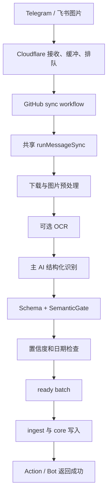
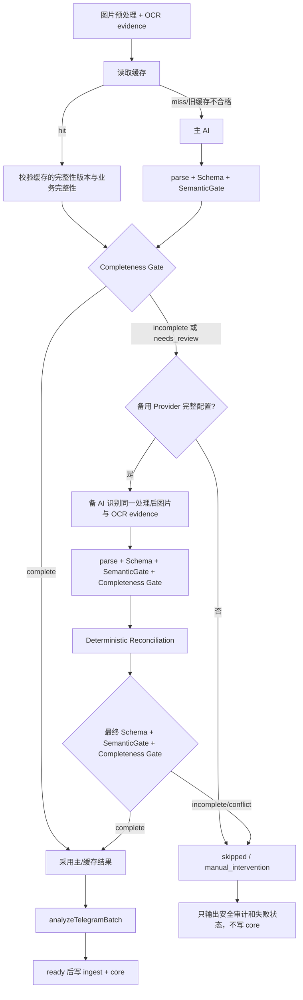

# 图片识别完整性校验与主备 AI 比对实施方案

> 文档状态：待实施<br>
> 编写日期：2026-07-16<br>
> 适用渠道：Telegram、飞书<br>
> 适用数据：体测、训练、饮食、睡眠图片<br>
> 配套核验：[图片识别完整性校验与主备AI比对核验Checklist.md](./图片识别完整性校验与主备AI比对核验Checklist.md)

## 1. 决策结论

**Go，但必须先完成 P0 数据保真修复，再接入完整性门禁。**

本文件是实施期间的一次性目标/需求/设计文档，不代表下述能力已经上线；完成后必须按第 17 节回写长期事实并删除本文件。

目标不是让主、备 AI 每次都执行，而是把“Schema 合法”与“业务数据完整”分开：

1. 主 AI 技术成功且业务完整：直接采用主结果，不调用备 AI。
2. 主 AI 技术失败：延续现有技术 fallback，调用备 AI。
3. 主 AI 技术成功但业务不完整或需要复核：调用备 AI，对两次结果做确定性补全与冲突判断。
4. 主备合并后再次通过 Schema、SemanticGate 和完整性门禁，才允许进入 `analyzeTelegramBatch()` 和 `core.*` 写入。
5. 主备仍不完整、关键字段冲突或备 AI 未配置：不得返回“解析成功/已入库”，不得写 `core.*`，应进入可审计的 `skipped` / `manual_intervention` 结果。

此外，`src/adapters/telegram/sync-analysis.adapter.mjs:341-353` 当前会在批次归一化时丢弃活动的 `durationSeconds`、`calories`、`heartRate`、`distanceKm`、`avgSpeedKmh`。这会导致 AI 已正确识别的训练消耗仍在入库前丢失，必须作为本需求的 P0 前置修复。

## 2. 目标与成功定义

### 2.1 业务目标

- 图片中应识别且可可靠读取的核心值，不再因为单次 AI 漏识别而静默写成 `null` 或错误汇总为 `0`。
- Telegram 与飞书共用同一套完整性规则、主备编排、审计和通知语义。
- “Webhook 已接收”“Action 绿色”“AI 返回合法 JSON”“数据库事务成功”“业务字段完整”成为不同状态，不再互相替代。
- 在不臆造截图不可见字段的前提下，提高体测、训练消耗、饮食热量和睡眠时长/评分的可用完整率。

### 2.2 可验收成功标准

- 主 AI 完整时，测试能证明备 AI 调用次数为 `0`。
- 主 AI 返回 Schema 合法但硬完整性字段为空时，测试能证明备 AI被调用一次。
- 备 AI 只补充主 AI 空值；关键字段冲突超出容差时不自动入库。
- 最终结果不完整时，`persistNormalizedBatch()` 不得收到 `ready` 图片批次。
- Bot 文案、Action summary 和 safe report 明确显示“备 AI 补全成功”“数据仍不完整”“关键字段冲突”或“备用识别未配置”，不伪装为成功。
- 缓存命中也执行完整性门禁，旧的不完整缓存不能绕过门禁。
- 活动结构化字段从 AI 结果一直保留到 `core.activity`。

## 3. 范围与非目标

### 3.1 本期范围

- `measurement`、`workout`、`nutrition`、`sleep` 四类图片的业务完整性合同。
- 主 AI 后置完整性校验、按需备用识别、确定性合并、冲突阻断、最终校验。
- 缓存版本、幂等键、识别审计、批次状态、Bot 回执和 Action summary。
- Telegram/飞书正常同步与 pending replay 的配置一致性。
- 识别 fixture、单元测试、渠道集成测试、数据库写入测试和手工验收。
- 修复活动结构化字段在 `normalizeActivities()` 中丢失的问题。

### 3.2 非目标

- 不要求主备 AI 每张图都双跑；完整主结果必须走单模型快路径。
- 不把 PostgreSQL 所有 nullable 列改成 `NOT NULL`。
- 不要求截图本来没有展示的字段非空，也不允许备 AI靠常识补值。
- 不新增 Telegram 和飞书两套重复业务实现。
- 不在本期自动修改已存在的历史错误数据；历史数据应在新逻辑上线后以受控重放/重识别任务处理。
- 不把页面“当日四类数据是否齐全”与“单张截图内部字段是否完整”混为同一个门禁。

## 4. 当前系统事实与根因

### 4.1 实际链路



Cloudflare 在事件接收或入队后就会返回 `ok:true`，此时尚未下载图片或执行识别。GitHub Action 当前主要以进程退出码判断绿色；这两类成功都不是业务字段完整性的证明。

Telegram 与飞书最终都进入 `src/app/use-cases/message-sync.use-case.mjs:239-277` 的共享编排。飞书入口 `src/app/use-cases/feishu-sync.use-case.mjs:91-123` 只是渠道装配，因此本需求必须落在共享识别链路，不能复制渠道实现。`docs/04_问题与排查/飞书.md:40` 仍称复用 `runTelegramSync`，与实际 `runMessageSync` 不符，实施完成时应一并修正文档。

还有一处必须显式纠正的长期文档漂移：`docs/02_系统核心逻辑/README.md:44` 声称“图片只有通过 schema、置信度、日期和业务校验后才会写入 `core.*`”。实际代码目前只有零散业务检查，并没有本方案定义的四类字段完整性门禁；这句话只能视为目标不变量，不能作为已有能力或验收证据。

### 4.2 Schema 只保证键存在，不保证业务值存在

当前 Schema 版本为 v4。`src/core/ai/telegram-recognition-schema.mjs:31-192` 要求各字段键存在，但大量叶子值允许 `null`，包括：

- `measurement.weightKg`、`measurement.bodyFatPct`；
- 活动 `calories`、`durationSeconds`、心率、距离；
- `dailyWorkoutSummary.activityCaloriesKcal`；
- `totalCalories`；
- 睡眠时长、评分和阶段字段。

`src/app/use-cases/image-recognition-parse.mjs:25-35` 只执行解析、Schema 校验和 SemanticGate；`src/core/ai/recognition-semantic-validator.mjs:29-55` 负责物理范围清洗及少量关系冲突，不判断一张图片是否具备可写入业务事实的最小字段集合。

结论：**“字段键齐全且值为 null”仍可能是合法 Schema 结果。**

### 4.3 备用 AI 只处理技术失败

`src/app/use-cases/image-recognition-provider.mjs:27-106` 只在以下情况调用 fallback provider：

- `AiProviderError`；
- HTTP 429/5xx；
- Abort/Timeout；
- empty content、rate limit、network、fetch failed 等技术错误。

主 AI 返回合法 JSON、Schema 通过但关键业务值为空时不会进入 `catch`，因此不会调用备 AI。现有测试 `test/ai-recognition-service.test.mjs:1791-1853` 甚至明确锁定了“business-incomplete measurement 不调用 fallback”的旧行为，实施时必须反转该测试语义。

### 4.4 不完整识别仍可能进入 ready 和 succeeded

`src/adapters/telegram/sync-batch-logic.adapter.mjs:277-395` 主要检查识别存在、置信度、日期并收集各类数据；`511-558` 归一化后直接返回 `status:'ready'`，没有按 `imageType` 执行统一业务完整性门禁。

`src/adapters/postgres/source-batch-repository.pg.mjs:193-231` 对非 `unknown` 识别直接写 `status:'succeeded'`，`fields_json` 可以保存缺值结果。`src/db/training/write.mjs:151-160` 随后写入 ingest，并在 ready 图片批次上调用 core 增量写入。

`src/app/use-cases/message-sync/status.mjs:596-615` 只要批次为 `ready`、没有整图失败且持久化非 deferred，就会返回“解析成功……已入库”。所以“技术成功但字段缺失”会被错误包装为业务成功。

### 4.5 PostgreSQL 不能替代业务门禁

以 `sql/dev-sql/core.sql` 为准，main 导出需在实施时同步复核：

| 表 | 代码/SQL 事实 | 风险 |
| --- | --- | --- |
| `core.activity` | `activity_type` 非空；`calories`、心率、距离、时长可空（23-38） | 有活动行但训练消耗可能为空 |
| `core.meal` | `meal_name` 非空；`calories` 可空（46-55） | 有餐次行但热量不可用 |
| `core.measurement` | `weight_kg`、`body_fat_pct` 可空（63-82） | 有体测行但页面核心值缺失 |
| `core.sleep` | 总/夜间睡眠分钟、评分均可空（90-117） | 有睡眠行但页面无时长/评分 |
| `core.training_day` | `training_calories NOT NULL DEFAULT 0`（228-238） | 漏识别可能被汇总成看似真实的 0 |

这些 nullable 设计兼容不同 App 和不同截图页型，是合理的存储模型；本需求应在写库前建立业务合同，而不是粗暴收紧所有数据库列。

### 4.6 页面确实消费这些缺失值

`src/site/monitor-view.mjs:106-155` 直接展示体重、体脂、睡眠评分/时长、摄入与训练消耗；`308-326` 用 `totalCalories`、睡眠数据和 `trainingCalories > 0` 计算数据质量。因此缺值不是纯审计问题，会直接变成用户看到的空白或不完整率。

### 4.7 现有一致性检查发现不了“行存在但列为空”

`tools/check-core-data-consistency.mjs` 检查的是 ingest 有某类 payload、core 缺少对应行。若 `core.activity` 或 `core.sleep` 行已经存在但关键列为 `null`/汇总为 `0`，通常不会被发现。因此新完整性门禁不能依赖 `npm run check:core-consistency` 兜底。

### 4.8 P0：活动结构化字段在归一化阶段被丢弃

```text
AI / parse 阶段：保留 durationSeconds、calories、heartRate、distanceKm、avgSpeedKmh
        ↓
normalizeActivities：当前只保留 time、type、detail
        ↓
TrainingRecord / PostgreSQL writer：虽然支持结构化字段，但已经拿不到值
```

证据：

- `src/app/use-cases/image-recognition-parse.mjs:213-226` 保留五个结构化字段；
- `src/adapters/telegram/sync-analysis.adapter.mjs:341-353` 只写 `{ time, type, detail }`；
- `src/core/entities/training-record.mjs:98-120` 能正确解析这些结构化值；
- `src/adapters/postgres/core-row-writer.pg.mjs:125-145` 能写入对应列。

若不先修复这里，即使主备 AI 都正确识别，训练消耗仍可能在入库前消失。

## 5. 目标流程与模块边界



### 5.1 推荐新增模块

#### `src/core/ai/recognition-completeness.mjs`

保持纯函数、渠道无关、Provider 无关，建议导出：

```js
export const RECOGNITION_COMPLETENESS_VERSION = 'v1';

export function evaluateRecognitionCompleteness({
  recognition,
  ocrDocument,
  appProfiles,
}) {
  return {
    status: 'complete' | 'incomplete' | 'needs_review',
    version: RECOGNITION_COMPLETENESS_VERSION,
    imageType: recognition.imageType,
    missingFields: [],
    conditionalFields: [],
    reviewFields: [],
    evidenceCodes: [],
  };
}
```

约束：

- 不接触数据库、不发起 AI 请求、不读取 Telegram/飞书 SDK 对象。
- 只返回字段路径和证据代码，不在日志摘要中返回实际健康数据值或完整 OCR 文本。
- 必须在 SemanticGate 之后判断；被 SemanticGate 清成 `null` 的值按缺失处理，`needs_review` 决策按复核处理。
- 日期不放入此函数，继续由现有 `analyzeTelegramBatch()` 日期合同处理。

#### `src/core/ai/recognition-reconciliation.mjs`

负责主备结果确定性合并，建议导出：

```js
export function reconcileRecognitionResults({ primary, fallback }) {
  return {
    status: 'primary' | 'fallback_completed' | 'conflict' | 'incomplete',
    value: null,
    filledFields: [],
    agreedFields: [],
    conflictFields: [],
    fieldSources: {},
  };
}
```

约束：

- 不按模型自报 `confidence` 解决关键字段冲突。
- 不从备结果填入 OCR/App Profile 无法证明截图可见的条件字段。
- 合并后必须重新执行 Schema、SemanticGate 与完整性校验。
- 数组按稳定业务键合并，不按数组下标盲目覆盖。

### 5.2 编排位置

- `image-recognition-provider.mjs` 继续负责“单个 Provider 请求、响应格式降级、技术错误分类”。
- `image-recognition.use-case.mjs` 负责“缓存、主结果完整性、按需调用 fallback、合并和最终结果”。
- 不建议把业务不完整伪装成异常塞进现有 `shouldRetryWithFallbackProvider()`；技术 fallback 与业务补全应有明确、可测试的两个分支。
- `message-sync/image-processing.mjs` 接收最终识别或安全失败，继续把渠道无关结果交给 `analyzeTelegramBatch()`。

## 6. 两级完整性合同

### 6.1 原则

完整性不是“所有 Schema 字段都非空”，而是：

1. **硬完整性**：该图片类型能否形成有意义的业务记录；不满足一定触发备 AI，最终不满足不得写 core。
2. **条件完整性**：OCR/App Profile/页面标签明确表明字段可见时，该字段必须有值；截图未展示则允许 `null`。

数值有效必须同时满足：是有限数字、通过现有 SemanticGate 范围检查，并符合字段业务语义。字符串必须 trim 后非空；数组元素必须满足其自身最小合同。

### 6.2 硬完整性矩阵

| 图片类型 | 硬完整性合同 | 不完整原因代码 |
| --- | --- | --- |
| `measurement` | `records.measurement` 存在，且 `weightKg` 为有效值。体脂秤/身体成分页若由页面特征确定，则 `bodyFatPct` 升级为条件必需。 | `measurement_missing`、`measurement.weightKg` |
| `workout` 明细页 | 至少一条有效 activity；每条至少有 `time`、`type`、`detail`，并保留可见的结构化指标。只有空数组不得算完整。 | `activities_empty`、`activities[i].identity` |
| `workout` 总览页 | `dailyWorkoutSummary` 存在，且 `activityCaloriesKcal` 有效。 | `dailyWorkoutSummary.activityCaloriesKcal` |
| `workout` 混合页 | 明细或总览至少满足一个硬合同；OCR 明确出现总览标签时仍应用对应条件字段。 | 对应字段路径 |
| `nutrition` | `totalCalories` 有效，或存在至少一条有效 `meal.calories` 且可确定性求和。只有 `details` 不得算完整。 | `nutrition.totalCalories`、`meals_empty` |
| `sleep` | `records.sleep` 存在，且 `totalSleepMinutes` 或 `nightSleepMinutes` 至少一个有效。只有 `sleepScore` 不得算完整。 | `sleep_missing`、`sleep.duration` |
| `unknown` | 维持 unmapped/ignored，不调用备 AI 试图强行变成健康数据。 | `unknown_type` |

### 6.3 条件完整性矩阵

条件判断的证据优先级：OCR 文本块/标签 > App Profile 页面特征与字段别名 > AI warning。仅凭模型说“可能有”不能成为字段可见证据。

| 可见证据示例 | 必须存在的字段 | 说明 |
| --- | --- | --- |
| `体脂率`、`Body Fat Percentage` | `records.measurement.bodyFatPct` | App Profile 已有别名 |
| `活动热量`、`活动消耗`、`运动消耗`、`Active Energy`、`Move` | `records.dailyWorkoutSummary.activityCaloriesKcal` 或对应明细 `calories` | 根据总览/明细页型判定目标路径 |
| `总热量`、`总摄入`、`已摄入`、`Dietary Energy` | `records.totalCalories` | 若仅有逐餐值但无总计标签，可允许程序确定性求和 |
| `睡眠评分`、`Sleep Score` | `records.sleep.sleepScore` | 评分缺失时触发备 AI，但评分不能替代睡眠时长硬合同 |
| `总睡眠`、`睡眠时长`、`Time Asleep`、`Sleep Duration` | `totalSleepMinutes` 或按 App Profile 指定的时长字段 | 华为仅显示“夜间睡眠”时允许写 `nightSleepMinutes` |
| 活动详情中明确的心率、距离、时长、消耗标签 | 对应 activity 结构化字段 | 依赖 P0 字段保真修复 |

### 6.4 OCR 不可用时的降级

当前 OCR 由 `AI_OCR_ENABLED` 控制，且默认 `AI_OCR_FAILURE_MODE=best_effort`（`message-sync/image-processing.mjs:187-203`）。因此完整性合同必须区分：

- 硬完整性始终执行，不依赖 OCR。
- 条件完整性在有 OCR 文本块时执行完整标签匹配。
- 无 OCR 时，可使用 `detectedApp + App Profile + imageType` 识别明确页型；证据不足时不得把所有可空字段一律判缺失。
- OCR 失败本身不应强制双跑，但最终硬完整性不足仍触发备 AI。

## 7. 主备调用、合并与冲突规则

### 7.1 触发备用 AI 的条件

| 主结果 | 是否调用备用 AI |
| --- | --- |
| Provider/HTTP/timeout/空响应等现有技术错误 | 是，保持现有行为 |
| Schema/解析严格重试后仍失败 | 是；需反转 `test/ai-recognition-service.test.mjs:1653-1734` 当前“不调用 fallback”的旧测试语义 |
| Schema 合法，硬完整性为 `incomplete` | 是 |
| Schema 合法，条件字段缺失 | 是 |
| SemanticGate 为 `needs_review` | 是 |
| 完整性为 `complete` | 否 |
| `imageType='unknown'` | 否，按 unknown 处理 |

备 AI 必须接收与主 AI 相同的处理后图片、OCR evidence、系统 Prompt、Schema 和来源上下文；不能只把主 AI JSON 发给备 AI修补，否则备 AI 无法独立核对图片。

### 7.2 合并规则

按字段执行以下优先级：

1. 主值非空、备值为空：保留主值。
2. 主值为空、备值非空，且备值通过 Schema/SemanticGate/可见证据：用备值补全，记录 `filledFields` 与来源 `fallback`。
3. 两边均为空：保持为空；若是硬/条件必需字段，最终状态为 `incomplete`。
4. 两边字符串标准化后相同，或数值在容差内：保留主值，记录 `agreedFields`。
5. 两边关键字段超出容差：记录 `conflictFields`，最终状态为 `conflict`，不得自动入库。
6. 非关键说明性文本冲突：默认保留主值，可把安全冲突代码写 warnings，不阻断核心事实。
7. `imageType` 冲突：不得跨类型拼接；转 `manual_intervention`。
8. 日期继续服从现有日期合同。若主备 `detectedDate` 冲突，不在合并器中按 confidence 决胜，交由日期冲突路径阻断。

### 7.3 初始数值容差

容差必须集中配置并由测试锁定，禁止散落魔法数字。建议 v1：

| 字段类别 | 容差 |
| --- | ---: |
| 体重、骨骼肌、骨量、去脂体重 | `0.1 kg` |
| BMI、体脂率及其他百分比 | `0.1` |
| kcal | `1 kcal` |
| 睡眠/锻炼分钟 | `5 min` |
| 活动时长 | `5 s` |
| 心率 | `2 bpm` |
| 距离 | `0.05 km` |
| 速度 | `0.1 km/h` |
| 睡眠评分 | `1` |

这些值用于判断 OCR/模型舍入差异，不代表业务允许修改真实值。若真实样本证明容差不合适，必须用 fixture 和评测结果调整。

### 7.4 数组合并

- Activities 稳定键沿用 `time|type|detail` 的业务身份；同键字段级补全，不能整条以备覆盖主。
- Meals 使用标准化餐次/名称作为业务键；同键 calories 冲突遵循 kcal 容差，不能简单求和两个模型的重复识别。
- 睡眠仍为单个 `records.sleep` 对象，不拆成两条记录。
- 合并过程必须保持输入不可变，输出新对象，便于测试与审计。

## 8. 缓存与幂等设计

### 8.1 当前风险

`src/app/use-cases/image-recognition.use-case.mjs:86-138` 在 Provider 调用前直接返回缓存；当前 cache key 只包含渠道、资源、Prompt、Schema、model、capability（19-42）。若旧缓存业务不完整，上线门禁后仍可能继续命中并绕过主备流程。

### 8.2 必须实现

- 所有缓存命中结果先重新执行 Schema、SemanticGate 与完整性门禁。
- 引入 `RECOGNITION_COMPLETENESS_VERSION` 并进入 cache key，建议形式：

```text
<channel>:file_unique_id:<id>:prompt:<version>:schema:<version>:completeness:<version>:model:<model>:capability:<mode>
```

- 若实现中通过提升 Prompt/Schema 版本使旧缓存失效，也仍必须保留“缓存命中后校验”作为长期不变量。
- 只有最终 `complete` 结果可作为成功缓存复用；`incomplete`、`conflict`、`needs_review` 不得作为最终成功返回。
- 主备两次调用对同一图片保持同一业务幂等根键，但 attempt/provider 维度必须能在审计中区分，避免日志互相覆盖。
- 最终 cache key 必须能反映最终采用的模型/组合版本，不能误写成仅主模型成功。

## 9. 状态、审计与隐私

### 9.1 建议状态合同

| 场景 | recognition completeness | reconciliation | batch / business | core 写入 |
| --- | --- | --- | --- | --- |
| 主结果完整 | `complete` | `primary` | `ready` | 是 |
| 备 AI 补全成功 | `complete` | `fallback_completed` | `ready` | 是 |
| 主备仍缺字段 | `incomplete` | `incomplete` | `skipped` + `manual_intervention` | 否 |
| 关键字段冲突 | `needs_review` | `conflict` | `skipped` + `manual_intervention` | 否 |
| 需要备 AI 但未配置 | `incomplete` | `fallback_unavailable` | `skipped` + `manual_intervention` | 否 |
| 技术临时故障且可重试 | 未决 | `not_run` | `skipped` + `auto_retry` | 否 |

`Action success` 可以继续代表 workflow 进程正常结束，但 Action summary 的 `businessStatus` / `failureDisposition` 必须能显示业务未完成。不得为了让 Action 变红而让所有可人工处理的业务缺失都抛未捕获异常。

### 9.2 现有 JSONB 足够，本期不新增列

`sql/dev-sql/ingest.sql` 已提供：

- `ingest.recognition_run.fields_json`、`raw_result_json`、`warnings_json`；
- `ingest.source_batch.payload_json`、`issues_json`；
- `ingest.ai_call_log` 的 provider/model/status/latency/failure/token 字段。

建议把以下对象写入 recognition/batch JSON，不新增 PostgreSQL 列：

```json
{
  "completeness": {
    "status": "complete",
    "version": "v1",
    "missingFields": [],
    "conditionalFields": [],
    "triggeredFallback": true
  },
  "reconciliation": {
    "status": "fallback_completed",
    "filledFields": ["records.sleep.sleepScore"],
    "conflictFields": [],
    "finalSource": "merged"
  },
  "primaryModel": "...",
  "fallbackModel": "..."
}
```

`ingest.recognition_run.status` 不应再仅以 `dataType !== unknown` 判断 succeeded；至少应区分 `succeeded`、`incomplete`、`conflict`、`unmapped`。若本期不扩展 SQL check constraint（当前无枚举约束），可直接使用这些文本状态并补测试。

### 9.3 安全输出约束

Action summary、safe report、stderr 和 Bot 回执只允许输出：

- 状态、版本、缺失/冲突字段路径、字段数量；
- Provider/model 名、attempt 类型、耗时/token 安全统计；
- 不包含具体健康数值的证据代码。

不得输出：原图/base64/图片 URL、file id、完整 OCR 文本、caption、完整 Prompt、完整 AI 响应、聊天 ID、Secret 或健康字段实际值。当前长期文档 `docs/02_系统核心逻辑/图片识别逻辑.md:49` 已规定类似边界，新实现必须延续。

## 10. Bot 回执与 Action summary

### 10.1 Bot 文案

建议按以下语义生成，Telegram/飞书共用 `message-sync/status.mjs`：

| 场景 | 回执示例 |
| --- | --- |
| 主 AI 完整 | `解析成功（已识别 1/1），已入库 7月16日数据` |
| 备 AI 补全成功 | `解析成功（备用识别已补全），已入库 7月16日数据` |
| 主备仍不完整 | `解析未入库：识别结果仍缺少必要字段（睡眠时长）` |
| 关键字段冲突 | `解析未入库：主备识别的关键字段不一致，需要人工核对` |
| 备用识别未配置 | `解析未入库：主识别缺少必要字段，备用识别未配置` |

字段名称使用安全中文标签，不输出具体值。

### 10.2 Action summary

`tools/action-sync-summary.mjs:108-165` 已有 `businessStatus` 和 `failureDisposition`，应扩展而非另建报告：

- 增加 `completenessStatus`、`missingFieldCount`、`reconciliationStatus`、`conflictFieldCount`。
- AI 表展示 `primary` / `fallback_business_completion` / `fallback_technical` 等 attemptKinds。
- `isBusinessIncompleteBatch()` 必须把 `incomplete`、`conflict`、`fallback_unavailable` 纳入 business incomplete。
- Workflow conclusion 可以为 success，但 summary 必须显式列出未入库和人工处理状态。

## 11. 配置与 workflow

### 11.1 备用 Provider 创建条件

`src/app/use-cases/message-sync.use-case.mjs:627-653` 只有以下三项全部非空时才创建备用 Provider：

- `TELEGRAM_RECOGNITION_FALLBACK_API_KEY`
- `TELEGRAM_RECOGNITION_FALLBACK_BASE_URL`
- `TELEGRAM_RECOGNITION_FALLBACK_MODEL`

如果只配置一部分，当前代码仅写 stderr 后忽略 fallback。新业务门禁下，如果主结果不完整且 fallback 不可用，必须转明确业务失败，不能继续采用主结果。

### 11.2 workflow 缺口

- `.github/workflows/sync.yml:134-143` 和 `sync-dev.yml:124-133` 已注入正常同步的 fallback 配置。
- `.github/workflows/pending-replay.yml:39-68` 当前只注入通用 AI 与图片输入配置，缺少识别主模型、fallback key/base/model/timeout、缓存等配置。

实施时必须让 pending replay 与正常同步使用相同识别配置，否则重放同一任务可能得到不同的 fallback 能力和状态语义。

### 11.3 配置事实需现场核验

`docs/01_系统配置/dev.md:41-42`、`main.md:43-44` 记录 fallback key/base 在某次 Settings 清单中缺失；`docs/04_问题与排查/资源.md:50-55` 又记录过真实主备切换案例。两者存在时间点/事实漂移。

上线前必须分别核验 dev/main 的 Secret/Variable **是否存在**，但任何文档、日志或截图不得展示 Secret 值。核验结果应回写长期配置文档。

## 12. 文件级实施清单

| 优先级 | 文件 | 具体改动 |
| --- | --- | --- |
| P0 | `src/adapters/telegram/sync-analysis.adapter.mjs` | `normalizeActivities()` 在去重时保留五个结构化字段；同键多结果按非空补全并检测冲突，而非只保存三字段。 |
| P0 | `test/telegram-sync.test.mjs`、`test/training-db-core.test.mjs` | 锁定 activity 结构化字段经过 batch、entity、writer 后不丢失。 |
| P0 | `src/core/ai/recognition-completeness.mjs`（新增） | 实现两级完整性合同、OCR/App Profile 条件证据、安全原因码和版本。 |
| P0 | `src/core/ai/recognition-reconciliation.mjs`（新增） | 实现字段级补全、数组业务键合并、容差比较、关键冲突阻断。 |
| P0 | `src/app/use-cases/image-recognition.use-case.mjs` | 缓存后置校验；主结果完整快路径；不完整时调用 fallback；最终门禁；返回主备审计元数据。 |
| P0 | `src/app/use-cases/image-recognition-provider.mjs` | 暴露可复用的单 Provider 请求能力；保留技术 fallback 分类，避免与业务补全分支混写。 |
| P0 | `src/core/ai/normalized-recognition.mjs` | 提升 pipeline version；持久化 completeness/reconciliation 的安全元数据。 |
| P0 | `src/app/use-cases/message-sync/image-processing.mjs` | 将最终不完整/冲突结果转换为安全 recognition failure/batch 状态，确保不会进入 ready 持久化。 |
| P0 | `src/adapters/postgres/source-batch-repository.pg.mjs` | recognition status 根据最终业务状态写 `succeeded/incomplete/conflict/unmapped`，JSONB 保存审计。 |
| P0 | `.github/workflows/pending-replay.yml` | 注入与正常同步一致的识别主备、timeout、cache 配置。 |
| P1 | `src/app/use-cases/message-sync/status.mjs` | 扩展 safe report、AI summary、business/failure disposition 和 Bot 文案。 |
| P1 | `tools/action-sync-summary.mjs` | 展示完整性/合并状态和安全字段计数；业务不完整必须进入未完成列表。 |
| P1 | `prompts/_source/recognition-rules.json`、`prompts/_source/app-profiles.json`、生成 Prompt | 若实现依赖新增可见标签或主备自检提示，先改 source 后用现有生成器更新产物和 metadata version。 |
| P1 | `test/fixtures/recognition-eval/`、`tools/eval-recognition.mjs` | 加入缺字段、补全、冲突和 conditional-visible fixture；评测增加 incomplete/conflict/silent-store 指标。 |
| P1 | `test/ai-recognition-service.test.mjs` | 反转 1791-1853 旧断言，并覆盖主完整、业务不完整、技术失败、缓存、主备冲突。 |
| P1 | `test/ai-schema-validator.test.mjs` | 完整性与 SemanticGate 顺序、sanitize 后缺失、needs_review 的测试。 |
| P1 | `test/telegram-sync.test.mjs`、`test/telegram-sync-runner.test.mjs`、`test/feishu-sync.test.mjs` | 两渠道同合同、失败不持久化、回执一致。 |
| P1 | `test/action-sync-summary.test.mjs` | 业务不完整仍能在绿色 workflow 中被标识，且不泄露原始值。 |
| P1 | `test/github-workflows.test.mjs` | 锁定 pending replay 的主备配置注入。 |
| P2 | `tools/check-core-data-consistency.mjs` | 可选增强为关键列质量检查；不能作为写前门禁替代品。 |
| P2 | 长期文档与 `CHANGELOG.md` | 实施验收后按第 17 节同步当前事实并删除本临时计划。 |

## 13. TDD 测试矩阵

实施必须先写失败测试，再写最小实现，再重构。至少覆盖：

| ID | 场景 | 期望 |
| --- | --- | --- |
| T01 | 主 measurement 有有效 weight | 不调用 fallback，最终 complete |
| T02 | 主 measurement weight=null，备有效 | 调 fallback，补全后 ready |
| T03 | OCR 有“体脂率”，主 bodyFat=null，备有效 | 条件补全成功 |
| T04 | 主备 weight 超容差冲突 | conflict，不写 core |
| T05 | 主 workout 总览 activityCalories 缺失，备有效 | 补全后 training calories 入库 |
| T06 | 主 activity 结构化 calories/heartRate 等有效 | 经过 normalizeActivities 后仍保留 |
| T07 | 主 nutrition 只有 details | 触发 fallback，不得 ready |
| T08 | nutrition 无总计标签但有有效 meals | 可确定性求和，不必调用 fallback |
| T09 | 主 sleep 只有 score、无时长 | 触发 fallback；最终仍无时长则不入库 |
| T10 | OCR 有“睡眠评分”，主 score=null，备有效 | 条件字段补全 |
| T11 | 截图/App Profile 不展示 score | score=null 仍可完整，不误触发 fallback |
| T12 | SemanticGate 将超范围关键值清空 | 按缺失触发 fallback |
| T13 | SemanticGate needs_review | 调 fallback；无法消解则人工处理 |
| T14 | 主 Provider timeout | 保持技术 fallback |
| T15 | 主 Schema 合法但业务不完整 | 反转旧测试，调用 fallback |
| T16 | fallback 未配置 | 明确 fallback_unavailable，不写 core、不回成功 |
| T17 | 缓存完整且版本匹配 | 命中后校验通过，不调用任何 Provider |
| T18 | 缓存不完整/旧版本 | 不直接返回；执行主备新流程 |
| T19 | Telegram 与飞书同一识别输入 | 完整性与合并结果一致 |
| T20 | pending replay | 具备同样 fallback 配置和行为 |
| T21 | Action summary | 输出状态/字段路径数量，不输出实际值/OCR/Prompt |
| T22 | 最终 incomplete/conflict | `persistNormalizedBatch` 未被调用或 core rowCount 为 0 |

## 14. 分阶段实施路线

### 阶段 A：P0 数据保真与 RED 测试

1. 为 `normalizeActivities()` 写会失败的结构化字段保真测试。
2. 修复字段丢弃并跑 targeted tests。
3. 为四类硬完整性、条件字段、主备补全与冲突写纯函数 RED 测试。

完成证明：结构化活动值可从识别结果到达 core writer；完整性/合并测试先红后绿。

### 阶段 B：识别用例编排与缓存

1. 接入 completeness gate。
2. 保留主完整快路径。
3. 增加业务不完整 fallback 与合并。
4. 增加 completeness version、缓存后置校验与最终缓存策略。

完成证明：`ai-recognition-service` 测试覆盖所有主备分支，旧的不完整缓存不能直接成功。

### 阶段 C：批次、持久化与通知

1. 最终 incomplete/conflict 转安全业务失败。
2. recognition_run / source_batch JSONB 保存安全审计。
3. 扩展 Bot、safe report 和 Action summary。
4. 补 pending replay 配置。

完成证明：两渠道集成测试中不完整批次不写 core、不回“解析成功”。

### 阶段 D：dev 灰度

1. 核验 dev fallback 配置存在但不打印值。
2. 用四类脱敏真实图片各至少 3 张执行 dev 端到端测试，覆盖主完整和主缺失两种路径。
3. 对照 `ingest.recognition_run`、`source_batch`、`core.*`、Bot 回执与 Action summary。
4. 统计 fallback 触发率、补全成功率、冲突率、额外时延和 token。

完成证明：无 silent store；主完整图片不产生额外 fallback 成本；缺失图片可被补全或明确阻断。

### 阶段 E：main 上线与长期文档同步

1. dev 验收通过后核验 main 配置。
2. 部署 main，执行小批真实图片验收。
3. 按第 17 节更新长期文档、README 导航和 CHANGELOG。
4. 删除 `docs/03_计划实施` 中本次一次性方案与 Checklist。

## 15. 风险、回滚与停止条件

### 15.1 主要风险

| 风险 | 缓解 |
| --- | --- |
| 把截图未显示字段误判为缺失，fallback 率和成本暴涨 | 两级合同；条件字段必须有 OCR/App Profile 可见证据 |
| 主备冲突仍自动选值，写入错误事实 | 关键字段超容差一律阻断，不按 confidence 决胜 |
| 旧缓存继续放行 | completeness version 入 key + 命中后重校验 |
| fallback 未配置但仍返回成功 | 显式 `fallback_unavailable` 业务状态 |
| 日总览 0 与缺失混淆 | 写前检查 activityCalories；不让缺失走到 `training_calories DEFAULT 0` |
| 双模型增加耗时/token | 主完整快路径；只对不完整/复核结果调用备 AI |
| 日志泄露健康数据/OCR | 只输出字段路径、数量、状态和安全统计 |

### 15.2 功能开关与回滚

建议增加 `AI_RECOGNITION_COMPLETENESS_GATE_ENABLED`：

- dev 默认开启，main 经 dev 验收后开启。
- 回滚仅允许关闭“业务不完整触发备用识别”编排；**P0 活动字段保真修复不得回滚**。
- 即使临时关闭备用补全，也应保留“不完整不得伪装成功”的安全门禁；若业务要求旧行为，必须由用户明确批准并记录风险。

### 15.3 停止上线条件

出现任一项即 No-Go：

- 主完整样本仍调用 fallback。
- 任一最终 incomplete/conflict 样本写入 `core.*`。
- activity 结构化字段仍在 batch 归一化后丢失。
- Telegram 与飞书行为不同。
- pending replay 不具备同样 fallback 能力。
- safe report / Action summary 泄露图片、完整 OCR、Prompt、聊天 ID 或健康值。
- dev 真实样本出现关键字段错误自动合并，或 fallback 触发率异常且无法由可见证据解释。

## 16. 验收命令

实现后按风险由小到大执行：

```bash
node --test test/ai-schema-validator.test.mjs
node --test test/ai-recognition-service.test.mjs
node --test test/telegram-sync.test.mjs
node --test test/telegram-sync-runner.test.mjs
node --test test/feishu-sync.test.mjs
node --test test/training-db-core.test.mjs
node --test test/action-sync-summary.test.mjs
node --test test/github-workflows.test.mjs
npm run eval:recognition
npm run check:core-consistency
npm test
npm run build
git diff --check
```

说明：`check:core-consistency` 只能验证 ingest/core 行级一致性，不能替代本需求的字段完整性 fixture、SQL 断言和端到端核验。

## 17. 实施完成后的文档落地规则

遵循 `docs/05_日常规则/实施规划落地文档同步规则.md`：

1. 从最终代码、workflow、SQL 和实际运行结果确认事实，不从本方案反推。
2. 将 fallback/completeness 配置写入 `docs/01_系统配置/`。
3. 将目标识别流程、完整性合同、缓存与状态写入 `docs/02_系统核心逻辑/图片识别逻辑.md`、`数据入库流程.md`、`Action日志与失败补偿.md`。
4. 将“不完整、冲突、fallback unavailable”的排查步骤写入 `docs/04_问题与排查/AI.md`、`Action日志.md`，并修正 `飞书.md` 的旧 `runTelegramSync` 描述。
5. 更新 `docs/README.md`、相关目录 README、根 README 必要导航与 `CHANGELOG.md`。
6. 删除本实施方案和配套 Checklist；长期只维护当前事实，历史由 Git 追溯。

## 18. 最终 Definition of Done

- [ ] 两级完整性合同有纯函数、版本和完整测试。
- [ ] 主完整不调备；主不完整才调备；技术 fallback 保持可用。
- [ ] 主备补全与冲突规则是确定性的，关键冲突不自动入库。
- [ ] 所有最终结果在写 core 前通过 Schema、SemanticGate 与完整性门禁。
- [ ] `normalizeActivities()` 不再丢结构化字段。
- [ ] 缓存命中重校验，旧不完整缓存失效。
- [ ] Telegram、飞书、pending replay 行为一致。
- [ ] ingest 审计完整，core 只保存最终完整业务事实。
- [ ] Bot、safe report、Action summary 正确区分任务成功和业务完成，并符合隐私约束。
- [ ] dev 四类真实图片灰度通过，main 小批验证通过。
- [ ] 全部自动化命令通过。
- [ ] 长期文档已按实际实现更新，本临时文档已删除。
