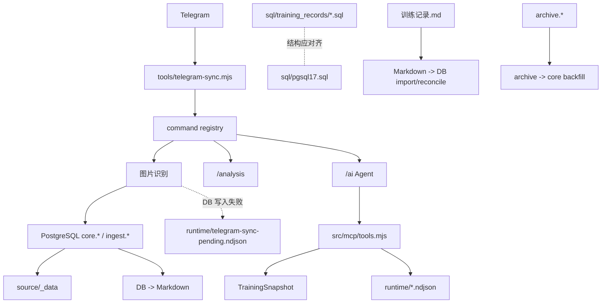
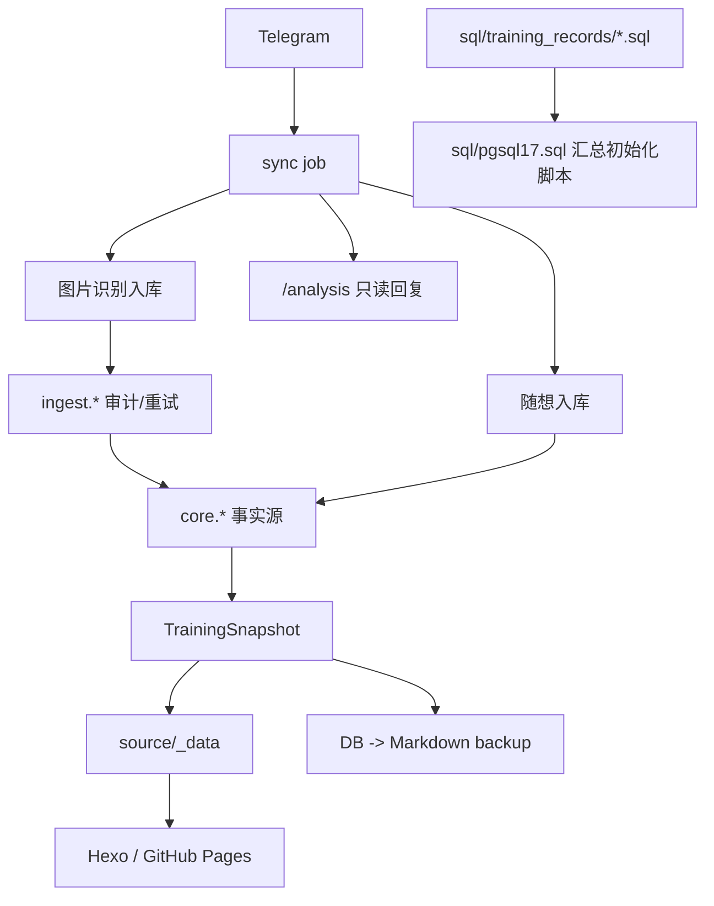

# MCP 删除与数据库结构对齐审计 v12

> 审核日期：2026-06-08  
> 审核范围：`README.md`、`docs/`、`sql/training_records/`、`sql/pgsql17.sql`、`src/`、`tools/`、`test/`、`.github/`  
> 审核目标：删除 MCP 功能及其直接绑定的 Telegram `/ai` / `/智能助手` Agent 入口；以 `sql/training_records/` 为准校验并完善 `sql/pgsql17.sql`。

## 格局判断

### Thesis

系统的目标模型应该从“训练记录工具集合”升级为“PostgreSQL 事实源驱动的训练数据管道”。MCP 是额外协议层，可以整层删除；Telegram `/ai` / `/智能助手` 是独立 Agent 命令，不参与 Telegram 图片发送入库，也不是 `/analysis` 的必要路径，且当前实现依赖 MCP，因此建议随 MCP 一起删除。数据库结构方面，`sql/training_records/` 是当前分 schema 表结构基准，`sql/pgsql17.sql` 应作为汇总初始化脚本向它对齐。

### Confidence

- **Confidence level**: high
- **Why not certain**: 无法从仓库确认线上是否仍有外部 MCP 客户端；`pgsql17.sql` 与 `training_records/` 的逐字段差异还需要脚本化比对后才能给出最终修补清单。

### The Trap

- **Inherited constraint**: 过去几轮优化把 MCP tool 层和 Telegram `/ai` 绑在一起，并且文档把 `/ai` 写进日常入口；同时文档把 `pgsql17.sql` 与 `training_records/` 并列描述，没有明确谁是表结构基准。
- **Is it real?**: partially
- **Why**: `npm run mcp:server` 和 `src/mcp/**` 是 MCP 功能本体；`/ai` / `/智能助手` 只是调用 MCP 的 Agent 命令，不参与图片入库和 `/analysis` 主链路。数据库侧，用户已明确 `sql/training_records/` 是当前各库表结构，`pgsql17.sql` 应对齐它，而不是反过来把 `training_records/` 降级为历史资料。

### High-格局 Direction

目标架构只保留四类边界：

1. **输入边界**：Telegram webhook / repository_dispatch / poll。
2. **事实源边界**：PostgreSQL `core.*`，辅以 `ingest.*` 审计和重试。
3. **输出边界**：Hexo `source/_data/*.json`、GitHub Pages、DB -> Markdown 备份。
4. **只读分析边界**：`/analysis` 使用 `TrainingSnapshot` 和 AI provider，只回发 Telegram，不经过 MCP。
5. **数据库结构边界**：`sql/training_records/` 是分 schema 结构源；`sql/pgsql17.sql` 是聚合初始化脚本，必须由前者校验。

所有 MCP server、MCP tool、MCP 配置、MCP 文档，以及直接绑定 MCP 的 Telegram `/ai` / `/智能助手` Agent 入口都应该删除。

### Frame-Opening Move

- **Move used**: zero-legacy thought experiment
- **What it reveals**: 如果今天从零搭建这个个人系统，不会先做 MCP stdio server，也不会额外做一个和图片入库、`/analysis` 无关的 `/ai` Agent 命令；会直接保留 Telegram 图片入库、随想、`/analysis` 和站点构建。数据库初始化也不会维护两套互相竞争的 schema 来源，而是用分 schema 文件做结构基准，再生成或校验总初始化脚本。

### Bold Takes

- MCP 要整层删除，不要只删 `mcp:server`。`/ai` 的当前实现依赖 `src/mcp/tools.mjs`，且与 Telegram 图片发送和 `/analysis` 无关，因此建议一起删除。
- `tools/` 不是业务层，下一轮不要继续在 `tools/telegram-sync.mjs` 和 `tools/telegram-sync-lib.mjs` 里堆实现。它们应该只剩 CLI/job 入口；内部导入应转向 `src/**`。
- `runtime/telegram-sync-pending.ndjson` 不应该再作为长期补偿机制。既然已有 `ingest.telegram_pending_batch`，运行队列也应该进库，文件队列只保留为本地测试夹具或短期迁移读取。
- `sql/training_records/` 是当前表结构基准；`sql/pgsql17.sql` 不能和它漂移。拆分 SQL 中存在 `DROP TABLE IF EXISTS` 是执行风险，不代表它们是历史资料；正确动作是标明执行场景，并让 `pgsql17.sql` 对齐最终结构。
- Markdown -> DB 导入应该从常规维护入口降级为“人工事故恢复工具”，甚至要求 `--confirm` 和明确日期范围；DB -> Markdown 备份继续保留。

## Options

| Option | What it optimizes | Cost | Verdict |
| --- | --- | --- | --- |
| Conservative path | 只删 `mcp:server` 脚本 | MCP tool 仍被 `/ai` 和测试引用；复杂度不降 | reject |
| Clean target | 删除 MCP 层、`/ai` Agent 入口和相关文档测试，`pgsql17.sql` 按 `training_records/` 校验补齐 | 需要同步 tests/docs 和 SQL 比对 | recommended |
| Staged clean path | 先删 MCP + `/ai`，再单独做 SQL 校验补齐 | 多一个阶段，但审计更稳 | recommended fallback |

## Before / After

### Before



### After



## Razor Verdict

- **Verdict**: replace current shape
- **One-line reason**: 当前系统已经有清晰事实源，但 MCP 协议层仍和 Telegram `/ai` 纠缠；数据库 schema 也需要明确 `training_records/` 到 `pgsql17.sql` 的对齐关系。
- **Razor principle used**: 一个概念只有在删除后会破坏真实用户目标、事实源完整性、补偿能力或部署链路时才值得独立存在。

## Evidence

| Source | What was seen | Supports / weakens which verdict | Confidence |
| --- | --- | --- | --- |
| `README.md:13`、`README.md:28`、`README.md:212` | README 将 `/ai` 和 MCP stdio server 写为核心功能和常用命令 | MCP 是显式暴露能力，删除必须同步文档和命令 | High |
| `package.json:24` | 存在 `mcp:server` 启动脚本 | `src/mcp/server.mjs` 是可删除入口 | High |
| `tools/telegram-ai-agent.mjs:5` | `/ai` Agent 直接导入 `callMcpTool` | 只删 MCP server 不够，`/ai` 应随 MCP 一起删除 | High |
| `src/telegram/command-registry.mjs:23` | 命令注册表包含 `ai_agent`，别名为 `/ai`、`/智能助手` | `/ai` 是当前 Telegram 命令面的一部分 | High |
| `docs/数据流转/数据流转说明.md:70`、`docs/数据流转/数据流转说明.md:83` | 文档描述 `/ai` 通过 MCP tools 查询 | 删除 MCP 后必须修改数据流文档 | High |
| `sql/pgsql17.sql:414` | 已有 `ingest.telegram_pending_batch` | 运行补偿可统一进数据库 | High |
| `tools/telegram-sync-fallback.mjs:17`、`tools/telegram-sync.mjs:88`、`tools/telegram-sync.mjs:210` | 数据库写入失败仍读写 `runtime/telegram-sync-pending.ndjson` | 文件 pending 是并存旧机制 | High |
| `src/db/training/pending-recognition.mjs:9`、`:56`、`:145` | AI 识别失败队列已使用数据库表读取、追加、标记 resolved | DB pending 机制已部分落地 | High |
| `tools/training-maintenance.mjs:64` vs `src/db/training/archive.mjs:36` | inspect 读取 `training-archive-failures.ndjson`，archive 默认写 `training-db-sync.ndjson` | 运行时日志命名不一致，需要收敛 | High |
| `tools/training-domain.mjs:1`、`tools/training-parser.mjs:1`、`tools/dashboard-view.mjs:1` | 多个 `tools/` 文件只是 re-export | 兼容层可被压缩或下线 | High |
| `sql/training_records/core.sql:22`、`ingest.sql:33`、`archive.sql:22` | 拆分 SQL 使用 destructive `DROP TABLE IF EXISTS` | 需要明确执行场景，不能误跑到已有库 | High |
| `docs/系统架构/内部接口手册.md:744`、`:749` | 文档已说明 `sql/pgsql17.sql` 是新环境优先入口，拆分 SQL 是内部实现 | 需要修正：`training_records/` 是结构基准，`pgsql17.sql` 是总初始化脚本 | High |

## Razor Map

| Concept | Claimed purpose | What concretely breaks if deleted | Hidden owner | Verdict | Reason |
| --- | --- | --- | --- | --- | --- |
| `src/mcp/**` | 给 Agent 暴露训练查询工具 | 外部 MCP 客户端不可用；`/ai` 当前实现失效 | `/analysis`、站点数据、DB 查询模块 | Delete | 用户明确不需要 MCP，且当前主链路不依赖它 |
| `npm run mcp:server` | 启动本地 MCP stdio server | MCP 客户端无法拉起本项目 | 无 | Delete | 只是 MCP 暴露入口 |
| Telegram `/ai` / `/智能助手` | 通用训练助手 | 用户少一个非主链路问答入口 | `/analysis`、看板、手工查询 | Delete | 与 Telegram 图片发送和 `/analysis` 无关，且当前依赖 MCP |
| `tools/telegram-ai-agent.mjs` | 规划 MCP tool 调用并生成回复 | `/ai` 无法回复 | 无 | Delete | 删除 `/ai` 后没有独立职责 |
| `src/mcp/runtime-tools.mjs` | 读取运行状态 | `/ai`/MCP 看不到 pending 和 archive failure | `training-maintenance inspect` | Merge | 运行状态应归维护 CLI，不应作为 MCP tool |
| `runtime/telegram-sync-pending.ndjson` | DB 写入失败后待重放 | DB 写入失败批次缺少补偿 | `ingest.telegram_pending_batch` 或新 DB queue | Replace | 文件队列跨 CI/本地不稳定，和 DB retry 并存增加心智负担 |
| `ingest.telegram_pending_batch` | AI 识别失败重试 | AI 失败图片不可自动重试 | Telegram sync image processing | Keep | 已保护真实数据不丢失 |
| Markdown -> DB import/reconcile | 人工维护 Markdown 后回灌数据库 | 纯 Markdown 人工修复无法入库 | 受控 maintenance migrate | Defer/Delete | 常态使用会覆盖 DB 新数据，应降级为受控事故恢复 |
| DB -> Markdown export | 人工可读备份 | 失去可读备份和 Hexo 随想文章派生 | Markdown backup workflow | Keep | 这是事实源导出的安全备份 |
| `archive.*` | 历史解析快照和回填 | archive-only 历史数据无法补 core | `core.*` 和迁移脚本 | Defer | 运行主链路不应依赖，但历史回填是否完成需证明 |
| `tools/` re-export files | 兼容旧导入路径 | 旧测试或直接导入失败 | `src/**` public modules + npm scripts | Merge/Delete | 多数只是过渡层，下一轮可统一导入后删除 |
| `sql/training_records/*.sql` | 当前各 schema 表结构基准 | `pgsql17.sql` 失去校验来源 | `sql/pgsql17.sql` | Keep | 用户明确以该目录为准；需要对齐总初始化脚本 |
| `sql/pgsql17.sql` | 总初始化脚本 | 新库初始化缺少单文件入口 | `sql/training_records/*.sql` | Replace | 不是结构基准，而是必须由基准校验的汇总产物 |

## Clean Code Review

### Summary

最高杠杆的可维护性风险不是某个函数太长，而是模块边界还在迁移状态：`tools/`、`src/`、MCP、maintenance、runtime 文件队列同时承担“入口、业务、兼容、运维”职责。继续保留这些层会让每次新增训练字段、Telegram 命令或数据库修复都要同步改文档、旧入口、MCP tool、测试和运行状态读取。

### Findings

#### P1: `/ai` 通过 MCP 查询，但不属于 Telegram 图片发送或 `/analysis` 主链路

- **原则**: YAGNI / 结构清晰度
- **位置**: `tools/telegram-ai-agent.mjs:5`、`src/mcp/tool-catalog.mjs:1`、`src/telegram/command-registry.mjs:23`
- **级别**: 高
- **问题**: `/ai` 是独立 `ai_agent` 命令分支，不参与 image batch，也不是 `/analysis` 分支；它通过 MCP tool catalog 间接查询训练、运行状态和分析。删除 MCP 时保留它会制造新的内部助手重构成本。
- **建议**: 删除 `src/mcp/**`、MCP server、MCP 测试和文档，同时删除 `/ai` / `/智能助手` 命令分支、`tools/telegram-ai-agent.mjs`、help text 和相关测试。
- **Why now**: MCP 已经被用户明确排除，`/ai` 又不支撑 Telegram 发送/分析主链路，一起删除是更干净的减法。

#### P2: 运行补偿分裂为 DB pending 和文件 pending

- **原则**: 单一职责 / 结构清晰度
- **位置**: `src/db/training/pending-recognition.mjs:9`、`tools/telegram-sync-fallback.mjs:17`、`tools/telegram-sync.mjs:88`
- **级别**: 高
- **问题**: AI 识别失败进入 `ingest.telegram_pending_batch`，但 DB 持久化失败进入 `runtime/telegram-sync-pending.ndjson`。同一类“待补偿批次”有两个生命周期、两个存储位置和两套检查文档。
- **建议**: 新增或复用 DB pending 表承载 persistence failure；`runtime/telegram-sync-pending.ndjson` 只作为迁移读取一次，之后删除写入路径。
- **Why now**: 文件队列在 GitHub Actions 和本地之间不可自然共享，容易形成“以为有 pending，实际线上不可见”的排障误导。

#### P3: `tools/` 兼容层已超过必要保留期

- **原则**: 项目规范 / YAGNI
- **位置**: `tools/training-domain.mjs:1`、`tools/training-parser.mjs:1`、`tools/dashboard-view.mjs:1`、`tools/training-db-write.mjs:1`
- **级别**: 中
- **问题**: 多个 `tools/` 文件只是 re-export，但测试和文档仍把它们当稳定模块。结果是 `src/**` 的真实边界无法成为唯一导入标准。
- **建议**: 保留真正 CLI 文件；内部导入和测试导入统一迁到 `src/**`。对纯 re-export 文件设删除清单。
- **Why now**: 上一轮迁移已经完成基础分层，继续保留所有旧入口只会阻碍目录收口。

#### P4: `pgsql17.sql` 与 `training_records/` 的主从关系写反了

- **原则**: 项目规范 / 结构清晰度
- **位置**: `sql/pgsql17.sql:414`、`sql/training_records/core.sql:22`、`docs/系统架构/内部接口手册.md:744`
- **级别**: 中
- **问题**: 文档把 `sql/pgsql17.sql` 写成优先事实，容易让维护者用总脚本反推拆分表结构。用户已明确 `sql/training_records/` 是当前各库表结构基准。
- **建议**: 建立 schema 对齐检查：从 `core.sql`、`ingest.sql`、`archive.sql`、`core_sleep.sql`、`sleep_health_metrics.sql` 推导最终结构，再校验 `pgsql17.sql` 是否包含同等 schema、表、列、约束、索引和注释。
- **Why now**: 初始化脚本一旦和真实分 schema 结构漂移，新环境会从第一天开始带错表结构。

## 文档对照代码审计报告

### 审核结论

- **结论**: 有条件通过
- **汇总**: P0:0 P1:2 P2:3 P3:1 待证据补充:1
- **建议修复顺序**: 先同步删除 MCP 文档、MCP 启动入口和 `/ai` Agent 文档，再更新 SQL 结构基准说明和 `pgsql17.sql` 对齐检查。

### 问题列表

#### 1. README 把 MCP 和 `/ai` Agent 写成核心功能

- **严重级别**: P1
- **位置**:
  - 文档: `README.md:13`、`README.md:28`、`README.md:212`
  - 代码: `package.json:24`、`tools/telegram-ai-agent.mjs:5`
- **证据**:
  - 文档片段: `Telegram /ai /智能助手 调用 MCP 工具`
  - 代码片段: `import { callMcpTool as defaultCallMcpTool } from '../src/mcp/tools.mjs';`
- **影响**: 维护者会继续把 MCP 和 `/ai` Agent 当主系统能力维护。
- **建议（最小修正）**: 从 README、docs、help text、command registry 和测试中移除 MCP 与 `/ai` / `/智能助手`。
- **修复收益**: 明确保留 Telegram 图片发送、随想和 `/analysis`，删除无关的 Agent 查询面。
- **关联原则**: 以代码为真 / 按场景审计

#### 2. pending 队列文档只描述文件队列，代码已经有 DB pending 队列

- **严重级别**: P1
- **位置**:
  - 文档: `docs/数据流转/数据流转说明.md:93`、`docs/系统架构/系统总览.md:148`
  - 代码: `sql/pgsql17.sql:414`、`src/db/training/pending-recognition.mjs:32`
- **证据**:
  - 文档片段: `runtime/telegram-sync-pending.ndjson`
  - 代码片段: `from ingest.telegram_pending_batch`
- **影响**: 排障时可能只检查 runtime 文件而漏掉数据库 pending；也会误判 pending 机制是否统一。
- **建议（最小修正）**: 文档拆分 AI recognition pending 与 persistence fallback pending；后续实现统一到 DB 后删除文件 pending 文档。
- **修复收益**: 排障路径更准确，降低补偿队列遗漏风险。
- **关联原则**: 以代码为真 / 按场景审计

#### 3. archive failure 文件名在维护脚本和文档中不一致

- **严重级别**: P2
- **位置**:
  - 文档: `docs/数据流转/数据流转说明.md:94`
  - 代码: `src/db/training/archive.mjs:36`、`tools/training-maintenance.mjs:64`
- **证据**:
  - 文档片段: `runtime/training-db-sync.ndjson`
  - 代码片段: `training-archive-failures.ndjson`
- **影响**: `maintenance:inspect` 可能读不到 archive 模块实际写入的失败日志。
- **建议（最小修正）**: 统一文件名；推荐只保留 `runtime/training-db-sync.ndjson` 或直接迁到 DB ops log。
- **修复收益**: 维护检查结果可信。
- **关联原则**: 合同优先 / 以代码为真

#### 4. 数据库结构基准应是 `sql/training_records/`，`pgsql17.sql` 必须向它对齐

- **严重级别**: P2
- **位置**:
  - 文档: `docs/系统架构/系统总览.md:16`
  - 代码: `sql/training_records/core.sql:22`
- **证据**:
  - 文档片段: `SQL schema 位于 sql/training_records/*.sql 和 sql/pgsql17.sql`
  - 代码片段: `DROP TABLE IF EXISTS "core"."activity";`
- **影响**: 如果以 `pgsql17.sql` 反推拆分表结构，可能掩盖总初始化脚本缺列、缺索引或缺约束的问题。
- **建议（最小修正）**: 文档声明 `sql/training_records/` 是当前表结构基准；`pgsql17.sql` 是总初始化脚本，必须通过对齐检查后再用于新库初始化。另需标注带 `DROP TABLE` 的拆分 SQL 只适合受控重建或结构导出场景，不可直接跑到生产已有库。
- **修复收益**: 新库初始化和当前数据库结构一致，同时降低误执行 destructive SQL 的风险。
- **关联原则**: 安全默认收紧

#### 5. `tools/` re-export 仍被文档当作稳定内部接口

- **严重级别**: P2
- **位置**:
  - 文档: `docs/系统架构/系统总览.md:48`
  - 代码: `tools/training-parser.mjs:1`
- **证据**:
  - 文档片段: `tools/training-parser.mjs`
  - 代码片段: `export { parseTrainingRecord } from '../src/domain/training/training-parser.mjs';`
- **影响**: 后续开发继续导入兼容层，真实 `src/domain` 边界无法收口。
- **建议（最小修正）**: 文档中把 `tools/` 标为 CLI/compat，仅把 `src/**` 作为模块接口。
- **修复收益**: 让后续删文件有明确导入标准。
- **关联原则**: 术语与命名 / 以代码为真

## Complexity To Preserve

| Concept | Why preserved | Boundary that must not be mis-cut |
| --- | --- | --- |
| `core.training_day` + 子表 | 页面、分析和备份的事实源 | 不要用 Markdown 导入常态覆盖 |
| `ingest.telegram_batch/message/recognition` | 去重、审计、识别缓存和失败追踪 | 删除 MCP 时不要误删 ingest |
| `ingest.telegram_pending_batch` | AI 失败补偿已经落库 | 应扩展为统一 pending，而不是删除 |
| `/analysis` | 明确训练建议入口，用户价值高且不写数据 | 不要和 MCP / `/ai` Agent 一起误删 |
| Cloudflare Worker + GitHub dispatch | Telegram 自动链路入口 | 不属于 MCP |
| DB -> Markdown backup | 人工可读备份和随想文章派生 | 不要和 Markdown -> DB 回灌混为一谈 |
| AI provider / schema validator | 图片识别和分析共用 | 不属于 Agent/MCP 层 |

## Shape After the Razor

V12 后系统应该变成：Telegram 消息进入同步 job，图片和随想写 PostgreSQL，页面和 `/analysis` 从 `TrainingSnapshot` 读取；Markdown 只由数据库导出；MCP server、MCP tools、MCP 配置、MCP 文档、MCP 测试和 `/ai` Agent 入口消失。数据库脚本上，`sql/training_records/` 是结构基准，`sql/pgsql17.sql` 是对齐后的总初始化脚本。

## Risks & Guardrails

- **Likely rebound**: 后续又想加“通用助手”时，可能重新包装一套工具协议。Guardrail：先证明 `/analysis` 和看板不能覆盖真实问题，再单独立项。
- **Mis-cut risk**: 把 AI provider、recognition pending、`/analysis` 误认为 MCP 或 `/ai` Agent 依赖。Guardrail：删除匹配 `src/mcp/**`、`mcp:server`、`MCP_*` 配置、MCP docs/tests、`ai_agent`、`tools/telegram-ai-agent.mjs`、`/ai` help/tests。
- **Migration risk**: 生产仍可能有未重放的 `runtime/telegram-sync-pending.ndjson`。Guardrail：实施前导出并重放文件 pending，或写一次迁移脚本导入 DB pending。
- **Schema risk**: `pgsql17.sql` 与 `training_records/` 漂移。Guardrail：写脚本或 checklist 对比 schema/table/column/index/constraint/comment，以 `training_records/` 为准修 `pgsql17.sql`。

## First Proof Point

最小证明不是删文件，而是先做两次边界检查：

```bash
rg -n "src/mcp|callMcpTool|mcp:server|MCP_" README.md docs src tools test package.json
rg -n "/ai|智能助手|ai_agent" README.md docs src tools test
```

审计通过后，两条都只应剩历史归档文档中的背景记录；当前 README、长期 docs、命令注册、help text、package scripts 和 active tests 不再引用 MCP 或 `/ai` Agent。

## Falsifier

以下任一证据会推翻“删除 MCP + `/ai` Agent”的方向：

- 有外部客户端仍通过 `npm run mcp:server` 调用训练数据。
- 生产补偿依赖 `src/mcp/runtime-tools.mjs` 的运行状态输出。
- `/ai` 被证明是高频刚需，并且 `/analysis`、看板、手工查询无法覆盖。
- `pgsql17.sql` 已经被证明比 `sql/training_records/` 更接近生产真实结构。
