# 数据模型规范

> 结构基准：`sql/training_records/core.sql`、`sql/training_records/ingest.sql`、`sql/training_records/archive.sql`。`sql/pgsql17.sql` 是汇总初始化脚本，必须与拆分 SQL 的最终结构保持一致。

## 1. 数据源原则

- PostgreSQL 是训练系统唯一事实源。
- `core.*` 保存页面、分析、导出和 Telegram 同步使用的主结构化数据。
- `ingest.*` 保存 Telegram 批次、原始消息、AI 识别结果和 pending 队列状态。
- `archive.*` 保存 Markdown 解析快照、归档明细和构建运行留痕。
- `source/_data/*.json`、`训练数据解析.md`、Markdown 导出和 `runtime/*.ndjson` 日志只作为派生产物、备份或失败日志，不作为训练事实数据源。

## 2. ER 图

```mermaid
erDiagram
  CORE_TRAINING_DAY ||--o{ CORE_MEASUREMENT : archived_date
  CORE_TRAINING_DAY ||--o{ CORE_ACTIVITY : archived_date
  CORE_TRAINING_DAY ||--o{ CORE_MEAL : archived_date
  CORE_TRAINING_DAY ||--o{ CORE_SLEEP : archived_date
  INGEST_TELEGRAM_BATCH ||--o{ INGEST_TELEGRAM_MESSAGE : batch_id
  INGEST_TELEGRAM_BATCH ||--o{ INGEST_TELEGRAM_RECOGNITION : batch_id
  ARCHIVE_TRAINING_PARSE_SNAPSHOT ||--o{ ARCHIVE_TRAINING_PARSE_RUN : source_hash
  ARCHIVE_TRAINING_DAY ||--o{ ARCHIVE_TRAINING_MEASUREMENT : archived_date
  ARCHIVE_TRAINING_DAY ||--o{ ARCHIVE_TRAINING_ACTIVITY : archived_date
  ARCHIVE_TRAINING_DAY ||--o{ ARCHIVE_TRAINING_MEAL : archived_date
  ARCHIVE_TRAINING_DAY ||--o{ ARCHIVE_TRAINING_SLEEP : archived_date
```

## 3. `core.*` 字段规范

### `core.training_day`

| 字段 | 类型 | 约束 | 说明 |
| --- | --- | --- | --- |
| `archived_date` | `date` | PK | 归档日期，一天一行 |
| `source_channel` | `text` | NOT NULL | 来源，例如 `telegram`、`markdown_import`、`archive_backfill` |
| `source_batch_id` | `text` | NULL | 最近刷新该日汇总的批次或导入 ID |
| `total_activities` | `int4` | NOT NULL DEFAULT 0 | 当天活动数 |
| `total_duration_seconds` | `int4` | NOT NULL DEFAULT 0 | 当天活动总时长 |
| `training_calories` | `numeric(10,2)` | NOT NULL DEFAULT 0 | 当天训练消耗 |
| `workout_duration_minutes` | `int4` | NULL | 当天锻炼分钟数 |
| `active_hours` | `int4` | NULL | 当天活跃小时数 |
| `cycling_distance_km` | `numeric(10,2)` | NULL | 当天骑行距离 |
| `intake_calories` | `int4` | NULL | 当天摄入热量 |
| `sleep_total_minutes` | `int4` | NULL | 当天总睡眠分钟数，从 `core.sleep` 聚合刷新 |
| `night_sleep_minutes` | `int4` | NULL | 当天夜间睡眠分钟数，从 `core.sleep` 聚合刷新 |
| `nap_minutes` | `int4` | NULL | 当天午睡或零星小睡分钟数，从 `core.sleep` 聚合刷新 |
| `sleep_start_time` | `text` | NULL | 当天最早入睡时间文本 |
| `sleep_end_time` | `text` | NULL | 当天最晚醒来时间文本 |
| `deep_sleep_minutes` | `int4` | NULL | 当天深睡分钟数 |
| `light_sleep_minutes` | `int4` | NULL | 当天浅睡分钟数 |
| `rem_sleep_minutes` | `int4` | NULL | 当天 REM 睡眠分钟数 |
| `awake_minutes` | `int4` | NULL | 当天睡眠期间清醒分钟数 |
| `nutrition_details_json` | `jsonb` | NOT NULL DEFAULT `[]` | 饮食明细文本数组 |
| `updated_at` | `timestamptz` | NOT NULL | 最近更新时间 |

### 明细表

| 表 | 主键 | 外键 | 说明 |
| --- | --- | --- | --- |
| `core.measurement` | `measurement_key` | `archived_date -> core.training_day.archived_date` | 体脂秤测量明细；体重、体脂率、骨骼肌量等数值不得为负或异常过大 |
| `core.activity` | `activity_key` | `archived_date -> core.training_day.archived_date` | 活动明细；`activity_type` 必须是已知规范类型或兼容原始类型 |
| `core.meal` | `meal_key` | `archived_date -> core.training_day.archived_date` | 餐次热量和建议范围 |
| `core.sleep` | `sleep_key` | `archived_date -> core.training_day.archived_date` | 睡眠明细和健康指标 |
| `core.thought` | `telegram_message_id` | 无 | Telegram 随想正文、模块、图片引用和软删除状态；Markdown 附件随想会把附件正文写入正文列，不新增附件字段 |

## 4. `ingest.*` 字段规范

| 表 | 主键 | 说明 |
| --- | --- | --- |
| `ingest.telegram_batch` | `batch_id` | Telegram 批次状态、归档日期、payload hash、完整 payload、告警和问题 |
| `ingest.telegram_message` | `message_id` | Telegram 原始消息摘要、update id、图片 file id |
| `ingest.telegram_recognition` | `message_id` | AI 识别原始 JSON、图片类型、置信度和检测日期 |
| `ingest.telegram_pending_batch` | `pending_id` | 数据库失败后的 pending 队列，替代 `runtime/telegram-sync-pending.ndjson` |

## 5. `archive.*` 字段规范

| 表 | 主键 | 说明 |
| --- | --- | --- |
| `archive.training_parse_snapshot` | `source_hash` | Markdown 原文 hash 去重后的完整解析快照 |
| `archive.training_parse_run` | `run_id` | 每次构建或导入运行记录 |
| `archive.training_day` | `archived_date` | 归档日汇总，包含睡眠汇总字段 |
| `archive.training_measurement` | `measurement_hash` | 归档体脂明细 |
| `archive.training_activity` | `activity_hash` | 归档运动明细 |
| `archive.training_meal` | `meal_hash` | 归档餐次明细 |
| `archive.training_sleep` | `sleep_hash` | 归档睡眠明细和健康指标 |

## 6. 写入约束

- Telegram 图片成功路径在一个事务内先写 `ingest.*`，再增量 upsert `core.measurement`、`core.activity`、`core.meal`、`core.sleep`，最后刷新目标 `core.training_day` 汇总。
- Telegram sleep 图片写入 `core.sleep` 后，`core.training_day` 的睡眠汇总字段必须从 `core.sleep` 聚合刷新。
- Markdown 导入、archive 回填和手工对账是整日替换语义：按日期删除子表明细，再 upsert `core.training_day` 和明细表。
- 归档失败日志可写入 `runtime/training-db-sync.ndjson`，但该文件不是事实数据源。

## 7. 一致性校验

`npm run check:data-consistency` 覆盖以下校验：

- `core.training_day` 与 `archive.training_day` 记录数对比。
- `core.sleep` 无 orphaned 记录。
- `ingest.telegram_batch.status = 'ready'` 且有 `archived_date` 的记录均有对应 `core.training_day`。
- `core.measurement` 数值字段无负数或异常过大值。
- `core.activity.activity_type` 在预期范围内。
- `core.sleep` 中可比较的 `bedtime` 与 `wake_time` 顺序有效。
- `core.training_day` 睡眠汇总字段存在。
