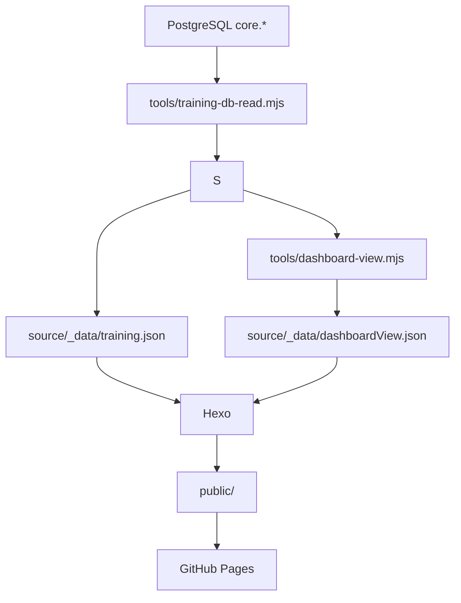
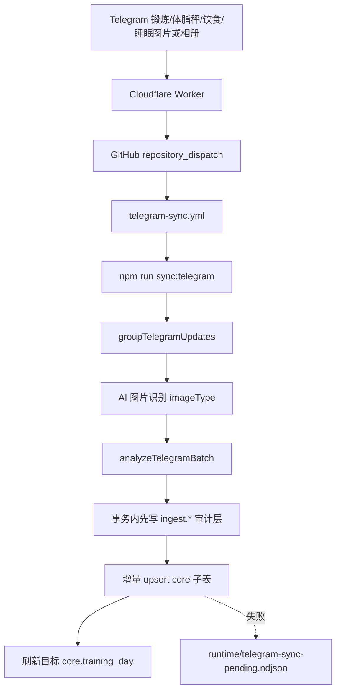
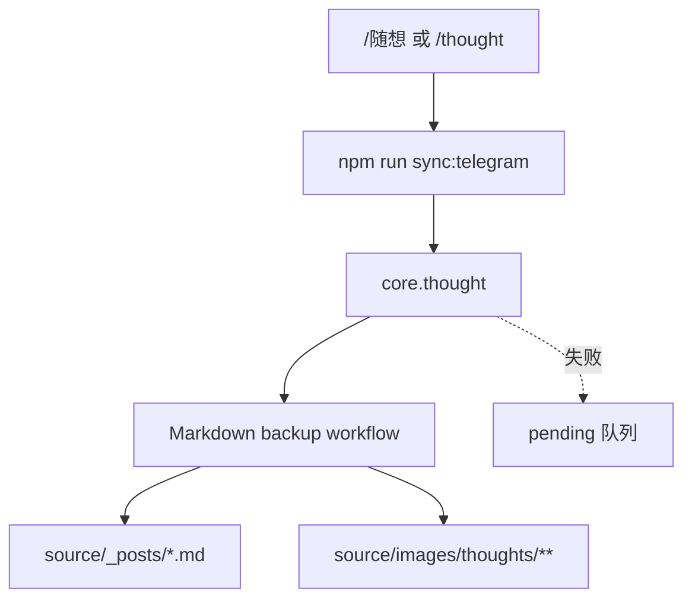
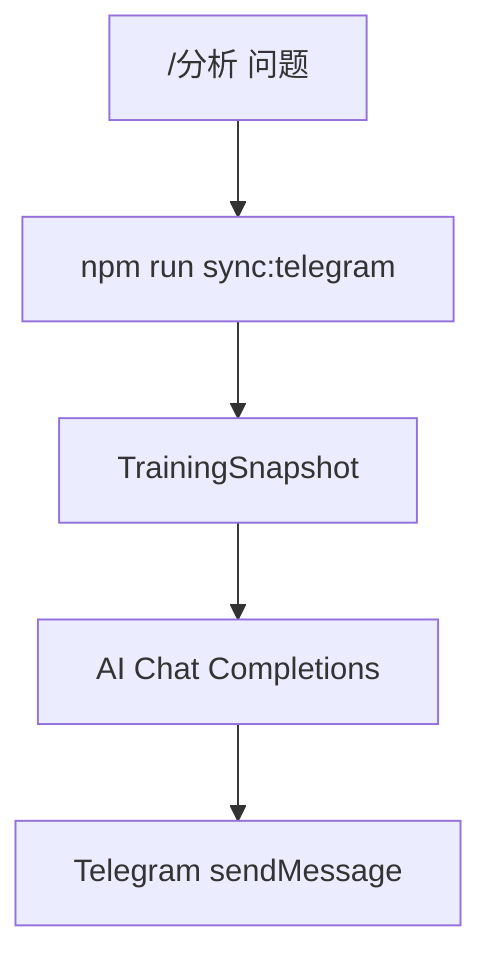

# 数据流转说明

本文按链路说明系统中数据如何从输入进入数据库、Markdown 备份、静态页面和 Telegram 回复。

## 1. 页面构建链路

线上页面以 `TRAINING_SNAPSHOT_SOURCE=database` 为准，从 PostgreSQL `core.*` 构建。Markdown 是数据库派生备份，不再作为部署前回灌数据库的默认输入；只有显式人工维护命令才允许使用 Markdown 导入。

## 2. Telegram 图片同步链路

相册由 Cloudflare Durable Object `TELEGRAM_ALBUM_BUFFER` 缓冲约 3 秒后统一派发。没有绑定时，Worker 会退回逐条 dispatch。

当前图片识别支持四类训练数据：

| 截图类型 | 识别字段 | 主要落点 |
| --- | --- | --- |
| 锻炼 | 活动总览、活动明细、热量、时长、距离、心率 | `core.training_day`、`core.activity` |
| 体脂秤 | 体重、BMI、体脂、骨骼肌、基础代谢等 | `core.measurement` |
| 饮食 | 餐次、总摄入、餐次明细 | `core.meal`、`core.training_day` |
| 睡眠 | 入睡/起床、睡眠阶段、睡眠评分、心率、HRV、血氧、呼吸率 | `core.sleep`、`core.training_day` |

睡眠图片的归档日期按醒来日期减一天计算；普通图片仍按图片内日期优先、文件名日期兜底的规则归档。

正常 `ready + stored` 图片批次以数据库为唯一事实源：只 upsert 本批次识别出的子表行，并刷新当前目标日期汇总，不会整日删除同日其它模块。数据库失败时写 pending replay，等待后续重放；Markdown 更新交给独立 DB -> Markdown 备份 workflow。

## 3. Telegram 随想链路

随想和身体反馈以 `core.thought` 为事实源。Markdown 文章和图片引用由备份 workflow 从数据库派生；待补偿记录会在后续同步启动时重放。

## 4. Telegram 分析链路

`/分析` 只读现有数据，不写训练记录、随想或数据库。

`/分析` 专注训练、饮食、体脂和身体反馈建议。

## 5. 数据存储分层

| 存储 | 职责 |
| --- | --- |
| `训练记录.md` | 数据库派生的人工可读训练备份 |
| `source/_posts` | 数据库派生的随想和身体反馈备份文章 |
| `source/images/thoughts` | Telegram 随想图片 artifact，DB 只保存引用 |
| `source/_data/*.json` | 页面构建数据产物 |
| `runtime/telegram-sync-pending.ndjson` | PostgreSQL 写入失败后的待重放队列 |
| `runtime/training-db-sync.ndjson` | archive 写入失败日志 |
| `ingest.*` | Telegram 批次、消息和识别原始记录 |
| `core.*` | 主结构化训练数据，包含训练日、体脂、活动、餐次、睡眠和随想 |
| `archive.*` | 构建快照和运行留痕；`archive.training_sleep` 用于历史归档/回填维护 |

## 6. 失败与补偿

- 图片批次写库失败：写 pending 队列，等待数据库恢复后重放。
- 随想批次写库失败：写 pending 队列，等待数据库恢复后重放。
- archive 写入失败：写 `runtime/training-db-sync.ndjson`，不阻断页面构建。
- 数据库恢复后：下一次 `npm run sync:telegram` 会先重放 pending 队列。
- Markdown 备份：由 `.github/workflows/markdown-backup.yml` 定时从数据库导出，是否执行由 GitHub Variables 控制。
- archive 中已有但 core 缺失的睡眠记录：`npm run backfill:core` 会补写 `core.sleep` 并更新训练日睡眠汇总。
- GitHub Actions 的 Telegram dispatch 会写 step summary，按 batch 输出 `taskStatus`、`persistenceStatus`、`archivedDate`、图片计数、pending 状态、`failureDisposition` 和失败 message id，便于区分可自动重试和需要人工修正的失败。
