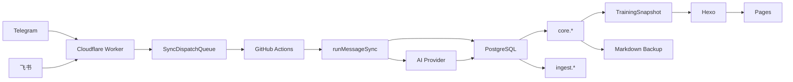

# 系统架构

本文是系统结构、分层、消息同步架构和 Markdown/静态站点边界的唯一架构入口。架构决策记录仍保留在 `架构决策记录/`。

## 系统架构

## 架构总览

## 分层

| 层 | 目录 | 职责 |
| --- | --- | --- |
| 核心域 | `src/core/` | 实体、Repository Port、领域服务、schema |
| 应用层 | `src/app/use-cases/` | 消息同步、数据生成、图片识别、训练分析 |
| 适配器 | `src/adapters/` | PostgreSQL、AI、Telegram、飞书、Hexo |
| 基础设施 | `src/infra/` | 配置和 app factory |
| 兼容 CLI | `tools/` | 维护脚本和历史 facade |
| 边缘入口 | `cloudflare/` | webhook、队列、dispatch |

## 核心边界

- 核心域不直接依赖 PostgreSQL、Telegram、飞书、AI 网络调用或文件系统。
- 应用层编排业务流程。
- 适配器负责外部系统差异。
- `tools/` 仍有历史 facade，未来可继续薄化，但当前文档按真实现状描述。

## 六边形架构

项目已经按 Ports and Adapters 方向演进，但仍保留部分历史 facade。

## 当前分布

- `src/core/entities/`：业务实体。
- `src/core/repositories/`：Repository Port。
- `src/core/services/`：领域服务。
- `src/app/use-cases/`：用例编排。
- `src/adapters/postgres/`：PostgreSQL 实现。
- `src/adapters/telegram/`、`src/adapters/feishu/`：通道适配。
- `src/adapters/ai/`：AI Provider 适配器。
- `src/ai/`：AI provider facade、识别服务和兼容入口。
- `tools/`：CLI 和兼容 facade。

## 开发原则

- 新业务规则优先进入 core 或 use case。
- 外部 I/O 差异放在 adapter。
- CLI 入口尽量薄化。
- 不为了命名纯净破坏现有双通道行为。

## 消息同步架构

消息同步的目标是把外部通道事件转成稳定、可审计、可重放的业务任务。

## 当前模型

- Telegram 和飞书都是 channel。
- `runMessageSync()` 是共享编排入口。
- `runTelegramSync()` 注入 Telegram adapter。
- `runFeishuSync()` 注入飞书 adapter，再复用共享同步主链路。

## 处理顺序

1. Cloudflare Worker 判断 channel。
2. Telegram secret header 或飞书签名/token 校验。
3. 图片 burst 进入对应 Durable Object 缓冲。
4. `SyncDispatchQueue` 排队触发 GitHub Actions。
5. workflow 判断 channel。
6. 同步脚本读取 dispatch payload。
7. 分流 help、analysis、thought、image。
8. 图片进入 AI 识别、缓存、校验。
9. ready batch 写入 `ingest.*` 和 `core.*`。
10. 返回 summary 和通道回执。

## 关键原则

- 通道可以不同，业务语义不能不同。
- Action success 不等于业务 success。
- `taskStatus/failureDisposition` 是业务判断关键字段。
- 失败必须能归类为 `user_input`、`ai_service`、`database`、`channel_api`、`github_action` 或 `system_bug`。

## Markdown 与静态站点

## Markdown 的角色

Markdown 是人工可读备份和显式恢复入口，不是正常消息同步的主事实源。

| 文件/目录 | 角色 |
| --- | --- |
| `训练记录.md` | DB 派生训练备份，可显式导入 |
| `source/_posts` | 随想和文章备份，供 Hexo 渲染 |
| `source/images/thoughts` | 随想图片 artifact |
| `source/_data/*.json` | 页面构建数据产物 |

## 站点构建

1. `npm run build:data` 生成 `source/_data/training.json` 和 `source/_data/dashboardView.json`。
2. `npm run build:site` 调用 Hexo。
3. Pages workflow 上传 `public/`。

## 禁止误用

- 不要把 Markdown 备份当作最新事实。
- 不要在图片同步阶段直接编辑 Markdown 作为成功判定。
- 不要用旧 Markdown 覆盖未核对的 `core.*` 数据。
